## Independent Project Sandox


```R
library('readxl')
library(psych)
library(tidyverse)
library(sqldf)
library(ggplot2)
library(gridExtra)
library(cowplot)
library(e1071) 
library(car)
library(semTools)
library(pastecs)
library(sjstats) 
library(userfriendlyscience)
library(generalhoslem)
library(regclass)
library(lm.beta)
library(stargazer)
library(broom)
library(Epi)
library(arm)
library(DescTools)
library(foreign)
library(olsrr)
```

    
    Attaching package: ‘olsrr’
    
    
    The following object is masked from ‘package:MASS’:
    
        cement
    
    
    The following object is masked from ‘package:datasets’:
    
        rivers
    
    


```R
data <- read_excel('data_academic_performance.xlsx')
```

    New names:
    * `` -> ...10
    


```R
data
```


<table>
<caption>A tibble: 12411 × 45</caption>
<thead>
	<tr><th scope=col>COD_S11</th><th scope=col>GENDER</th><th scope=col>EDU_FATHER</th><th scope=col>EDU_MOTHER</th><th scope=col>OCC_FATHER</th><th scope=col>OCC_MOTHER</th><th scope=col>STRATUM</th><th scope=col>SISBEN</th><th scope=col>PEOPLE_HOUSE</th><th scope=col>...10</th><th scope=col>⋯</th><th scope=col>CC_PRO</th><th scope=col>ENG_PRO</th><th scope=col>WC_PRO</th><th scope=col>FEP_PRO</th><th scope=col>G_SC</th><th scope=col>PERCENTILE</th><th scope=col>2ND_DECILE</th><th scope=col>QUARTILE</th><th scope=col>SEL</th><th scope=col>SEL_IHE</th></tr>
	<tr><th scope=col>&lt;chr&gt;</th><th scope=col>&lt;chr&gt;</th><th scope=col>&lt;chr&gt;</th><th scope=col>&lt;chr&gt;</th><th scope=col>&lt;chr&gt;</th><th scope=col>&lt;chr&gt;</th><th scope=col>&lt;chr&gt;</th><th scope=col>&lt;chr&gt;</th><th scope=col>&lt;chr&gt;</th><th scope=col>&lt;lgl&gt;</th><th scope=col>⋯</th><th scope=col>&lt;dbl&gt;</th><th scope=col>&lt;dbl&gt;</th><th scope=col>&lt;dbl&gt;</th><th scope=col>&lt;dbl&gt;</th><th scope=col>&lt;dbl&gt;</th><th scope=col>&lt;dbl&gt;</th><th scope=col>&lt;dbl&gt;</th><th scope=col>&lt;dbl&gt;</th><th scope=col>&lt;dbl&gt;</th><th scope=col>&lt;dbl&gt;</th></tr>
</thead>
<tbody>
	<tr><td>SB11201210000129</td><td>F</td><td>Incomplete Professional Education    </td><td>Complete technique or technology     </td><td>Technical or professional level employee</td><td>Home                                    </td><td>Stratum 4</td><td>It is not classified by the SISBEN       </td><td>Three</td><td>NA</td><td>⋯</td><td> 71</td><td> 93</td><td>79</td><td>181</td><td>180</td><td>91</td><td>5</td><td>4</td><td>2</td><td>2</td></tr>
	<tr><td>SB11201210000137</td><td>F</td><td>Complete Secundary                   </td><td>Complete professional education      </td><td>Entrepreneur                            </td><td>Independent professional                </td><td>Stratum 5</td><td>It is not classified by the SISBEN       </td><td>Three</td><td>NA</td><td>⋯</td><td> 86</td><td> 98</td><td>78</td><td>201</td><td>182</td><td>92</td><td>5</td><td>4</td><td>4</td><td>4</td></tr>
	<tr><td>SB11201210005154</td><td>M</td><td>Not sure                             </td><td>Not sure                             </td><td>Independent                             </td><td>Home                                    </td><td>Stratum 2</td><td>Level 2                                  </td><td>Five </td><td>NA</td><td>⋯</td><td> 18</td><td> 43</td><td>22</td><td>113</td><td>113</td><td> 7</td><td>1</td><td>1</td><td>1</td><td>1</td></tr>
	<tr><td>SB11201210007504</td><td>F</td><td>Not sure                             </td><td>Not sure                             </td><td>Other occupation                        </td><td>Independent                             </td><td>Stratum 2</td><td>It is not classified by the SISBEN       </td><td>Three</td><td>NA</td><td>⋯</td><td> 76</td><td> 80</td><td>48</td><td>137</td><td>157</td><td>67</td><td>4</td><td>3</td><td>2</td><td>2</td></tr>
	<tr><td>SB11201210007548</td><td>M</td><td>Complete professional education      </td><td>Complete professional education      </td><td>Executive                               </td><td>Home                                    </td><td>Stratum 4</td><td>It is not classified by the SISBEN       </td><td>One  </td><td>NA</td><td>⋯</td><td> 98</td><td>100</td><td>71</td><td>189</td><td>198</td><td>98</td><td>5</td><td>4</td><td>4</td><td>2</td></tr>
	<tr><td>SB11201210007568</td><td>F</td><td>Complete professional education      </td><td>Complete professional education      </td><td>Independent                             </td><td>Executive                               </td><td>Stratum 6</td><td>It is not classified by the SISBEN       </td><td>Three</td><td>NA</td><td>⋯</td><td> 32</td><td> 97</td><td>36</td><td>170</td><td>154</td><td>63</td><td>4</td><td>3</td><td>4</td><td>2</td></tr>
	<tr><td>SB11201210007598</td><td>M</td><td>Complete professional education      </td><td>Complete professional education      </td><td>Small entrepreneur                      </td><td>Executive                               </td><td>Stratum 5</td><td>It is not classified by the SISBEN       </td><td>Four </td><td>NA</td><td>⋯</td><td> 50</td><td> 92</td><td>53</td><td>187</td><td>152</td><td>59</td><td>3</td><td>3</td><td>2</td><td>2</td></tr>
	<tr><td>SB11201210007615</td><td>F</td><td>Incomplete Secundary                 </td><td>Complete Secundary                   </td><td>Entrepreneur                            </td><td>Independent professional                </td><td>Stratum 6</td><td>It is not classified by the SISBEN       </td><td>Five </td><td>NA</td><td>⋯</td><td> 94</td><td> 97</td><td>98</td><td>188</td><td>200</td><td>99</td><td>5</td><td>4</td><td>4</td><td>4</td></tr>
	<tr><td>SB11201210010208</td><td>M</td><td>Complete Secundary                   </td><td>Complete professional education      </td><td>Independent                             </td><td>Operator                                </td><td>Stratum 2</td><td>It is not classified by the SISBEN       </td><td>Three</td><td>NA</td><td>⋯</td><td> 43</td><td>  3</td><td>19</td><td>177</td><td>133</td><td>28</td><td>2</td><td>2</td><td>3</td><td>2</td></tr>
	<tr><td>SB11201210013577</td><td>M</td><td>Incomplete technical or technological</td><td>Incomplete technical or technological</td><td>Independent                             </td><td>Home                                    </td><td>Stratum 2</td><td>Level 2                                  </td><td>Four </td><td>NA</td><td>⋯</td><td> 22</td><td> 83</td><td> 1</td><td>112</td><td>126</td><td>18</td><td>1</td><td>1</td><td>4</td><td>2</td></tr>
	<tr><td>SB11201210015404</td><td>F</td><td>Not sure                             </td><td>Not sure                             </td><td>Other occupation                        </td><td>Independent professional                </td><td>Stratum 3</td><td>It is not classified by the SISBEN       </td><td>Five </td><td>NA</td><td>⋯</td><td> 93</td><td>100</td><td>98</td><td>187</td><td>200</td><td>99</td><td>5</td><td>4</td><td>2</td><td>4</td></tr>
	<tr><td>SB11201210016082</td><td>M</td><td>Complete technique or technology     </td><td>Complete Secundary                   </td><td>Technical or professional level employee</td><td>Entrepreneur                            </td><td>Stratum 2</td><td>It is not classified by the SISBEN       </td><td>Four </td><td>NA</td><td>⋯</td><td> 79</td><td> 10</td><td> 5</td><td>141</td><td>133</td><td>29</td><td>2</td><td>2</td><td>2</td><td>2</td></tr>
	<tr><td>SB11201210017060</td><td>F</td><td>Not sure                             </td><td>Incomplete technical or technological</td><td>Small entrepreneur                      </td><td>Home                                    </td><td>Stratum 3</td><td>It is not classified by the SISBEN       </td><td>Five </td><td>NA</td><td>⋯</td><td> 74</td><td> 56</td><td>37</td><td>119</td><td>148</td><td>53</td><td>3</td><td>3</td><td>2</td><td>2</td></tr>
	<tr><td>SB11201210019041</td><td>M</td><td>Complete professional education      </td><td>Complete professional education      </td><td>Entrepreneur                            </td><td>Small entrepreneur                      </td><td>Stratum 6</td><td>It is not classified by the SISBEN       </td><td>Six  </td><td>NA</td><td>⋯</td><td> 80</td><td> 97</td><td>83</td><td>180</td><td>191</td><td>96</td><td>5</td><td>4</td><td>4</td><td>4</td></tr>
	<tr><td>SB11201210023458</td><td>F</td><td>Incomplete primary                   </td><td>Incomplete primary                   </td><td>Small entrepreneur                      </td><td>Executive                               </td><td>Stratum 1</td><td>Level 1                                  </td><td>Two  </td><td>NA</td><td>⋯</td><td> 81</td><td> 36</td><td>76</td><td>137</td><td>157</td><td>67</td><td>4</td><td>3</td><td>1</td><td>2</td></tr>
	<tr><td>SB11201210024129</td><td>F</td><td>Complete technique or technology     </td><td>Not sure                             </td><td>Technical or professional level employee</td><td>Technical or professional level employee</td><td>Stratum 3</td><td>It is not classified by the SISBEN       </td><td>Two  </td><td>NA</td><td>⋯</td><td> 77</td><td> 74</td><td>30</td><td>172</td><td>164</td><td>76</td><td>4</td><td>4</td><td>4</td><td>2</td></tr>
	<tr><td>SB11201210024212</td><td>M</td><td>Complete professional education      </td><td>Complete professional education      </td><td>Small entrepreneur                      </td><td>Executive                               </td><td>Stratum 3</td><td>It is not classified by the SISBEN       </td><td>Four </td><td>NA</td><td>⋯</td><td> 72</td><td> 89</td><td> 8</td><td>145</td><td>162</td><td>73</td><td>4</td><td>3</td><td>4</td><td>1</td></tr>
	<tr><td>SB11201210024226</td><td>M</td><td>Complete professional education      </td><td>Complete professional education      </td><td>Independent professional                </td><td>Independent professional                </td><td>Stratum 3</td><td>It is not classified by the SISBEN       </td><td>Four </td><td>NA</td><td>⋯</td><td>100</td><td> 94</td><td>75</td><td>164</td><td>188</td><td>95</td><td>5</td><td>4</td><td>4</td><td>1</td></tr>
	<tr><td>SB11201210024293</td><td>M</td><td>Complete technique or technology     </td><td>Complete Secundary                   </td><td>Operator                                </td><td>Independent                             </td><td>Stratum 2</td><td>Level 2                                  </td><td>Four </td><td>NA</td><td>⋯</td><td> 12</td><td> 19</td><td>65</td><td>120</td><td>129</td><td>22</td><td>2</td><td>1</td><td>2</td><td>1</td></tr>
	<tr><td>SB11201210024453</td><td>M</td><td>Complete professional education      </td><td>Complete professional education      </td><td>Technical or professional level employee</td><td>Technical or professional level employee</td><td>Stratum 3</td><td>Esta clasificada en otro Level del SISBEN</td><td>Three</td><td>NA</td><td>⋯</td><td> 52</td><td> 74</td><td>59</td><td>135</td><td>170</td><td>82</td><td>5</td><td>4</td><td>2</td><td>2</td></tr>
	<tr><td>SB11201210024457</td><td>M</td><td>Complete professional education      </td><td>Complete professional education      </td><td>Independent professional                </td><td>Executive                               </td><td>Stratum 3</td><td>It is not classified by the SISBEN       </td><td>Three</td><td>NA</td><td>⋯</td><td> 54</td><td> 89</td><td>38</td><td> 90</td><td>170</td><td>83</td><td>5</td><td>4</td><td>4</td><td>2</td></tr>
	<tr><td>SB11201210024464</td><td>M</td><td>Incomplete primary                   </td><td>Incomplete Secundary                 </td><td>Independent                             </td><td>Home                                    </td><td>Stratum 2</td><td>It is not classified by the SISBEN       </td><td>Four </td><td>NA</td><td>⋯</td><td> 49</td><td> 60</td><td>44</td><td>168</td><td>144</td><td>46</td><td>3</td><td>2</td><td>1</td><td>2</td></tr>
	<tr><td>SB11201210033482</td><td>M</td><td>Complete primary                     </td><td>Incomplete primary                   </td><td>Independent                             </td><td>Home                                    </td><td>Stratum 4</td><td>It is not classified by the SISBEN       </td><td>Four </td><td>NA</td><td>⋯</td><td> 37</td><td> 65</td><td>14</td><td>126</td><td>138</td><td>37</td><td>2</td><td>2</td><td>2</td><td>3</td></tr>
	<tr><td>SB11201210034473</td><td>M</td><td>Incomplete primary                   </td><td>Incomplete primary                   </td><td>0                                       </td><td>0                                       </td><td>Stratum 2</td><td>It is not classified by the SISBEN       </td><td>Five </td><td>NA</td><td>⋯</td><td> 22</td><td> 88</td><td>44</td><td>174</td><td>164</td><td>76</td><td>4</td><td>4</td><td>4</td><td>2</td></tr>
	<tr><td>SB11201210034479</td><td>M</td><td>Complete professional education      </td><td>Incomplete Professional Education    </td><td>Executive                               </td><td>Operator                                </td><td>Stratum 3</td><td>It is not classified by the SISBEN       </td><td>Four </td><td>NA</td><td>⋯</td><td> 93</td><td> 92</td><td>74</td><td>179</td><td>194</td><td>97</td><td>5</td><td>4</td><td>1</td><td>2</td></tr>
	<tr><td>SB11201210034510</td><td>M</td><td>Complete technique or technology     </td><td>Complete technique or technology     </td><td>Executive                               </td><td>Home                                    </td><td>Stratum 3</td><td>It is not classified by the SISBEN       </td><td>Three</td><td>NA</td><td>⋯</td><td> 91</td><td> 97</td><td>91</td><td> 78</td><td>201</td><td>99</td><td>5</td><td>4</td><td>2</td><td>2</td></tr>
	<tr><td>SB11201210034773</td><td>M</td><td>Complete professional education      </td><td>Complete technique or technology     </td><td>Technical or professional level employee</td><td>Technical or professional level employee</td><td>Stratum 3</td><td>It is not classified by the SISBEN       </td><td>Four </td><td>NA</td><td>⋯</td><td> 15</td><td> 84</td><td>89</td><td>108</td><td>155</td><td>64</td><td>4</td><td>3</td><td>3</td><td>2</td></tr>
	<tr><td>SB11201210034995</td><td>M</td><td>Postgraduate education               </td><td>Complete professional education      </td><td>Executive                               </td><td>Auxiliary or Administrative             </td><td>Stratum 6</td><td>It is not classified by the SISBEN       </td><td>Five </td><td>NA</td><td>⋯</td><td> 74</td><td> 97</td><td>73</td><td> 81</td><td>180</td><td>91</td><td>5</td><td>4</td><td>4</td><td>2</td></tr>
	<tr><td>SB11201210035092</td><td>F</td><td>Complete Secundary                   </td><td>Complete technique or technology     </td><td>Technical or professional level employee</td><td>Home                                    </td><td>Stratum 4</td><td>It is not classified by the SISBEN       </td><td>Four </td><td>NA</td><td>⋯</td><td> 36</td><td> 61</td><td>35</td><td>117</td><td>137</td><td>34</td><td>2</td><td>2</td><td>4</td><td>3</td></tr>
	<tr><td>SB11201210035156</td><td>F</td><td>Complete technique or technology     </td><td>Complete technique or technology     </td><td>Executive                               </td><td>Independent                             </td><td>Stratum 3</td><td>It is not classified by the SISBEN       </td><td>Four </td><td>NA</td><td>⋯</td><td> 76</td><td> 75</td><td>66</td><td>158</td><td>161</td><td>73</td><td>4</td><td>3</td><td>2</td><td>3</td></tr>
	<tr><td>⋮</td><td>⋮</td><td>⋮</td><td>⋮</td><td>⋮</td><td>⋮</td><td>⋮</td><td>⋮</td><td>⋮</td><td>⋮</td><td>⋱</td><td>⋮</td><td>⋮</td><td>⋮</td><td>⋮</td><td>⋮</td><td>⋮</td><td>⋮</td><td>⋮</td><td>⋮</td><td>⋮</td></tr>
	<tr><td>SB11201420530432</td><td>F</td><td>Complete professional education      </td><td>Complete technique or technology     </td><td>Technical or professional level employee</td><td>Technical or professional level employee</td><td>Stratum 3</td><td>It is not classified by the SISBEN</td><td>Four </td><td>NA</td><td>⋯</td><td> 88</td><td> 75</td><td> 63</td><td> 63</td><td>179</td><td> 90</td><td>5</td><td>4</td><td>4</td><td>4</td></tr>
	<tr><td>SB11201420532449</td><td>F</td><td>Postgraduate education               </td><td>Postgraduate education               </td><td>Technical or professional level employee</td><td>Technical or professional level employee</td><td>Stratum 4</td><td>It is not classified by the SISBEN</td><td>Four </td><td>NA</td><td>⋯</td><td> 97</td><td> 99</td><td>100</td><td>150</td><td>215</td><td>100</td><td>5</td><td>4</td><td>4</td><td>4</td></tr>
	<tr><td>SB11201420533332</td><td>M</td><td>Complete Secundary                   </td><td>Complete technique or technology     </td><td>Other occupation                        </td><td>Other occupation                        </td><td>Stratum 2</td><td>It is not classified by the SISBEN</td><td>Five </td><td>NA</td><td>⋯</td><td> 48</td><td> 20</td><td> 92</td><td>174</td><td>154</td><td> 62</td><td>4</td><td>3</td><td>2</td><td>2</td></tr>
	<tr><td>SB11201420533363</td><td>F</td><td>Complete primary                     </td><td>Complete Secundary                   </td><td>Other occupation                        </td><td>Home                                    </td><td>Stratum 3</td><td>It is not classified by the SISBEN</td><td>Five </td><td>NA</td><td>⋯</td><td> 86</td><td> 58</td><td> 52</td><td>169</td><td>168</td><td> 81</td><td>5</td><td>4</td><td>1</td><td>2</td></tr>
	<tr><td>SB11201420534279</td><td>M</td><td>Postgraduate education               </td><td>Postgraduate education               </td><td>Executive                               </td><td>Executive                               </td><td>Stratum 6</td><td>It is not classified by the SISBEN</td><td>Four </td><td>NA</td><td>⋯</td><td>100</td><td> 98</td><td> 43</td><td>205</td><td>194</td><td> 98</td><td>5</td><td>4</td><td>4</td><td>4</td></tr>
	<tr><td>SB11201420535280</td><td>M</td><td>Complete professional education      </td><td>Complete professional education      </td><td>Technical or professional level employee</td><td>Technical or professional level employee</td><td>Stratum 3</td><td>It is not classified by the SISBEN</td><td>Five </td><td>NA</td><td>⋯</td><td>100</td><td>100</td><td> 72</td><td>235</td><td>209</td><td>100</td><td>5</td><td>4</td><td>4</td><td>4</td></tr>
	<tr><td>SB11201420535695</td><td>F</td><td>Complete Secundary                   </td><td>Complete Secundary                   </td><td>Other occupation                        </td><td>Other occupation                        </td><td>Stratum 2</td><td>Level 2                           </td><td>Three</td><td>NA</td><td>⋯</td><td> 24</td><td> 62</td><td> 95</td><td>167</td><td>171</td><td> 83</td><td>5</td><td>4</td><td>2</td><td>2</td></tr>
	<tr><td>SB11201420537465</td><td>F</td><td>Incomplete primary                   </td><td>Complete primary                     </td><td>Independent                             </td><td>Home                                    </td><td>Stratum 1</td><td>Level 1                           </td><td>Three</td><td>NA</td><td>⋯</td><td> 94</td><td> 44</td><td> 84</td><td> 44</td><td>183</td><td> 93</td><td>5</td><td>4</td><td>1</td><td>3</td></tr>
	<tr><td>SB11201420537512</td><td>F</td><td>Complete Secundary                   </td><td>Incomplete Secundary                 </td><td>Independent                             </td><td>Home                                    </td><td>Stratum 1</td><td>Level 1                           </td><td>Six  </td><td>NA</td><td>⋯</td><td> 86</td><td> 74</td><td> 30</td><td>144</td><td>161</td><td> 73</td><td>4</td><td>3</td><td>1</td><td>2</td></tr>
	<tr><td>SB11201420539243</td><td>F</td><td>Complete professional education      </td><td>Complete Secundary                   </td><td>Operator                                </td><td>Retired                                 </td><td>Stratum 3</td><td>It is not classified by the SISBEN</td><td>Three</td><td>NA</td><td>⋯</td><td> 76</td><td> 57</td><td> 91</td><td>153</td><td>166</td><td> 78</td><td>4</td><td>4</td><td>3</td><td>3</td></tr>
	<tr><td>SB11201420540364</td><td>F</td><td>Incomplete Professional Education    </td><td>Complete technique or technology     </td><td>Auxiliary or Administrative             </td><td>Other occupation                        </td><td>Stratum 3</td><td>It is not classified by the SISBEN</td><td>Two  </td><td>NA</td><td>⋯</td><td> 81</td><td> 69</td><td> 37</td><td>146</td><td>159</td><td> 70</td><td>4</td><td>3</td><td>2</td><td>2</td></tr>
	<tr><td>SB11201420543217</td><td>M</td><td>Complete primary                     </td><td>Complete Secundary                   </td><td>Operator                                </td><td>Home                                    </td><td>Stratum 2</td><td>It is not classified by the SISBEN</td><td>Six  </td><td>NA</td><td>⋯</td><td> 92</td><td>  9</td><td> 90</td><td>174</td><td>161</td><td> 73</td><td>4</td><td>3</td><td>1</td><td>2</td></tr>
	<tr><td>SB11201420543894</td><td>M</td><td>Complete professional education      </td><td>Complete professional education      </td><td>Executive                               </td><td>Other occupation                        </td><td>Stratum 4</td><td>It is not classified by the SISBEN</td><td>Five </td><td>NA</td><td>⋯</td><td> 91</td><td> 96</td><td> 23</td><td>198</td><td>179</td><td> 90</td><td>5</td><td>4</td><td>4</td><td>4</td></tr>
	<tr><td>SB11201420543965</td><td>M</td><td>Incomplete primary                   </td><td>Complete Secundary                   </td><td>Independent                             </td><td>Home                                    </td><td>Stratum 3</td><td>It is not classified by the SISBEN</td><td>Four </td><td>NA</td><td>⋯</td><td> 43</td><td> 27</td><td> 39</td><td>140</td><td>138</td><td> 36</td><td>2</td><td>2</td><td>2</td><td>2</td></tr>
	<tr><td>SB11201420548095</td><td>F</td><td>Complete professional education      </td><td>Complete Secundary                   </td><td>Small entrepreneur                      </td><td>Small entrepreneur                      </td><td>Stratum 2</td><td>It is not classified by the SISBEN</td><td>Four </td><td>NA</td><td>⋯</td><td>  2</td><td> 25</td><td> 73</td><td>111</td><td>127</td><td> 20</td><td>2</td><td>1</td><td>2</td><td>2</td></tr>
	<tr><td>SB11201420548458</td><td>M</td><td>Incomplete Professional Education    </td><td>Complete professional education      </td><td>Independent                             </td><td>Other occupation                        </td><td>Stratum 4</td><td>It is not classified by the SISBEN</td><td>Four </td><td>NA</td><td>⋯</td><td> 61</td><td> 86</td><td> 83</td><td>167</td><td>177</td><td> 89</td><td>5</td><td>4</td><td>4</td><td>2</td></tr>
	<tr><td>SB11201420552390</td><td>F</td><td>Complete Secundary                   </td><td>Complete Secundary                   </td><td>Operator                                </td><td>Home                                    </td><td>Stratum 3</td><td>Level 2                           </td><td>Three</td><td>NA</td><td>⋯</td><td> 29</td><td> 17</td><td> 42</td><td> 86</td><td>127</td><td> 19</td><td>1</td><td>1</td><td>2</td><td>2</td></tr>
	<tr><td>SB11201420552622</td><td>M</td><td>Incomplete Secundary                 </td><td>Incomplete Secundary                 </td><td>Independent                             </td><td>Home                                    </td><td>Stratum 1</td><td>Level 1                           </td><td>Six  </td><td>NA</td><td>⋯</td><td> 90</td><td> 77</td><td> 29</td><td>179</td><td>180</td><td> 91</td><td>5</td><td>4</td><td>1</td><td>4</td></tr>
	<tr><td>SB11201420559445</td><td>F</td><td>Complete Secundary                   </td><td>Complete primary                     </td><td>Other occupation                        </td><td>Independent                             </td><td>Stratum 2</td><td>Level 1                           </td><td>Five </td><td>NA</td><td>⋯</td><td> 87</td><td> 91</td><td> 67</td><td> 91</td><td>182</td><td> 92</td><td>5</td><td>4</td><td>1</td><td>3</td></tr>
	<tr><td>SB11201420559600</td><td>F</td><td>Complete professional education      </td><td>Complete professional education      </td><td>Technical or professional level employee</td><td>Technical or professional level employee</td><td>Stratum 4</td><td>It is not classified by the SISBEN</td><td>Four </td><td>NA</td><td>⋯</td><td> 89</td><td> 89</td><td> 50</td><td> 89</td><td>169</td><td> 82</td><td>5</td><td>4</td><td>4</td><td>3</td></tr>
	<tr><td>SB11201420560726</td><td>F</td><td>Complete Secundary                   </td><td>Incomplete technical or technological</td><td>Independent                             </td><td>Auxiliary or Administrative             </td><td>Stratum 3</td><td>It is not classified by the SISBEN</td><td>Four </td><td>NA</td><td>⋯</td><td> 39</td><td> 48</td><td>  8</td><td>  8</td><td>135</td><td> 31</td><td>2</td><td>2</td><td>2</td><td>3</td></tr>
	<tr><td>SB11201420561497</td><td>F</td><td>Incomplete technical or technological</td><td>Complete technique or technology     </td><td>Operator                                </td><td>Independent professional                </td><td>Stratum 2</td><td>Level 1                           </td><td>Six  </td><td>NA</td><td>⋯</td><td> 93</td><td> 90</td><td> 41</td><td>173</td><td>181</td><td> 92</td><td>5</td><td>4</td><td>2</td><td>4</td></tr>
	<tr><td>SB11201420565266</td><td>F</td><td>Not sure                             </td><td>Not sure                             </td><td>Technical or professional level employee</td><td>Home                                    </td><td>Stratum 3</td><td>It is not classified by the SISBEN</td><td>Four </td><td>NA</td><td>⋯</td><td> 83</td><td> 88</td><td> 65</td><td> 65</td><td>179</td><td> 90</td><td>5</td><td>4</td><td>2</td><td>4</td></tr>
	<tr><td>SB11201420565289</td><td>F</td><td>Not sure                             </td><td>Not sure                             </td><td>Technical or professional level employee</td><td>Home                                    </td><td>Stratum 3</td><td>It is not classified by the SISBEN</td><td>Four </td><td>NA</td><td>⋯</td><td> 53</td><td> 92</td><td> 84</td><td>173</td><td>183</td><td> 93</td><td>5</td><td>4</td><td>4</td><td>4</td></tr>
	<tr><td>SB11201420565781</td><td>M</td><td>Incomplete technical or technological</td><td>Incomplete Secundary                 </td><td>Other occupation                        </td><td>Home                                    </td><td>Stratum 2</td><td>It is not classified by the SISBEN</td><td>Two  </td><td>NA</td><td>⋯</td><td> 31</td><td> 88</td><td>  0</td><td>140</td><td>130</td><td> 25</td><td>2</td><td>2</td><td>3</td><td>2</td></tr>
	<tr><td>SB11201420568705</td><td>M</td><td>Ninguno                              </td><td>Complete Secundary                   </td><td>Other occupation                        </td><td>Auxiliary or Administrative             </td><td>Stratum 2</td><td>It is not classified by the SISBEN</td><td>Six  </td><td>NA</td><td>⋯</td><td> 86</td><td> 87</td><td> 65</td><td>142</td><td>176</td><td> 88</td><td>5</td><td>4</td><td>2</td><td>2</td></tr>
	<tr><td>SB11201420573045</td><td>M</td><td>Complete professional education      </td><td>Complete Secundary                   </td><td>Executive                               </td><td>Other occupation                        </td><td>Stratum 2</td><td>Level 2                           </td><td>Five </td><td>NA</td><td>⋯</td><td> 44</td><td> 11</td><td>  0</td><td>127</td><td>107</td><td>  4</td><td>1</td><td>1</td><td>4</td><td>2</td></tr>
	<tr><td>SB11201420578809</td><td>M</td><td>Complete technique or technology     </td><td>Complete technique or technology     </td><td>Retired                                 </td><td>Home                                    </td><td>Stratum 2</td><td>Level 2                           </td><td>Five </td><td>NA</td><td>⋯</td><td> 90</td><td> 81</td><td> 87</td><td>192</td><td>188</td><td> 95</td><td>5</td><td>4</td><td>2</td><td>2</td></tr>
	<tr><td>SB11201420578812</td><td>F</td><td>Complete professional education      </td><td>Complete professional education      </td><td>Independent professional                </td><td>Small entrepreneur                      </td><td>Stratum 3</td><td>It is not classified by the SISBEN</td><td>Seven</td><td>NA</td><td>⋯</td><td> 51</td><td>  8</td><td> 42</td><td>121</td><td>146</td><td> 50</td><td>3</td><td>3</td><td>3</td><td>2</td></tr>
	<tr><td>SB11201420583232</td><td>M</td><td>Complete Secundary                   </td><td>Complete primary                     </td><td>Independent                             </td><td>Home                                    </td><td>Stratum 3</td><td>Level 1                           </td><td>Four </td><td>NA</td><td>⋯</td><td> 91</td><td> 79</td><td> 47</td><td>193</td><td>178</td><td> 89</td><td>5</td><td>4</td><td>2</td><td>4</td></tr>
</tbody>
</table>


```R
df<-data
```


```R
names(df)
```


<style>
.list-inline {list-style: none; margin:0; padding: 0}
.list-inline>li {display: inline-block}
.list-inline>li:not(:last-child)::after {content: "\00b7"; padding: 0 .5ex}
</style>
<ol class=list-inline><li>'COD_S11'</li><li>'GENDER'</li><li>'EDU_FATHER'</li><li>'EDU_MOTHER'</li><li>'OCC_FATHER'</li><li>'OCC_MOTHER'</li><li>'STRATUM'</li><li>'SISBEN'</li><li>'PEOPLE_HOUSE'</li><li>'...10'</li><li>'INTERNET'</li><li>'TV'</li><li>'COMPUTER'</li><li>'WASHING_MCH'</li><li>'MIC_OVEN'</li><li>'CAR'</li><li>'DVD'</li><li>'FRESH'</li><li>'PHONE'</li><li>'MOBILE'</li><li>'REVENUE'</li><li>'JOB'</li><li>'SCHOOL_NAME'</li><li>'SCHOOL_NAT'</li><li>'SCHOOL_TYPE'</li><li>'MAT_S11'</li><li>'CR_S11'</li><li>'CC_S11'</li><li>'BIO_S11'</li><li>'ENG_S11'</li><li>'Cod_SPro'</li><li>'UNIVERSITY'</li><li>'ACADEMIC_PROGRAM'</li><li>'QR_PRO'</li><li>'CR_PRO'</li><li>'CC_PRO'</li><li>'ENG_PRO'</li><li>'WC_PRO'</li><li>'FEP_PRO'</li><li>'G_SC'</li><li>'PERCENTILE'</li><li>'2ND_DECILE'</li><li>'QUARTILE'</li><li>'SEL'</li><li>'SEL_IHE'</li></ol>


```R
# to summarise the data properally, convert characters to factors
# df[] <- lapply( df, factor)
col_names <- c('GENDER','EDU_FATHER','EDU_MOTHER','OCC_FATHER','OCC_MOTHER','STRATUM','SISBEN','PEOPLE_HOUSE','INTERNET','TV','COMPUTER','WASHING_MCH','MIC_OVEN','CAR','DVD','FRESH','PHONE','MOBILE','REVENUE','JOB','SCHOOL_NAME','SCHOOL_NAT','SCHOOL_TYPE','Cod_SPro','UNIVERSITY','ACADEMIC_PROGRAM')
```


```R
df[col_names] <- lapply(df[col_names] , factor)
```


```R
df
```


<table>
<caption>A tibble: 12411 × 45</caption>
<thead>
	<tr><th scope=col>COD_S11</th><th scope=col>GENDER</th><th scope=col>EDU_FATHER</th><th scope=col>EDU_MOTHER</th><th scope=col>OCC_FATHER</th><th scope=col>OCC_MOTHER</th><th scope=col>STRATUM</th><th scope=col>SISBEN</th><th scope=col>PEOPLE_HOUSE</th><th scope=col>...10</th><th scope=col>⋯</th><th scope=col>CC_PRO</th><th scope=col>ENG_PRO</th><th scope=col>WC_PRO</th><th scope=col>FEP_PRO</th><th scope=col>G_SC</th><th scope=col>PERCENTILE</th><th scope=col>2ND_DECILE</th><th scope=col>QUARTILE</th><th scope=col>SEL</th><th scope=col>SEL_IHE</th></tr>
	<tr><th scope=col>&lt;chr&gt;</th><th scope=col>&lt;fct&gt;</th><th scope=col>&lt;fct&gt;</th><th scope=col>&lt;fct&gt;</th><th scope=col>&lt;fct&gt;</th><th scope=col>&lt;fct&gt;</th><th scope=col>&lt;fct&gt;</th><th scope=col>&lt;fct&gt;</th><th scope=col>&lt;fct&gt;</th><th scope=col>&lt;lgl&gt;</th><th scope=col>⋯</th><th scope=col>&lt;dbl&gt;</th><th scope=col>&lt;dbl&gt;</th><th scope=col>&lt;dbl&gt;</th><th scope=col>&lt;dbl&gt;</th><th scope=col>&lt;dbl&gt;</th><th scope=col>&lt;dbl&gt;</th><th scope=col>&lt;dbl&gt;</th><th scope=col>&lt;dbl&gt;</th><th scope=col>&lt;dbl&gt;</th><th scope=col>&lt;dbl&gt;</th></tr>
</thead>
<tbody>
	<tr><td>SB11201210000129</td><td>F</td><td>Incomplete Professional Education    </td><td>Complete technique or technology     </td><td>Technical or professional level employee</td><td>Home                                    </td><td>Stratum 4</td><td>It is not classified by the SISBEN       </td><td>Three</td><td>NA</td><td>⋯</td><td> 71</td><td> 93</td><td>79</td><td>181</td><td>180</td><td>91</td><td>5</td><td>4</td><td>2</td><td>2</td></tr>
	<tr><td>SB11201210000137</td><td>F</td><td>Complete Secundary                   </td><td>Complete professional education      </td><td>Entrepreneur                            </td><td>Independent professional                </td><td>Stratum 5</td><td>It is not classified by the SISBEN       </td><td>Three</td><td>NA</td><td>⋯</td><td> 86</td><td> 98</td><td>78</td><td>201</td><td>182</td><td>92</td><td>5</td><td>4</td><td>4</td><td>4</td></tr>
	<tr><td>SB11201210005154</td><td>M</td><td>Not sure                             </td><td>Not sure                             </td><td>Independent                             </td><td>Home                                    </td><td>Stratum 2</td><td>Level 2                                  </td><td>Five </td><td>NA</td><td>⋯</td><td> 18</td><td> 43</td><td>22</td><td>113</td><td>113</td><td> 7</td><td>1</td><td>1</td><td>1</td><td>1</td></tr>
	<tr><td>SB11201210007504</td><td>F</td><td>Not sure                             </td><td>Not sure                             </td><td>Other occupation                        </td><td>Independent                             </td><td>Stratum 2</td><td>It is not classified by the SISBEN       </td><td>Three</td><td>NA</td><td>⋯</td><td> 76</td><td> 80</td><td>48</td><td>137</td><td>157</td><td>67</td><td>4</td><td>3</td><td>2</td><td>2</td></tr>
	<tr><td>SB11201210007548</td><td>M</td><td>Complete professional education      </td><td>Complete professional education      </td><td>Executive                               </td><td>Home                                    </td><td>Stratum 4</td><td>It is not classified by the SISBEN       </td><td>One  </td><td>NA</td><td>⋯</td><td> 98</td><td>100</td><td>71</td><td>189</td><td>198</td><td>98</td><td>5</td><td>4</td><td>4</td><td>2</td></tr>
	<tr><td>SB11201210007568</td><td>F</td><td>Complete professional education      </td><td>Complete professional education      </td><td>Independent                             </td><td>Executive                               </td><td>Stratum 6</td><td>It is not classified by the SISBEN       </td><td>Three</td><td>NA</td><td>⋯</td><td> 32</td><td> 97</td><td>36</td><td>170</td><td>154</td><td>63</td><td>4</td><td>3</td><td>4</td><td>2</td></tr>
	<tr><td>SB11201210007598</td><td>M</td><td>Complete professional education      </td><td>Complete professional education      </td><td>Small entrepreneur                      </td><td>Executive                               </td><td>Stratum 5</td><td>It is not classified by the SISBEN       </td><td>Four </td><td>NA</td><td>⋯</td><td> 50</td><td> 92</td><td>53</td><td>187</td><td>152</td><td>59</td><td>3</td><td>3</td><td>2</td><td>2</td></tr>
	<tr><td>SB11201210007615</td><td>F</td><td>Incomplete Secundary                 </td><td>Complete Secundary                   </td><td>Entrepreneur                            </td><td>Independent professional                </td><td>Stratum 6</td><td>It is not classified by the SISBEN       </td><td>Five </td><td>NA</td><td>⋯</td><td> 94</td><td> 97</td><td>98</td><td>188</td><td>200</td><td>99</td><td>5</td><td>4</td><td>4</td><td>4</td></tr>
	<tr><td>SB11201210010208</td><td>M</td><td>Complete Secundary                   </td><td>Complete professional education      </td><td>Independent                             </td><td>Operator                                </td><td>Stratum 2</td><td>It is not classified by the SISBEN       </td><td>Three</td><td>NA</td><td>⋯</td><td> 43</td><td>  3</td><td>19</td><td>177</td><td>133</td><td>28</td><td>2</td><td>2</td><td>3</td><td>2</td></tr>
	<tr><td>SB11201210013577</td><td>M</td><td>Incomplete technical or technological</td><td>Incomplete technical or technological</td><td>Independent                             </td><td>Home                                    </td><td>Stratum 2</td><td>Level 2                                  </td><td>Four </td><td>NA</td><td>⋯</td><td> 22</td><td> 83</td><td> 1</td><td>112</td><td>126</td><td>18</td><td>1</td><td>1</td><td>4</td><td>2</td></tr>
	<tr><td>SB11201210015404</td><td>F</td><td>Not sure                             </td><td>Not sure                             </td><td>Other occupation                        </td><td>Independent professional                </td><td>Stratum 3</td><td>It is not classified by the SISBEN       </td><td>Five </td><td>NA</td><td>⋯</td><td> 93</td><td>100</td><td>98</td><td>187</td><td>200</td><td>99</td><td>5</td><td>4</td><td>2</td><td>4</td></tr>
	<tr><td>SB11201210016082</td><td>M</td><td>Complete technique or technology     </td><td>Complete Secundary                   </td><td>Technical or professional level employee</td><td>Entrepreneur                            </td><td>Stratum 2</td><td>It is not classified by the SISBEN       </td><td>Four </td><td>NA</td><td>⋯</td><td> 79</td><td> 10</td><td> 5</td><td>141</td><td>133</td><td>29</td><td>2</td><td>2</td><td>2</td><td>2</td></tr>
	<tr><td>SB11201210017060</td><td>F</td><td>Not sure                             </td><td>Incomplete technical or technological</td><td>Small entrepreneur                      </td><td>Home                                    </td><td>Stratum 3</td><td>It is not classified by the SISBEN       </td><td>Five </td><td>NA</td><td>⋯</td><td> 74</td><td> 56</td><td>37</td><td>119</td><td>148</td><td>53</td><td>3</td><td>3</td><td>2</td><td>2</td></tr>
	<tr><td>SB11201210019041</td><td>M</td><td>Complete professional education      </td><td>Complete professional education      </td><td>Entrepreneur                            </td><td>Small entrepreneur                      </td><td>Stratum 6</td><td>It is not classified by the SISBEN       </td><td>Six  </td><td>NA</td><td>⋯</td><td> 80</td><td> 97</td><td>83</td><td>180</td><td>191</td><td>96</td><td>5</td><td>4</td><td>4</td><td>4</td></tr>
	<tr><td>SB11201210023458</td><td>F</td><td>Incomplete primary                   </td><td>Incomplete primary                   </td><td>Small entrepreneur                      </td><td>Executive                               </td><td>Stratum 1</td><td>Level 1                                  </td><td>Two  </td><td>NA</td><td>⋯</td><td> 81</td><td> 36</td><td>76</td><td>137</td><td>157</td><td>67</td><td>4</td><td>3</td><td>1</td><td>2</td></tr>
	<tr><td>SB11201210024129</td><td>F</td><td>Complete technique or technology     </td><td>Not sure                             </td><td>Technical or professional level employee</td><td>Technical or professional level employee</td><td>Stratum 3</td><td>It is not classified by the SISBEN       </td><td>Two  </td><td>NA</td><td>⋯</td><td> 77</td><td> 74</td><td>30</td><td>172</td><td>164</td><td>76</td><td>4</td><td>4</td><td>4</td><td>2</td></tr>
	<tr><td>SB11201210024212</td><td>M</td><td>Complete professional education      </td><td>Complete professional education      </td><td>Small entrepreneur                      </td><td>Executive                               </td><td>Stratum 3</td><td>It is not classified by the SISBEN       </td><td>Four </td><td>NA</td><td>⋯</td><td> 72</td><td> 89</td><td> 8</td><td>145</td><td>162</td><td>73</td><td>4</td><td>3</td><td>4</td><td>1</td></tr>
	<tr><td>SB11201210024226</td><td>M</td><td>Complete professional education      </td><td>Complete professional education      </td><td>Independent professional                </td><td>Independent professional                </td><td>Stratum 3</td><td>It is not classified by the SISBEN       </td><td>Four </td><td>NA</td><td>⋯</td><td>100</td><td> 94</td><td>75</td><td>164</td><td>188</td><td>95</td><td>5</td><td>4</td><td>4</td><td>1</td></tr>
	<tr><td>SB11201210024293</td><td>M</td><td>Complete technique or technology     </td><td>Complete Secundary                   </td><td>Operator                                </td><td>Independent                             </td><td>Stratum 2</td><td>Level 2                                  </td><td>Four </td><td>NA</td><td>⋯</td><td> 12</td><td> 19</td><td>65</td><td>120</td><td>129</td><td>22</td><td>2</td><td>1</td><td>2</td><td>1</td></tr>
	<tr><td>SB11201210024453</td><td>M</td><td>Complete professional education      </td><td>Complete professional education      </td><td>Technical or professional level employee</td><td>Technical or professional level employee</td><td>Stratum 3</td><td>Esta clasificada en otro Level del SISBEN</td><td>Three</td><td>NA</td><td>⋯</td><td> 52</td><td> 74</td><td>59</td><td>135</td><td>170</td><td>82</td><td>5</td><td>4</td><td>2</td><td>2</td></tr>
	<tr><td>SB11201210024457</td><td>M</td><td>Complete professional education      </td><td>Complete professional education      </td><td>Independent professional                </td><td>Executive                               </td><td>Stratum 3</td><td>It is not classified by the SISBEN       </td><td>Three</td><td>NA</td><td>⋯</td><td> 54</td><td> 89</td><td>38</td><td> 90</td><td>170</td><td>83</td><td>5</td><td>4</td><td>4</td><td>2</td></tr>
	<tr><td>SB11201210024464</td><td>M</td><td>Incomplete primary                   </td><td>Incomplete Secundary                 </td><td>Independent                             </td><td>Home                                    </td><td>Stratum 2</td><td>It is not classified by the SISBEN       </td><td>Four </td><td>NA</td><td>⋯</td><td> 49</td><td> 60</td><td>44</td><td>168</td><td>144</td><td>46</td><td>3</td><td>2</td><td>1</td><td>2</td></tr>
	<tr><td>SB11201210033482</td><td>M</td><td>Complete primary                     </td><td>Incomplete primary                   </td><td>Independent                             </td><td>Home                                    </td><td>Stratum 4</td><td>It is not classified by the SISBEN       </td><td>Four </td><td>NA</td><td>⋯</td><td> 37</td><td> 65</td><td>14</td><td>126</td><td>138</td><td>37</td><td>2</td><td>2</td><td>2</td><td>3</td></tr>
	<tr><td>SB11201210034473</td><td>M</td><td>Incomplete primary                   </td><td>Incomplete primary                   </td><td>0                                       </td><td>0                                       </td><td>Stratum 2</td><td>It is not classified by the SISBEN       </td><td>Five </td><td>NA</td><td>⋯</td><td> 22</td><td> 88</td><td>44</td><td>174</td><td>164</td><td>76</td><td>4</td><td>4</td><td>4</td><td>2</td></tr>
	<tr><td>SB11201210034479</td><td>M</td><td>Complete professional education      </td><td>Incomplete Professional Education    </td><td>Executive                               </td><td>Operator                                </td><td>Stratum 3</td><td>It is not classified by the SISBEN       </td><td>Four </td><td>NA</td><td>⋯</td><td> 93</td><td> 92</td><td>74</td><td>179</td><td>194</td><td>97</td><td>5</td><td>4</td><td>1</td><td>2</td></tr>
	<tr><td>SB11201210034510</td><td>M</td><td>Complete technique or technology     </td><td>Complete technique or technology     </td><td>Executive                               </td><td>Home                                    </td><td>Stratum 3</td><td>It is not classified by the SISBEN       </td><td>Three</td><td>NA</td><td>⋯</td><td> 91</td><td> 97</td><td>91</td><td> 78</td><td>201</td><td>99</td><td>5</td><td>4</td><td>2</td><td>2</td></tr>
	<tr><td>SB11201210034773</td><td>M</td><td>Complete professional education      </td><td>Complete technique or technology     </td><td>Technical or professional level employee</td><td>Technical or professional level employee</td><td>Stratum 3</td><td>It is not classified by the SISBEN       </td><td>Four </td><td>NA</td><td>⋯</td><td> 15</td><td> 84</td><td>89</td><td>108</td><td>155</td><td>64</td><td>4</td><td>3</td><td>3</td><td>2</td></tr>
	<tr><td>SB11201210034995</td><td>M</td><td>Postgraduate education               </td><td>Complete professional education      </td><td>Executive                               </td><td>Auxiliary or Administrative             </td><td>Stratum 6</td><td>It is not classified by the SISBEN       </td><td>Five </td><td>NA</td><td>⋯</td><td> 74</td><td> 97</td><td>73</td><td> 81</td><td>180</td><td>91</td><td>5</td><td>4</td><td>4</td><td>2</td></tr>
	<tr><td>SB11201210035092</td><td>F</td><td>Complete Secundary                   </td><td>Complete technique or technology     </td><td>Technical or professional level employee</td><td>Home                                    </td><td>Stratum 4</td><td>It is not classified by the SISBEN       </td><td>Four </td><td>NA</td><td>⋯</td><td> 36</td><td> 61</td><td>35</td><td>117</td><td>137</td><td>34</td><td>2</td><td>2</td><td>4</td><td>3</td></tr>
	<tr><td>SB11201210035156</td><td>F</td><td>Complete technique or technology     </td><td>Complete technique or technology     </td><td>Executive                               </td><td>Independent                             </td><td>Stratum 3</td><td>It is not classified by the SISBEN       </td><td>Four </td><td>NA</td><td>⋯</td><td> 76</td><td> 75</td><td>66</td><td>158</td><td>161</td><td>73</td><td>4</td><td>3</td><td>2</td><td>3</td></tr>
	<tr><td>⋮</td><td>⋮</td><td>⋮</td><td>⋮</td><td>⋮</td><td>⋮</td><td>⋮</td><td>⋮</td><td>⋮</td><td>⋮</td><td>⋱</td><td>⋮</td><td>⋮</td><td>⋮</td><td>⋮</td><td>⋮</td><td>⋮</td><td>⋮</td><td>⋮</td><td>⋮</td><td>⋮</td></tr>
	<tr><td>SB11201420530432</td><td>F</td><td>Complete professional education      </td><td>Complete technique or technology     </td><td>Technical or professional level employee</td><td>Technical or professional level employee</td><td>Stratum 3</td><td>It is not classified by the SISBEN</td><td>Four </td><td>NA</td><td>⋯</td><td> 88</td><td> 75</td><td> 63</td><td> 63</td><td>179</td><td> 90</td><td>5</td><td>4</td><td>4</td><td>4</td></tr>
	<tr><td>SB11201420532449</td><td>F</td><td>Postgraduate education               </td><td>Postgraduate education               </td><td>Technical or professional level employee</td><td>Technical or professional level employee</td><td>Stratum 4</td><td>It is not classified by the SISBEN</td><td>Four </td><td>NA</td><td>⋯</td><td> 97</td><td> 99</td><td>100</td><td>150</td><td>215</td><td>100</td><td>5</td><td>4</td><td>4</td><td>4</td></tr>
	<tr><td>SB11201420533332</td><td>M</td><td>Complete Secundary                   </td><td>Complete technique or technology     </td><td>Other occupation                        </td><td>Other occupation                        </td><td>Stratum 2</td><td>It is not classified by the SISBEN</td><td>Five </td><td>NA</td><td>⋯</td><td> 48</td><td> 20</td><td> 92</td><td>174</td><td>154</td><td> 62</td><td>4</td><td>3</td><td>2</td><td>2</td></tr>
	<tr><td>SB11201420533363</td><td>F</td><td>Complete primary                     </td><td>Complete Secundary                   </td><td>Other occupation                        </td><td>Home                                    </td><td>Stratum 3</td><td>It is not classified by the SISBEN</td><td>Five </td><td>NA</td><td>⋯</td><td> 86</td><td> 58</td><td> 52</td><td>169</td><td>168</td><td> 81</td><td>5</td><td>4</td><td>1</td><td>2</td></tr>
	<tr><td>SB11201420534279</td><td>M</td><td>Postgraduate education               </td><td>Postgraduate education               </td><td>Executive                               </td><td>Executive                               </td><td>Stratum 6</td><td>It is not classified by the SISBEN</td><td>Four </td><td>NA</td><td>⋯</td><td>100</td><td> 98</td><td> 43</td><td>205</td><td>194</td><td> 98</td><td>5</td><td>4</td><td>4</td><td>4</td></tr>
	<tr><td>SB11201420535280</td><td>M</td><td>Complete professional education      </td><td>Complete professional education      </td><td>Technical or professional level employee</td><td>Technical or professional level employee</td><td>Stratum 3</td><td>It is not classified by the SISBEN</td><td>Five </td><td>NA</td><td>⋯</td><td>100</td><td>100</td><td> 72</td><td>235</td><td>209</td><td>100</td><td>5</td><td>4</td><td>4</td><td>4</td></tr>
	<tr><td>SB11201420535695</td><td>F</td><td>Complete Secundary                   </td><td>Complete Secundary                   </td><td>Other occupation                        </td><td>Other occupation                        </td><td>Stratum 2</td><td>Level 2                           </td><td>Three</td><td>NA</td><td>⋯</td><td> 24</td><td> 62</td><td> 95</td><td>167</td><td>171</td><td> 83</td><td>5</td><td>4</td><td>2</td><td>2</td></tr>
	<tr><td>SB11201420537465</td><td>F</td><td>Incomplete primary                   </td><td>Complete primary                     </td><td>Independent                             </td><td>Home                                    </td><td>Stratum 1</td><td>Level 1                           </td><td>Three</td><td>NA</td><td>⋯</td><td> 94</td><td> 44</td><td> 84</td><td> 44</td><td>183</td><td> 93</td><td>5</td><td>4</td><td>1</td><td>3</td></tr>
	<tr><td>SB11201420537512</td><td>F</td><td>Complete Secundary                   </td><td>Incomplete Secundary                 </td><td>Independent                             </td><td>Home                                    </td><td>Stratum 1</td><td>Level 1                           </td><td>Six  </td><td>NA</td><td>⋯</td><td> 86</td><td> 74</td><td> 30</td><td>144</td><td>161</td><td> 73</td><td>4</td><td>3</td><td>1</td><td>2</td></tr>
	<tr><td>SB11201420539243</td><td>F</td><td>Complete professional education      </td><td>Complete Secundary                   </td><td>Operator                                </td><td>Retired                                 </td><td>Stratum 3</td><td>It is not classified by the SISBEN</td><td>Three</td><td>NA</td><td>⋯</td><td> 76</td><td> 57</td><td> 91</td><td>153</td><td>166</td><td> 78</td><td>4</td><td>4</td><td>3</td><td>3</td></tr>
	<tr><td>SB11201420540364</td><td>F</td><td>Incomplete Professional Education    </td><td>Complete technique or technology     </td><td>Auxiliary or Administrative             </td><td>Other occupation                        </td><td>Stratum 3</td><td>It is not classified by the SISBEN</td><td>Two  </td><td>NA</td><td>⋯</td><td> 81</td><td> 69</td><td> 37</td><td>146</td><td>159</td><td> 70</td><td>4</td><td>3</td><td>2</td><td>2</td></tr>
	<tr><td>SB11201420543217</td><td>M</td><td>Complete primary                     </td><td>Complete Secundary                   </td><td>Operator                                </td><td>Home                                    </td><td>Stratum 2</td><td>It is not classified by the SISBEN</td><td>Six  </td><td>NA</td><td>⋯</td><td> 92</td><td>  9</td><td> 90</td><td>174</td><td>161</td><td> 73</td><td>4</td><td>3</td><td>1</td><td>2</td></tr>
	<tr><td>SB11201420543894</td><td>M</td><td>Complete professional education      </td><td>Complete professional education      </td><td>Executive                               </td><td>Other occupation                        </td><td>Stratum 4</td><td>It is not classified by the SISBEN</td><td>Five </td><td>NA</td><td>⋯</td><td> 91</td><td> 96</td><td> 23</td><td>198</td><td>179</td><td> 90</td><td>5</td><td>4</td><td>4</td><td>4</td></tr>
	<tr><td>SB11201420543965</td><td>M</td><td>Incomplete primary                   </td><td>Complete Secundary                   </td><td>Independent                             </td><td>Home                                    </td><td>Stratum 3</td><td>It is not classified by the SISBEN</td><td>Four </td><td>NA</td><td>⋯</td><td> 43</td><td> 27</td><td> 39</td><td>140</td><td>138</td><td> 36</td><td>2</td><td>2</td><td>2</td><td>2</td></tr>
	<tr><td>SB11201420548095</td><td>F</td><td>Complete professional education      </td><td>Complete Secundary                   </td><td>Small entrepreneur                      </td><td>Small entrepreneur                      </td><td>Stratum 2</td><td>It is not classified by the SISBEN</td><td>Four </td><td>NA</td><td>⋯</td><td>  2</td><td> 25</td><td> 73</td><td>111</td><td>127</td><td> 20</td><td>2</td><td>1</td><td>2</td><td>2</td></tr>
	<tr><td>SB11201420548458</td><td>M</td><td>Incomplete Professional Education    </td><td>Complete professional education      </td><td>Independent                             </td><td>Other occupation                        </td><td>Stratum 4</td><td>It is not classified by the SISBEN</td><td>Four </td><td>NA</td><td>⋯</td><td> 61</td><td> 86</td><td> 83</td><td>167</td><td>177</td><td> 89</td><td>5</td><td>4</td><td>4</td><td>2</td></tr>
	<tr><td>SB11201420552390</td><td>F</td><td>Complete Secundary                   </td><td>Complete Secundary                   </td><td>Operator                                </td><td>Home                                    </td><td>Stratum 3</td><td>Level 2                           </td><td>Three</td><td>NA</td><td>⋯</td><td> 29</td><td> 17</td><td> 42</td><td> 86</td><td>127</td><td> 19</td><td>1</td><td>1</td><td>2</td><td>2</td></tr>
	<tr><td>SB11201420552622</td><td>M</td><td>Incomplete Secundary                 </td><td>Incomplete Secundary                 </td><td>Independent                             </td><td>Home                                    </td><td>Stratum 1</td><td>Level 1                           </td><td>Six  </td><td>NA</td><td>⋯</td><td> 90</td><td> 77</td><td> 29</td><td>179</td><td>180</td><td> 91</td><td>5</td><td>4</td><td>1</td><td>4</td></tr>
	<tr><td>SB11201420559445</td><td>F</td><td>Complete Secundary                   </td><td>Complete primary                     </td><td>Other occupation                        </td><td>Independent                             </td><td>Stratum 2</td><td>Level 1                           </td><td>Five </td><td>NA</td><td>⋯</td><td> 87</td><td> 91</td><td> 67</td><td> 91</td><td>182</td><td> 92</td><td>5</td><td>4</td><td>1</td><td>3</td></tr>
	<tr><td>SB11201420559600</td><td>F</td><td>Complete professional education      </td><td>Complete professional education      </td><td>Technical or professional level employee</td><td>Technical or professional level employee</td><td>Stratum 4</td><td>It is not classified by the SISBEN</td><td>Four </td><td>NA</td><td>⋯</td><td> 89</td><td> 89</td><td> 50</td><td> 89</td><td>169</td><td> 82</td><td>5</td><td>4</td><td>4</td><td>3</td></tr>
	<tr><td>SB11201420560726</td><td>F</td><td>Complete Secundary                   </td><td>Incomplete technical or technological</td><td>Independent                             </td><td>Auxiliary or Administrative             </td><td>Stratum 3</td><td>It is not classified by the SISBEN</td><td>Four </td><td>NA</td><td>⋯</td><td> 39</td><td> 48</td><td>  8</td><td>  8</td><td>135</td><td> 31</td><td>2</td><td>2</td><td>2</td><td>3</td></tr>
	<tr><td>SB11201420561497</td><td>F</td><td>Incomplete technical or technological</td><td>Complete technique or technology     </td><td>Operator                                </td><td>Independent professional                </td><td>Stratum 2</td><td>Level 1                           </td><td>Six  </td><td>NA</td><td>⋯</td><td> 93</td><td> 90</td><td> 41</td><td>173</td><td>181</td><td> 92</td><td>5</td><td>4</td><td>2</td><td>4</td></tr>
	<tr><td>SB11201420565266</td><td>F</td><td>Not sure                             </td><td>Not sure                             </td><td>Technical or professional level employee</td><td>Home                                    </td><td>Stratum 3</td><td>It is not classified by the SISBEN</td><td>Four </td><td>NA</td><td>⋯</td><td> 83</td><td> 88</td><td> 65</td><td> 65</td><td>179</td><td> 90</td><td>5</td><td>4</td><td>2</td><td>4</td></tr>
	<tr><td>SB11201420565289</td><td>F</td><td>Not sure                             </td><td>Not sure                             </td><td>Technical or professional level employee</td><td>Home                                    </td><td>Stratum 3</td><td>It is not classified by the SISBEN</td><td>Four </td><td>NA</td><td>⋯</td><td> 53</td><td> 92</td><td> 84</td><td>173</td><td>183</td><td> 93</td><td>5</td><td>4</td><td>4</td><td>4</td></tr>
	<tr><td>SB11201420565781</td><td>M</td><td>Incomplete technical or technological</td><td>Incomplete Secundary                 </td><td>Other occupation                        </td><td>Home                                    </td><td>Stratum 2</td><td>It is not classified by the SISBEN</td><td>Two  </td><td>NA</td><td>⋯</td><td> 31</td><td> 88</td><td>  0</td><td>140</td><td>130</td><td> 25</td><td>2</td><td>2</td><td>3</td><td>2</td></tr>
	<tr><td>SB11201420568705</td><td>M</td><td>Ninguno                              </td><td>Complete Secundary                   </td><td>Other occupation                        </td><td>Auxiliary or Administrative             </td><td>Stratum 2</td><td>It is not classified by the SISBEN</td><td>Six  </td><td>NA</td><td>⋯</td><td> 86</td><td> 87</td><td> 65</td><td>142</td><td>176</td><td> 88</td><td>5</td><td>4</td><td>2</td><td>2</td></tr>
	<tr><td>SB11201420573045</td><td>M</td><td>Complete professional education      </td><td>Complete Secundary                   </td><td>Executive                               </td><td>Other occupation                        </td><td>Stratum 2</td><td>Level 2                           </td><td>Five </td><td>NA</td><td>⋯</td><td> 44</td><td> 11</td><td>  0</td><td>127</td><td>107</td><td>  4</td><td>1</td><td>1</td><td>4</td><td>2</td></tr>
	<tr><td>SB11201420578809</td><td>M</td><td>Complete technique or technology     </td><td>Complete technique or technology     </td><td>Retired                                 </td><td>Home                                    </td><td>Stratum 2</td><td>Level 2                           </td><td>Five </td><td>NA</td><td>⋯</td><td> 90</td><td> 81</td><td> 87</td><td>192</td><td>188</td><td> 95</td><td>5</td><td>4</td><td>2</td><td>2</td></tr>
	<tr><td>SB11201420578812</td><td>F</td><td>Complete professional education      </td><td>Complete professional education      </td><td>Independent professional                </td><td>Small entrepreneur                      </td><td>Stratum 3</td><td>It is not classified by the SISBEN</td><td>Seven</td><td>NA</td><td>⋯</td><td> 51</td><td>  8</td><td> 42</td><td>121</td><td>146</td><td> 50</td><td>3</td><td>3</td><td>3</td><td>2</td></tr>
	<tr><td>SB11201420583232</td><td>M</td><td>Complete Secundary                   </td><td>Complete primary                     </td><td>Independent                             </td><td>Home                                    </td><td>Stratum 3</td><td>Level 1                           </td><td>Four </td><td>NA</td><td>⋯</td><td> 91</td><td> 79</td><td> 47</td><td>193</td><td>178</td><td> 89</td><td>5</td><td>4</td><td>2</td><td>4</td></tr>
</tbody>
</table>


```R
summary(df)
```


       COD_S11          GENDER                              EDU_FATHER  
     Length:12411       F:5043   Complete professional education :3016  
     Class :character   M:7368   Complete Secundary              :2843  
     Mode  :character            Complete technique or technology:1194  
                                 Incomplete Secundary            :1091  
                                 Postgraduate education          :1085  
                                 Complete primary                : 824  
                                 (Other)                         :2358  
                                EDU_MOTHER  
     Complete Secundary              :3106  
     Complete professional education :3059  
     Complete technique or technology:1495  
     Incomplete Secundary            :1056  
     Postgraduate education          : 997  
     Complete primary                : 713  
     (Other)                         :1985  
                                        OCC_FATHER  
     Independent                             :2907  
     Technical or professional level employee:1803  
     Operator                                :1537  
     Other occupation                        :1087  
     Executive                               :1077  
     0                                       : 940  
     (Other)                                 :3060  
                                        OCC_MOTHER        STRATUM    
     Home                                    :4658   0        :  14  
     Technical or professional level employee:1795   Stratum 1:1709  
     Independent                             :1107   Stratum 2:4029  
     Auxiliary or Administrative             : 846   Stratum 3:4045  
     Executive                               : 794   Stratum 4:1578  
     Independent professional                : 715   Stratum 5: 633  
     (Other)                                 :2496   Stratum 6: 403  
                                           SISBEN      PEOPLE_HOUSE   ...10        
     0                                        :  21   Four   :4767   Mode:logical  
     Esta clasificada en otro Level del SISBEN:  96   Five   :2870   NA's:12411    
     It is not classified by the SISBEN       :7534   Three  :2345                 
     Level 1                                  :2057   Six    :1090                 
     Level 2                                  :2120   Two    : 592                 
     Level 3                                  : 583   Seven  : 372                 
                                                      (Other): 375                 
     INTERNET     TV        COMPUTER    WASHING_MCH MIC_OVEN    CAR      
     No :2659   No : 1842   No : 2237   No :4723    No :3841   No :6602  
     Yes:9752   Yes:10569   Yes:10174   Yes:7688    Yes:8570   Yes:5809  
                                                                         
                                                                         
                                                                         
                                                                         
                                                                         
      DVD       FRESH       PHONE       MOBILE    
     No :3089   No :  381   No :  521   No :3564  
     Yes:9322   Yes:12030   Yes:11890   Yes:8847  
                                                  
                                                  
                                                  
                                                  
                                                  
                               REVENUE                                   JOB       
     Between 1 and less than 2 LMMW:3873   0                               :  138  
     Between 2 and less than 3 LMMW:2783   No                              :11909  
     Between 3 and less than 5 LMMW:2239   Yes, 20 hours or more per week  :  134  
     less than 1 LMMW              :1037   Yes, less than 20 hours per week:  230  
     Between 5 and less than 7 LMMW: 973                                           
     10 or more LMMW               : 718                                           
     (Other)                       : 788                                           
                           SCHOOL_NAME      SCHOOL_NAT               SCHOOL_TYPE  
     CIUDAD ESCOLAR DE COMFENALCO:   47   PRIVATE:6565   ACADEMIC          :7834  
     COL LA SALLE                :   42   PUBLIC :5846   Not apply         :   5  
     COLEGIO DEL SAGRADO CORAZON :   40                  TECHNICAL         :1059  
     COL. MILITAR ALMIRANTE COLON:   39                  TECHNICAL/ACADEMIC:3513  
     COL CALASANZ                :   38                                           
     COL CHAMPAGNAT              :   33                                           
     (Other)                     :12172                                           
        MAT_S11           CR_S11           CC_S11          BIO_S11      
     Min.   : 26.00   Min.   : 24.00   Min.   :  0.00   Min.   : 11.00  
     1st Qu.: 56.00   1st Qu.: 54.00   1st Qu.: 54.00   1st Qu.: 56.00  
     Median : 64.00   Median : 61.00   Median : 60.00   Median : 64.00  
     Mean   : 64.32   Mean   : 60.78   Mean   : 60.71   Mean   : 63.95  
     3rd Qu.: 72.00   3rd Qu.: 67.00   3rd Qu.: 67.00   3rd Qu.: 71.00  
     Max.   :100.00   Max.   :100.00   Max.   :100.00   Max.   :100.00  
                                                                        
        ENG_S11                Cod_SPro    
     Min.   : 26.0   EK201830012603:    2  
     1st Qu.: 50.0   EK201830013197:    2  
     Median : 59.0   EK201830017763:    2  
     Mean   : 61.8   EK201830022057:    2  
     3rd Qu.: 72.0   EK201830030238:    2  
     Max.   :100.0   EK201830036216:    2  
                     (Other)       :12399  
                                                            UNIVERSITY  
     UNIVERSIDAD DE LOS ANDES-BOGOTÁ D.C.                        : 696  
     ESCUELA COLOMBIANA DE INGENIERIA"JULIO GARAVITO"-BOGOTÁ D.C.: 397  
     UNIVERSIDAD INDUSTRIAL DE SANTANDER-BUCARAMANGA             : 397  
     UNIVERSIDAD DEL NORTE-BARRANQUILLA                          : 376  
     UNIVERSIDAD DISTRITAL"FRANCISCO JOSE DE CALDAS"-BOGOTÁ D.C. : 335  
     FUNDACION UNIVERSIDAD DE AMERICA-BOGOTÁ D.C.                : 326  
     (Other)                                                     :9884  
                   ACADEMIC_PROGRAM     QR_PRO           CR_PRO     
     INDUSTRIAL ENGINEERING:5318    Min.   :  1.00   Min.   :  1.0  
     CIVIL ENGINEERING     :3320    1st Qu.: 65.00   1st Qu.: 42.0  
     MECHANICAL ENGINEERING:1135    Median : 85.00   Median : 67.0  
     CHEMICAL ENGINEERING  :1000    Mean   : 77.42   Mean   : 62.2  
     ELECTRONIC ENGINEERING: 849    3rd Qu.: 96.00   3rd Qu.: 86.0  
     ELECTRIC ENGINEERING  : 278    Max.   :100.00   Max.   :100.0  
     (Other)               : 511                                    
         CC_PRO          ENG_PRO          WC_PRO         FEP_PRO     
     Min.   :  1.00   Min.   :  1.0   Min.   :  0.0   Min.   :  1.0  
     1st Qu.: 36.00   1st Qu.: 51.0   1st Qu.: 28.0   1st Qu.:124.0  
     Median : 65.00   Median : 74.0   Median : 56.0   Median :153.0  
     Mean   : 59.19   Mean   : 67.5   Mean   : 53.7   Mean   :145.5  
     3rd Qu.: 85.00   3rd Qu.: 88.0   3rd Qu.: 80.0   3rd Qu.:174.0  
     Max.   :100.00   Max.   :100.0   Max.   :100.0   Max.   :300.0  
                                                                     
          G_SC         PERCENTILE       2ND_DECILE       QUARTILE    
     Min.   : 37.0   Min.   :  1.00   Min.   :1.000   Min.   :1.000  
     1st Qu.:147.0   1st Qu.: 51.00   1st Qu.:3.000   1st Qu.:3.000  
     Median :163.0   Median : 75.00   Median :4.000   Median :4.000  
     Mean   :162.7   Mean   : 68.45   Mean   :3.886   Mean   :3.189  
     3rd Qu.:179.0   3rd Qu.: 90.00   3rd Qu.:5.000   3rd Qu.:4.000  
     Max.   :247.0   Max.   :100.00   Max.   :5.000   Max.   :4.000  
                                                                     
          SEL           SEL_IHE     
     Min.   :1.000   Min.   :1.000  
     1st Qu.:2.000   1st Qu.:2.000  
     Median :2.000   Median :2.000  
     Mean   :2.599   Mean   :2.409  
     3rd Qu.:4.000   3rd Qu.:3.000  
     Max.   :4.000   Max.   :4.000  
                                    


```R
# selecting only the variables of interest
filter_data <- sqldf('select GENDER, STRATUM ,EDU_FATHER,EDU_MOTHER,OCC_FATHER,OCC_MOTHER,SISBEN,PEOPLE_HOUSE,INTERNET,TV,COMPUTER,WASHING_MCH,MIC_OVEN,CAR,DVD,PHONE,MOBILE,REVENUE,JOB,
                        SCHOOL_NAT,SCHOOL_TYPE,MAT_S11,CR_S11,BIO_S11,ENG_S11,G_SC,CC_S11 FROM df')
```


```R
filter_data
```


<table>
<caption>A data.frame: 12411 × 25</caption>
<thead>
	<tr><th scope=col>GENDER</th><th scope=col>EDU_FATHER</th><th scope=col>EDU_MOTHER</th><th scope=col>OCC_FATHER</th><th scope=col>OCC_MOTHER</th><th scope=col>SISBEN</th><th scope=col>PEOPLE_HOUSE</th><th scope=col>INTERNET</th><th scope=col>TV</th><th scope=col>COMPUTER</th><th scope=col>⋯</th><th scope=col>MOBILE</th><th scope=col>REVENUE</th><th scope=col>JOB</th><th scope=col>SCHOOL_NAT</th><th scope=col>SCHOOL_TYPE</th><th scope=col>MAT_S11</th><th scope=col>CR_S11</th><th scope=col>BIO_S11</th><th scope=col>ENG_S11</th><th scope=col>G_SC</th></tr>
	<tr><th scope=col>&lt;fct&gt;</th><th scope=col>&lt;fct&gt;</th><th scope=col>&lt;fct&gt;</th><th scope=col>&lt;fct&gt;</th><th scope=col>&lt;fct&gt;</th><th scope=col>&lt;fct&gt;</th><th scope=col>&lt;fct&gt;</th><th scope=col>&lt;fct&gt;</th><th scope=col>&lt;fct&gt;</th><th scope=col>&lt;fct&gt;</th><th scope=col>⋯</th><th scope=col>&lt;fct&gt;</th><th scope=col>&lt;fct&gt;</th><th scope=col>&lt;fct&gt;</th><th scope=col>&lt;fct&gt;</th><th scope=col>&lt;fct&gt;</th><th scope=col>&lt;dbl&gt;</th><th scope=col>&lt;dbl&gt;</th><th scope=col>&lt;dbl&gt;</th><th scope=col>&lt;dbl&gt;</th><th scope=col>&lt;dbl&gt;</th></tr>
</thead>
<tbody>
	<tr><td>F</td><td>Incomplete Professional Education    </td><td>Complete technique or technology     </td><td>Technical or professional level employee</td><td>Home                                    </td><td>It is not classified by the SISBEN       </td><td>Three</td><td>Yes</td><td>Yes</td><td>Yes</td><td>⋯</td><td>Yes</td><td>Between 1 and less than 2 LMMW </td><td>No                              </td><td>PRIVATE</td><td>ACADEMIC          </td><td>71</td><td>81</td><td> 86</td><td>82</td><td>180</td></tr>
	<tr><td>F</td><td>Complete Secundary                   </td><td>Complete professional education      </td><td>Entrepreneur                            </td><td>Independent professional                </td><td>It is not classified by the SISBEN       </td><td>Three</td><td>Yes</td><td>Yes</td><td>Yes</td><td>⋯</td><td>Yes</td><td>10 or more LMMW                </td><td>No                              </td><td>PRIVATE</td><td>ACADEMIC          </td><td>83</td><td>75</td><td>100</td><td>88</td><td>182</td></tr>
	<tr><td>M</td><td>Not sure                             </td><td>Not sure                             </td><td>Independent                             </td><td>Home                                    </td><td>Level 2                                  </td><td>Five </td><td>No </td><td>No </td><td>Yes</td><td>⋯</td><td>No </td><td>Between 1 and less than 2 LMMW </td><td>Yes, 20 hours or more per week  </td><td>PRIVATE</td><td>ACADEMIC          </td><td>52</td><td>49</td><td> 46</td><td>42</td><td>113</td></tr>
	<tr><td>F</td><td>Not sure                             </td><td>Not sure                             </td><td>Other occupation                        </td><td>Independent                             </td><td>It is not classified by the SISBEN       </td><td>Three</td><td>Yes</td><td>Yes</td><td>Yes</td><td>⋯</td><td>Yes</td><td>Between 2 and less than 3 LMMW </td><td>No                              </td><td>PRIVATE</td><td>ACADEMIC          </td><td>56</td><td>55</td><td> 64</td><td>73</td><td>157</td></tr>
	<tr><td>M</td><td>Complete professional education      </td><td>Complete professional education      </td><td>Executive                               </td><td>Home                                    </td><td>It is not classified by the SISBEN       </td><td>One  </td><td>Yes</td><td>Yes</td><td>Yes</td><td>⋯</td><td>Yes</td><td>Between 7 and less than 10 LMMW</td><td>No                              </td><td>PRIVATE</td><td>ACADEMIC          </td><td>80</td><td>65</td><td> 85</td><td>92</td><td>198</td></tr>
	<tr><td>F</td><td>Complete professional education      </td><td>Complete professional education      </td><td>Independent                             </td><td>Executive                               </td><td>It is not classified by the SISBEN       </td><td>Three</td><td>Yes</td><td>Yes</td><td>Yes</td><td>⋯</td><td>Yes</td><td>10 or more LMMW                </td><td>No                              </td><td>PRIVATE</td><td>ACADEMIC          </td><td>71</td><td>60</td><td> 61</td><td>82</td><td>154</td></tr>
	<tr><td>M</td><td>Complete professional education      </td><td>Complete professional education      </td><td>Small entrepreneur                      </td><td>Executive                               </td><td>It is not classified by the SISBEN       </td><td>Four </td><td>Yes</td><td>Yes</td><td>Yes</td><td>⋯</td><td>Yes</td><td>10 or more LMMW                </td><td>No                              </td><td>PRIVATE</td><td>ACADEMIC          </td><td>71</td><td>75</td><td> 75</td><td>85</td><td>152</td></tr>
	<tr><td>F</td><td>Incomplete Secundary                 </td><td>Complete Secundary                   </td><td>Entrepreneur                            </td><td>Independent professional                </td><td>It is not classified by the SISBEN       </td><td>Five </td><td>Yes</td><td>Yes</td><td>Yes</td><td>⋯</td><td>No </td><td>10 or more LMMW                </td><td>No                              </td><td>PRIVATE</td><td>ACADEMIC          </td><td>74</td><td>67</td><td> 85</td><td>96</td><td>200</td></tr>
	<tr><td>M</td><td>Complete Secundary                   </td><td>Complete professional education      </td><td>Independent                             </td><td>Operator                                </td><td>It is not classified by the SISBEN       </td><td>Three</td><td>Yes</td><td>Yes</td><td>Yes</td><td>⋯</td><td>Yes</td><td>Between 1 and less than 2 LMMW </td><td>No                              </td><td>PRIVATE</td><td>TECHNICAL         </td><td>44</td><td>54</td><td> 44</td><td>46</td><td>133</td></tr>
	<tr><td>M</td><td>Incomplete technical or technological</td><td>Incomplete technical or technological</td><td>Independent                             </td><td>Home                                    </td><td>Level 2                                  </td><td>Four </td><td>Yes</td><td>Yes</td><td>Yes</td><td>⋯</td><td>Yes</td><td>Between 2 and less than 3 LMMW </td><td>Yes, 20 hours or more per week  </td><td>PRIVATE</td><td>ACADEMIC          </td><td>52</td><td>55</td><td> 55</td><td>65</td><td>126</td></tr>
	<tr><td>F</td><td>Not sure                             </td><td>Not sure                             </td><td>Other occupation                        </td><td>Independent professional                </td><td>It is not classified by the SISBEN       </td><td>Five </td><td>Yes</td><td>Yes</td><td>Yes</td><td>⋯</td><td>Yes</td><td>10 or more LMMW                </td><td>No                              </td><td>PRIVATE</td><td>ACADEMIC          </td><td>74</td><td>71</td><td> 78</td><td>96</td><td>200</td></tr>
	<tr><td>M</td><td>Complete technique or technology     </td><td>Complete Secundary                   </td><td>Technical or professional level employee</td><td>Entrepreneur                            </td><td>It is not classified by the SISBEN       </td><td>Four </td><td>Yes</td><td>Yes</td><td>Yes</td><td>⋯</td><td>Yes</td><td>Between 2 and less than 3 LMMW </td><td>Yes, 20 hours or more per week  </td><td>PRIVATE</td><td>ACADEMIC          </td><td>54</td><td>47</td><td> 45</td><td>43</td><td>133</td></tr>
	<tr><td>F</td><td>Not sure                             </td><td>Incomplete technical or technological</td><td>Small entrepreneur                      </td><td>Home                                    </td><td>It is not classified by the SISBEN       </td><td>Five </td><td>No </td><td>Yes</td><td>Yes</td><td>⋯</td><td>No </td><td>Between 2 and less than 3 LMMW </td><td>No                              </td><td>PRIVATE</td><td>ACADEMIC          </td><td>56</td><td>62</td><td> 61</td><td>50</td><td>148</td></tr>
	<tr><td>M</td><td>Complete professional education      </td><td>Complete professional education      </td><td>Entrepreneur                            </td><td>Small entrepreneur                      </td><td>It is not classified by the SISBEN       </td><td>Six  </td><td>Yes</td><td>Yes</td><td>Yes</td><td>⋯</td><td>Yes</td><td>10 or more LMMW                </td><td>No                              </td><td>PRIVATE</td><td>ACADEMIC          </td><td>76</td><td>71</td><td> 75</td><td>82</td><td>191</td></tr>
	<tr><td>F</td><td>Incomplete primary                   </td><td>Incomplete primary                   </td><td>Small entrepreneur                      </td><td>Executive                               </td><td>Level 1                                  </td><td>Two  </td><td>No </td><td>No </td><td>No </td><td>⋯</td><td>No </td><td>less than 1 LMMW               </td><td>Yes, 20 hours or more per week  </td><td>PRIVATE</td><td>ACADEMIC          </td><td>56</td><td>45</td><td> 51</td><td>44</td><td>157</td></tr>
	<tr><td>F</td><td>Complete technique or technology     </td><td>Not sure                             </td><td>Technical or professional level employee</td><td>Technical or professional level employee</td><td>It is not classified by the SISBEN       </td><td>Two  </td><td>Yes</td><td>Yes</td><td>Yes</td><td>⋯</td><td>Yes</td><td>Between 2 and less than 3 LMMW </td><td>No                              </td><td>PRIVATE</td><td>ACADEMIC          </td><td>62</td><td>58</td><td> 55</td><td>59</td><td>164</td></tr>
	<tr><td>M</td><td>Complete professional education      </td><td>Complete professional education      </td><td>Small entrepreneur                      </td><td>Executive                               </td><td>It is not classified by the SISBEN       </td><td>Four </td><td>Yes</td><td>Yes</td><td>Yes</td><td>⋯</td><td>Yes</td><td>Between 7 and less than 10 LMMW</td><td>No                              </td><td>PRIVATE</td><td>ACADEMIC          </td><td>74</td><td>67</td><td> 78</td><td>68</td><td>162</td></tr>
	<tr><td>M</td><td>Complete professional education      </td><td>Complete professional education      </td><td>Independent professional                </td><td>Independent professional                </td><td>It is not classified by the SISBEN       </td><td>Four </td><td>Yes</td><td>Yes</td><td>Yes</td><td>⋯</td><td>Yes</td><td>Between 7 and less than 10 LMMW</td><td>No                              </td><td>PRIVATE</td><td>ACADEMIC          </td><td>74</td><td>64</td><td> 72</td><td>88</td><td>188</td></tr>
	<tr><td>M</td><td>Complete technique or technology     </td><td>Complete Secundary                   </td><td>Operator                                </td><td>Independent                             </td><td>Level 2                                  </td><td>Four </td><td>Yes</td><td>Yes</td><td>Yes</td><td>⋯</td><td>No </td><td>Between 1 and less than 2 LMMW </td><td>Yes, less than 20 hours per week</td><td>PRIVATE</td><td>ACADEMIC          </td><td>44</td><td>49</td><td> 44</td><td>44</td><td>129</td></tr>
	<tr><td>M</td><td>Complete professional education      </td><td>Complete professional education      </td><td>Technical or professional level employee</td><td>Technical or professional level employee</td><td>Esta clasificada en otro Level del SISBEN</td><td>Three</td><td>Yes</td><td>Yes</td><td>Yes</td><td>⋯</td><td>No </td><td>Between 3 and less than 5 LMMW </td><td>No                              </td><td>PRIVATE</td><td>ACADEMIC          </td><td>61</td><td>44</td><td> 41</td><td>53</td><td>170</td></tr>
	<tr><td>M</td><td>Complete professional education      </td><td>Complete professional education      </td><td>Independent professional                </td><td>Executive                               </td><td>It is not classified by the SISBEN       </td><td>Three</td><td>Yes</td><td>Yes</td><td>Yes</td><td>⋯</td><td>Yes</td><td>Between 1 and less than 2 LMMW </td><td>No                              </td><td>PRIVATE</td><td>TECHNICAL/ACADEMIC</td><td>58</td><td>53</td><td> 48</td><td>58</td><td>170</td></tr>
	<tr><td>M</td><td>Incomplete primary                   </td><td>Incomplete Secundary                 </td><td>Independent                             </td><td>Home                                    </td><td>It is not classified by the SISBEN       </td><td>Four </td><td>Yes</td><td>No </td><td>Yes</td><td>⋯</td><td>Yes</td><td>less than 1 LMMW               </td><td>No                              </td><td>PRIVATE</td><td>TECHNICAL/ACADEMIC</td><td>60</td><td>47</td><td> 56</td><td>57</td><td>144</td></tr>
	<tr><td>M</td><td>Complete primary                     </td><td>Incomplete primary                   </td><td>Independent                             </td><td>Home                                    </td><td>It is not classified by the SISBEN       </td><td>Four </td><td>Yes</td><td>Yes</td><td>Yes</td><td>⋯</td><td>Yes</td><td>Between 2 and less than 3 LMMW </td><td>No                              </td><td>PRIVATE</td><td>ACADEMIC          </td><td>53</td><td>47</td><td> 36</td><td>64</td><td>138</td></tr>
	<tr><td>M</td><td>Incomplete primary                   </td><td>Incomplete primary                   </td><td>0                                       </td><td>0                                       </td><td>It is not classified by the SISBEN       </td><td>Five </td><td>Yes</td><td>Yes</td><td>No </td><td>⋯</td><td>Yes</td><td>Between 2 and less than 3 LMMW </td><td>No                              </td><td>PRIVATE</td><td>TECHNICAL/ACADEMIC</td><td>67</td><td>65</td><td> 72</td><td>82</td><td>164</td></tr>
	<tr><td>M</td><td>Complete professional education      </td><td>Incomplete Professional Education    </td><td>Executive                               </td><td>Operator                                </td><td>It is not classified by the SISBEN       </td><td>Four </td><td>Yes</td><td>Yes</td><td>Yes</td><td>⋯</td><td>Yes</td><td>Between 3 and less than 5 LMMW </td><td>No                              </td><td>PRIVATE</td><td>TECHNICAL/ACADEMIC</td><td>80</td><td>71</td><td> 66</td><td>75</td><td>194</td></tr>
	<tr><td>M</td><td>Complete technique or technology     </td><td>Complete technique or technology     </td><td>Executive                               </td><td>Home                                    </td><td>It is not classified by the SISBEN       </td><td>Three</td><td>Yes</td><td>Yes</td><td>Yes</td><td>⋯</td><td>Yes</td><td>Between 2 and less than 3 LMMW </td><td>No                              </td><td>PRIVATE</td><td>TECHNICAL/ACADEMIC</td><td>83</td><td>75</td><td>100</td><td>71</td><td>201</td></tr>
	<tr><td>M</td><td>Complete professional education      </td><td>Complete technique or technology     </td><td>Technical or professional level employee</td><td>Technical or professional level employee</td><td>It is not classified by the SISBEN       </td><td>Four </td><td>Yes</td><td>Yes</td><td>Yes</td><td>⋯</td><td>Yes</td><td>Between 3 and less than 5 LMMW </td><td>No                              </td><td>PRIVATE</td><td>ACADEMIC          </td><td>69</td><td>56</td><td> 63</td><td>70</td><td>155</td></tr>
	<tr><td>M</td><td>Postgraduate education               </td><td>Complete professional education      </td><td>Executive                               </td><td>Auxiliary or Administrative             </td><td>It is not classified by the SISBEN       </td><td>Five </td><td>Yes</td><td>Yes</td><td>Yes</td><td>⋯</td><td>Yes</td><td>10 or more LMMW                </td><td>No                              </td><td>PRIVATE</td><td>ACADEMIC          </td><td>85</td><td>71</td><td> 72</td><td>92</td><td>180</td></tr>
	<tr><td>F</td><td>Complete Secundary                   </td><td>Complete technique or technology     </td><td>Technical or professional level employee</td><td>Home                                    </td><td>It is not classified by the SISBEN       </td><td>Four </td><td>Yes</td><td>Yes</td><td>Yes</td><td>⋯</td><td>Yes</td><td>Between 3 and less than 5 LMMW </td><td>No                              </td><td>PRIVATE</td><td>TECHNICAL/ACADEMIC</td><td>48</td><td>56</td><td> 51</td><td>54</td><td>137</td></tr>
	<tr><td>F</td><td>Complete technique or technology     </td><td>Complete technique or technology     </td><td>Executive                               </td><td>Independent                             </td><td>It is not classified by the SISBEN       </td><td>Four </td><td>Yes</td><td>Yes</td><td>Yes</td><td>⋯</td><td>Yes</td><td>Between 2 and less than 3 LMMW </td><td>No                              </td><td>PRIVATE</td><td>TECHNICAL/ACADEMIC</td><td>48</td><td>44</td><td> 61</td><td>48</td><td>161</td></tr>
	<tr><td>⋮</td><td>⋮</td><td>⋮</td><td>⋮</td><td>⋮</td><td>⋮</td><td>⋮</td><td>⋮</td><td>⋮</td><td>⋮</td><td>⋱</td><td>⋮</td><td>⋮</td><td>⋮</td><td>⋮</td><td>⋮</td><td>⋮</td><td>⋮</td><td>⋮</td><td>⋮</td><td>⋮</td></tr>
	<tr><td>F</td><td>Complete professional education      </td><td>Complete technique or technology     </td><td>Technical or professional level employee</td><td>Technical or professional level employee</td><td>It is not classified by the SISBEN</td><td>Four </td><td>Yes</td><td>Yes</td><td>Yes</td><td>⋯</td><td>Yes</td><td>Between 3 and less than 5 LMMW </td><td>No                              </td><td>PRIVATE</td><td>ACADEMIC          </td><td>67</td><td>72</td><td>75</td><td> 62</td><td>179</td></tr>
	<tr><td>F</td><td>Postgraduate education               </td><td>Postgraduate education               </td><td>Technical or professional level employee</td><td>Technical or professional level employee</td><td>It is not classified by the SISBEN</td><td>Four </td><td>Yes</td><td>Yes</td><td>Yes</td><td>⋯</td><td>Yes</td><td>10 or more LMMW                </td><td>No                              </td><td>PRIVATE</td><td>ACADEMIC          </td><td>74</td><td>72</td><td>70</td><td>100</td><td>215</td></tr>
	<tr><td>M</td><td>Complete Secundary                   </td><td>Complete technique or technology     </td><td>Other occupation                        </td><td>Other occupation                        </td><td>It is not classified by the SISBEN</td><td>Five </td><td>Yes</td><td>Yes</td><td>Yes</td><td>⋯</td><td>No </td><td>Between 1 and less than 2 LMMW </td><td>No                              </td><td>PUBLIC </td><td>TECHNICAL/ACADEMIC</td><td>61</td><td>57</td><td>61</td><td> 52</td><td>154</td></tr>
	<tr><td>F</td><td>Complete primary                     </td><td>Complete Secundary                   </td><td>Other occupation                        </td><td>Home                                    </td><td>It is not classified by the SISBEN</td><td>Five </td><td>Yes</td><td>Yes</td><td>Yes</td><td>⋯</td><td>No </td><td>Between 1 and less than 2 LMMW </td><td>No                              </td><td>PUBLIC </td><td>TECHNICAL/ACADEMIC</td><td>52</td><td>67</td><td>61</td><td> 53</td><td>168</td></tr>
	<tr><td>M</td><td>Postgraduate education               </td><td>Postgraduate education               </td><td>Executive                               </td><td>Executive                               </td><td>It is not classified by the SISBEN</td><td>Four </td><td>Yes</td><td>Yes</td><td>Yes</td><td>⋯</td><td>Yes</td><td>10 or more LMMW                </td><td>No                              </td><td>PRIVATE</td><td>ACADEMIC          </td><td>87</td><td>72</td><td>74</td><td> 88</td><td>194</td></tr>
	<tr><td>M</td><td>Complete professional education      </td><td>Complete professional education      </td><td>Technical or professional level employee</td><td>Technical or professional level employee</td><td>It is not classified by the SISBEN</td><td>Five </td><td>Yes</td><td>Yes</td><td>Yes</td><td>⋯</td><td>Yes</td><td>Between 5 and less than 7 LMMW </td><td>No                              </td><td>PRIVATE</td><td>ACADEMIC          </td><td>85</td><td>72</td><td>81</td><td> 65</td><td>209</td></tr>
	<tr><td>F</td><td>Complete Secundary                   </td><td>Complete Secundary                   </td><td>Other occupation                        </td><td>Other occupation                        </td><td>Level 2                           </td><td>Three</td><td>No </td><td>Yes</td><td>Yes</td><td>⋯</td><td>No </td><td>Between 1 and less than 2 LMMW </td><td>No                              </td><td>PUBLIC </td><td>ACADEMIC          </td><td>55</td><td>55</td><td>63</td><td> 58</td><td>171</td></tr>
	<tr><td>F</td><td>Incomplete primary                   </td><td>Complete primary                     </td><td>Independent                             </td><td>Home                                    </td><td>Level 1                           </td><td>Three</td><td>No </td><td>No </td><td>No </td><td>⋯</td><td>No </td><td>less than 1 LMMW               </td><td>No                              </td><td>PUBLIC </td><td>TECHNICAL         </td><td>69</td><td>67</td><td>73</td><td> 59</td><td>183</td></tr>
	<tr><td>F</td><td>Complete Secundary                   </td><td>Incomplete Secundary                 </td><td>Independent                             </td><td>Home                                    </td><td>Level 1                           </td><td>Six  </td><td>Yes</td><td>Yes</td><td>Yes</td><td>⋯</td><td>Yes</td><td>less than 1 LMMW               </td><td>No                              </td><td>PUBLIC </td><td>ACADEMIC          </td><td>63</td><td>63</td><td>72</td><td> 61</td><td>161</td></tr>
	<tr><td>F</td><td>Complete professional education      </td><td>Complete Secundary                   </td><td>Operator                                </td><td>Retired                                 </td><td>It is not classified by the SISBEN</td><td>Three</td><td>Yes</td><td>Yes</td><td>Yes</td><td>⋯</td><td>Yes</td><td>Between 1 and less than 2 LMMW </td><td>No                              </td><td>PUBLIC </td><td>ACADEMIC          </td><td>66</td><td>60</td><td>58</td><td> 51</td><td>166</td></tr>
	<tr><td>F</td><td>Incomplete Professional Education    </td><td>Complete technique or technology     </td><td>Auxiliary or Administrative             </td><td>Other occupation                        </td><td>It is not classified by the SISBEN</td><td>Two  </td><td>Yes</td><td>Yes</td><td>No </td><td>⋯</td><td>Yes</td><td>Between 1 and less than 2 LMMW </td><td>No                              </td><td>PUBLIC </td><td>TECHNICAL/ACADEMIC</td><td>53</td><td>60</td><td>59</td><td> 61</td><td>159</td></tr>
	<tr><td>M</td><td>Complete primary                     </td><td>Complete Secundary                   </td><td>Operator                                </td><td>Home                                    </td><td>It is not classified by the SISBEN</td><td>Six  </td><td>Yes</td><td>Yes</td><td>Yes</td><td>⋯</td><td>No </td><td>Between 1 and less than 2 LMMW </td><td>No                              </td><td>PUBLIC </td><td>TECHNICAL/ACADEMIC</td><td>44</td><td>48</td><td>54</td><td> 54</td><td>161</td></tr>
	<tr><td>M</td><td>Complete professional education      </td><td>Complete professional education      </td><td>Executive                               </td><td>Other occupation                        </td><td>It is not classified by the SISBEN</td><td>Five </td><td>Yes</td><td>Yes</td><td>Yes</td><td>⋯</td><td>No </td><td>Between 2 and less than 3 LMMW </td><td>No                              </td><td>PRIVATE</td><td>ACADEMIC          </td><td>81</td><td>69</td><td>75</td><td> 71</td><td>179</td></tr>
	<tr><td>M</td><td>Incomplete primary                   </td><td>Complete Secundary                   </td><td>Independent                             </td><td>Home                                    </td><td>It is not classified by the SISBEN</td><td>Four </td><td>Yes</td><td>Yes</td><td>Yes</td><td>⋯</td><td>Yes</td><td>Between 2 and less than 3 LMMW </td><td>No                              </td><td>PUBLIC </td><td>ACADEMIC          </td><td>52</td><td>47</td><td>56</td><td> 58</td><td>138</td></tr>
	<tr><td>F</td><td>Complete professional education      </td><td>Complete Secundary                   </td><td>Small entrepreneur                      </td><td>Small entrepreneur                      </td><td>It is not classified by the SISBEN</td><td>Four </td><td>Yes</td><td>Yes</td><td>Yes</td><td>⋯</td><td>Yes</td><td>Between 3 and less than 5 LMMW </td><td>No                              </td><td>PRIVATE</td><td>ACADEMIC          </td><td>64</td><td>57</td><td>58</td><td> 49</td><td>127</td></tr>
	<tr><td>M</td><td>Incomplete Professional Education    </td><td>Complete professional education      </td><td>Independent                             </td><td>Other occupation                        </td><td>It is not classified by the SISBEN</td><td>Four </td><td>Yes</td><td>Yes</td><td>Yes</td><td>⋯</td><td>Yes</td><td>Between 3 and less than 5 LMMW </td><td>No                              </td><td>PRIVATE</td><td>ACADEMIC          </td><td>58</td><td>62</td><td>64</td><td> 69</td><td>177</td></tr>
	<tr><td>F</td><td>Complete Secundary                   </td><td>Complete Secundary                   </td><td>Operator                                </td><td>Home                                    </td><td>Level 2                           </td><td>Three</td><td>Yes</td><td>Yes</td><td>Yes</td><td>⋯</td><td>Yes</td><td>Between 1 and less than 2 LMMW </td><td>No                              </td><td>PUBLIC </td><td>ACADEMIC          </td><td>55</td><td>51</td><td>48</td><td> 43</td><td>127</td></tr>
	<tr><td>M</td><td>Incomplete Secundary                 </td><td>Incomplete Secundary                 </td><td>Independent                             </td><td>Home                                    </td><td>Level 1                           </td><td>Six  </td><td>Yes</td><td>Yes</td><td>Yes</td><td>⋯</td><td>Yes</td><td>Between 1 and less than 2 LMMW </td><td>Yes, less than 20 hours per week</td><td>PUBLIC </td><td>TECHNICAL/ACADEMIC</td><td>72</td><td>60</td><td>64</td><td> 53</td><td>180</td></tr>
	<tr><td>F</td><td>Complete Secundary                   </td><td>Complete primary                     </td><td>Other occupation                        </td><td>Independent                             </td><td>Level 1                           </td><td>Five </td><td>Yes</td><td>Yes</td><td>Yes</td><td>⋯</td><td>Yes</td><td>Between 2 and less than 3 LMMW </td><td>No                              </td><td>PUBLIC </td><td>TECHNICAL/ACADEMIC</td><td>69</td><td>65</td><td>73</td><td> 77</td><td>182</td></tr>
	<tr><td>F</td><td>Complete professional education      </td><td>Complete professional education      </td><td>Technical or professional level employee</td><td>Technical or professional level employee</td><td>It is not classified by the SISBEN</td><td>Four </td><td>Yes</td><td>Yes</td><td>Yes</td><td>⋯</td><td>Yes</td><td>Between 7 and less than 10 LMMW</td><td>No                              </td><td>PRIVATE</td><td>ACADEMIC          </td><td>66</td><td>58</td><td>57</td><td> 69</td><td>169</td></tr>
	<tr><td>F</td><td>Complete Secundary                   </td><td>Incomplete technical or technological</td><td>Independent                             </td><td>Auxiliary or Administrative             </td><td>It is not classified by the SISBEN</td><td>Four </td><td>Yes</td><td>Yes</td><td>Yes</td><td>⋯</td><td>Yes</td><td>Between 3 and less than 5 LMMW </td><td>No                              </td><td>PUBLIC </td><td>TECHNICAL/ACADEMIC</td><td>87</td><td>72</td><td>71</td><td> 81</td><td>135</td></tr>
	<tr><td>F</td><td>Incomplete technical or technological</td><td>Complete technique or technology     </td><td>Operator                                </td><td>Independent professional                </td><td>Level 1                           </td><td>Six  </td><td>Yes</td><td>Yes</td><td>No </td><td>⋯</td><td>Yes</td><td>Between 1 and less than 2 LMMW </td><td>No                              </td><td>PRIVATE</td><td>ACADEMIC          </td><td>64</td><td>61</td><td>67</td><td> 67</td><td>181</td></tr>
	<tr><td>F</td><td>Not sure                             </td><td>Not sure                             </td><td>Technical or professional level employee</td><td>Home                                    </td><td>It is not classified by the SISBEN</td><td>Four </td><td>Yes</td><td>Yes</td><td>Yes</td><td>⋯</td><td>Yes</td><td>Between 2 and less than 3 LMMW </td><td>No                              </td><td>PRIVATE</td><td>ACADEMIC          </td><td>67</td><td>61</td><td>71</td><td> 64</td><td>179</td></tr>
	<tr><td>F</td><td>Not sure                             </td><td>Not sure                             </td><td>Technical or professional level employee</td><td>Home                                    </td><td>It is not classified by the SISBEN</td><td>Four </td><td>Yes</td><td>Yes</td><td>Yes</td><td>⋯</td><td>Yes</td><td>Between 5 and less than 7 LMMW </td><td>No                              </td><td>PRIVATE</td><td>ACADEMIC          </td><td>75</td><td>75</td><td>72</td><td>100</td><td>183</td></tr>
	<tr><td>M</td><td>Incomplete technical or technological</td><td>Incomplete Secundary                 </td><td>Other occupation                        </td><td>Home                                    </td><td>It is not classified by the SISBEN</td><td>Two  </td><td>Yes</td><td>Yes</td><td>Yes</td><td>⋯</td><td>Yes</td><td>Between 1 and less than 2 LMMW </td><td>No                              </td><td>PRIVATE</td><td>ACADEMIC          </td><td>61</td><td>63</td><td>68</td><td> 77</td><td>130</td></tr>
	<tr><td>M</td><td>Ninguno                              </td><td>Complete Secundary                   </td><td>Other occupation                        </td><td>Auxiliary or Administrative             </td><td>It is not classified by the SISBEN</td><td>Six  </td><td>Yes</td><td>Yes</td><td>Yes</td><td>⋯</td><td>Yes</td><td>Between 1 and less than 2 LMMW </td><td>No                              </td><td>PRIVATE</td><td>ACADEMIC          </td><td>67</td><td>69</td><td>67</td><td> 81</td><td>176</td></tr>
	<tr><td>M</td><td>Complete professional education      </td><td>Complete Secundary                   </td><td>Executive                               </td><td>Other occupation                        </td><td>Level 2                           </td><td>Five </td><td>Yes</td><td>Yes</td><td>Yes</td><td>⋯</td><td>Yes</td><td>Between 2 and less than 3 LMMW </td><td>No                              </td><td>PUBLIC </td><td>ACADEMIC          </td><td>58</td><td>57</td><td>63</td><td> 53</td><td>107</td></tr>
	<tr><td>M</td><td>Complete technique or technology     </td><td>Complete technique or technology     </td><td>Retired                                 </td><td>Home                                    </td><td>Level 2                           </td><td>Five </td><td>Yes</td><td>Yes</td><td>Yes</td><td>⋯</td><td>Yes</td><td>Between 3 and less than 5 LMMW </td><td>No                              </td><td>PRIVATE</td><td>ACADEMIC          </td><td>66</td><td>69</td><td>70</td><td> 58</td><td>188</td></tr>
	<tr><td>F</td><td>Complete professional education      </td><td>Complete professional education      </td><td>Independent professional                </td><td>Small entrepreneur                      </td><td>It is not classified by the SISBEN</td><td>Seven</td><td>Yes</td><td>Yes</td><td>Yes</td><td>⋯</td><td>Yes</td><td>Between 5 and less than 7 LMMW </td><td>No                              </td><td>PRIVATE</td><td>ACADEMIC          </td><td>53</td><td>69</td><td>59</td><td> 52</td><td>146</td></tr>
	<tr><td>M</td><td>Complete Secundary                   </td><td>Complete primary                     </td><td>Independent                             </td><td>Home                                    </td><td>Level 1                           </td><td>Four </td><td>No </td><td>No </td><td>No </td><td>⋯</td><td>Yes</td><td>Between 1 and less than 2 LMMW </td><td>No                              </td><td>PUBLIC </td><td>ACADEMIC          </td><td>79</td><td>65</td><td>77</td><td> 73</td><td>178</td></tr>
</tbody>
</table>


```R
summary(filter_data)
```


     GENDER                              EDU_FATHER  
     F:5043   Complete professional education :3016  
     M:7368   Complete Secundary              :2843  
              Complete technique or technology:1194  
              Incomplete Secundary            :1091  
              Postgraduate education          :1085  
              Complete primary                : 824  
              (Other)                         :2358  
                                EDU_MOTHER  
     Complete Secundary              :3106  
     Complete professional education :3059  
     Complete technique or technology:1495  
     Incomplete Secundary            :1056  
     Postgraduate education          : 997  
     Complete primary                : 713  
     (Other)                         :1985  
                                        OCC_FATHER  
     Independent                             :2907  
     Technical or professional level employee:1803  
     Operator                                :1537  
     Other occupation                        :1087  
     Executive                               :1077  
     0                                       : 940  
     (Other)                                 :3060  
                                        OCC_MOTHER  
     Home                                    :4658  
     Technical or professional level employee:1795  
     Independent                             :1107  
     Auxiliary or Administrative             : 846  
     Executive                               : 794  
     Independent professional                : 715  
     (Other)                                 :2496  
                                           SISBEN      PEOPLE_HOUSE  INTERNET  
     0                                        :  21   Four   :4767   No :2659  
     Esta clasificada en otro Level del SISBEN:  96   Five   :2870   Yes:9752  
     It is not classified by the SISBEN       :7534   Three  :2345             
     Level 1                                  :2057   Six    :1090             
     Level 2                                  :2120   Two    : 592             
     Level 3                                  : 583   Seven  : 372             
                                                      (Other): 375             
       TV        COMPUTER    WASHING_MCH MIC_OVEN    CAR        DVD      
     No : 1842   No : 2237   No :4723    No :3841   No :6602   No :3089  
     Yes:10569   Yes:10174   Yes:7688    Yes:8570   Yes:5809   Yes:9322  
                                                                         
                                                                         
                                                                         
                                                                         
                                                                         
     PHONE       MOBILE                               REVENUE    
     No :  521   No :3564   Between 1 and less than 2 LMMW:3873  
     Yes:11890   Yes:8847   Between 2 and less than 3 LMMW:2783  
                            Between 3 and less than 5 LMMW:2239  
                            less than 1 LMMW              :1037  
                            Between 5 and less than 7 LMMW: 973  
                            10 or more LMMW               : 718  
                            (Other)                       : 788  
                                   JOB          SCHOOL_NAT  
     0                               :  138   PRIVATE:6565  
     No                              :11909   PUBLIC :5846  
     Yes, 20 hours or more per week  :  134                 
     Yes, less than 20 hours per week:  230                 
                                                            
                                                            
                                                            
                 SCHOOL_TYPE      MAT_S11           CR_S11          BIO_S11      
     ACADEMIC          :7834   Min.   : 26.00   Min.   : 24.00   Min.   : 11.00  
     Not apply         :   5   1st Qu.: 56.00   1st Qu.: 54.00   1st Qu.: 56.00  
     TECHNICAL         :1059   Median : 64.00   Median : 61.00   Median : 64.00  
     TECHNICAL/ACADEMIC:3513   Mean   : 64.32   Mean   : 60.78   Mean   : 63.95  
                               3rd Qu.: 72.00   3rd Qu.: 67.00   3rd Qu.: 71.00  
                               Max.   :100.00   Max.   :100.00   Max.   :100.00  
                                                                                 
        ENG_S11           G_SC      
     Min.   : 26.0   Min.   : 37.0  
     1st Qu.: 50.0   1st Qu.:147.0  
     Median : 59.0   Median :163.0  
     Mean   : 61.8   Mean   :162.7  
     3rd Qu.: 72.0   3rd Qu.:179.0  
     Max.   :100.0   Max.   :247.0  
                                    


```R
cat_data <- sqldf('select GENDER, EDU_FATHER,EDU_MOTHER,OCC_FATHER,OCC_MOTHER,SISBEN,PEOPLE_HOUSE,INTERNET,TV,COMPUTER,WASHING_MCH,MIC_OVEN,CAR,DVD,PHONE,MOBILE,REVENUE,JOB,
                        SCHOOL_NAT,SCHOOL_TYPE from df')
```


```R
cat_data
```


<table>
<caption>A data.frame: 12411 × 20</caption>
<thead>
	<tr><th scope=col>GENDER</th><th scope=col>EDU_FATHER</th><th scope=col>EDU_MOTHER</th><th scope=col>OCC_FATHER</th><th scope=col>OCC_MOTHER</th><th scope=col>SISBEN</th><th scope=col>PEOPLE_HOUSE</th><th scope=col>INTERNET</th><th scope=col>TV</th><th scope=col>COMPUTER</th><th scope=col>WASHING_MCH</th><th scope=col>MIC_OVEN</th><th scope=col>CAR</th><th scope=col>DVD</th><th scope=col>PHONE</th><th scope=col>MOBILE</th><th scope=col>REVENUE</th><th scope=col>JOB</th><th scope=col>SCHOOL_NAT</th><th scope=col>SCHOOL_TYPE</th></tr>
	<tr><th scope=col>&lt;fct&gt;</th><th scope=col>&lt;fct&gt;</th><th scope=col>&lt;fct&gt;</th><th scope=col>&lt;fct&gt;</th><th scope=col>&lt;fct&gt;</th><th scope=col>&lt;fct&gt;</th><th scope=col>&lt;fct&gt;</th><th scope=col>&lt;fct&gt;</th><th scope=col>&lt;fct&gt;</th><th scope=col>&lt;fct&gt;</th><th scope=col>&lt;fct&gt;</th><th scope=col>&lt;fct&gt;</th><th scope=col>&lt;fct&gt;</th><th scope=col>&lt;fct&gt;</th><th scope=col>&lt;fct&gt;</th><th scope=col>&lt;fct&gt;</th><th scope=col>&lt;fct&gt;</th><th scope=col>&lt;fct&gt;</th><th scope=col>&lt;fct&gt;</th><th scope=col>&lt;fct&gt;</th></tr>
</thead>
<tbody>
	<tr><td>F</td><td>Incomplete Professional Education    </td><td>Complete technique or technology     </td><td>Technical or professional level employee</td><td>Home                                    </td><td>It is not classified by the SISBEN       </td><td>Three</td><td>Yes</td><td>Yes</td><td>Yes</td><td>Yes</td><td>No </td><td>No </td><td>Yes</td><td>Yes</td><td>Yes</td><td>Between 1 and less than 2 LMMW </td><td>No                              </td><td>PRIVATE</td><td>ACADEMIC          </td></tr>
	<tr><td>F</td><td>Complete Secundary                   </td><td>Complete professional education      </td><td>Entrepreneur                            </td><td>Independent professional                </td><td>It is not classified by the SISBEN       </td><td>Three</td><td>Yes</td><td>Yes</td><td>Yes</td><td>Yes</td><td>Yes</td><td>Yes</td><td>Yes</td><td>Yes</td><td>Yes</td><td>10 or more LMMW                </td><td>No                              </td><td>PRIVATE</td><td>ACADEMIC          </td></tr>
	<tr><td>M</td><td>Not sure                             </td><td>Not sure                             </td><td>Independent                             </td><td>Home                                    </td><td>Level 2                                  </td><td>Five </td><td>No </td><td>No </td><td>Yes</td><td>Yes</td><td>No </td><td>No </td><td>Yes</td><td>Yes</td><td>No </td><td>Between 1 and less than 2 LMMW </td><td>Yes, 20 hours or more per week  </td><td>PRIVATE</td><td>ACADEMIC          </td></tr>
	<tr><td>F</td><td>Not sure                             </td><td>Not sure                             </td><td>Other occupation                        </td><td>Independent                             </td><td>It is not classified by the SISBEN       </td><td>Three</td><td>Yes</td><td>Yes</td><td>Yes</td><td>Yes</td><td>Yes</td><td>No </td><td>Yes</td><td>Yes</td><td>Yes</td><td>Between 2 and less than 3 LMMW </td><td>No                              </td><td>PRIVATE</td><td>ACADEMIC          </td></tr>
	<tr><td>M</td><td>Complete professional education      </td><td>Complete professional education      </td><td>Executive                               </td><td>Home                                    </td><td>It is not classified by the SISBEN       </td><td>One  </td><td>Yes</td><td>Yes</td><td>Yes</td><td>Yes</td><td>No </td><td>Yes</td><td>Yes</td><td>Yes</td><td>Yes</td><td>Between 7 and less than 10 LMMW</td><td>No                              </td><td>PRIVATE</td><td>ACADEMIC          </td></tr>
	<tr><td>F</td><td>Complete professional education      </td><td>Complete professional education      </td><td>Independent                             </td><td>Executive                               </td><td>It is not classified by the SISBEN       </td><td>Three</td><td>Yes</td><td>Yes</td><td>Yes</td><td>Yes</td><td>Yes</td><td>Yes</td><td>Yes</td><td>Yes</td><td>Yes</td><td>10 or more LMMW                </td><td>No                              </td><td>PRIVATE</td><td>ACADEMIC          </td></tr>
	<tr><td>M</td><td>Complete professional education      </td><td>Complete professional education      </td><td>Small entrepreneur                      </td><td>Executive                               </td><td>It is not classified by the SISBEN       </td><td>Four </td><td>Yes</td><td>Yes</td><td>Yes</td><td>Yes</td><td>Yes</td><td>Yes</td><td>Yes</td><td>Yes</td><td>Yes</td><td>10 or more LMMW                </td><td>No                              </td><td>PRIVATE</td><td>ACADEMIC          </td></tr>
	<tr><td>F</td><td>Incomplete Secundary                 </td><td>Complete Secundary                   </td><td>Entrepreneur                            </td><td>Independent professional                </td><td>It is not classified by the SISBEN       </td><td>Five </td><td>Yes</td><td>Yes</td><td>Yes</td><td>Yes</td><td>Yes</td><td>Yes</td><td>Yes</td><td>Yes</td><td>No </td><td>10 or more LMMW                </td><td>No                              </td><td>PRIVATE</td><td>ACADEMIC          </td></tr>
	<tr><td>M</td><td>Complete Secundary                   </td><td>Complete professional education      </td><td>Independent                             </td><td>Operator                                </td><td>It is not classified by the SISBEN       </td><td>Three</td><td>Yes</td><td>Yes</td><td>Yes</td><td>Yes</td><td>No </td><td>No </td><td>Yes</td><td>Yes</td><td>Yes</td><td>Between 1 and less than 2 LMMW </td><td>No                              </td><td>PRIVATE</td><td>TECHNICAL         </td></tr>
	<tr><td>M</td><td>Incomplete technical or technological</td><td>Incomplete technical or technological</td><td>Independent                             </td><td>Home                                    </td><td>Level 2                                  </td><td>Four </td><td>Yes</td><td>Yes</td><td>Yes</td><td>Yes</td><td>Yes</td><td>Yes</td><td>Yes</td><td>Yes</td><td>Yes</td><td>Between 2 and less than 3 LMMW </td><td>Yes, 20 hours or more per week  </td><td>PRIVATE</td><td>ACADEMIC          </td></tr>
	<tr><td>F</td><td>Not sure                             </td><td>Not sure                             </td><td>Other occupation                        </td><td>Independent professional                </td><td>It is not classified by the SISBEN       </td><td>Five </td><td>Yes</td><td>Yes</td><td>Yes</td><td>Yes</td><td>Yes</td><td>Yes</td><td>Yes</td><td>Yes</td><td>Yes</td><td>10 or more LMMW                </td><td>No                              </td><td>PRIVATE</td><td>ACADEMIC          </td></tr>
	<tr><td>M</td><td>Complete technique or technology     </td><td>Complete Secundary                   </td><td>Technical or professional level employee</td><td>Entrepreneur                            </td><td>It is not classified by the SISBEN       </td><td>Four </td><td>Yes</td><td>Yes</td><td>Yes</td><td>Yes</td><td>Yes</td><td>Yes</td><td>Yes</td><td>Yes</td><td>Yes</td><td>Between 2 and less than 3 LMMW </td><td>Yes, 20 hours or more per week  </td><td>PRIVATE</td><td>ACADEMIC          </td></tr>
	<tr><td>F</td><td>Not sure                             </td><td>Incomplete technical or technological</td><td>Small entrepreneur                      </td><td>Home                                    </td><td>It is not classified by the SISBEN       </td><td>Five </td><td>No </td><td>Yes</td><td>Yes</td><td>Yes</td><td>No </td><td>No </td><td>Yes</td><td>Yes</td><td>No </td><td>Between 2 and less than 3 LMMW </td><td>No                              </td><td>PRIVATE</td><td>ACADEMIC          </td></tr>
	<tr><td>M</td><td>Complete professional education      </td><td>Complete professional education      </td><td>Entrepreneur                            </td><td>Small entrepreneur                      </td><td>It is not classified by the SISBEN       </td><td>Six  </td><td>Yes</td><td>Yes</td><td>Yes</td><td>Yes</td><td>Yes</td><td>Yes</td><td>Yes</td><td>Yes</td><td>Yes</td><td>10 or more LMMW                </td><td>No                              </td><td>PRIVATE</td><td>ACADEMIC          </td></tr>
	<tr><td>F</td><td>Incomplete primary                   </td><td>Incomplete primary                   </td><td>Small entrepreneur                      </td><td>Executive                               </td><td>Level 1                                  </td><td>Two  </td><td>No </td><td>No </td><td>No </td><td>No </td><td>No </td><td>No </td><td>No </td><td>Yes</td><td>No </td><td>less than 1 LMMW               </td><td>Yes, 20 hours or more per week  </td><td>PRIVATE</td><td>ACADEMIC          </td></tr>
	<tr><td>F</td><td>Complete technique or technology     </td><td>Not sure                             </td><td>Technical or professional level employee</td><td>Technical or professional level employee</td><td>It is not classified by the SISBEN       </td><td>Two  </td><td>Yes</td><td>Yes</td><td>Yes</td><td>Yes</td><td>Yes</td><td>No </td><td>Yes</td><td>Yes</td><td>Yes</td><td>Between 2 and less than 3 LMMW </td><td>No                              </td><td>PRIVATE</td><td>ACADEMIC          </td></tr>
	<tr><td>M</td><td>Complete professional education      </td><td>Complete professional education      </td><td>Small entrepreneur                      </td><td>Executive                               </td><td>It is not classified by the SISBEN       </td><td>Four </td><td>Yes</td><td>Yes</td><td>Yes</td><td>Yes</td><td>Yes</td><td>Yes</td><td>Yes</td><td>Yes</td><td>Yes</td><td>Between 7 and less than 10 LMMW</td><td>No                              </td><td>PRIVATE</td><td>ACADEMIC          </td></tr>
	<tr><td>M</td><td>Complete professional education      </td><td>Complete professional education      </td><td>Independent professional                </td><td>Independent professional                </td><td>It is not classified by the SISBEN       </td><td>Four </td><td>Yes</td><td>Yes</td><td>Yes</td><td>Yes</td><td>Yes</td><td>Yes</td><td>Yes</td><td>Yes</td><td>Yes</td><td>Between 7 and less than 10 LMMW</td><td>No                              </td><td>PRIVATE</td><td>ACADEMIC          </td></tr>
	<tr><td>M</td><td>Complete technique or technology     </td><td>Complete Secundary                   </td><td>Operator                                </td><td>Independent                             </td><td>Level 2                                  </td><td>Four </td><td>Yes</td><td>Yes</td><td>Yes</td><td>No </td><td>Yes</td><td>No </td><td>Yes</td><td>Yes</td><td>No </td><td>Between 1 and less than 2 LMMW </td><td>Yes, less than 20 hours per week</td><td>PRIVATE</td><td>ACADEMIC          </td></tr>
	<tr><td>M</td><td>Complete professional education      </td><td>Complete professional education      </td><td>Technical or professional level employee</td><td>Technical or professional level employee</td><td>Esta clasificada en otro Level del SISBEN</td><td>Three</td><td>Yes</td><td>Yes</td><td>Yes</td><td>Yes</td><td>No </td><td>No </td><td>Yes</td><td>Yes</td><td>No </td><td>Between 3 and less than 5 LMMW </td><td>No                              </td><td>PRIVATE</td><td>ACADEMIC          </td></tr>
	<tr><td>M</td><td>Complete professional education      </td><td>Complete professional education      </td><td>Independent professional                </td><td>Executive                               </td><td>It is not classified by the SISBEN       </td><td>Three</td><td>Yes</td><td>Yes</td><td>Yes</td><td>Yes</td><td>No </td><td>Yes</td><td>Yes</td><td>Yes</td><td>Yes</td><td>Between 1 and less than 2 LMMW </td><td>No                              </td><td>PRIVATE</td><td>TECHNICAL/ACADEMIC</td></tr>
	<tr><td>M</td><td>Incomplete primary                   </td><td>Incomplete Secundary                 </td><td>Independent                             </td><td>Home                                    </td><td>It is not classified by the SISBEN       </td><td>Four </td><td>Yes</td><td>No </td><td>Yes</td><td>No </td><td>No </td><td>No </td><td>No </td><td>Yes</td><td>Yes</td><td>less than 1 LMMW               </td><td>No                              </td><td>PRIVATE</td><td>TECHNICAL/ACADEMIC</td></tr>
	<tr><td>M</td><td>Complete primary                     </td><td>Incomplete primary                   </td><td>Independent                             </td><td>Home                                    </td><td>It is not classified by the SISBEN       </td><td>Four </td><td>Yes</td><td>Yes</td><td>Yes</td><td>Yes</td><td>No </td><td>Yes</td><td>Yes</td><td>Yes</td><td>Yes</td><td>Between 2 and less than 3 LMMW </td><td>No                              </td><td>PRIVATE</td><td>ACADEMIC          </td></tr>
	<tr><td>M</td><td>Incomplete primary                   </td><td>Incomplete primary                   </td><td>0                                       </td><td>0                                       </td><td>It is not classified by the SISBEN       </td><td>Five </td><td>Yes</td><td>Yes</td><td>No </td><td>No </td><td>No </td><td>No </td><td>Yes</td><td>Yes</td><td>Yes</td><td>Between 2 and less than 3 LMMW </td><td>No                              </td><td>PRIVATE</td><td>TECHNICAL/ACADEMIC</td></tr>
	<tr><td>M</td><td>Complete professional education      </td><td>Incomplete Professional Education    </td><td>Executive                               </td><td>Operator                                </td><td>It is not classified by the SISBEN       </td><td>Four </td><td>Yes</td><td>Yes</td><td>Yes</td><td>Yes</td><td>Yes</td><td>No </td><td>Yes</td><td>Yes</td><td>Yes</td><td>Between 3 and less than 5 LMMW </td><td>No                              </td><td>PRIVATE</td><td>TECHNICAL/ACADEMIC</td></tr>
	<tr><td>M</td><td>Complete technique or technology     </td><td>Complete technique or technology     </td><td>Executive                               </td><td>Home                                    </td><td>It is not classified by the SISBEN       </td><td>Three</td><td>Yes</td><td>Yes</td><td>Yes</td><td>Yes</td><td>No </td><td>Yes</td><td>No </td><td>Yes</td><td>Yes</td><td>Between 2 and less than 3 LMMW </td><td>No                              </td><td>PRIVATE</td><td>TECHNICAL/ACADEMIC</td></tr>
	<tr><td>M</td><td>Complete professional education      </td><td>Complete technique or technology     </td><td>Technical or professional level employee</td><td>Technical or professional level employee</td><td>It is not classified by the SISBEN       </td><td>Four </td><td>Yes</td><td>Yes</td><td>Yes</td><td>Yes</td><td>Yes</td><td>Yes</td><td>Yes</td><td>Yes</td><td>Yes</td><td>Between 3 and less than 5 LMMW </td><td>No                              </td><td>PRIVATE</td><td>ACADEMIC          </td></tr>
	<tr><td>M</td><td>Postgraduate education               </td><td>Complete professional education      </td><td>Executive                               </td><td>Auxiliary or Administrative             </td><td>It is not classified by the SISBEN       </td><td>Five </td><td>Yes</td><td>Yes</td><td>Yes</td><td>Yes</td><td>Yes</td><td>Yes</td><td>Yes</td><td>Yes</td><td>Yes</td><td>10 or more LMMW                </td><td>No                              </td><td>PRIVATE</td><td>ACADEMIC          </td></tr>
	<tr><td>F</td><td>Complete Secundary                   </td><td>Complete technique or technology     </td><td>Technical or professional level employee</td><td>Home                                    </td><td>It is not classified by the SISBEN       </td><td>Four </td><td>Yes</td><td>Yes</td><td>Yes</td><td>Yes</td><td>Yes</td><td>Yes</td><td>Yes</td><td>Yes</td><td>Yes</td><td>Between 3 and less than 5 LMMW </td><td>No                              </td><td>PRIVATE</td><td>TECHNICAL/ACADEMIC</td></tr>
	<tr><td>F</td><td>Complete technique or technology     </td><td>Complete technique or technology     </td><td>Executive                               </td><td>Independent                             </td><td>It is not classified by the SISBEN       </td><td>Four </td><td>Yes</td><td>Yes</td><td>Yes</td><td>Yes</td><td>Yes</td><td>Yes</td><td>Yes</td><td>Yes</td><td>Yes</td><td>Between 2 and less than 3 LMMW </td><td>No                              </td><td>PRIVATE</td><td>TECHNICAL/ACADEMIC</td></tr>
	<tr><td>⋮</td><td>⋮</td><td>⋮</td><td>⋮</td><td>⋮</td><td>⋮</td><td>⋮</td><td>⋮</td><td>⋮</td><td>⋮</td><td>⋮</td><td>⋮</td><td>⋮</td><td>⋮</td><td>⋮</td><td>⋮</td><td>⋮</td><td>⋮</td><td>⋮</td><td>⋮</td></tr>
	<tr><td>F</td><td>Complete professional education      </td><td>Complete technique or technology     </td><td>Technical or professional level employee</td><td>Technical or professional level employee</td><td>It is not classified by the SISBEN</td><td>Four </td><td>Yes</td><td>Yes</td><td>Yes</td><td>Yes</td><td>Yes</td><td>Yes</td><td>Yes</td><td>Yes</td><td>Yes</td><td>Between 3 and less than 5 LMMW </td><td>No                              </td><td>PRIVATE</td><td>ACADEMIC          </td></tr>
	<tr><td>F</td><td>Postgraduate education               </td><td>Postgraduate education               </td><td>Technical or professional level employee</td><td>Technical or professional level employee</td><td>It is not classified by the SISBEN</td><td>Four </td><td>Yes</td><td>Yes</td><td>Yes</td><td>Yes</td><td>Yes</td><td>Yes</td><td>Yes</td><td>Yes</td><td>Yes</td><td>10 or more LMMW                </td><td>No                              </td><td>PRIVATE</td><td>ACADEMIC          </td></tr>
	<tr><td>M</td><td>Complete Secundary                   </td><td>Complete technique or technology     </td><td>Other occupation                        </td><td>Other occupation                        </td><td>It is not classified by the SISBEN</td><td>Five </td><td>Yes</td><td>Yes</td><td>Yes</td><td>Yes</td><td>Yes</td><td>Yes</td><td>No </td><td>Yes</td><td>No </td><td>Between 1 and less than 2 LMMW </td><td>No                              </td><td>PUBLIC </td><td>TECHNICAL/ACADEMIC</td></tr>
	<tr><td>F</td><td>Complete primary                     </td><td>Complete Secundary                   </td><td>Other occupation                        </td><td>Home                                    </td><td>It is not classified by the SISBEN</td><td>Five </td><td>Yes</td><td>Yes</td><td>Yes</td><td>No </td><td>No </td><td>No </td><td>Yes</td><td>Yes</td><td>No </td><td>Between 1 and less than 2 LMMW </td><td>No                              </td><td>PUBLIC </td><td>TECHNICAL/ACADEMIC</td></tr>
	<tr><td>M</td><td>Postgraduate education               </td><td>Postgraduate education               </td><td>Executive                               </td><td>Executive                               </td><td>It is not classified by the SISBEN</td><td>Four </td><td>Yes</td><td>Yes</td><td>Yes</td><td>Yes</td><td>Yes</td><td>Yes</td><td>Yes</td><td>Yes</td><td>Yes</td><td>10 or more LMMW                </td><td>No                              </td><td>PRIVATE</td><td>ACADEMIC          </td></tr>
	<tr><td>M</td><td>Complete professional education      </td><td>Complete professional education      </td><td>Technical or professional level employee</td><td>Technical or professional level employee</td><td>It is not classified by the SISBEN</td><td>Five </td><td>Yes</td><td>Yes</td><td>Yes</td><td>No </td><td>No </td><td>Yes</td><td>No </td><td>Yes</td><td>Yes</td><td>Between 5 and less than 7 LMMW </td><td>No                              </td><td>PRIVATE</td><td>ACADEMIC          </td></tr>
	<tr><td>F</td><td>Complete Secundary                   </td><td>Complete Secundary                   </td><td>Other occupation                        </td><td>Other occupation                        </td><td>Level 2                           </td><td>Three</td><td>No </td><td>Yes</td><td>Yes</td><td>No </td><td>Yes</td><td>No </td><td>Yes</td><td>Yes</td><td>No </td><td>Between 1 and less than 2 LMMW </td><td>No                              </td><td>PUBLIC </td><td>ACADEMIC          </td></tr>
	<tr><td>F</td><td>Incomplete primary                   </td><td>Complete primary                     </td><td>Independent                             </td><td>Home                                    </td><td>Level 1                           </td><td>Three</td><td>No </td><td>No </td><td>No </td><td>No </td><td>No </td><td>No </td><td>No </td><td>Yes</td><td>No </td><td>less than 1 LMMW               </td><td>No                              </td><td>PUBLIC </td><td>TECHNICAL         </td></tr>
	<tr><td>F</td><td>Complete Secundary                   </td><td>Incomplete Secundary                 </td><td>Independent                             </td><td>Home                                    </td><td>Level 1                           </td><td>Six  </td><td>Yes</td><td>Yes</td><td>Yes</td><td>Yes</td><td>Yes</td><td>Yes</td><td>Yes</td><td>Yes</td><td>Yes</td><td>less than 1 LMMW               </td><td>No                              </td><td>PUBLIC </td><td>ACADEMIC          </td></tr>
	<tr><td>F</td><td>Complete professional education      </td><td>Complete Secundary                   </td><td>Operator                                </td><td>Retired                                 </td><td>It is not classified by the SISBEN</td><td>Three</td><td>Yes</td><td>Yes</td><td>Yes</td><td>Yes</td><td>Yes</td><td>Yes</td><td>Yes</td><td>Yes</td><td>Yes</td><td>Between 1 and less than 2 LMMW </td><td>No                              </td><td>PUBLIC </td><td>ACADEMIC          </td></tr>
	<tr><td>F</td><td>Incomplete Professional Education    </td><td>Complete technique or technology     </td><td>Auxiliary or Administrative             </td><td>Other occupation                        </td><td>It is not classified by the SISBEN</td><td>Two  </td><td>Yes</td><td>Yes</td><td>No </td><td>No </td><td>Yes</td><td>No </td><td>No </td><td>Yes</td><td>Yes</td><td>Between 1 and less than 2 LMMW </td><td>No                              </td><td>PUBLIC </td><td>TECHNICAL/ACADEMIC</td></tr>
	<tr><td>M</td><td>Complete primary                     </td><td>Complete Secundary                   </td><td>Operator                                </td><td>Home                                    </td><td>It is not classified by the SISBEN</td><td>Six  </td><td>Yes</td><td>Yes</td><td>Yes</td><td>Yes</td><td>Yes</td><td>Yes</td><td>Yes</td><td>Yes</td><td>No </td><td>Between 1 and less than 2 LMMW </td><td>No                              </td><td>PUBLIC </td><td>TECHNICAL/ACADEMIC</td></tr>
	<tr><td>M</td><td>Complete professional education      </td><td>Complete professional education      </td><td>Executive                               </td><td>Other occupation                        </td><td>It is not classified by the SISBEN</td><td>Five </td><td>Yes</td><td>Yes</td><td>Yes</td><td>Yes</td><td>Yes</td><td>Yes</td><td>Yes</td><td>Yes</td><td>No </td><td>Between 2 and less than 3 LMMW </td><td>No                              </td><td>PRIVATE</td><td>ACADEMIC          </td></tr>
	<tr><td>M</td><td>Incomplete primary                   </td><td>Complete Secundary                   </td><td>Independent                             </td><td>Home                                    </td><td>It is not classified by the SISBEN</td><td>Four </td><td>Yes</td><td>Yes</td><td>Yes</td><td>No </td><td>No </td><td>Yes</td><td>Yes</td><td>Yes</td><td>Yes</td><td>Between 2 and less than 3 LMMW </td><td>No                              </td><td>PUBLIC </td><td>ACADEMIC          </td></tr>
	<tr><td>F</td><td>Complete professional education      </td><td>Complete Secundary                   </td><td>Small entrepreneur                      </td><td>Small entrepreneur                      </td><td>It is not classified by the SISBEN</td><td>Four </td><td>Yes</td><td>Yes</td><td>Yes</td><td>Yes</td><td>Yes</td><td>Yes</td><td>Yes</td><td>Yes</td><td>Yes</td><td>Between 3 and less than 5 LMMW </td><td>No                              </td><td>PRIVATE</td><td>ACADEMIC          </td></tr>
	<tr><td>M</td><td>Incomplete Professional Education    </td><td>Complete professional education      </td><td>Independent                             </td><td>Other occupation                        </td><td>It is not classified by the SISBEN</td><td>Four </td><td>Yes</td><td>Yes</td><td>Yes</td><td>Yes</td><td>Yes</td><td>Yes</td><td>Yes</td><td>Yes</td><td>Yes</td><td>Between 3 and less than 5 LMMW </td><td>No                              </td><td>PRIVATE</td><td>ACADEMIC          </td></tr>
	<tr><td>F</td><td>Complete Secundary                   </td><td>Complete Secundary                   </td><td>Operator                                </td><td>Home                                    </td><td>Level 2                           </td><td>Three</td><td>Yes</td><td>Yes</td><td>Yes</td><td>Yes</td><td>Yes</td><td>No </td><td>Yes</td><td>Yes</td><td>Yes</td><td>Between 1 and less than 2 LMMW </td><td>No                              </td><td>PUBLIC </td><td>ACADEMIC          </td></tr>
	<tr><td>M</td><td>Incomplete Secundary                 </td><td>Incomplete Secundary                 </td><td>Independent                             </td><td>Home                                    </td><td>Level 1                           </td><td>Six  </td><td>Yes</td><td>Yes</td><td>Yes</td><td>No </td><td>Yes</td><td>No </td><td>No </td><td>Yes</td><td>Yes</td><td>Between 1 and less than 2 LMMW </td><td>Yes, less than 20 hours per week</td><td>PUBLIC </td><td>TECHNICAL/ACADEMIC</td></tr>
	<tr><td>F</td><td>Complete Secundary                   </td><td>Complete primary                     </td><td>Other occupation                        </td><td>Independent                             </td><td>Level 1                           </td><td>Five </td><td>Yes</td><td>Yes</td><td>Yes</td><td>No </td><td>Yes</td><td>No </td><td>No </td><td>Yes</td><td>Yes</td><td>Between 2 and less than 3 LMMW </td><td>No                              </td><td>PUBLIC </td><td>TECHNICAL/ACADEMIC</td></tr>
	<tr><td>F</td><td>Complete professional education      </td><td>Complete professional education      </td><td>Technical or professional level employee</td><td>Technical or professional level employee</td><td>It is not classified by the SISBEN</td><td>Four </td><td>Yes</td><td>Yes</td><td>Yes</td><td>Yes</td><td>Yes</td><td>Yes</td><td>Yes</td><td>Yes</td><td>Yes</td><td>Between 7 and less than 10 LMMW</td><td>No                              </td><td>PRIVATE</td><td>ACADEMIC          </td></tr>
	<tr><td>F</td><td>Complete Secundary                   </td><td>Incomplete technical or technological</td><td>Independent                             </td><td>Auxiliary or Administrative             </td><td>It is not classified by the SISBEN</td><td>Four </td><td>Yes</td><td>Yes</td><td>Yes</td><td>Yes</td><td>Yes</td><td>No </td><td>Yes</td><td>Yes</td><td>Yes</td><td>Between 3 and less than 5 LMMW </td><td>No                              </td><td>PUBLIC </td><td>TECHNICAL/ACADEMIC</td></tr>
	<tr><td>F</td><td>Incomplete technical or technological</td><td>Complete technique or technology     </td><td>Operator                                </td><td>Independent professional                </td><td>Level 1                           </td><td>Six  </td><td>Yes</td><td>Yes</td><td>No </td><td>No </td><td>Yes</td><td>No </td><td>Yes</td><td>Yes</td><td>Yes</td><td>Between 1 and less than 2 LMMW </td><td>No                              </td><td>PRIVATE</td><td>ACADEMIC          </td></tr>
	<tr><td>F</td><td>Not sure                             </td><td>Not sure                             </td><td>Technical or professional level employee</td><td>Home                                    </td><td>It is not classified by the SISBEN</td><td>Four </td><td>Yes</td><td>Yes</td><td>Yes</td><td>No </td><td>Yes</td><td>No </td><td>Yes</td><td>Yes</td><td>Yes</td><td>Between 2 and less than 3 LMMW </td><td>No                              </td><td>PRIVATE</td><td>ACADEMIC          </td></tr>
	<tr><td>F</td><td>Not sure                             </td><td>Not sure                             </td><td>Technical or professional level employee</td><td>Home                                    </td><td>It is not classified by the SISBEN</td><td>Four </td><td>Yes</td><td>Yes</td><td>Yes</td><td>Yes</td><td>Yes</td><td>Yes</td><td>Yes</td><td>Yes</td><td>Yes</td><td>Between 5 and less than 7 LMMW </td><td>No                              </td><td>PRIVATE</td><td>ACADEMIC          </td></tr>
	<tr><td>M</td><td>Incomplete technical or technological</td><td>Incomplete Secundary                 </td><td>Other occupation                        </td><td>Home                                    </td><td>It is not classified by the SISBEN</td><td>Two  </td><td>Yes</td><td>Yes</td><td>Yes</td><td>Yes</td><td>Yes</td><td>No </td><td>Yes</td><td>Yes</td><td>Yes</td><td>Between 1 and less than 2 LMMW </td><td>No                              </td><td>PRIVATE</td><td>ACADEMIC          </td></tr>
	<tr><td>M</td><td>Ninguno                              </td><td>Complete Secundary                   </td><td>Other occupation                        </td><td>Auxiliary or Administrative             </td><td>It is not classified by the SISBEN</td><td>Six  </td><td>Yes</td><td>Yes</td><td>Yes</td><td>Yes</td><td>Yes</td><td>Yes</td><td>Yes</td><td>Yes</td><td>Yes</td><td>Between 1 and less than 2 LMMW </td><td>No                              </td><td>PRIVATE</td><td>ACADEMIC          </td></tr>
	<tr><td>M</td><td>Complete professional education      </td><td>Complete Secundary                   </td><td>Executive                               </td><td>Other occupation                        </td><td>Level 2                           </td><td>Five </td><td>Yes</td><td>Yes</td><td>Yes</td><td>Yes</td><td>Yes</td><td>No </td><td>Yes</td><td>Yes</td><td>Yes</td><td>Between 2 and less than 3 LMMW </td><td>No                              </td><td>PUBLIC </td><td>ACADEMIC          </td></tr>
	<tr><td>M</td><td>Complete technique or technology     </td><td>Complete technique or technology     </td><td>Retired                                 </td><td>Home                                    </td><td>Level 2                           </td><td>Five </td><td>Yes</td><td>Yes</td><td>Yes</td><td>No </td><td>Yes</td><td>Yes</td><td>No </td><td>Yes</td><td>Yes</td><td>Between 3 and less than 5 LMMW </td><td>No                              </td><td>PRIVATE</td><td>ACADEMIC          </td></tr>
	<tr><td>F</td><td>Complete professional education      </td><td>Complete professional education      </td><td>Independent professional                </td><td>Small entrepreneur                      </td><td>It is not classified by the SISBEN</td><td>Seven</td><td>Yes</td><td>Yes</td><td>Yes</td><td>Yes</td><td>Yes</td><td>Yes</td><td>Yes</td><td>Yes</td><td>Yes</td><td>Between 5 and less than 7 LMMW </td><td>No                              </td><td>PRIVATE</td><td>ACADEMIC          </td></tr>
	<tr><td>M</td><td>Complete Secundary                   </td><td>Complete primary                     </td><td>Independent                             </td><td>Home                                    </td><td>Level 1                           </td><td>Four </td><td>No </td><td>No </td><td>No </td><td>No </td><td>No </td><td>No </td><td>No </td><td>Yes</td><td>Yes</td><td>Between 1 and less than 2 LMMW </td><td>No                              </td><td>PUBLIC </td><td>ACADEMIC          </td></tr>
</tbody>
</table>


```R
# Categorical data barcharts
bar_cat_plot_list <- list()
col_names <- colnames(cat_data)
for(i in col_names){
#     print(i)
    gg <- ggplot(cat_data, aes_string(x = i)) + geom_bar() + theme(axis.text.x = element_text(angle = 45, hjust = 1, size=5))
    bar_cat_plot_list[[i]] <- gg
} # end of loop
```


```R
options(repr.plot.width = 16, repr.plot.height = 10)
```


```R
plot_grid(plotlist = bar_cat_plot_list)
```


    
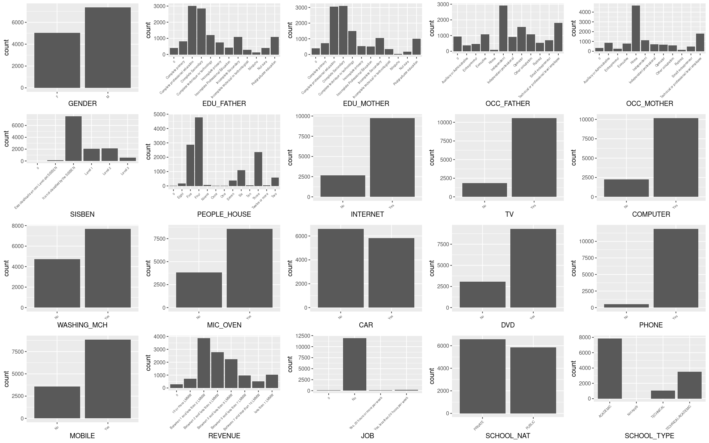
    


```R
sqldf('select count(JOB) from cat_data where JOB == 0')
```


<table>
<caption>A data.frame: 1 × 1</caption>
<thead>
	<tr><th scope=col>count(JOB)</th></tr>
	<tr><th scope=col>&lt;int&gt;</th></tr>
</thead>
<tbody>
	<tr><td>138</td></tr>
</tbody>
</table>


```R
sqldf('select distinct(people_house) from cat_data')
```


<table>
<caption>A data.frame: 13 × 1</caption>
<thead>
	<tr><th scope=col>PEOPLE_HOUSE</th></tr>
	<tr><th scope=col>&lt;fct&gt;</th></tr>
</thead>
<tbody>
	<tr><td>Three         </td></tr>
	<tr><td>Five          </td></tr>
	<tr><td>One           </td></tr>
	<tr><td>Four          </td></tr>
	<tr><td>Six           </td></tr>
	<tr><td>Two           </td></tr>
	<tr><td>Twelve or more</td></tr>
	<tr><td>Nueve         </td></tr>
	<tr><td>Eight         </td></tr>
	<tr><td>Seven         </td></tr>
	<tr><td>Ten           </td></tr>
	<tr><td>Once          </td></tr>
	<tr><td>0             </td></tr>
</tbody>
</table>


```R
sqldf('select count(people_house) from cat_data where people_house == 0')
```


<table>
<caption>A data.frame: 1 × 1</caption>
<thead>
	<tr><th scope=col>count(people_house)</th></tr>
	<tr><th scope=col>&lt;int&gt;</th></tr>
</thead>
<tbody>
	<tr><td>21</td></tr>
</tbody>
</table>


```R
cont_data <- sqldf('select MAT_S11,CR_S11,BIO_S11,ENG_S11,CC_S11,G_SC from df')
```


```R
describe(cont_data)
```


<table>
<caption>A psych: 6 × 13</caption>
<thead>
	<tr><th></th><th scope=col>vars</th><th scope=col>n</th><th scope=col>mean</th><th scope=col>sd</th><th scope=col>median</th><th scope=col>trimmed</th><th scope=col>mad</th><th scope=col>min</th><th scope=col>max</th><th scope=col>range</th><th scope=col>skew</th><th scope=col>kurtosis</th><th scope=col>se</th></tr>
	<tr><th></th><th scope=col>&lt;int&gt;</th><th scope=col>&lt;dbl&gt;</th><th scope=col>&lt;dbl&gt;</th><th scope=col>&lt;dbl&gt;</th><th scope=col>&lt;dbl&gt;</th><th scope=col>&lt;dbl&gt;</th><th scope=col>&lt;dbl&gt;</th><th scope=col>&lt;dbl&gt;</th><th scope=col>&lt;dbl&gt;</th><th scope=col>&lt;dbl&gt;</th><th scope=col>&lt;dbl&gt;</th><th scope=col>&lt;dbl&gt;</th><th scope=col>&lt;dbl&gt;</th></tr>
</thead>
<tbody>
	<tr><th scope=row>MAT_S11</th><td>1</td><td>12411</td><td> 64.32076</td><td>11.87365</td><td> 64</td><td> 63.83624</td><td>11.8608</td><td>26</td><td>100</td><td> 74</td><td> 0.39946028</td><td> 0.12886390</td><td>0.10658126</td></tr>
	<tr><th scope=row>CR_S11</th><td>2</td><td>12411</td><td> 60.77842</td><td>10.02588</td><td> 61</td><td> 60.62846</td><td>10.3782</td><td>24</td><td>100</td><td> 76</td><td> 0.21419352</td><td> 0.47665834</td><td>0.08999511</td></tr>
	<tr><th scope=row>BIO_S11</th><td>3</td><td>12411</td><td> 63.95053</td><td>11.15687</td><td> 64</td><td> 63.64568</td><td>10.3782</td><td>11</td><td>100</td><td> 89</td><td> 0.30329883</td><td> 0.29791111</td><td>0.10014723</td></tr>
	<tr><th scope=row>ENG_S11</th><td>4</td><td>12411</td><td> 61.80106</td><td>14.29778</td><td> 59</td><td> 60.76866</td><td>14.8260</td><td>26</td><td>100</td><td> 74</td><td> 0.60676163</td><td>-0.37157362</td><td>0.12834091</td></tr>
	<tr><th scope=row>CC_S11</th><td>5</td><td>12411</td><td> 60.70518</td><td>10.12052</td><td> 60</td><td> 60.42814</td><td>10.3782</td><td> 0</td><td>100</td><td>100</td><td> 0.34706837</td><td> 0.75443026</td><td>0.09084470</td></tr>
	<tr><th scope=row>G_SC</th><td>6</td><td>12411</td><td>162.71050</td><td>23.11248</td><td>163</td><td>162.93947</td><td>23.7216</td><td>37</td><td>247</td><td>210</td><td>-0.09539073</td><td>-0.07629832</td><td>0.20746419</td></tr>
</tbody>
</table>


```R
sqldf('select count(MAT_S11) from cont_data where MAT_S11 is null')
sqldf('select count(CR_S11) from cont_data where CR_S11 is null')
sqldf('select count(BIO_S11) from cont_data where BIO_S11 is null')
sqldf('select count(ENG_S11) from cont_data where ENG_S11 is null')
sqldf('select count(G_SC) from cont_data where G_SC is null')
```


<table>
<caption>A data.frame: 1 × 1</caption>
<thead>
	<tr><th scope=col>count(MAT_S11)</th></tr>
	<tr><th scope=col>&lt;int&gt;</th></tr>
</thead>
<tbody>
	<tr><td>0</td></tr>
</tbody>
</table>


<table>
<caption>A data.frame: 1 × 1</caption>
<thead>
	<tr><th scope=col>count(CR_S11)</th></tr>
	<tr><th scope=col>&lt;int&gt;</th></tr>
</thead>
<tbody>
	<tr><td>0</td></tr>
</tbody>
</table>


<table>
<caption>A data.frame: 1 × 1</caption>
<thead>
	<tr><th scope=col>count(BIO_S11)</th></tr>
	<tr><th scope=col>&lt;int&gt;</th></tr>
</thead>
<tbody>
	<tr><td>0</td></tr>
</tbody>
</table>


<table>
<caption>A data.frame: 1 × 1</caption>
<thead>
	<tr><th scope=col>count(ENG_S11)</th></tr>
	<tr><th scope=col>&lt;int&gt;</th></tr>
</thead>
<tbody>
	<tr><td>0</td></tr>
</tbody>
</table>


<table>
<caption>A data.frame: 1 × 1</caption>
<thead>
	<tr><th scope=col>count(G_SC)</th></tr>
	<tr><th scope=col>&lt;int&gt;</th></tr>
</thead>
<tbody>
	<tr><td>0</td></tr>
</tbody>
</table>


```R
col_names <- colnames(cont_data)
col_names
```


<style>
.list-inline {list-style: none; margin:0; padding: 0}
.list-inline>li {display: inline-block}
.list-inline>li:not(:last-child)::after {content: "\00b7"; padding: 0 .5ex}
</style>
<ol class=list-inline><li>'MAT_S11'</li><li>'CR_S11'</li><li>'BIO_S11'</li><li>'ENG_S11'</li><li>'G_SC'</li></ol>


```R
# hold all the plots created in the loop
plot_list <- list()
col_names <- colnames(cont_data)
for(i in col_names){
    print(i)
    print(mean(cont_data[,i]))
    gg <- ggplot(cont_data , aes_string(i))  
    gg <- gg + geom_histogram(binwidth=1, colour="black", aes(y=..density.., fill=..count..))
    gg<-gg+scale_fill_gradient("Count", low="#DCDCDC", high="#7C7C7C")
    gg<-gg+stat_function(fun=dnorm, color="red",args=list(mean=mean(cont_data[,i], na.rm=TRUE), sd=sd(cont_data[,i], na.rm=TRUE)))
    plot_list[[i]] <- gg
} # end of loop
```

    [1] "MAT_S11"
    [1] 64.32076
    [1] "CR_S11"
    [1] 60.77842
    [1] "BIO_S11"
    [1] 63.95053
    [1] "ENG_S11"
    [1] 61.80106
    [1] "CC_S11"
    [1] 60.70518
    [1] "G_SC"
    [1] 162.7105


```R
plot_grid(plotlist = plot_list)
```


    
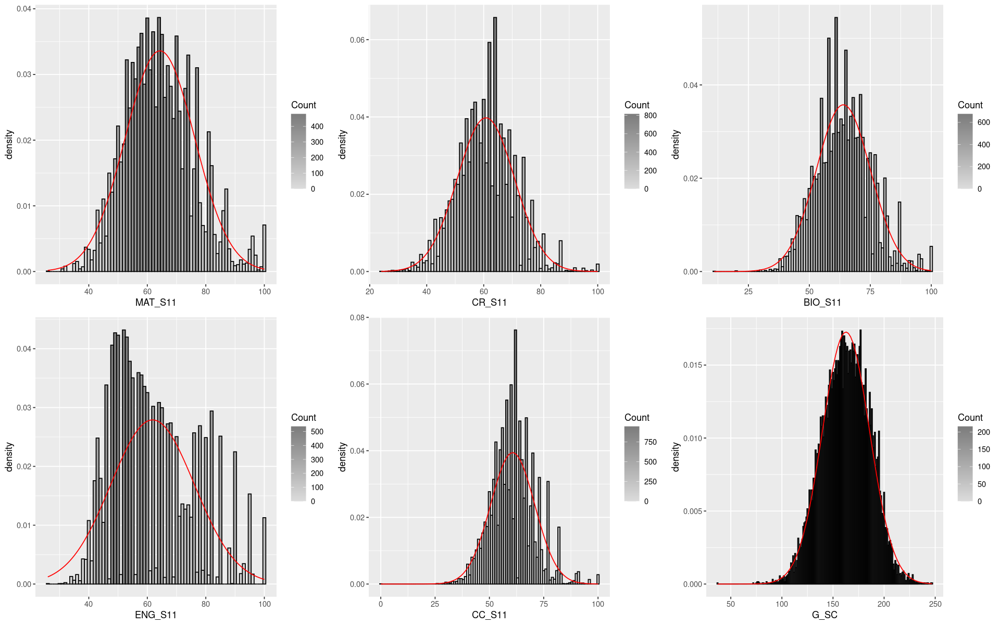
    


```R
# hold all theplots created in the loop
box_plot_list <- list()
for(i in col_names){
    print(i)
    gg <- ggplot(cont_data, aes_string(y=i)) + geom_boxplot() + theme(text = element_text(size=20))
    box_plot_list[[i]] <- gg
} # end of loop
```

    [1] "MAT_S11"
    [1] "CR_S11"
    [1] "BIO_S11"
    [1] "ENG_S11"
    [1] "CC_S11"
    [1] "G_SC"


```R
plot_grid(plotlist = box_plot_list)
```


    
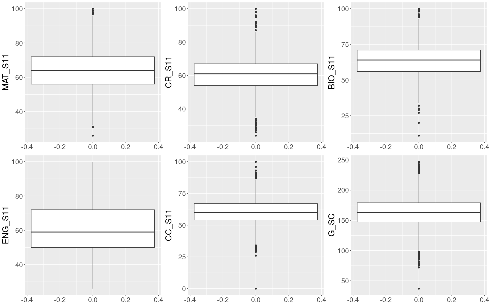
    


```R
# make sure to remove missing values and outliers
```


```R
head(cont_data)
```


<table>
<caption>A data.frame: 6 × 5</caption>
<thead>
	<tr><th></th><th scope=col>MAT_S11</th><th scope=col>CR_S11</th><th scope=col>BIO_S11</th><th scope=col>ENG_S11</th><th scope=col>G_SC</th></tr>
	<tr><th></th><th scope=col>&lt;dbl&gt;</th><th scope=col>&lt;dbl&gt;</th><th scope=col>&lt;dbl&gt;</th><th scope=col>&lt;dbl&gt;</th><th scope=col>&lt;dbl&gt;</th></tr>
</thead>
<tbody>
	<tr><th scope=row>1</th><td>71</td><td>81</td><td> 86</td><td>82</td><td>180</td></tr>
	<tr><th scope=row>2</th><td>83</td><td>75</td><td>100</td><td>88</td><td>182</td></tr>
	<tr><th scope=row>3</th><td>52</td><td>49</td><td> 46</td><td>42</td><td>113</td></tr>
	<tr><th scope=row>4</th><td>56</td><td>55</td><td> 64</td><td>73</td><td>157</td></tr>
	<tr><th scope=row>5</th><td>80</td><td>65</td><td> 85</td><td>92</td><td>198</td></tr>
	<tr><th scope=row>6</th><td>71</td><td>60</td><td> 61</td><td>82</td><td>154</td></tr>
</tbody>
</table>


```R
# qq plot for each numerical data above
qqnorm(cont_data$MAT_S11 ,main='MAT_S11')+qqline(cont_data$MAT_S11, col=2) #show a line on theplot
```


    Error in qqnorm(cont_data$MAT_S11, main = "MAT_S11") + qqline(cont_data$MAT_S11, : non-numeric argument to binary operator
    Traceback:


    
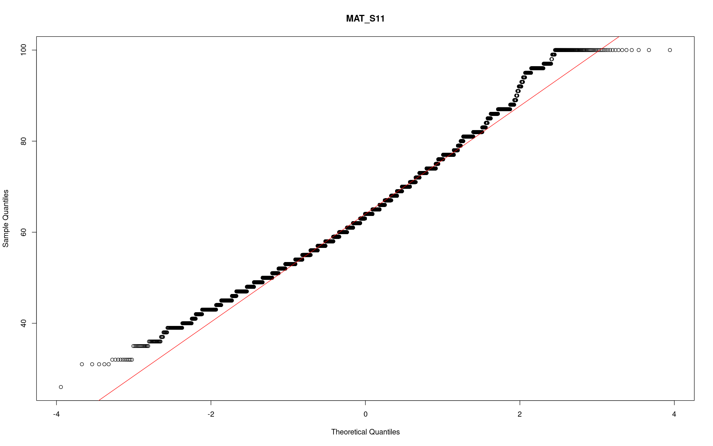
    


```R
qqnorm(cont_data$CR_S11 ,main='CR_S11')+qqline(cont_data$CR_S11, col=2) #show a line on theplot
```


    Error in qqnorm(cont_data$CR_S11, main = "CR_S11") + qqline(cont_data$CR_S11, : non-numeric argument to binary operator
    Traceback:


    
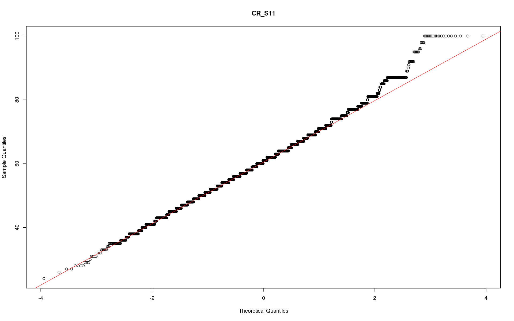
    


```R
qqnorm(cont_data$BIO_S11 ,main='BIO_S11')+qqline(cont_data$BIO_S11, col=2) #show a line on theplot
```


    Error in qqnorm(cont_data$BIO_S11, main = "BIO_S11") + qqline(cont_data$BIO_S11, : non-numeric argument to binary operator
    Traceback:


    
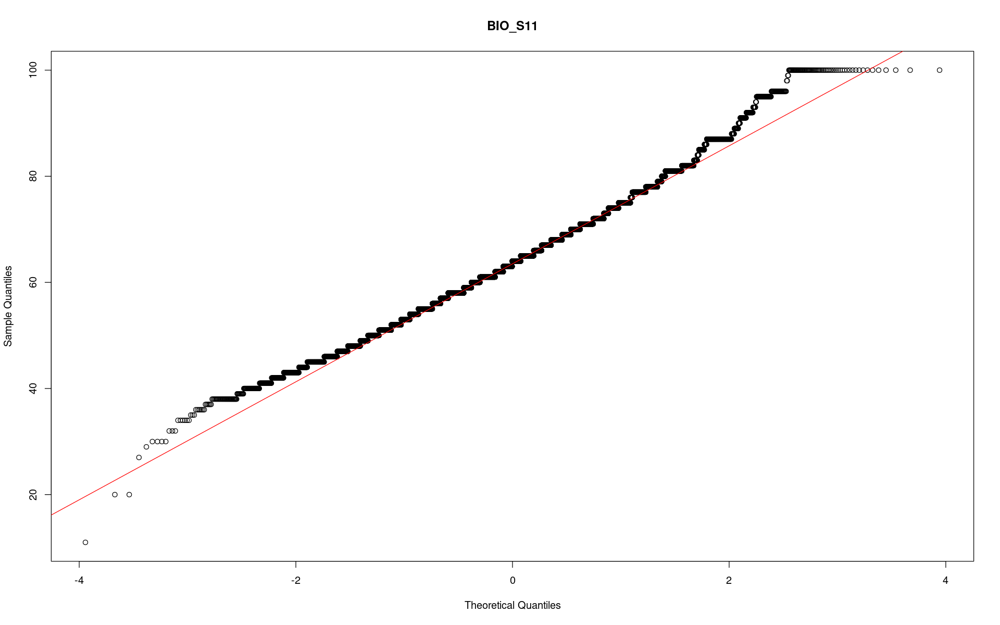
    


```R
qqnorm(cont_data$ENG_S11 ,main='ENG_S11')+qqline(cont_data$ENG_S11, col=2) #show a line on theplot
```


    Error in qqnorm(cont_data$ENG_S11, main = "ENG_S11") + qqline(cont_data$ENG_S11, : non-numeric argument to binary operator
    Traceback:


    
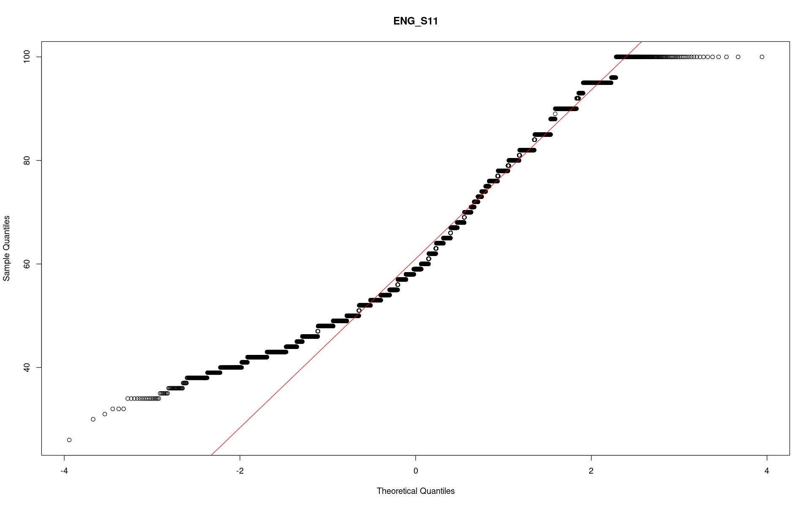
    


```R
qqnorm(cont_data$CC_S11 ,main='CC_S11')+qqline(cont_data$CC_S11, col=2) #show a line on theplot
```


    Error in qqnorm(cont_data$CC_S11, main = "CC_S11") + qqline(cont_data$CC_S11, : non-numeric argument to binary operator
    Traceback:


    
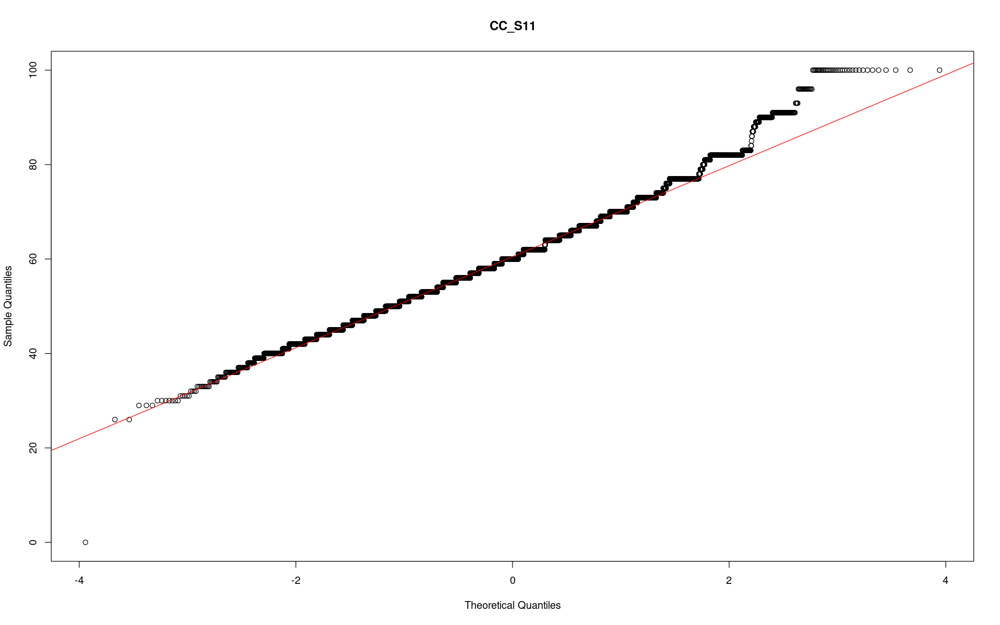
    


```R
qqnorm(cont_data$G_SC ,main='G_SC')+qqline(cont_data$G_SC, col=2) #show a line on theplot
```


    Error in qqnorm(cont_data$G_SC, main = "G_SC") + qqline(cont_data$G_SC, : non-numeric argument to binary operator
    Traceback:


    
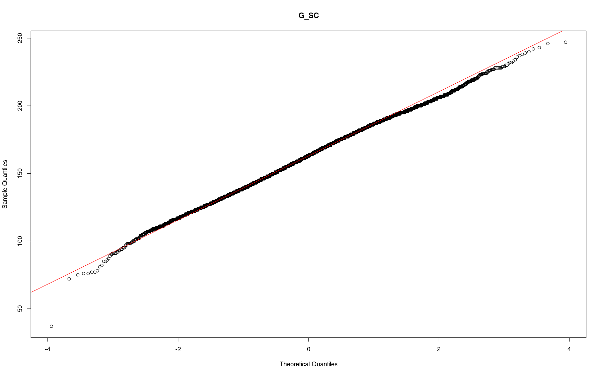
    


```R
# removig data that is NA,using complete.cases in case i missed finding data with Null values
head(filter_data)
```


<table>
<caption>A data.frame: 6 × 25</caption>
<thead>
	<tr><th></th><th scope=col>GENDER</th><th scope=col>EDU_FATHER</th><th scope=col>EDU_MOTHER</th><th scope=col>OCC_FATHER</th><th scope=col>OCC_MOTHER</th><th scope=col>SISBEN</th><th scope=col>PEOPLE_HOUSE</th><th scope=col>INTERNET</th><th scope=col>TV</th><th scope=col>COMPUTER</th><th scope=col>⋯</th><th scope=col>MOBILE</th><th scope=col>REVENUE</th><th scope=col>JOB</th><th scope=col>SCHOOL_NAT</th><th scope=col>SCHOOL_TYPE</th><th scope=col>MAT_S11</th><th scope=col>CR_S11</th><th scope=col>BIO_S11</th><th scope=col>ENG_S11</th><th scope=col>G_SC</th></tr>
	<tr><th></th><th scope=col>&lt;fct&gt;</th><th scope=col>&lt;fct&gt;</th><th scope=col>&lt;fct&gt;</th><th scope=col>&lt;fct&gt;</th><th scope=col>&lt;fct&gt;</th><th scope=col>&lt;fct&gt;</th><th scope=col>&lt;fct&gt;</th><th scope=col>&lt;fct&gt;</th><th scope=col>&lt;fct&gt;</th><th scope=col>&lt;fct&gt;</th><th scope=col>⋯</th><th scope=col>&lt;fct&gt;</th><th scope=col>&lt;fct&gt;</th><th scope=col>&lt;fct&gt;</th><th scope=col>&lt;fct&gt;</th><th scope=col>&lt;fct&gt;</th><th scope=col>&lt;dbl&gt;</th><th scope=col>&lt;dbl&gt;</th><th scope=col>&lt;dbl&gt;</th><th scope=col>&lt;dbl&gt;</th><th scope=col>&lt;dbl&gt;</th></tr>
</thead>
<tbody>
	<tr><th scope=row>1</th><td>F</td><td>Incomplete Professional Education</td><td>Complete technique or technology</td><td>Technical or professional level employee</td><td>Home                    </td><td>It is not classified by the SISBEN</td><td>Three</td><td>Yes</td><td>Yes</td><td>Yes</td><td>⋯</td><td>Yes</td><td>Between 1 and less than 2 LMMW </td><td>No                            </td><td>PRIVATE</td><td>ACADEMIC</td><td>71</td><td>81</td><td> 86</td><td>82</td><td>180</td></tr>
	<tr><th scope=row>2</th><td>F</td><td>Complete Secundary               </td><td>Complete professional education </td><td>Entrepreneur                            </td><td>Independent professional</td><td>It is not classified by the SISBEN</td><td>Three</td><td>Yes</td><td>Yes</td><td>Yes</td><td>⋯</td><td>Yes</td><td>10 or more LMMW                </td><td>No                            </td><td>PRIVATE</td><td>ACADEMIC</td><td>83</td><td>75</td><td>100</td><td>88</td><td>182</td></tr>
	<tr><th scope=row>3</th><td>M</td><td>Not sure                         </td><td>Not sure                        </td><td>Independent                             </td><td>Home                    </td><td>Level 2                           </td><td>Five </td><td>No </td><td>No </td><td>Yes</td><td>⋯</td><td>No </td><td>Between 1 and less than 2 LMMW </td><td>Yes, 20 hours or more per week</td><td>PRIVATE</td><td>ACADEMIC</td><td>52</td><td>49</td><td> 46</td><td>42</td><td>113</td></tr>
	<tr><th scope=row>4</th><td>F</td><td>Not sure                         </td><td>Not sure                        </td><td>Other occupation                        </td><td>Independent             </td><td>It is not classified by the SISBEN</td><td>Three</td><td>Yes</td><td>Yes</td><td>Yes</td><td>⋯</td><td>Yes</td><td>Between 2 and less than 3 LMMW </td><td>No                            </td><td>PRIVATE</td><td>ACADEMIC</td><td>56</td><td>55</td><td> 64</td><td>73</td><td>157</td></tr>
	<tr><th scope=row>5</th><td>M</td><td>Complete professional education  </td><td>Complete professional education </td><td>Executive                               </td><td>Home                    </td><td>It is not classified by the SISBEN</td><td>One  </td><td>Yes</td><td>Yes</td><td>Yes</td><td>⋯</td><td>Yes</td><td>Between 7 and less than 10 LMMW</td><td>No                            </td><td>PRIVATE</td><td>ACADEMIC</td><td>80</td><td>65</td><td> 85</td><td>92</td><td>198</td></tr>
	<tr><th scope=row>6</th><td>F</td><td>Complete professional education  </td><td>Complete professional education </td><td>Independent                             </td><td>Executive               </td><td>It is not classified by the SISBEN</td><td>Three</td><td>Yes</td><td>Yes</td><td>Yes</td><td>⋯</td><td>Yes</td><td>10 or more LMMW                </td><td>No                            </td><td>PRIVATE</td><td>ACADEMIC</td><td>71</td><td>60</td><td> 61</td><td>82</td><td>154</td></tr>
</tbody>
</table>


```R
filter_data<-filter_data[complete.cases(filter_data),]
```


```R
filter_data
```


<table>
<caption>A data.frame: 12411 × 25</caption>
<thead>
	<tr><th></th><th scope=col>GENDER</th><th scope=col>EDU_FATHER</th><th scope=col>EDU_MOTHER</th><th scope=col>OCC_FATHER</th><th scope=col>OCC_MOTHER</th><th scope=col>SISBEN</th><th scope=col>PEOPLE_HOUSE</th><th scope=col>INTERNET</th><th scope=col>TV</th><th scope=col>COMPUTER</th><th scope=col>⋯</th><th scope=col>MOBILE</th><th scope=col>REVENUE</th><th scope=col>JOB</th><th scope=col>SCHOOL_NAT</th><th scope=col>SCHOOL_TYPE</th><th scope=col>MAT_S11</th><th scope=col>CR_S11</th><th scope=col>BIO_S11</th><th scope=col>ENG_S11</th><th scope=col>G_SC</th></tr>
	<tr><th></th><th scope=col>&lt;fct&gt;</th><th scope=col>&lt;fct&gt;</th><th scope=col>&lt;fct&gt;</th><th scope=col>&lt;fct&gt;</th><th scope=col>&lt;fct&gt;</th><th scope=col>&lt;fct&gt;</th><th scope=col>&lt;fct&gt;</th><th scope=col>&lt;fct&gt;</th><th scope=col>&lt;fct&gt;</th><th scope=col>&lt;fct&gt;</th><th scope=col>⋯</th><th scope=col>&lt;fct&gt;</th><th scope=col>&lt;fct&gt;</th><th scope=col>&lt;fct&gt;</th><th scope=col>&lt;fct&gt;</th><th scope=col>&lt;fct&gt;</th><th scope=col>&lt;dbl&gt;</th><th scope=col>&lt;dbl&gt;</th><th scope=col>&lt;dbl&gt;</th><th scope=col>&lt;dbl&gt;</th><th scope=col>&lt;dbl&gt;</th></tr>
</thead>
<tbody>
	<tr><th scope=row>1</th><td>F</td><td>Incomplete Professional Education    </td><td>Complete technique or technology     </td><td>Technical or professional level employee</td><td>Home                                    </td><td>It is not classified by the SISBEN       </td><td>Three</td><td>Yes</td><td>Yes</td><td>Yes</td><td>⋯</td><td>Yes</td><td>Between 1 and less than 2 LMMW </td><td>No                              </td><td>PRIVATE</td><td>ACADEMIC          </td><td>71</td><td>81</td><td> 86</td><td>82</td><td>180</td></tr>
	<tr><th scope=row>2</th><td>F</td><td>Complete Secundary                   </td><td>Complete professional education      </td><td>Entrepreneur                            </td><td>Independent professional                </td><td>It is not classified by the SISBEN       </td><td>Three</td><td>Yes</td><td>Yes</td><td>Yes</td><td>⋯</td><td>Yes</td><td>10 or more LMMW                </td><td>No                              </td><td>PRIVATE</td><td>ACADEMIC          </td><td>83</td><td>75</td><td>100</td><td>88</td><td>182</td></tr>
	<tr><th scope=row>3</th><td>M</td><td>Not sure                             </td><td>Not sure                             </td><td>Independent                             </td><td>Home                                    </td><td>Level 2                                  </td><td>Five </td><td>No </td><td>No </td><td>Yes</td><td>⋯</td><td>No </td><td>Between 1 and less than 2 LMMW </td><td>Yes, 20 hours or more per week  </td><td>PRIVATE</td><td>ACADEMIC          </td><td>52</td><td>49</td><td> 46</td><td>42</td><td>113</td></tr>
	<tr><th scope=row>4</th><td>F</td><td>Not sure                             </td><td>Not sure                             </td><td>Other occupation                        </td><td>Independent                             </td><td>It is not classified by the SISBEN       </td><td>Three</td><td>Yes</td><td>Yes</td><td>Yes</td><td>⋯</td><td>Yes</td><td>Between 2 and less than 3 LMMW </td><td>No                              </td><td>PRIVATE</td><td>ACADEMIC          </td><td>56</td><td>55</td><td> 64</td><td>73</td><td>157</td></tr>
	<tr><th scope=row>5</th><td>M</td><td>Complete professional education      </td><td>Complete professional education      </td><td>Executive                               </td><td>Home                                    </td><td>It is not classified by the SISBEN       </td><td>One  </td><td>Yes</td><td>Yes</td><td>Yes</td><td>⋯</td><td>Yes</td><td>Between 7 and less than 10 LMMW</td><td>No                              </td><td>PRIVATE</td><td>ACADEMIC          </td><td>80</td><td>65</td><td> 85</td><td>92</td><td>198</td></tr>
	<tr><th scope=row>6</th><td>F</td><td>Complete professional education      </td><td>Complete professional education      </td><td>Independent                             </td><td>Executive                               </td><td>It is not classified by the SISBEN       </td><td>Three</td><td>Yes</td><td>Yes</td><td>Yes</td><td>⋯</td><td>Yes</td><td>10 or more LMMW                </td><td>No                              </td><td>PRIVATE</td><td>ACADEMIC          </td><td>71</td><td>60</td><td> 61</td><td>82</td><td>154</td></tr>
	<tr><th scope=row>7</th><td>M</td><td>Complete professional education      </td><td>Complete professional education      </td><td>Small entrepreneur                      </td><td>Executive                               </td><td>It is not classified by the SISBEN       </td><td>Four </td><td>Yes</td><td>Yes</td><td>Yes</td><td>⋯</td><td>Yes</td><td>10 or more LMMW                </td><td>No                              </td><td>PRIVATE</td><td>ACADEMIC          </td><td>71</td><td>75</td><td> 75</td><td>85</td><td>152</td></tr>
	<tr><th scope=row>8</th><td>F</td><td>Incomplete Secundary                 </td><td>Complete Secundary                   </td><td>Entrepreneur                            </td><td>Independent professional                </td><td>It is not classified by the SISBEN       </td><td>Five </td><td>Yes</td><td>Yes</td><td>Yes</td><td>⋯</td><td>No </td><td>10 or more LMMW                </td><td>No                              </td><td>PRIVATE</td><td>ACADEMIC          </td><td>74</td><td>67</td><td> 85</td><td>96</td><td>200</td></tr>
	<tr><th scope=row>9</th><td>M</td><td>Complete Secundary                   </td><td>Complete professional education      </td><td>Independent                             </td><td>Operator                                </td><td>It is not classified by the SISBEN       </td><td>Three</td><td>Yes</td><td>Yes</td><td>Yes</td><td>⋯</td><td>Yes</td><td>Between 1 and less than 2 LMMW </td><td>No                              </td><td>PRIVATE</td><td>TECHNICAL         </td><td>44</td><td>54</td><td> 44</td><td>46</td><td>133</td></tr>
	<tr><th scope=row>10</th><td>M</td><td>Incomplete technical or technological</td><td>Incomplete technical or technological</td><td>Independent                             </td><td>Home                                    </td><td>Level 2                                  </td><td>Four </td><td>Yes</td><td>Yes</td><td>Yes</td><td>⋯</td><td>Yes</td><td>Between 2 and less than 3 LMMW </td><td>Yes, 20 hours or more per week  </td><td>PRIVATE</td><td>ACADEMIC          </td><td>52</td><td>55</td><td> 55</td><td>65</td><td>126</td></tr>
	<tr><th scope=row>11</th><td>F</td><td>Not sure                             </td><td>Not sure                             </td><td>Other occupation                        </td><td>Independent professional                </td><td>It is not classified by the SISBEN       </td><td>Five </td><td>Yes</td><td>Yes</td><td>Yes</td><td>⋯</td><td>Yes</td><td>10 or more LMMW                </td><td>No                              </td><td>PRIVATE</td><td>ACADEMIC          </td><td>74</td><td>71</td><td> 78</td><td>96</td><td>200</td></tr>
	<tr><th scope=row>12</th><td>M</td><td>Complete technique or technology     </td><td>Complete Secundary                   </td><td>Technical or professional level employee</td><td>Entrepreneur                            </td><td>It is not classified by the SISBEN       </td><td>Four </td><td>Yes</td><td>Yes</td><td>Yes</td><td>⋯</td><td>Yes</td><td>Between 2 and less than 3 LMMW </td><td>Yes, 20 hours or more per week  </td><td>PRIVATE</td><td>ACADEMIC          </td><td>54</td><td>47</td><td> 45</td><td>43</td><td>133</td></tr>
	<tr><th scope=row>13</th><td>F</td><td>Not sure                             </td><td>Incomplete technical or technological</td><td>Small entrepreneur                      </td><td>Home                                    </td><td>It is not classified by the SISBEN       </td><td>Five </td><td>No </td><td>Yes</td><td>Yes</td><td>⋯</td><td>No </td><td>Between 2 and less than 3 LMMW </td><td>No                              </td><td>PRIVATE</td><td>ACADEMIC          </td><td>56</td><td>62</td><td> 61</td><td>50</td><td>148</td></tr>
	<tr><th scope=row>14</th><td>M</td><td>Complete professional education      </td><td>Complete professional education      </td><td>Entrepreneur                            </td><td>Small entrepreneur                      </td><td>It is not classified by the SISBEN       </td><td>Six  </td><td>Yes</td><td>Yes</td><td>Yes</td><td>⋯</td><td>Yes</td><td>10 or more LMMW                </td><td>No                              </td><td>PRIVATE</td><td>ACADEMIC          </td><td>76</td><td>71</td><td> 75</td><td>82</td><td>191</td></tr>
	<tr><th scope=row>15</th><td>F</td><td>Incomplete primary                   </td><td>Incomplete primary                   </td><td>Small entrepreneur                      </td><td>Executive                               </td><td>Level 1                                  </td><td>Two  </td><td>No </td><td>No </td><td>No </td><td>⋯</td><td>No </td><td>less than 1 LMMW               </td><td>Yes, 20 hours or more per week  </td><td>PRIVATE</td><td>ACADEMIC          </td><td>56</td><td>45</td><td> 51</td><td>44</td><td>157</td></tr>
	<tr><th scope=row>16</th><td>F</td><td>Complete technique or technology     </td><td>Not sure                             </td><td>Technical or professional level employee</td><td>Technical or professional level employee</td><td>It is not classified by the SISBEN       </td><td>Two  </td><td>Yes</td><td>Yes</td><td>Yes</td><td>⋯</td><td>Yes</td><td>Between 2 and less than 3 LMMW </td><td>No                              </td><td>PRIVATE</td><td>ACADEMIC          </td><td>62</td><td>58</td><td> 55</td><td>59</td><td>164</td></tr>
	<tr><th scope=row>17</th><td>M</td><td>Complete professional education      </td><td>Complete professional education      </td><td>Small entrepreneur                      </td><td>Executive                               </td><td>It is not classified by the SISBEN       </td><td>Four </td><td>Yes</td><td>Yes</td><td>Yes</td><td>⋯</td><td>Yes</td><td>Between 7 and less than 10 LMMW</td><td>No                              </td><td>PRIVATE</td><td>ACADEMIC          </td><td>74</td><td>67</td><td> 78</td><td>68</td><td>162</td></tr>
	<tr><th scope=row>18</th><td>M</td><td>Complete professional education      </td><td>Complete professional education      </td><td>Independent professional                </td><td>Independent professional                </td><td>It is not classified by the SISBEN       </td><td>Four </td><td>Yes</td><td>Yes</td><td>Yes</td><td>⋯</td><td>Yes</td><td>Between 7 and less than 10 LMMW</td><td>No                              </td><td>PRIVATE</td><td>ACADEMIC          </td><td>74</td><td>64</td><td> 72</td><td>88</td><td>188</td></tr>
	<tr><th scope=row>19</th><td>M</td><td>Complete technique or technology     </td><td>Complete Secundary                   </td><td>Operator                                </td><td>Independent                             </td><td>Level 2                                  </td><td>Four </td><td>Yes</td><td>Yes</td><td>Yes</td><td>⋯</td><td>No </td><td>Between 1 and less than 2 LMMW </td><td>Yes, less than 20 hours per week</td><td>PRIVATE</td><td>ACADEMIC          </td><td>44</td><td>49</td><td> 44</td><td>44</td><td>129</td></tr>
	<tr><th scope=row>20</th><td>M</td><td>Complete professional education      </td><td>Complete professional education      </td><td>Technical or professional level employee</td><td>Technical or professional level employee</td><td>Esta clasificada en otro Level del SISBEN</td><td>Three</td><td>Yes</td><td>Yes</td><td>Yes</td><td>⋯</td><td>No </td><td>Between 3 and less than 5 LMMW </td><td>No                              </td><td>PRIVATE</td><td>ACADEMIC          </td><td>61</td><td>44</td><td> 41</td><td>53</td><td>170</td></tr>
	<tr><th scope=row>21</th><td>M</td><td>Complete professional education      </td><td>Complete professional education      </td><td>Independent professional                </td><td>Executive                               </td><td>It is not classified by the SISBEN       </td><td>Three</td><td>Yes</td><td>Yes</td><td>Yes</td><td>⋯</td><td>Yes</td><td>Between 1 and less than 2 LMMW </td><td>No                              </td><td>PRIVATE</td><td>TECHNICAL/ACADEMIC</td><td>58</td><td>53</td><td> 48</td><td>58</td><td>170</td></tr>
	<tr><th scope=row>22</th><td>M</td><td>Incomplete primary                   </td><td>Incomplete Secundary                 </td><td>Independent                             </td><td>Home                                    </td><td>It is not classified by the SISBEN       </td><td>Four </td><td>Yes</td><td>No </td><td>Yes</td><td>⋯</td><td>Yes</td><td>less than 1 LMMW               </td><td>No                              </td><td>PRIVATE</td><td>TECHNICAL/ACADEMIC</td><td>60</td><td>47</td><td> 56</td><td>57</td><td>144</td></tr>
	<tr><th scope=row>23</th><td>M</td><td>Complete primary                     </td><td>Incomplete primary                   </td><td>Independent                             </td><td>Home                                    </td><td>It is not classified by the SISBEN       </td><td>Four </td><td>Yes</td><td>Yes</td><td>Yes</td><td>⋯</td><td>Yes</td><td>Between 2 and less than 3 LMMW </td><td>No                              </td><td>PRIVATE</td><td>ACADEMIC          </td><td>53</td><td>47</td><td> 36</td><td>64</td><td>138</td></tr>
	<tr><th scope=row>24</th><td>M</td><td>Incomplete primary                   </td><td>Incomplete primary                   </td><td>0                                       </td><td>0                                       </td><td>It is not classified by the SISBEN       </td><td>Five </td><td>Yes</td><td>Yes</td><td>No </td><td>⋯</td><td>Yes</td><td>Between 2 and less than 3 LMMW </td><td>No                              </td><td>PRIVATE</td><td>TECHNICAL/ACADEMIC</td><td>67</td><td>65</td><td> 72</td><td>82</td><td>164</td></tr>
	<tr><th scope=row>25</th><td>M</td><td>Complete professional education      </td><td>Incomplete Professional Education    </td><td>Executive                               </td><td>Operator                                </td><td>It is not classified by the SISBEN       </td><td>Four </td><td>Yes</td><td>Yes</td><td>Yes</td><td>⋯</td><td>Yes</td><td>Between 3 and less than 5 LMMW </td><td>No                              </td><td>PRIVATE</td><td>TECHNICAL/ACADEMIC</td><td>80</td><td>71</td><td> 66</td><td>75</td><td>194</td></tr>
	<tr><th scope=row>26</th><td>M</td><td>Complete technique or technology     </td><td>Complete technique or technology     </td><td>Executive                               </td><td>Home                                    </td><td>It is not classified by the SISBEN       </td><td>Three</td><td>Yes</td><td>Yes</td><td>Yes</td><td>⋯</td><td>Yes</td><td>Between 2 and less than 3 LMMW </td><td>No                              </td><td>PRIVATE</td><td>TECHNICAL/ACADEMIC</td><td>83</td><td>75</td><td>100</td><td>71</td><td>201</td></tr>
	<tr><th scope=row>27</th><td>M</td><td>Complete professional education      </td><td>Complete technique or technology     </td><td>Technical or professional level employee</td><td>Technical or professional level employee</td><td>It is not classified by the SISBEN       </td><td>Four </td><td>Yes</td><td>Yes</td><td>Yes</td><td>⋯</td><td>Yes</td><td>Between 3 and less than 5 LMMW </td><td>No                              </td><td>PRIVATE</td><td>ACADEMIC          </td><td>69</td><td>56</td><td> 63</td><td>70</td><td>155</td></tr>
	<tr><th scope=row>28</th><td>M</td><td>Postgraduate education               </td><td>Complete professional education      </td><td>Executive                               </td><td>Auxiliary or Administrative             </td><td>It is not classified by the SISBEN       </td><td>Five </td><td>Yes</td><td>Yes</td><td>Yes</td><td>⋯</td><td>Yes</td><td>10 or more LMMW                </td><td>No                              </td><td>PRIVATE</td><td>ACADEMIC          </td><td>85</td><td>71</td><td> 72</td><td>92</td><td>180</td></tr>
	<tr><th scope=row>29</th><td>F</td><td>Complete Secundary                   </td><td>Complete technique or technology     </td><td>Technical or professional level employee</td><td>Home                                    </td><td>It is not classified by the SISBEN       </td><td>Four </td><td>Yes</td><td>Yes</td><td>Yes</td><td>⋯</td><td>Yes</td><td>Between 3 and less than 5 LMMW </td><td>No                              </td><td>PRIVATE</td><td>TECHNICAL/ACADEMIC</td><td>48</td><td>56</td><td> 51</td><td>54</td><td>137</td></tr>
	<tr><th scope=row>30</th><td>F</td><td>Complete technique or technology     </td><td>Complete technique or technology     </td><td>Executive                               </td><td>Independent                             </td><td>It is not classified by the SISBEN       </td><td>Four </td><td>Yes</td><td>Yes</td><td>Yes</td><td>⋯</td><td>Yes</td><td>Between 2 and less than 3 LMMW </td><td>No                              </td><td>PRIVATE</td><td>TECHNICAL/ACADEMIC</td><td>48</td><td>44</td><td> 61</td><td>48</td><td>161</td></tr>
	<tr><th scope=row>⋮</th><td>⋮</td><td>⋮</td><td>⋮</td><td>⋮</td><td>⋮</td><td>⋮</td><td>⋮</td><td>⋮</td><td>⋮</td><td>⋮</td><td>⋱</td><td>⋮</td><td>⋮</td><td>⋮</td><td>⋮</td><td>⋮</td><td>⋮</td><td>⋮</td><td>⋮</td><td>⋮</td><td>⋮</td></tr>
	<tr><th scope=row>12382</th><td>F</td><td>Complete professional education      </td><td>Complete technique or technology     </td><td>Technical or professional level employee</td><td>Technical or professional level employee</td><td>It is not classified by the SISBEN</td><td>Four </td><td>Yes</td><td>Yes</td><td>Yes</td><td>⋯</td><td>Yes</td><td>Between 3 and less than 5 LMMW </td><td>No                              </td><td>PRIVATE</td><td>ACADEMIC          </td><td>67</td><td>72</td><td>75</td><td> 62</td><td>179</td></tr>
	<tr><th scope=row>12383</th><td>F</td><td>Postgraduate education               </td><td>Postgraduate education               </td><td>Technical or professional level employee</td><td>Technical or professional level employee</td><td>It is not classified by the SISBEN</td><td>Four </td><td>Yes</td><td>Yes</td><td>Yes</td><td>⋯</td><td>Yes</td><td>10 or more LMMW                </td><td>No                              </td><td>PRIVATE</td><td>ACADEMIC          </td><td>74</td><td>72</td><td>70</td><td>100</td><td>215</td></tr>
	<tr><th scope=row>12384</th><td>M</td><td>Complete Secundary                   </td><td>Complete technique or technology     </td><td>Other occupation                        </td><td>Other occupation                        </td><td>It is not classified by the SISBEN</td><td>Five </td><td>Yes</td><td>Yes</td><td>Yes</td><td>⋯</td><td>No </td><td>Between 1 and less than 2 LMMW </td><td>No                              </td><td>PUBLIC </td><td>TECHNICAL/ACADEMIC</td><td>61</td><td>57</td><td>61</td><td> 52</td><td>154</td></tr>
	<tr><th scope=row>12385</th><td>F</td><td>Complete primary                     </td><td>Complete Secundary                   </td><td>Other occupation                        </td><td>Home                                    </td><td>It is not classified by the SISBEN</td><td>Five </td><td>Yes</td><td>Yes</td><td>Yes</td><td>⋯</td><td>No </td><td>Between 1 and less than 2 LMMW </td><td>No                              </td><td>PUBLIC </td><td>TECHNICAL/ACADEMIC</td><td>52</td><td>67</td><td>61</td><td> 53</td><td>168</td></tr>
	<tr><th scope=row>12386</th><td>M</td><td>Postgraduate education               </td><td>Postgraduate education               </td><td>Executive                               </td><td>Executive                               </td><td>It is not classified by the SISBEN</td><td>Four </td><td>Yes</td><td>Yes</td><td>Yes</td><td>⋯</td><td>Yes</td><td>10 or more LMMW                </td><td>No                              </td><td>PRIVATE</td><td>ACADEMIC          </td><td>87</td><td>72</td><td>74</td><td> 88</td><td>194</td></tr>
	<tr><th scope=row>12387</th><td>M</td><td>Complete professional education      </td><td>Complete professional education      </td><td>Technical or professional level employee</td><td>Technical or professional level employee</td><td>It is not classified by the SISBEN</td><td>Five </td><td>Yes</td><td>Yes</td><td>Yes</td><td>⋯</td><td>Yes</td><td>Between 5 and less than 7 LMMW </td><td>No                              </td><td>PRIVATE</td><td>ACADEMIC          </td><td>85</td><td>72</td><td>81</td><td> 65</td><td>209</td></tr>
	<tr><th scope=row>12388</th><td>F</td><td>Complete Secundary                   </td><td>Complete Secundary                   </td><td>Other occupation                        </td><td>Other occupation                        </td><td>Level 2                           </td><td>Three</td><td>No </td><td>Yes</td><td>Yes</td><td>⋯</td><td>No </td><td>Between 1 and less than 2 LMMW </td><td>No                              </td><td>PUBLIC </td><td>ACADEMIC          </td><td>55</td><td>55</td><td>63</td><td> 58</td><td>171</td></tr>
	<tr><th scope=row>12389</th><td>F</td><td>Incomplete primary                   </td><td>Complete primary                     </td><td>Independent                             </td><td>Home                                    </td><td>Level 1                           </td><td>Three</td><td>No </td><td>No </td><td>No </td><td>⋯</td><td>No </td><td>less than 1 LMMW               </td><td>No                              </td><td>PUBLIC </td><td>TECHNICAL         </td><td>69</td><td>67</td><td>73</td><td> 59</td><td>183</td></tr>
	<tr><th scope=row>12390</th><td>F</td><td>Complete Secundary                   </td><td>Incomplete Secundary                 </td><td>Independent                             </td><td>Home                                    </td><td>Level 1                           </td><td>Six  </td><td>Yes</td><td>Yes</td><td>Yes</td><td>⋯</td><td>Yes</td><td>less than 1 LMMW               </td><td>No                              </td><td>PUBLIC </td><td>ACADEMIC          </td><td>63</td><td>63</td><td>72</td><td> 61</td><td>161</td></tr>
	<tr><th scope=row>12391</th><td>F</td><td>Complete professional education      </td><td>Complete Secundary                   </td><td>Operator                                </td><td>Retired                                 </td><td>It is not classified by the SISBEN</td><td>Three</td><td>Yes</td><td>Yes</td><td>Yes</td><td>⋯</td><td>Yes</td><td>Between 1 and less than 2 LMMW </td><td>No                              </td><td>PUBLIC </td><td>ACADEMIC          </td><td>66</td><td>60</td><td>58</td><td> 51</td><td>166</td></tr>
	<tr><th scope=row>12392</th><td>F</td><td>Incomplete Professional Education    </td><td>Complete technique or technology     </td><td>Auxiliary or Administrative             </td><td>Other occupation                        </td><td>It is not classified by the SISBEN</td><td>Two  </td><td>Yes</td><td>Yes</td><td>No </td><td>⋯</td><td>Yes</td><td>Between 1 and less than 2 LMMW </td><td>No                              </td><td>PUBLIC </td><td>TECHNICAL/ACADEMIC</td><td>53</td><td>60</td><td>59</td><td> 61</td><td>159</td></tr>
	<tr><th scope=row>12393</th><td>M</td><td>Complete primary                     </td><td>Complete Secundary                   </td><td>Operator                                </td><td>Home                                    </td><td>It is not classified by the SISBEN</td><td>Six  </td><td>Yes</td><td>Yes</td><td>Yes</td><td>⋯</td><td>No </td><td>Between 1 and less than 2 LMMW </td><td>No                              </td><td>PUBLIC </td><td>TECHNICAL/ACADEMIC</td><td>44</td><td>48</td><td>54</td><td> 54</td><td>161</td></tr>
	<tr><th scope=row>12394</th><td>M</td><td>Complete professional education      </td><td>Complete professional education      </td><td>Executive                               </td><td>Other occupation                        </td><td>It is not classified by the SISBEN</td><td>Five </td><td>Yes</td><td>Yes</td><td>Yes</td><td>⋯</td><td>No </td><td>Between 2 and less than 3 LMMW </td><td>No                              </td><td>PRIVATE</td><td>ACADEMIC          </td><td>81</td><td>69</td><td>75</td><td> 71</td><td>179</td></tr>
	<tr><th scope=row>12395</th><td>M</td><td>Incomplete primary                   </td><td>Complete Secundary                   </td><td>Independent                             </td><td>Home                                    </td><td>It is not classified by the SISBEN</td><td>Four </td><td>Yes</td><td>Yes</td><td>Yes</td><td>⋯</td><td>Yes</td><td>Between 2 and less than 3 LMMW </td><td>No                              </td><td>PUBLIC </td><td>ACADEMIC          </td><td>52</td><td>47</td><td>56</td><td> 58</td><td>138</td></tr>
	<tr><th scope=row>12396</th><td>F</td><td>Complete professional education      </td><td>Complete Secundary                   </td><td>Small entrepreneur                      </td><td>Small entrepreneur                      </td><td>It is not classified by the SISBEN</td><td>Four </td><td>Yes</td><td>Yes</td><td>Yes</td><td>⋯</td><td>Yes</td><td>Between 3 and less than 5 LMMW </td><td>No                              </td><td>PRIVATE</td><td>ACADEMIC          </td><td>64</td><td>57</td><td>58</td><td> 49</td><td>127</td></tr>
	<tr><th scope=row>12397</th><td>M</td><td>Incomplete Professional Education    </td><td>Complete professional education      </td><td>Independent                             </td><td>Other occupation                        </td><td>It is not classified by the SISBEN</td><td>Four </td><td>Yes</td><td>Yes</td><td>Yes</td><td>⋯</td><td>Yes</td><td>Between 3 and less than 5 LMMW </td><td>No                              </td><td>PRIVATE</td><td>ACADEMIC          </td><td>58</td><td>62</td><td>64</td><td> 69</td><td>177</td></tr>
	<tr><th scope=row>12398</th><td>F</td><td>Complete Secundary                   </td><td>Complete Secundary                   </td><td>Operator                                </td><td>Home                                    </td><td>Level 2                           </td><td>Three</td><td>Yes</td><td>Yes</td><td>Yes</td><td>⋯</td><td>Yes</td><td>Between 1 and less than 2 LMMW </td><td>No                              </td><td>PUBLIC </td><td>ACADEMIC          </td><td>55</td><td>51</td><td>48</td><td> 43</td><td>127</td></tr>
	<tr><th scope=row>12399</th><td>M</td><td>Incomplete Secundary                 </td><td>Incomplete Secundary                 </td><td>Independent                             </td><td>Home                                    </td><td>Level 1                           </td><td>Six  </td><td>Yes</td><td>Yes</td><td>Yes</td><td>⋯</td><td>Yes</td><td>Between 1 and less than 2 LMMW </td><td>Yes, less than 20 hours per week</td><td>PUBLIC </td><td>TECHNICAL/ACADEMIC</td><td>72</td><td>60</td><td>64</td><td> 53</td><td>180</td></tr>
	<tr><th scope=row>12400</th><td>F</td><td>Complete Secundary                   </td><td>Complete primary                     </td><td>Other occupation                        </td><td>Independent                             </td><td>Level 1                           </td><td>Five </td><td>Yes</td><td>Yes</td><td>Yes</td><td>⋯</td><td>Yes</td><td>Between 2 and less than 3 LMMW </td><td>No                              </td><td>PUBLIC </td><td>TECHNICAL/ACADEMIC</td><td>69</td><td>65</td><td>73</td><td> 77</td><td>182</td></tr>
	<tr><th scope=row>12401</th><td>F</td><td>Complete professional education      </td><td>Complete professional education      </td><td>Technical or professional level employee</td><td>Technical or professional level employee</td><td>It is not classified by the SISBEN</td><td>Four </td><td>Yes</td><td>Yes</td><td>Yes</td><td>⋯</td><td>Yes</td><td>Between 7 and less than 10 LMMW</td><td>No                              </td><td>PRIVATE</td><td>ACADEMIC          </td><td>66</td><td>58</td><td>57</td><td> 69</td><td>169</td></tr>
	<tr><th scope=row>12402</th><td>F</td><td>Complete Secundary                   </td><td>Incomplete technical or technological</td><td>Independent                             </td><td>Auxiliary or Administrative             </td><td>It is not classified by the SISBEN</td><td>Four </td><td>Yes</td><td>Yes</td><td>Yes</td><td>⋯</td><td>Yes</td><td>Between 3 and less than 5 LMMW </td><td>No                              </td><td>PUBLIC </td><td>TECHNICAL/ACADEMIC</td><td>87</td><td>72</td><td>71</td><td> 81</td><td>135</td></tr>
	<tr><th scope=row>12403</th><td>F</td><td>Incomplete technical or technological</td><td>Complete technique or technology     </td><td>Operator                                </td><td>Independent professional                </td><td>Level 1                           </td><td>Six  </td><td>Yes</td><td>Yes</td><td>No </td><td>⋯</td><td>Yes</td><td>Between 1 and less than 2 LMMW </td><td>No                              </td><td>PRIVATE</td><td>ACADEMIC          </td><td>64</td><td>61</td><td>67</td><td> 67</td><td>181</td></tr>
	<tr><th scope=row>12404</th><td>F</td><td>Not sure                             </td><td>Not sure                             </td><td>Technical or professional level employee</td><td>Home                                    </td><td>It is not classified by the SISBEN</td><td>Four </td><td>Yes</td><td>Yes</td><td>Yes</td><td>⋯</td><td>Yes</td><td>Between 2 and less than 3 LMMW </td><td>No                              </td><td>PRIVATE</td><td>ACADEMIC          </td><td>67</td><td>61</td><td>71</td><td> 64</td><td>179</td></tr>
	<tr><th scope=row>12405</th><td>F</td><td>Not sure                             </td><td>Not sure                             </td><td>Technical or professional level employee</td><td>Home                                    </td><td>It is not classified by the SISBEN</td><td>Four </td><td>Yes</td><td>Yes</td><td>Yes</td><td>⋯</td><td>Yes</td><td>Between 5 and less than 7 LMMW </td><td>No                              </td><td>PRIVATE</td><td>ACADEMIC          </td><td>75</td><td>75</td><td>72</td><td>100</td><td>183</td></tr>
	<tr><th scope=row>12406</th><td>M</td><td>Incomplete technical or technological</td><td>Incomplete Secundary                 </td><td>Other occupation                        </td><td>Home                                    </td><td>It is not classified by the SISBEN</td><td>Two  </td><td>Yes</td><td>Yes</td><td>Yes</td><td>⋯</td><td>Yes</td><td>Between 1 and less than 2 LMMW </td><td>No                              </td><td>PRIVATE</td><td>ACADEMIC          </td><td>61</td><td>63</td><td>68</td><td> 77</td><td>130</td></tr>
	<tr><th scope=row>12407</th><td>M</td><td>Ninguno                              </td><td>Complete Secundary                   </td><td>Other occupation                        </td><td>Auxiliary or Administrative             </td><td>It is not classified by the SISBEN</td><td>Six  </td><td>Yes</td><td>Yes</td><td>Yes</td><td>⋯</td><td>Yes</td><td>Between 1 and less than 2 LMMW </td><td>No                              </td><td>PRIVATE</td><td>ACADEMIC          </td><td>67</td><td>69</td><td>67</td><td> 81</td><td>176</td></tr>
	<tr><th scope=row>12408</th><td>M</td><td>Complete professional education      </td><td>Complete Secundary                   </td><td>Executive                               </td><td>Other occupation                        </td><td>Level 2                           </td><td>Five </td><td>Yes</td><td>Yes</td><td>Yes</td><td>⋯</td><td>Yes</td><td>Between 2 and less than 3 LMMW </td><td>No                              </td><td>PUBLIC </td><td>ACADEMIC          </td><td>58</td><td>57</td><td>63</td><td> 53</td><td>107</td></tr>
	<tr><th scope=row>12409</th><td>M</td><td>Complete technique or technology     </td><td>Complete technique or technology     </td><td>Retired                                 </td><td>Home                                    </td><td>Level 2                           </td><td>Five </td><td>Yes</td><td>Yes</td><td>Yes</td><td>⋯</td><td>Yes</td><td>Between 3 and less than 5 LMMW </td><td>No                              </td><td>PRIVATE</td><td>ACADEMIC          </td><td>66</td><td>69</td><td>70</td><td> 58</td><td>188</td></tr>
	<tr><th scope=row>12410</th><td>F</td><td>Complete professional education      </td><td>Complete professional education      </td><td>Independent professional                </td><td>Small entrepreneur                      </td><td>It is not classified by the SISBEN</td><td>Seven</td><td>Yes</td><td>Yes</td><td>Yes</td><td>⋯</td><td>Yes</td><td>Between 5 and less than 7 LMMW </td><td>No                              </td><td>PRIVATE</td><td>ACADEMIC          </td><td>53</td><td>69</td><td>59</td><td> 52</td><td>146</td></tr>
	<tr><th scope=row>12411</th><td>M</td><td>Complete Secundary                   </td><td>Complete primary                     </td><td>Independent                             </td><td>Home                                    </td><td>Level 1                           </td><td>Four </td><td>No </td><td>No </td><td>No </td><td>⋯</td><td>Yes</td><td>Between 1 and less than 2 LMMW </td><td>No                              </td><td>PUBLIC </td><td>ACADEMIC          </td><td>79</td><td>65</td><td>77</td><td> 73</td><td>178</td></tr>
</tbody>
</table>


## handling missing value


```R
# Remove the missing values in Job and people_house
clean_data <- filter_data
```


```R
# clean_data <- clean_data[!(clean_data$JOB == "0"),]
```


```R
# clean_data <- clean_data[!(clean_data$PEOPLE_HOUSE == "0"),]
```


```R
# clean_data <- clean_data[!(clean_data$EDU_FATHER == "0"),]
```


```R
clean_data
```


<table>
<caption>A data.frame: 12411 × 25</caption>
<thead>
	<tr><th></th><th scope=col>GENDER</th><th scope=col>EDU_FATHER</th><th scope=col>EDU_MOTHER</th><th scope=col>OCC_FATHER</th><th scope=col>OCC_MOTHER</th><th scope=col>SISBEN</th><th scope=col>PEOPLE_HOUSE</th><th scope=col>INTERNET</th><th scope=col>TV</th><th scope=col>COMPUTER</th><th scope=col>⋯</th><th scope=col>MOBILE</th><th scope=col>REVENUE</th><th scope=col>JOB</th><th scope=col>SCHOOL_NAT</th><th scope=col>SCHOOL_TYPE</th><th scope=col>MAT_S11</th><th scope=col>CR_S11</th><th scope=col>BIO_S11</th><th scope=col>ENG_S11</th><th scope=col>G_SC</th></tr>
	<tr><th></th><th scope=col>&lt;fct&gt;</th><th scope=col>&lt;fct&gt;</th><th scope=col>&lt;fct&gt;</th><th scope=col>&lt;fct&gt;</th><th scope=col>&lt;fct&gt;</th><th scope=col>&lt;fct&gt;</th><th scope=col>&lt;fct&gt;</th><th scope=col>&lt;fct&gt;</th><th scope=col>&lt;fct&gt;</th><th scope=col>&lt;fct&gt;</th><th scope=col>⋯</th><th scope=col>&lt;fct&gt;</th><th scope=col>&lt;fct&gt;</th><th scope=col>&lt;fct&gt;</th><th scope=col>&lt;fct&gt;</th><th scope=col>&lt;fct&gt;</th><th scope=col>&lt;dbl&gt;</th><th scope=col>&lt;dbl&gt;</th><th scope=col>&lt;dbl&gt;</th><th scope=col>&lt;dbl&gt;</th><th scope=col>&lt;dbl&gt;</th></tr>
</thead>
<tbody>
	<tr><th scope=row>1</th><td>F</td><td>Incomplete Professional Education    </td><td>Complete technique or technology     </td><td>Technical or professional level employee</td><td>Home                                    </td><td>It is not classified by the SISBEN       </td><td>Three</td><td>Yes</td><td>Yes</td><td>Yes</td><td>⋯</td><td>Yes</td><td>Between 1 and less than 2 LMMW </td><td>No                              </td><td>PRIVATE</td><td>ACADEMIC          </td><td>71</td><td>81</td><td> 86</td><td>82</td><td>180</td></tr>
	<tr><th scope=row>2</th><td>F</td><td>Complete Secundary                   </td><td>Complete professional education      </td><td>Entrepreneur                            </td><td>Independent professional                </td><td>It is not classified by the SISBEN       </td><td>Three</td><td>Yes</td><td>Yes</td><td>Yes</td><td>⋯</td><td>Yes</td><td>10 or more LMMW                </td><td>No                              </td><td>PRIVATE</td><td>ACADEMIC          </td><td>83</td><td>75</td><td>100</td><td>88</td><td>182</td></tr>
	<tr><th scope=row>3</th><td>M</td><td>Not sure                             </td><td>Not sure                             </td><td>Independent                             </td><td>Home                                    </td><td>Level 2                                  </td><td>Five </td><td>No </td><td>No </td><td>Yes</td><td>⋯</td><td>No </td><td>Between 1 and less than 2 LMMW </td><td>Yes, 20 hours or more per week  </td><td>PRIVATE</td><td>ACADEMIC          </td><td>52</td><td>49</td><td> 46</td><td>42</td><td>113</td></tr>
	<tr><th scope=row>4</th><td>F</td><td>Not sure                             </td><td>Not sure                             </td><td>Other occupation                        </td><td>Independent                             </td><td>It is not classified by the SISBEN       </td><td>Three</td><td>Yes</td><td>Yes</td><td>Yes</td><td>⋯</td><td>Yes</td><td>Between 2 and less than 3 LMMW </td><td>No                              </td><td>PRIVATE</td><td>ACADEMIC          </td><td>56</td><td>55</td><td> 64</td><td>73</td><td>157</td></tr>
	<tr><th scope=row>5</th><td>M</td><td>Complete professional education      </td><td>Complete professional education      </td><td>Executive                               </td><td>Home                                    </td><td>It is not classified by the SISBEN       </td><td>One  </td><td>Yes</td><td>Yes</td><td>Yes</td><td>⋯</td><td>Yes</td><td>Between 7 and less than 10 LMMW</td><td>No                              </td><td>PRIVATE</td><td>ACADEMIC          </td><td>80</td><td>65</td><td> 85</td><td>92</td><td>198</td></tr>
	<tr><th scope=row>6</th><td>F</td><td>Complete professional education      </td><td>Complete professional education      </td><td>Independent                             </td><td>Executive                               </td><td>It is not classified by the SISBEN       </td><td>Three</td><td>Yes</td><td>Yes</td><td>Yes</td><td>⋯</td><td>Yes</td><td>10 or more LMMW                </td><td>No                              </td><td>PRIVATE</td><td>ACADEMIC          </td><td>71</td><td>60</td><td> 61</td><td>82</td><td>154</td></tr>
	<tr><th scope=row>7</th><td>M</td><td>Complete professional education      </td><td>Complete professional education      </td><td>Small entrepreneur                      </td><td>Executive                               </td><td>It is not classified by the SISBEN       </td><td>Four </td><td>Yes</td><td>Yes</td><td>Yes</td><td>⋯</td><td>Yes</td><td>10 or more LMMW                </td><td>No                              </td><td>PRIVATE</td><td>ACADEMIC          </td><td>71</td><td>75</td><td> 75</td><td>85</td><td>152</td></tr>
	<tr><th scope=row>8</th><td>F</td><td>Incomplete Secundary                 </td><td>Complete Secundary                   </td><td>Entrepreneur                            </td><td>Independent professional                </td><td>It is not classified by the SISBEN       </td><td>Five </td><td>Yes</td><td>Yes</td><td>Yes</td><td>⋯</td><td>No </td><td>10 or more LMMW                </td><td>No                              </td><td>PRIVATE</td><td>ACADEMIC          </td><td>74</td><td>67</td><td> 85</td><td>96</td><td>200</td></tr>
	<tr><th scope=row>9</th><td>M</td><td>Complete Secundary                   </td><td>Complete professional education      </td><td>Independent                             </td><td>Operator                                </td><td>It is not classified by the SISBEN       </td><td>Three</td><td>Yes</td><td>Yes</td><td>Yes</td><td>⋯</td><td>Yes</td><td>Between 1 and less than 2 LMMW </td><td>No                              </td><td>PRIVATE</td><td>TECHNICAL         </td><td>44</td><td>54</td><td> 44</td><td>46</td><td>133</td></tr>
	<tr><th scope=row>10</th><td>M</td><td>Incomplete technical or technological</td><td>Incomplete technical or technological</td><td>Independent                             </td><td>Home                                    </td><td>Level 2                                  </td><td>Four </td><td>Yes</td><td>Yes</td><td>Yes</td><td>⋯</td><td>Yes</td><td>Between 2 and less than 3 LMMW </td><td>Yes, 20 hours or more per week  </td><td>PRIVATE</td><td>ACADEMIC          </td><td>52</td><td>55</td><td> 55</td><td>65</td><td>126</td></tr>
	<tr><th scope=row>11</th><td>F</td><td>Not sure                             </td><td>Not sure                             </td><td>Other occupation                        </td><td>Independent professional                </td><td>It is not classified by the SISBEN       </td><td>Five </td><td>Yes</td><td>Yes</td><td>Yes</td><td>⋯</td><td>Yes</td><td>10 or more LMMW                </td><td>No                              </td><td>PRIVATE</td><td>ACADEMIC          </td><td>74</td><td>71</td><td> 78</td><td>96</td><td>200</td></tr>
	<tr><th scope=row>12</th><td>M</td><td>Complete technique or technology     </td><td>Complete Secundary                   </td><td>Technical or professional level employee</td><td>Entrepreneur                            </td><td>It is not classified by the SISBEN       </td><td>Four </td><td>Yes</td><td>Yes</td><td>Yes</td><td>⋯</td><td>Yes</td><td>Between 2 and less than 3 LMMW </td><td>Yes, 20 hours or more per week  </td><td>PRIVATE</td><td>ACADEMIC          </td><td>54</td><td>47</td><td> 45</td><td>43</td><td>133</td></tr>
	<tr><th scope=row>13</th><td>F</td><td>Not sure                             </td><td>Incomplete technical or technological</td><td>Small entrepreneur                      </td><td>Home                                    </td><td>It is not classified by the SISBEN       </td><td>Five </td><td>No </td><td>Yes</td><td>Yes</td><td>⋯</td><td>No </td><td>Between 2 and less than 3 LMMW </td><td>No                              </td><td>PRIVATE</td><td>ACADEMIC          </td><td>56</td><td>62</td><td> 61</td><td>50</td><td>148</td></tr>
	<tr><th scope=row>14</th><td>M</td><td>Complete professional education      </td><td>Complete professional education      </td><td>Entrepreneur                            </td><td>Small entrepreneur                      </td><td>It is not classified by the SISBEN       </td><td>Six  </td><td>Yes</td><td>Yes</td><td>Yes</td><td>⋯</td><td>Yes</td><td>10 or more LMMW                </td><td>No                              </td><td>PRIVATE</td><td>ACADEMIC          </td><td>76</td><td>71</td><td> 75</td><td>82</td><td>191</td></tr>
	<tr><th scope=row>15</th><td>F</td><td>Incomplete primary                   </td><td>Incomplete primary                   </td><td>Small entrepreneur                      </td><td>Executive                               </td><td>Level 1                                  </td><td>Two  </td><td>No </td><td>No </td><td>No </td><td>⋯</td><td>No </td><td>less than 1 LMMW               </td><td>Yes, 20 hours or more per week  </td><td>PRIVATE</td><td>ACADEMIC          </td><td>56</td><td>45</td><td> 51</td><td>44</td><td>157</td></tr>
	<tr><th scope=row>16</th><td>F</td><td>Complete technique or technology     </td><td>Not sure                             </td><td>Technical or professional level employee</td><td>Technical or professional level employee</td><td>It is not classified by the SISBEN       </td><td>Two  </td><td>Yes</td><td>Yes</td><td>Yes</td><td>⋯</td><td>Yes</td><td>Between 2 and less than 3 LMMW </td><td>No                              </td><td>PRIVATE</td><td>ACADEMIC          </td><td>62</td><td>58</td><td> 55</td><td>59</td><td>164</td></tr>
	<tr><th scope=row>17</th><td>M</td><td>Complete professional education      </td><td>Complete professional education      </td><td>Small entrepreneur                      </td><td>Executive                               </td><td>It is not classified by the SISBEN       </td><td>Four </td><td>Yes</td><td>Yes</td><td>Yes</td><td>⋯</td><td>Yes</td><td>Between 7 and less than 10 LMMW</td><td>No                              </td><td>PRIVATE</td><td>ACADEMIC          </td><td>74</td><td>67</td><td> 78</td><td>68</td><td>162</td></tr>
	<tr><th scope=row>18</th><td>M</td><td>Complete professional education      </td><td>Complete professional education      </td><td>Independent professional                </td><td>Independent professional                </td><td>It is not classified by the SISBEN       </td><td>Four </td><td>Yes</td><td>Yes</td><td>Yes</td><td>⋯</td><td>Yes</td><td>Between 7 and less than 10 LMMW</td><td>No                              </td><td>PRIVATE</td><td>ACADEMIC          </td><td>74</td><td>64</td><td> 72</td><td>88</td><td>188</td></tr>
	<tr><th scope=row>19</th><td>M</td><td>Complete technique or technology     </td><td>Complete Secundary                   </td><td>Operator                                </td><td>Independent                             </td><td>Level 2                                  </td><td>Four </td><td>Yes</td><td>Yes</td><td>Yes</td><td>⋯</td><td>No </td><td>Between 1 and less than 2 LMMW </td><td>Yes, less than 20 hours per week</td><td>PRIVATE</td><td>ACADEMIC          </td><td>44</td><td>49</td><td> 44</td><td>44</td><td>129</td></tr>
	<tr><th scope=row>20</th><td>M</td><td>Complete professional education      </td><td>Complete professional education      </td><td>Technical or professional level employee</td><td>Technical or professional level employee</td><td>Esta clasificada en otro Level del SISBEN</td><td>Three</td><td>Yes</td><td>Yes</td><td>Yes</td><td>⋯</td><td>No </td><td>Between 3 and less than 5 LMMW </td><td>No                              </td><td>PRIVATE</td><td>ACADEMIC          </td><td>61</td><td>44</td><td> 41</td><td>53</td><td>170</td></tr>
	<tr><th scope=row>21</th><td>M</td><td>Complete professional education      </td><td>Complete professional education      </td><td>Independent professional                </td><td>Executive                               </td><td>It is not classified by the SISBEN       </td><td>Three</td><td>Yes</td><td>Yes</td><td>Yes</td><td>⋯</td><td>Yes</td><td>Between 1 and less than 2 LMMW </td><td>No                              </td><td>PRIVATE</td><td>TECHNICAL/ACADEMIC</td><td>58</td><td>53</td><td> 48</td><td>58</td><td>170</td></tr>
	<tr><th scope=row>22</th><td>M</td><td>Incomplete primary                   </td><td>Incomplete Secundary                 </td><td>Independent                             </td><td>Home                                    </td><td>It is not classified by the SISBEN       </td><td>Four </td><td>Yes</td><td>No </td><td>Yes</td><td>⋯</td><td>Yes</td><td>less than 1 LMMW               </td><td>No                              </td><td>PRIVATE</td><td>TECHNICAL/ACADEMIC</td><td>60</td><td>47</td><td> 56</td><td>57</td><td>144</td></tr>
	<tr><th scope=row>23</th><td>M</td><td>Complete primary                     </td><td>Incomplete primary                   </td><td>Independent                             </td><td>Home                                    </td><td>It is not classified by the SISBEN       </td><td>Four </td><td>Yes</td><td>Yes</td><td>Yes</td><td>⋯</td><td>Yes</td><td>Between 2 and less than 3 LMMW </td><td>No                              </td><td>PRIVATE</td><td>ACADEMIC          </td><td>53</td><td>47</td><td> 36</td><td>64</td><td>138</td></tr>
	<tr><th scope=row>24</th><td>M</td><td>Incomplete primary                   </td><td>Incomplete primary                   </td><td>0                                       </td><td>0                                       </td><td>It is not classified by the SISBEN       </td><td>Five </td><td>Yes</td><td>Yes</td><td>No </td><td>⋯</td><td>Yes</td><td>Between 2 and less than 3 LMMW </td><td>No                              </td><td>PRIVATE</td><td>TECHNICAL/ACADEMIC</td><td>67</td><td>65</td><td> 72</td><td>82</td><td>164</td></tr>
	<tr><th scope=row>25</th><td>M</td><td>Complete professional education      </td><td>Incomplete Professional Education    </td><td>Executive                               </td><td>Operator                                </td><td>It is not classified by the SISBEN       </td><td>Four </td><td>Yes</td><td>Yes</td><td>Yes</td><td>⋯</td><td>Yes</td><td>Between 3 and less than 5 LMMW </td><td>No                              </td><td>PRIVATE</td><td>TECHNICAL/ACADEMIC</td><td>80</td><td>71</td><td> 66</td><td>75</td><td>194</td></tr>
	<tr><th scope=row>26</th><td>M</td><td>Complete technique or technology     </td><td>Complete technique or technology     </td><td>Executive                               </td><td>Home                                    </td><td>It is not classified by the SISBEN       </td><td>Three</td><td>Yes</td><td>Yes</td><td>Yes</td><td>⋯</td><td>Yes</td><td>Between 2 and less than 3 LMMW </td><td>No                              </td><td>PRIVATE</td><td>TECHNICAL/ACADEMIC</td><td>83</td><td>75</td><td>100</td><td>71</td><td>201</td></tr>
	<tr><th scope=row>27</th><td>M</td><td>Complete professional education      </td><td>Complete technique or technology     </td><td>Technical or professional level employee</td><td>Technical or professional level employee</td><td>It is not classified by the SISBEN       </td><td>Four </td><td>Yes</td><td>Yes</td><td>Yes</td><td>⋯</td><td>Yes</td><td>Between 3 and less than 5 LMMW </td><td>No                              </td><td>PRIVATE</td><td>ACADEMIC          </td><td>69</td><td>56</td><td> 63</td><td>70</td><td>155</td></tr>
	<tr><th scope=row>28</th><td>M</td><td>Postgraduate education               </td><td>Complete professional education      </td><td>Executive                               </td><td>Auxiliary or Administrative             </td><td>It is not classified by the SISBEN       </td><td>Five </td><td>Yes</td><td>Yes</td><td>Yes</td><td>⋯</td><td>Yes</td><td>10 or more LMMW                </td><td>No                              </td><td>PRIVATE</td><td>ACADEMIC          </td><td>85</td><td>71</td><td> 72</td><td>92</td><td>180</td></tr>
	<tr><th scope=row>29</th><td>F</td><td>Complete Secundary                   </td><td>Complete technique or technology     </td><td>Technical or professional level employee</td><td>Home                                    </td><td>It is not classified by the SISBEN       </td><td>Four </td><td>Yes</td><td>Yes</td><td>Yes</td><td>⋯</td><td>Yes</td><td>Between 3 and less than 5 LMMW </td><td>No                              </td><td>PRIVATE</td><td>TECHNICAL/ACADEMIC</td><td>48</td><td>56</td><td> 51</td><td>54</td><td>137</td></tr>
	<tr><th scope=row>30</th><td>F</td><td>Complete technique or technology     </td><td>Complete technique or technology     </td><td>Executive                               </td><td>Independent                             </td><td>It is not classified by the SISBEN       </td><td>Four </td><td>Yes</td><td>Yes</td><td>Yes</td><td>⋯</td><td>Yes</td><td>Between 2 and less than 3 LMMW </td><td>No                              </td><td>PRIVATE</td><td>TECHNICAL/ACADEMIC</td><td>48</td><td>44</td><td> 61</td><td>48</td><td>161</td></tr>
	<tr><th scope=row>⋮</th><td>⋮</td><td>⋮</td><td>⋮</td><td>⋮</td><td>⋮</td><td>⋮</td><td>⋮</td><td>⋮</td><td>⋮</td><td>⋮</td><td>⋱</td><td>⋮</td><td>⋮</td><td>⋮</td><td>⋮</td><td>⋮</td><td>⋮</td><td>⋮</td><td>⋮</td><td>⋮</td><td>⋮</td></tr>
	<tr><th scope=row>12382</th><td>F</td><td>Complete professional education      </td><td>Complete technique or technology     </td><td>Technical or professional level employee</td><td>Technical or professional level employee</td><td>It is not classified by the SISBEN</td><td>Four </td><td>Yes</td><td>Yes</td><td>Yes</td><td>⋯</td><td>Yes</td><td>Between 3 and less than 5 LMMW </td><td>No                              </td><td>PRIVATE</td><td>ACADEMIC          </td><td>67</td><td>72</td><td>75</td><td> 62</td><td>179</td></tr>
	<tr><th scope=row>12383</th><td>F</td><td>Postgraduate education               </td><td>Postgraduate education               </td><td>Technical or professional level employee</td><td>Technical or professional level employee</td><td>It is not classified by the SISBEN</td><td>Four </td><td>Yes</td><td>Yes</td><td>Yes</td><td>⋯</td><td>Yes</td><td>10 or more LMMW                </td><td>No                              </td><td>PRIVATE</td><td>ACADEMIC          </td><td>74</td><td>72</td><td>70</td><td>100</td><td>215</td></tr>
	<tr><th scope=row>12384</th><td>M</td><td>Complete Secundary                   </td><td>Complete technique or technology     </td><td>Other occupation                        </td><td>Other occupation                        </td><td>It is not classified by the SISBEN</td><td>Five </td><td>Yes</td><td>Yes</td><td>Yes</td><td>⋯</td><td>No </td><td>Between 1 and less than 2 LMMW </td><td>No                              </td><td>PUBLIC </td><td>TECHNICAL/ACADEMIC</td><td>61</td><td>57</td><td>61</td><td> 52</td><td>154</td></tr>
	<tr><th scope=row>12385</th><td>F</td><td>Complete primary                     </td><td>Complete Secundary                   </td><td>Other occupation                        </td><td>Home                                    </td><td>It is not classified by the SISBEN</td><td>Five </td><td>Yes</td><td>Yes</td><td>Yes</td><td>⋯</td><td>No </td><td>Between 1 and less than 2 LMMW </td><td>No                              </td><td>PUBLIC </td><td>TECHNICAL/ACADEMIC</td><td>52</td><td>67</td><td>61</td><td> 53</td><td>168</td></tr>
	<tr><th scope=row>12386</th><td>M</td><td>Postgraduate education               </td><td>Postgraduate education               </td><td>Executive                               </td><td>Executive                               </td><td>It is not classified by the SISBEN</td><td>Four </td><td>Yes</td><td>Yes</td><td>Yes</td><td>⋯</td><td>Yes</td><td>10 or more LMMW                </td><td>No                              </td><td>PRIVATE</td><td>ACADEMIC          </td><td>87</td><td>72</td><td>74</td><td> 88</td><td>194</td></tr>
	<tr><th scope=row>12387</th><td>M</td><td>Complete professional education      </td><td>Complete professional education      </td><td>Technical or professional level employee</td><td>Technical or professional level employee</td><td>It is not classified by the SISBEN</td><td>Five </td><td>Yes</td><td>Yes</td><td>Yes</td><td>⋯</td><td>Yes</td><td>Between 5 and less than 7 LMMW </td><td>No                              </td><td>PRIVATE</td><td>ACADEMIC          </td><td>85</td><td>72</td><td>81</td><td> 65</td><td>209</td></tr>
	<tr><th scope=row>12388</th><td>F</td><td>Complete Secundary                   </td><td>Complete Secundary                   </td><td>Other occupation                        </td><td>Other occupation                        </td><td>Level 2                           </td><td>Three</td><td>No </td><td>Yes</td><td>Yes</td><td>⋯</td><td>No </td><td>Between 1 and less than 2 LMMW </td><td>No                              </td><td>PUBLIC </td><td>ACADEMIC          </td><td>55</td><td>55</td><td>63</td><td> 58</td><td>171</td></tr>
	<tr><th scope=row>12389</th><td>F</td><td>Incomplete primary                   </td><td>Complete primary                     </td><td>Independent                             </td><td>Home                                    </td><td>Level 1                           </td><td>Three</td><td>No </td><td>No </td><td>No </td><td>⋯</td><td>No </td><td>less than 1 LMMW               </td><td>No                              </td><td>PUBLIC </td><td>TECHNICAL         </td><td>69</td><td>67</td><td>73</td><td> 59</td><td>183</td></tr>
	<tr><th scope=row>12390</th><td>F</td><td>Complete Secundary                   </td><td>Incomplete Secundary                 </td><td>Independent                             </td><td>Home                                    </td><td>Level 1                           </td><td>Six  </td><td>Yes</td><td>Yes</td><td>Yes</td><td>⋯</td><td>Yes</td><td>less than 1 LMMW               </td><td>No                              </td><td>PUBLIC </td><td>ACADEMIC          </td><td>63</td><td>63</td><td>72</td><td> 61</td><td>161</td></tr>
	<tr><th scope=row>12391</th><td>F</td><td>Complete professional education      </td><td>Complete Secundary                   </td><td>Operator                                </td><td>Retired                                 </td><td>It is not classified by the SISBEN</td><td>Three</td><td>Yes</td><td>Yes</td><td>Yes</td><td>⋯</td><td>Yes</td><td>Between 1 and less than 2 LMMW </td><td>No                              </td><td>PUBLIC </td><td>ACADEMIC          </td><td>66</td><td>60</td><td>58</td><td> 51</td><td>166</td></tr>
	<tr><th scope=row>12392</th><td>F</td><td>Incomplete Professional Education    </td><td>Complete technique or technology     </td><td>Auxiliary or Administrative             </td><td>Other occupation                        </td><td>It is not classified by the SISBEN</td><td>Two  </td><td>Yes</td><td>Yes</td><td>No </td><td>⋯</td><td>Yes</td><td>Between 1 and less than 2 LMMW </td><td>No                              </td><td>PUBLIC </td><td>TECHNICAL/ACADEMIC</td><td>53</td><td>60</td><td>59</td><td> 61</td><td>159</td></tr>
	<tr><th scope=row>12393</th><td>M</td><td>Complete primary                     </td><td>Complete Secundary                   </td><td>Operator                                </td><td>Home                                    </td><td>It is not classified by the SISBEN</td><td>Six  </td><td>Yes</td><td>Yes</td><td>Yes</td><td>⋯</td><td>No </td><td>Between 1 and less than 2 LMMW </td><td>No                              </td><td>PUBLIC </td><td>TECHNICAL/ACADEMIC</td><td>44</td><td>48</td><td>54</td><td> 54</td><td>161</td></tr>
	<tr><th scope=row>12394</th><td>M</td><td>Complete professional education      </td><td>Complete professional education      </td><td>Executive                               </td><td>Other occupation                        </td><td>It is not classified by the SISBEN</td><td>Five </td><td>Yes</td><td>Yes</td><td>Yes</td><td>⋯</td><td>No </td><td>Between 2 and less than 3 LMMW </td><td>No                              </td><td>PRIVATE</td><td>ACADEMIC          </td><td>81</td><td>69</td><td>75</td><td> 71</td><td>179</td></tr>
	<tr><th scope=row>12395</th><td>M</td><td>Incomplete primary                   </td><td>Complete Secundary                   </td><td>Independent                             </td><td>Home                                    </td><td>It is not classified by the SISBEN</td><td>Four </td><td>Yes</td><td>Yes</td><td>Yes</td><td>⋯</td><td>Yes</td><td>Between 2 and less than 3 LMMW </td><td>No                              </td><td>PUBLIC </td><td>ACADEMIC          </td><td>52</td><td>47</td><td>56</td><td> 58</td><td>138</td></tr>
	<tr><th scope=row>12396</th><td>F</td><td>Complete professional education      </td><td>Complete Secundary                   </td><td>Small entrepreneur                      </td><td>Small entrepreneur                      </td><td>It is not classified by the SISBEN</td><td>Four </td><td>Yes</td><td>Yes</td><td>Yes</td><td>⋯</td><td>Yes</td><td>Between 3 and less than 5 LMMW </td><td>No                              </td><td>PRIVATE</td><td>ACADEMIC          </td><td>64</td><td>57</td><td>58</td><td> 49</td><td>127</td></tr>
	<tr><th scope=row>12397</th><td>M</td><td>Incomplete Professional Education    </td><td>Complete professional education      </td><td>Independent                             </td><td>Other occupation                        </td><td>It is not classified by the SISBEN</td><td>Four </td><td>Yes</td><td>Yes</td><td>Yes</td><td>⋯</td><td>Yes</td><td>Between 3 and less than 5 LMMW </td><td>No                              </td><td>PRIVATE</td><td>ACADEMIC          </td><td>58</td><td>62</td><td>64</td><td> 69</td><td>177</td></tr>
	<tr><th scope=row>12398</th><td>F</td><td>Complete Secundary                   </td><td>Complete Secundary                   </td><td>Operator                                </td><td>Home                                    </td><td>Level 2                           </td><td>Three</td><td>Yes</td><td>Yes</td><td>Yes</td><td>⋯</td><td>Yes</td><td>Between 1 and less than 2 LMMW </td><td>No                              </td><td>PUBLIC </td><td>ACADEMIC          </td><td>55</td><td>51</td><td>48</td><td> 43</td><td>127</td></tr>
	<tr><th scope=row>12399</th><td>M</td><td>Incomplete Secundary                 </td><td>Incomplete Secundary                 </td><td>Independent                             </td><td>Home                                    </td><td>Level 1                           </td><td>Six  </td><td>Yes</td><td>Yes</td><td>Yes</td><td>⋯</td><td>Yes</td><td>Between 1 and less than 2 LMMW </td><td>Yes, less than 20 hours per week</td><td>PUBLIC </td><td>TECHNICAL/ACADEMIC</td><td>72</td><td>60</td><td>64</td><td> 53</td><td>180</td></tr>
	<tr><th scope=row>12400</th><td>F</td><td>Complete Secundary                   </td><td>Complete primary                     </td><td>Other occupation                        </td><td>Independent                             </td><td>Level 1                           </td><td>Five </td><td>Yes</td><td>Yes</td><td>Yes</td><td>⋯</td><td>Yes</td><td>Between 2 and less than 3 LMMW </td><td>No                              </td><td>PUBLIC </td><td>TECHNICAL/ACADEMIC</td><td>69</td><td>65</td><td>73</td><td> 77</td><td>182</td></tr>
	<tr><th scope=row>12401</th><td>F</td><td>Complete professional education      </td><td>Complete professional education      </td><td>Technical or professional level employee</td><td>Technical or professional level employee</td><td>It is not classified by the SISBEN</td><td>Four </td><td>Yes</td><td>Yes</td><td>Yes</td><td>⋯</td><td>Yes</td><td>Between 7 and less than 10 LMMW</td><td>No                              </td><td>PRIVATE</td><td>ACADEMIC          </td><td>66</td><td>58</td><td>57</td><td> 69</td><td>169</td></tr>
	<tr><th scope=row>12402</th><td>F</td><td>Complete Secundary                   </td><td>Incomplete technical or technological</td><td>Independent                             </td><td>Auxiliary or Administrative             </td><td>It is not classified by the SISBEN</td><td>Four </td><td>Yes</td><td>Yes</td><td>Yes</td><td>⋯</td><td>Yes</td><td>Between 3 and less than 5 LMMW </td><td>No                              </td><td>PUBLIC </td><td>TECHNICAL/ACADEMIC</td><td>87</td><td>72</td><td>71</td><td> 81</td><td>135</td></tr>
	<tr><th scope=row>12403</th><td>F</td><td>Incomplete technical or technological</td><td>Complete technique or technology     </td><td>Operator                                </td><td>Independent professional                </td><td>Level 1                           </td><td>Six  </td><td>Yes</td><td>Yes</td><td>No </td><td>⋯</td><td>Yes</td><td>Between 1 and less than 2 LMMW </td><td>No                              </td><td>PRIVATE</td><td>ACADEMIC          </td><td>64</td><td>61</td><td>67</td><td> 67</td><td>181</td></tr>
	<tr><th scope=row>12404</th><td>F</td><td>Not sure                             </td><td>Not sure                             </td><td>Technical or professional level employee</td><td>Home                                    </td><td>It is not classified by the SISBEN</td><td>Four </td><td>Yes</td><td>Yes</td><td>Yes</td><td>⋯</td><td>Yes</td><td>Between 2 and less than 3 LMMW </td><td>No                              </td><td>PRIVATE</td><td>ACADEMIC          </td><td>67</td><td>61</td><td>71</td><td> 64</td><td>179</td></tr>
	<tr><th scope=row>12405</th><td>F</td><td>Not sure                             </td><td>Not sure                             </td><td>Technical or professional level employee</td><td>Home                                    </td><td>It is not classified by the SISBEN</td><td>Four </td><td>Yes</td><td>Yes</td><td>Yes</td><td>⋯</td><td>Yes</td><td>Between 5 and less than 7 LMMW </td><td>No                              </td><td>PRIVATE</td><td>ACADEMIC          </td><td>75</td><td>75</td><td>72</td><td>100</td><td>183</td></tr>
	<tr><th scope=row>12406</th><td>M</td><td>Incomplete technical or technological</td><td>Incomplete Secundary                 </td><td>Other occupation                        </td><td>Home                                    </td><td>It is not classified by the SISBEN</td><td>Two  </td><td>Yes</td><td>Yes</td><td>Yes</td><td>⋯</td><td>Yes</td><td>Between 1 and less than 2 LMMW </td><td>No                              </td><td>PRIVATE</td><td>ACADEMIC          </td><td>61</td><td>63</td><td>68</td><td> 77</td><td>130</td></tr>
	<tr><th scope=row>12407</th><td>M</td><td>Ninguno                              </td><td>Complete Secundary                   </td><td>Other occupation                        </td><td>Auxiliary or Administrative             </td><td>It is not classified by the SISBEN</td><td>Six  </td><td>Yes</td><td>Yes</td><td>Yes</td><td>⋯</td><td>Yes</td><td>Between 1 and less than 2 LMMW </td><td>No                              </td><td>PRIVATE</td><td>ACADEMIC          </td><td>67</td><td>69</td><td>67</td><td> 81</td><td>176</td></tr>
	<tr><th scope=row>12408</th><td>M</td><td>Complete professional education      </td><td>Complete Secundary                   </td><td>Executive                               </td><td>Other occupation                        </td><td>Level 2                           </td><td>Five </td><td>Yes</td><td>Yes</td><td>Yes</td><td>⋯</td><td>Yes</td><td>Between 2 and less than 3 LMMW </td><td>No                              </td><td>PUBLIC </td><td>ACADEMIC          </td><td>58</td><td>57</td><td>63</td><td> 53</td><td>107</td></tr>
	<tr><th scope=row>12409</th><td>M</td><td>Complete technique or technology     </td><td>Complete technique or technology     </td><td>Retired                                 </td><td>Home                                    </td><td>Level 2                           </td><td>Five </td><td>Yes</td><td>Yes</td><td>Yes</td><td>⋯</td><td>Yes</td><td>Between 3 and less than 5 LMMW </td><td>No                              </td><td>PRIVATE</td><td>ACADEMIC          </td><td>66</td><td>69</td><td>70</td><td> 58</td><td>188</td></tr>
	<tr><th scope=row>12410</th><td>F</td><td>Complete professional education      </td><td>Complete professional education      </td><td>Independent professional                </td><td>Small entrepreneur                      </td><td>It is not classified by the SISBEN</td><td>Seven</td><td>Yes</td><td>Yes</td><td>Yes</td><td>⋯</td><td>Yes</td><td>Between 5 and less than 7 LMMW </td><td>No                              </td><td>PRIVATE</td><td>ACADEMIC          </td><td>53</td><td>69</td><td>59</td><td> 52</td><td>146</td></tr>
	<tr><th scope=row>12411</th><td>M</td><td>Complete Secundary                   </td><td>Complete primary                     </td><td>Independent                             </td><td>Home                                    </td><td>Level 1                           </td><td>Four </td><td>No </td><td>No </td><td>No </td><td>⋯</td><td>Yes</td><td>Between 1 and less than 2 LMMW </td><td>No                              </td><td>PUBLIC </td><td>ACADEMIC          </td><td>79</td><td>65</td><td>77</td><td> 73</td><td>178</td></tr>
</tbody>
</table>


```R
head(clean_data)
```


<table>
<caption>A data.frame: 6 × 25</caption>
<thead>
	<tr><th></th><th scope=col>GENDER</th><th scope=col>EDU_FATHER</th><th scope=col>EDU_MOTHER</th><th scope=col>OCC_FATHER</th><th scope=col>OCC_MOTHER</th><th scope=col>SISBEN</th><th scope=col>PEOPLE_HOUSE</th><th scope=col>INTERNET</th><th scope=col>TV</th><th scope=col>COMPUTER</th><th scope=col>⋯</th><th scope=col>MOBILE</th><th scope=col>REVENUE</th><th scope=col>JOB</th><th scope=col>SCHOOL_NAT</th><th scope=col>SCHOOL_TYPE</th><th scope=col>MAT_S11</th><th scope=col>CR_S11</th><th scope=col>BIO_S11</th><th scope=col>ENG_S11</th><th scope=col>G_SC</th></tr>
	<tr><th></th><th scope=col>&lt;fct&gt;</th><th scope=col>&lt;fct&gt;</th><th scope=col>&lt;fct&gt;</th><th scope=col>&lt;fct&gt;</th><th scope=col>&lt;fct&gt;</th><th scope=col>&lt;fct&gt;</th><th scope=col>&lt;fct&gt;</th><th scope=col>&lt;fct&gt;</th><th scope=col>&lt;fct&gt;</th><th scope=col>&lt;fct&gt;</th><th scope=col>⋯</th><th scope=col>&lt;fct&gt;</th><th scope=col>&lt;fct&gt;</th><th scope=col>&lt;fct&gt;</th><th scope=col>&lt;fct&gt;</th><th scope=col>&lt;fct&gt;</th><th scope=col>&lt;dbl&gt;</th><th scope=col>&lt;dbl&gt;</th><th scope=col>&lt;dbl&gt;</th><th scope=col>&lt;dbl&gt;</th><th scope=col>&lt;dbl&gt;</th></tr>
</thead>
<tbody>
	<tr><th scope=row>1</th><td>F</td><td>Incomplete Professional Education</td><td>Complete technique or technology</td><td>Technical or professional level employee</td><td>Home                    </td><td>It is not classified by the SISBEN</td><td>Three</td><td>Yes</td><td>Yes</td><td>Yes</td><td>⋯</td><td>Yes</td><td>Between 1 and less than 2 LMMW </td><td>No                            </td><td>PRIVATE</td><td>ACADEMIC</td><td>71</td><td>81</td><td> 86</td><td>82</td><td>180</td></tr>
	<tr><th scope=row>2</th><td>F</td><td>Complete Secundary               </td><td>Complete professional education </td><td>Entrepreneur                            </td><td>Independent professional</td><td>It is not classified by the SISBEN</td><td>Three</td><td>Yes</td><td>Yes</td><td>Yes</td><td>⋯</td><td>Yes</td><td>10 or more LMMW                </td><td>No                            </td><td>PRIVATE</td><td>ACADEMIC</td><td>83</td><td>75</td><td>100</td><td>88</td><td>182</td></tr>
	<tr><th scope=row>3</th><td>M</td><td>Not sure                         </td><td>Not sure                        </td><td>Independent                             </td><td>Home                    </td><td>Level 2                           </td><td>Five </td><td>No </td><td>No </td><td>Yes</td><td>⋯</td><td>No </td><td>Between 1 and less than 2 LMMW </td><td>Yes, 20 hours or more per week</td><td>PRIVATE</td><td>ACADEMIC</td><td>52</td><td>49</td><td> 46</td><td>42</td><td>113</td></tr>
	<tr><th scope=row>4</th><td>F</td><td>Not sure                         </td><td>Not sure                        </td><td>Other occupation                        </td><td>Independent             </td><td>It is not classified by the SISBEN</td><td>Three</td><td>Yes</td><td>Yes</td><td>Yes</td><td>⋯</td><td>Yes</td><td>Between 2 and less than 3 LMMW </td><td>No                            </td><td>PRIVATE</td><td>ACADEMIC</td><td>56</td><td>55</td><td> 64</td><td>73</td><td>157</td></tr>
	<tr><th scope=row>5</th><td>M</td><td>Complete professional education  </td><td>Complete professional education </td><td>Executive                               </td><td>Home                    </td><td>It is not classified by the SISBEN</td><td>One  </td><td>Yes</td><td>Yes</td><td>Yes</td><td>⋯</td><td>Yes</td><td>Between 7 and less than 10 LMMW</td><td>No                            </td><td>PRIVATE</td><td>ACADEMIC</td><td>80</td><td>65</td><td> 85</td><td>92</td><td>198</td></tr>
	<tr><th scope=row>6</th><td>F</td><td>Complete professional education  </td><td>Complete professional education </td><td>Independent                             </td><td>Executive               </td><td>It is not classified by the SISBEN</td><td>Three</td><td>Yes</td><td>Yes</td><td>Yes</td><td>⋯</td><td>Yes</td><td>10 or more LMMW                </td><td>No                            </td><td>PRIVATE</td><td>ACADEMIC</td><td>71</td><td>60</td><td> 61</td><td>82</td><td>154</td></tr>
</tbody>
</table>


```R
library('dvmisc')
```

    Loading required package: rbenchmark
    
    
    Attaching package: ‘dvmisc’
    
    
    The following object is masked from ‘package:userfriendlyscience’:
    
        trim
    
    
    The following object is masked from ‘package:tidyr’:
    
        expand_grid
    
    
    The following object is masked from ‘package:psych’:
    
        headtail
    
    


```R
# Getting Kurtosis and skew values of Maths, also standardised score:
math_skew <- semTools::skew(clean_data$MAT_S11)
math_kurt <- semTools::kurtosis(clean_data$MAT_S11)

# standardise the values
math_skew[1]/math_skew[2]
math_kurt[1]/math_kurt[2]

math_score_range<- abs(scale(clean_data$MAT_S11))

FSA::perc(as.numeric(math_score_range), 1.96, "gt")
FSA::perc(as.numeric(math_score_range), 3.29, "gt") #0%
```


<strong>skew (g1):</strong> 18.1721515462378


<strong>Excess Kur (g2):</strong> 2.95406439579392


4.4476674


0


```R
y <- trim(clean_data$MAT_S11, p = 0.05)
```


```R
# Getting Kurtosis and skew values of Maths, also standardised score:
math_skew <- semTools::skew(y)
math_kurt <- semTools::kurtosis(y)

# standardise the values
math_skew[1]/math_skew[2]
math_kurt[1]/math_kurt[2]

math_score_range<- abs(scale(y))

FSA::perc(as.numeric(math_score_range), 1.96, "gt")
FSA::perc(as.numeric(math_score_range), 3.29, "gt") #0%
```


<strong>skew (g1):</strong> 10.6181438200226


<strong>Excess Kur (g2):</strong> -16.2634188327499


2.4359996


0


```R
y <- trim(clean_data_v2$MAT_S11, p = 0.05)
```


```R
# Getting Kurtosis and skew values of Maths, also standardised score:
math_skew <- semTools::skew(clean_data_v2$MAT_S11)
math_kurt <- semTools::kurtosis(clean_data_v2$MAT_S11)

# standardise the values
math_skew[1]/math_skew[2]
math_kurt[1]/math_kurt[2]

math_score_range<- abs(scale(clean_data_v2$MAT_S11))

FSA::perc(as.numeric(math_score_range), 1.96, "gt")
FSA::perc(as.numeric(math_score_range), 3.29, "gt") #0%
```


<strong>skew (g1):</strong> 8.38309609244338


<strong>Excess Kur (g2):</strong> -15.7160170291162


3.5207621


0


```R
# Getting Kurtosis and skew values of Maths, also standardised score:
math_skew <- semTools::skew(clean_data$MAT_S11)
math_kurt <- semTools::kurtosis(clean_data$MAT_S11)

# standardise the values
math_skew[1]/math_skew[2]
math_kurt[1]/math_kurt[2]

math_score_range<- abs(scale(clean_data$MAT_S11))

FSA::perc(as.numeric(math_score_range), 1.96, "gt")
FSA::perc(as.numeric(math_score_range), 3.29, "gt") #0%
```


<strong>skew (g1):</strong> 18.1721515462378


<strong>Excess Kur (g2):</strong> 2.95406439579392


4.4476674


0


```R
# Getting Kurtosis and skew values of Critical reading, also standardised score:
reading_skew <- semTools::skew(clean_data$CR_S11)
reading_kurt <- semTools::kurtosis(clean_data$CR_S11)

# standardise the values
reading_skew[1]/reading_skew[2]
reading_kurt[1]/reading_kurt[2]

reading_score_range<- abs(scale(clean_data$CR_S11))

FSA::perc(as.numeric(reading_score_range), 1.96, "gt")
FSA::perc(as.numeric(reading_score_range), 3.29, "gt") #0%
```


<strong>skew (g1):</strong> 9.74404017104087


<strong>Excess Kur (g2):</strong> 10.8675055006598


5.575699


0.3786963


```R
# Getting Kurtosis and skew values of Critical reading, also standardised score:
# This time removing outliers
reading_skew <- semTools::skew(clean_data_v2$CR_S11)
reading_kurt <- semTools::kurtosis(clean_data_v2$CR_S11)

# standardise the values
reading_skew[1]/reading_skew[2]
reading_kurt[1]/reading_kurt[2]

reading_score_range<- abs(scale(clean_data_v2$CR_S11))

FSA::perc(as.numeric(reading_score_range), 1.96, "gt")
FSA::perc(as.numeric(reading_score_range), 3.29, "gt") #0%
```


<strong>skew (g1):</strong> 2.1736629162309


<strong>Excess Kur (g2):</strong> -2.60137054394747


5.0638902


0


```R
y <- trim(clean_data$CR_S11, p = 0.05)
```


```R
# Getting Kurtosis and skew values of Critical reading, also standardised score:
reading_skew <- semTools::skew(y)
reading_kurt <- semTools::kurtosis(y)

# standardise the values
reading_skew[1]/reading_skew[2]
reading_kurt[1]/reading_kurt[2]

reading_score_range<- abs(scale(y))

FSA::perc(as.numeric(reading_score_range), 1.96, "gt")
FSA::perc(as.numeric(reading_score_range), 3.29, "gt") #0%
```


<strong>skew (g1):</strong> 2.55007222161434


<strong>Excess Kur (g2):</strong> -16.2172305914377


3.5597273


0


```R
# Getting Kurtosis and skew values of Biology, also standardised score:
biology_skew <- semTools::skew(clean_data$BIO_S11)
biology_kurt <- semTools::kurtosis(clean_data$BIO_S11)

# standardise the values
biology_skew[1]/biology_skew[2]
biology_kurt[1]/biology_kurt[2]

biology_score_range<- abs(scale(clean_data$BIO_S11))

FSA::perc(as.numeric(biology_score_range), 1.96, "gt")
FSA::perc(as.numeric(biology_score_range), 3.29, "gt") #0%
```


<strong>skew (g1):</strong> 13.7975977074928


<strong>Excess Kur (g2):</strong> 6.80043166277546


5.5595842


0.0322295


```R
y <- trim(clean_data$BIO_S11, p = 0.05)
```


```R
# Getting Kurtosis and skew values of Biology, also standardised score:
biology_skew <- semTools::skew(y)
biology_kurt <- semTools::kurtosis(y)

# standardise the values
biology_skew[1]/biology_skew[2]
biology_kurt[1]/biology_kurt[2]

biology_score_range<- abs(scale(y))

FSA::perc(as.numeric(biology_score_range), 1.96, "gt")
FSA::perc(as.numeric(biology_score_range), 3.29, "gt") #0%
```


<strong>skew (g1):</strong> 3.12243143041013


<strong>Excess Kur (g2):</strong> -16.0054484611865


4.7985154


0


```R
# Getting Kurtosis and skew values of English, also standardised score:
english_skew <- semTools::skew(clean_data$ENG_S11)
english_kurt <- semTools::kurtosis(clean_data$ENG_S11)

# standardise the values
english_skew[1]/english_skew[2]
english_kurt[1]/english_kurt[2]

english_score_range<- abs(scale(clean_data$ENG_S11))

FSA::perc(as.numeric(english_score_range), 1.96, "gt")
FSA::perc(as.numeric(english_score_range), 3.29, "gt") #0%
```


<strong>skew (g1):</strong> 27.6026548100382


<strong>Excess Kur (g2):</strong> -8.43249709316762


5.6482153


0


```R
y <- trim(clean_data$ENG_S11, p = 0.05)
```


```R
# Getting Kurtosis and skew values of English, also standardised score:
english_skew <- semTools::skew(y)
english_kurt <- semTools::kurtosis(y)

# standardise the values
english_skew[1]/english_skew[2]
english_kurt[1]/english_kurt[2]

english_score_range<- abs(scale(y))

FSA::perc(as.numeric(english_score_range), 1.96, "gt")
FSA::perc(as.numeric(english_score_range), 3.29, "gt") #0%
```


<strong>skew (g1):</strong> 22.8135182214382


<strong>Excess Kur (g2):</strong> -15.9687117224631


3.1140658


0


```R
# Getting Kurtosis and skew values of Global score, also standardised score:
global_skew <- semTools::skew(clean_data$G_SC)
global_kurt <- semTools::kurtosis(clean_data$G_SC)

# standardise the values
global_skew[1]/global_skew[2]
global_kurt[1]/global_kurt[2]

global_score_range<- abs(scale(clean_data$G_SC))

FSA::perc(as.numeric(global_score_range), 1.96, "gt")
FSA::perc(as.numeric(global_score_range), 3.29, "gt") #0%
```


<strong>skew (g1):</strong> -4.33949212854718


<strong>Excess Kur (g2):</strong> -1.71403541529758


4.0609137


0.15309


```R
y <- trim(clean_data$G_SC, p = 0.05)
```


```R
# Getting Kurtosis and skew values of Global score, also standardised score:
global_skew <- semTools::skew(y)
global_kurt <- semTools::kurtosis(y)

# standardise the values
global_skew[1]/global_skew[2]
global_kurt[1]/global_kurt[2]

global_score_range<- abs(scale(y))

FSA::perc(as.numeric(global_score_range), 1.96, "gt")
FSA::perc(as.numeric(global_score_range), 3.29, "gt") #0%
```


<strong>skew (g1):</strong> -2.24889583087043


<strong>Excess Kur (g2):</strong> -19.7969412862748


1.0980182


0


```R
sd(clean_data$MAT_S11)   
```


11.8736500200764


## Correlation tests and pearsons test


```R
#Scatterplot relationship, G_SC and MAT_S11
scatter <- ggplot(clean_data, aes(clean_data$MAT_S11, clean_data$G_SC))

#Add a regression line
scatter + geom_point() + geom_smooth(method = "lm", colour = "Red", se = F) + labs(x = "Maths scores(MAT_S11)", y = "Global score(G_SC)") 

```

    Warning message:
    “Use of `clean_data$MAT_S11` is discouraged. Use `MAT_S11` instead.”
    Warning message:
    “Use of `clean_data$G_SC` is discouraged. Use `G_SC` instead.”
    Warning message:
    “Use of `clean_data$MAT_S11` is discouraged. Use `MAT_S11` instead.”
    Warning message:
    “Use of `clean_data$G_SC` is discouraged. Use `G_SC` instead.”
    `geom_smooth()` using formula 'y ~ x'
    


    
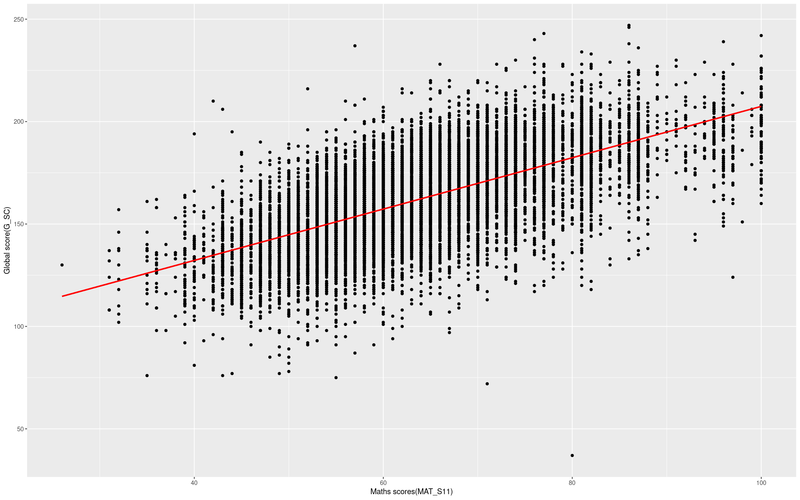
    


```R
# Pearson Maths
stats::cor.test(clean_data$G_SC, clean_data$MAT_S11, method='pearson')
```


    
    	Pearson's product-moment correlation
    
    data:  clean_data$G_SC and clean_data$MAT_S11
    t = 93.733, df = 12409, p-value < 2.2e-16
    alternative hypothesis: true correlation is not equal to 0
    95 percent confidence interval:
     0.6334194 0.6540231
    sample estimates:
          cor 
    0.6438379 


```R
#Scatterplot relationship, G_SC and CR_S11
scatter <- ggplot(clean_data, aes(clean_data$CR_S11, clean_data$G_SC))

#Add a regression line
scatter + geom_point() + geom_smooth(method = "lm", colour = "Red", se = F) + labs(x = "Creative Reading scores(CR_S11)", y = "Global score(G_SC)") 

```

    Warning message:
    “Use of `clean_data$CR_S11` is discouraged. Use `CR_S11` instead.”
    Warning message:
    “Use of `clean_data$G_SC` is discouraged. Use `G_SC` instead.”
    Warning message:
    “Use of `clean_data$CR_S11` is discouraged. Use `CR_S11` instead.”
    Warning message:
    “Use of `clean_data$G_SC` is discouraged. Use `G_SC` instead.”
    `geom_smooth()` using formula 'y ~ x'
    


    
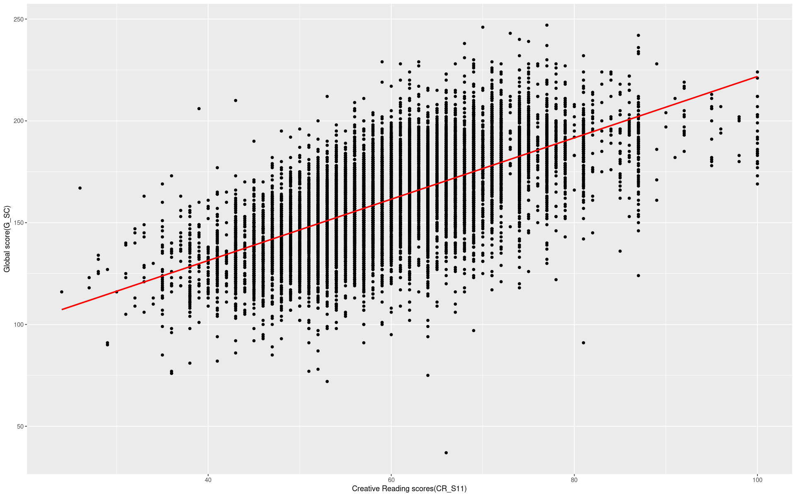
    


```R
# Pearson test Creative reading
stats::cor.test(clean_data$G_SC, clean_data$CR_S11, method='pearson')
# statistically significant result

```


    
    	Pearson's product-moment correlation
    
    data:  clean_data$G_SC and clean_data$CR_S11
    t = 96.193, df = 12409, p-value < 2.2e-16
    alternative hypothesis: true correlation is not equal to 0
    95 percent confidence interval:
     0.6433767 0.6635360
    sample estimates:
          cor 
    0.6535722 


```R
#Scatterplot relationship, G_SC and BIO_S11
scatter <- ggplot(clean_data, aes(clean_data$BIO_S11, clean_data$G_SC))

#Add a regression line
scatter + geom_point() + geom_smooth(method = "lm", colour = "Red", se = F) + labs(x = "Biology scores(BIO_S11)", y = "Global score(G_SC)") 

```

    Warning message:
    “Use of `clean_data$BIO_S11` is discouraged. Use `BIO_S11` instead.”
    Warning message:
    “Use of `clean_data$G_SC` is discouraged. Use `G_SC` instead.”
    Warning message:
    “Use of `clean_data$BIO_S11` is discouraged. Use `BIO_S11` instead.”
    Warning message:
    “Use of `clean_data$G_SC` is discouraged. Use `G_SC` instead.”
    `geom_smooth()` using formula 'y ~ x'
    


    
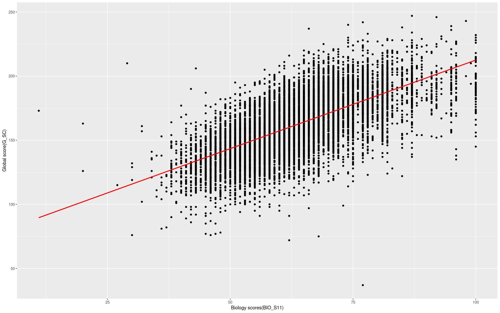
    


```R
# Pearson test Biology
stats::cor.test(clean_data$G_SC, clean_data$BIO_S11, method='pearson')
```


    
    	Pearson's product-moment correlation
    
    data:  clean_data$G_SC and clean_data$BIO_S11
    t = 99.627, df = 12409, p-value < 2.2e-16
    alternative hypothesis: true correlation is not equal to 0
    95 percent confidence interval:
     0.6567441 0.6762966
    sample estimates:
         cor 
    0.666635 


```R
#Scatterplot relationship, G_SC and ENG_S11
scatter <- ggplot(clean_data, aes(clean_data$ENG_S11, clean_data$G_SC))

#Add a regression line
scatter + geom_point() + geom_smooth(method = "lm", colour = "Red", se = F) + labs(x = "English(ENG_S11)", y = "Global score(G_SC)") 

```

    Warning message:
    “Use of `clean_data$ENG_S11` is discouraged. Use `ENG_S11` instead.”
    Warning message:
    “Use of `clean_data$G_SC` is discouraged. Use `G_SC` instead.”
    Warning message:
    “Use of `clean_data$ENG_S11` is discouraged. Use `ENG_S11` instead.”
    Warning message:
    “Use of `clean_data$G_SC` is discouraged. Use `G_SC` instead.”
    `geom_smooth()` using formula 'y ~ x'
    


    

    


```R
# Pearsons Test
stats::cor.test(clean_data$G_SC, clean_data$ENG_S11, method='pearson')
```


    
    	Pearson's product-moment correlation
    
    data:  clean_data$G_SC and clean_data$ENG_S11
    t = 98.435, df = 12409, p-value < 2.2e-16
    alternative hypothesis: true correlation is not equal to 0
    95 percent confidence interval:
     0.6521731 0.6719345
    sample estimates:
          cor 
    0.6621689 


## Performing T-Test


```R
# global grade and gender
# Describe the variables
psych::describeBy(clean_data$G_SC, clean_data$GENDER, mat=TRUE)
```


<table>
<caption>A data.frame: 2 × 15</caption>
<thead>
	<tr><th></th><th scope=col>item</th><th scope=col>group1</th><th scope=col>vars</th><th scope=col>n</th><th scope=col>mean</th><th scope=col>sd</th><th scope=col>median</th><th scope=col>trimmed</th><th scope=col>mad</th><th scope=col>min</th><th scope=col>max</th><th scope=col>range</th><th scope=col>skew</th><th scope=col>kurtosis</th><th scope=col>se</th></tr>
	<tr><th></th><th scope=col>&lt;fct&gt;</th><th scope=col>&lt;fct&gt;</th><th scope=col>&lt;dbl&gt;</th><th scope=col>&lt;dbl&gt;</th><th scope=col>&lt;dbl&gt;</th><th scope=col>&lt;dbl&gt;</th><th scope=col>&lt;dbl&gt;</th><th scope=col>&lt;dbl&gt;</th><th scope=col>&lt;dbl&gt;</th><th scope=col>&lt;dbl&gt;</th><th scope=col>&lt;dbl&gt;</th><th scope=col>&lt;dbl&gt;</th><th scope=col>&lt;dbl&gt;</th><th scope=col>&lt;dbl&gt;</th><th scope=col>&lt;dbl&gt;</th></tr>
</thead>
<tbody>
	<tr><th scope=row>X11</th><td>1</td><td>F</td><td>1</td><td>5043</td><td>161.2782</td><td>22.33294</td><td>162</td><td>161.4994</td><td>23.7216</td><td>76</td><td>242</td><td>166</td><td>-0.07216008</td><td>-0.24717975</td><td>0.3144861</td></tr>
	<tr><th scope=row>X12</th><td>2</td><td>M</td><td>1</td><td>7368</td><td>163.6908</td><td>23.58262</td><td>164</td><td>163.9561</td><td>25.2042</td><td>37</td><td>247</td><td>210</td><td>-0.12210492</td><td> 0.01441897</td><td>0.2747370</td></tr>
</tbody>
</table>


```R
# Using levene's test to test variance, pvalue needs to be greater than 0.05
car::leveneTest(G_SC ~ GENDER, data=clean_data)
```


<table>
<caption>A anova: 2 × 3</caption>
<thead>
	<tr><th></th><th scope=col>Df</th><th scope=col>F value</th><th scope=col>Pr(&gt;F)</th></tr>
	<tr><th></th><th scope=col>&lt;int&gt;</th><th scope=col>&lt;dbl&gt;</th><th scope=col>&lt;dbl&gt;</th></tr>
</thead>
<tbody>
	<tr><th scope=row>group</th><td>    1</td><td>13.11544</td><td>0.00029404</td></tr>
	<tr><th scope=row> </th><td>12409</td><td>      NA</td><td>        NA</td></tr>
</tbody>
</table>


```R
# Levene's test showed unequal variance, therefore need to perform welsh modification to the t-test (will be rejected)
# therefore set var.equal to false
# Perfomring the T-test
stats::t.test(G_SC~GENDER,var.equal=FALSE,data=clean_data)
```


    
    	Welch Two Sample t-test
    
    data:  G_SC by GENDER
    t = -5.7775, df = 11207, p-value = 7.785e-09
    alternative hypothesis: true difference in means is not equal to 0
    95 percent confidence interval:
     -3.231169 -1.594067
    sample estimates:
    mean in group F mean in group M 
           161.2782        163.6908 


```R
# Performing Cohen's d
res <- stats::t.test(G_SC~GENDER,var.equal=FALSE,data=clean_data)
effcd=round((2*res$statistic)/sqrt(res$parameter),2)
effectsize::t_to_d(t = res$statistic, res$parameter)
```


<table>
<caption>A effectsize_table: 1 × 4</caption>
<thead>
	<tr><th></th><th scope=col>d</th><th scope=col>CI</th><th scope=col>CI_low</th><th scope=col>CI_high</th></tr>
	<tr><th></th><th scope=col>&lt;dbl&gt;</th><th scope=col>&lt;dbl&gt;</th><th scope=col>&lt;dbl&gt;</th><th scope=col>&lt;dbl&gt;</th></tr>
</thead>
<tbody>
	<tr><th scope=row>t</th><td>-0.109149</td><td>0.95</td><td>-0.1462022</td><td>-0.07209105</td></tr>
</tbody>
</table>


```R
# global grade and Internet 
# Describe the variables
psych::describeBy(clean_data$G_SC, clean_data$INTERNET, mat=TRUE)
```


<table>
<caption>A data.frame: 2 × 15</caption>
<thead>
	<tr><th></th><th scope=col>item</th><th scope=col>group1</th><th scope=col>vars</th><th scope=col>n</th><th scope=col>mean</th><th scope=col>sd</th><th scope=col>median</th><th scope=col>trimmed</th><th scope=col>mad</th><th scope=col>min</th><th scope=col>max</th><th scope=col>range</th><th scope=col>skew</th><th scope=col>kurtosis</th><th scope=col>se</th></tr>
	<tr><th></th><th scope=col>&lt;fct&gt;</th><th scope=col>&lt;fct&gt;</th><th scope=col>&lt;dbl&gt;</th><th scope=col>&lt;dbl&gt;</th><th scope=col>&lt;dbl&gt;</th><th scope=col>&lt;dbl&gt;</th><th scope=col>&lt;dbl&gt;</th><th scope=col>&lt;dbl&gt;</th><th scope=col>&lt;dbl&gt;</th><th scope=col>&lt;dbl&gt;</th><th scope=col>&lt;dbl&gt;</th><th scope=col>&lt;dbl&gt;</th><th scope=col>&lt;dbl&gt;</th><th scope=col>&lt;dbl&gt;</th><th scope=col>&lt;dbl&gt;</th></tr>
</thead>
<tbody>
	<tr><th scope=row>X11</th><td>1</td><td>No </td><td>1</td><td>2659</td><td>154.6164</td><td>22.20693</td><td>154</td><td>154.5843</td><td>22.2390</td><td>76</td><td>228</td><td>152</td><td>-0.001151644</td><td>-0.03269828</td><td>0.4306549</td></tr>
	<tr><th scope=row>X12</th><td>2</td><td>Yes</td><td>1</td><td>9752</td><td>164.9175</td><td>22.86246</td><td>166</td><td>165.2390</td><td>23.7216</td><td>37</td><td>247</td><td>210</td><td>-0.130381036</td><td>-0.03758293</td><td>0.2315133</td></tr>
</tbody>
</table>


```R
# Using levene's test to test variance, pvalue needs to be greater than 0.05
car::leveneTest(G_SC ~ INTERNET, data=clean_data)
```


<table>
<caption>A anova: 2 × 3</caption>
<thead>
	<tr><th></th><th scope=col>Df</th><th scope=col>F value</th><th scope=col>Pr(&gt;F)</th></tr>
	<tr><th></th><th scope=col>&lt;int&gt;</th><th scope=col>&lt;dbl&gt;</th><th scope=col>&lt;dbl&gt;</th></tr>
</thead>
<tbody>
	<tr><th scope=row>group</th><td>    1</td><td>5.789355</td><td>0.01613804</td></tr>
	<tr><th scope=row> </th><td>12409</td><td>      NA</td><td>        NA</td></tr>
</tbody>
</table>


```R
# Levene's test showed unequal variance, therefore need to perform welsh modification to the t-test (wull be rejected)
# therefore set var.equal to false
# Perfomring the T-test
stats::t.test(G_SC~INTERNET,var.equal=FALSE,data=clean_data)
```


    
    	Welch Two Sample t-test
    
    data:  G_SC by INTERNET
    t = -21.068, df = 4318, p-value < 2.2e-16
    alternative hypothesis: true difference in means is not equal to 0
    95 percent confidence interval:
     -11.259629  -9.342483
    sample estimates:
     mean in group No mean in group Yes 
             154.6164          164.9175 


```R
# Performing Cohen's d
res <- stats::t.test(G_SC~INTERNET,var.equal=FALSE,data=clean_data)
effcd=round((2*res$statistic)/sqrt(res$parameter),2)
effectsize::t_to_d(t = res$statistic, res$parameter)
```


<table>
<caption>A effectsize_table: 1 × 4</caption>
<thead>
	<tr><th></th><th scope=col>d</th><th scope=col>CI</th><th scope=col>CI_low</th><th scope=col>CI_high</th></tr>
	<tr><th></th><th scope=col>&lt;dbl&gt;</th><th scope=col>&lt;dbl&gt;</th><th scope=col>&lt;dbl&gt;</th><th scope=col>&lt;dbl&gt;</th></tr>
</thead>
<tbody>
	<tr><th scope=row>t</th><td>-0.6412321</td><td>0.95</td><td>-0.702364</td><td>-0.5800293</td></tr>
</tbody>
</table>


```R
# global grade and tv 
# Describe the variables
psych::describeBy(clean_data$G_SC, clean_data$TV, mat=TRUE)
```


<table>
<caption>A data.frame: 2 × 15</caption>
<thead>
	<tr><th></th><th scope=col>item</th><th scope=col>group1</th><th scope=col>vars</th><th scope=col>n</th><th scope=col>mean</th><th scope=col>sd</th><th scope=col>median</th><th scope=col>trimmed</th><th scope=col>mad</th><th scope=col>min</th><th scope=col>max</th><th scope=col>range</th><th scope=col>skew</th><th scope=col>kurtosis</th><th scope=col>se</th></tr>
	<tr><th></th><th scope=col>&lt;fct&gt;</th><th scope=col>&lt;fct&gt;</th><th scope=col>&lt;dbl&gt;</th><th scope=col>&lt;dbl&gt;</th><th scope=col>&lt;dbl&gt;</th><th scope=col>&lt;dbl&gt;</th><th scope=col>&lt;dbl&gt;</th><th scope=col>&lt;dbl&gt;</th><th scope=col>&lt;dbl&gt;</th><th scope=col>&lt;dbl&gt;</th><th scope=col>&lt;dbl&gt;</th><th scope=col>&lt;dbl&gt;</th><th scope=col>&lt;dbl&gt;</th><th scope=col>&lt;dbl&gt;</th><th scope=col>&lt;dbl&gt;</th></tr>
</thead>
<tbody>
	<tr><th scope=row>X11</th><td>1</td><td>No </td><td>1</td><td> 1842</td><td>155.4598</td><td>22.74521</td><td>155</td><td>155.5197</td><td>23.7216</td><td>77</td><td>228</td><td>151</td><td>-0.03963129</td><td>-0.13022982</td><td>0.5299625</td></tr>
	<tr><th scope=row>X12</th><td>2</td><td>Yes</td><td>1</td><td>10569</td><td>163.9742</td><td>22.94365</td><td>164</td><td>164.2314</td><td>23.7216</td><td>37</td><td>247</td><td>210</td><td>-0.10536223</td><td>-0.05546219</td><td>0.2231750</td></tr>
</tbody>
</table>


```R
# Using levene's test to test variance, pvalue needs to be greater than 0.05
car::leveneTest(G_SC ~ TV, data=clean_data)
```


<table>
<caption>A anova: 2 × 3</caption>
<thead>
	<tr><th></th><th scope=col>Df</th><th scope=col>F value</th><th scope=col>Pr(&gt;F)</th></tr>
	<tr><th></th><th scope=col>&lt;int&gt;</th><th scope=col>&lt;dbl&gt;</th><th scope=col>&lt;dbl&gt;</th></tr>
</thead>
<tbody>
	<tr><th scope=row>group</th><td>    1</td><td>0.6489572</td><td>0.4205012</td></tr>
	<tr><th scope=row> </th><td>12409</td><td>       NA</td><td>       NA</td></tr>
</tbody>
</table>


```R
# Levene's 
# therefore set var.equal to true
# Perfomring the T-test
stats::t.test(G_SC~TV,var.equal=TRUE,data=clean_data)
```


    
    	Two Sample t-test
    
    data:  G_SC by TV
    t = -14.716, df = 12409, p-value < 2.2e-16
    alternative hypothesis: true difference in means is not equal to 0
    95 percent confidence interval:
     -9.648411 -7.380276
    sample estimates:
     mean in group No mean in group Yes 
             155.4598          163.9742 


```R
# Performing Cohen's d
res <- stats::t.test(G_SC~TV,var.equal=TRUE,data=clean_data)
effcd=round((2*res$statistic)/sqrt(res$parameter),2)
effectsize::t_to_d(t = res$statistic, res$parameter)
```


<table>
<caption>A effectsize_table: 1 × 4</caption>
<thead>
	<tr><th></th><th scope=col>d</th><th scope=col>CI</th><th scope=col>CI_low</th><th scope=col>CI_high</th></tr>
	<tr><th></th><th scope=col>&lt;dbl&gt;</th><th scope=col>&lt;dbl&gt;</th><th scope=col>&lt;dbl&gt;</th><th scope=col>&lt;dbl&gt;</th></tr>
</thead>
<tbody>
	<tr><th scope=row>t</th><td>-0.2642191</td><td>0.95</td><td>-0.2995563</td><td>-0.2288745</td></tr>
</tbody>
</table>


```R
# global grade and computer (will be rejected, failed levene test)
# Describe the variables
psych::describeBy(clean_data$G_SC, clean_data$COMPUTER, mat=TRUE)
```


<table>
<caption>A data.frame: 2 × 15</caption>
<thead>
	<tr><th></th><th scope=col>item</th><th scope=col>group1</th><th scope=col>vars</th><th scope=col>n</th><th scope=col>mean</th><th scope=col>sd</th><th scope=col>median</th><th scope=col>trimmed</th><th scope=col>mad</th><th scope=col>min</th><th scope=col>max</th><th scope=col>range</th><th scope=col>skew</th><th scope=col>kurtosis</th><th scope=col>se</th></tr>
	<tr><th></th><th scope=col>&lt;fct&gt;</th><th scope=col>&lt;fct&gt;</th><th scope=col>&lt;dbl&gt;</th><th scope=col>&lt;dbl&gt;</th><th scope=col>&lt;dbl&gt;</th><th scope=col>&lt;dbl&gt;</th><th scope=col>&lt;dbl&gt;</th><th scope=col>&lt;dbl&gt;</th><th scope=col>&lt;dbl&gt;</th><th scope=col>&lt;dbl&gt;</th><th scope=col>&lt;dbl&gt;</th><th scope=col>&lt;dbl&gt;</th><th scope=col>&lt;dbl&gt;</th><th scope=col>&lt;dbl&gt;</th><th scope=col>&lt;dbl&gt;</th></tr>
</thead>
<tbody>
	<tr><th scope=row>X11</th><td>1</td><td>No </td><td>1</td><td> 2237</td><td>155.9526</td><td>21.86040</td><td>156</td><td>156.0815</td><td>22.2390</td><td>76</td><td>226</td><td>150</td><td>-0.07375166</td><td>-0.02764496</td><td>0.4621948</td></tr>
	<tr><th scope=row>X12</th><td>2</td><td>Yes</td><td>1</td><td>10174</td><td>164.1964</td><td>23.11635</td><td>165</td><td>164.4912</td><td>23.7216</td><td>37</td><td>247</td><td>210</td><td>-0.11780745</td><td>-0.07145279</td><td>0.2291782</td></tr>
</tbody>
</table>


```R
# Using levene's test to test variance, pvalue needs to be greater than 0.05
car::leveneTest(G_SC ~ COMPUTER, data=clean_data)
```


<table>
<caption>A anova: 2 × 3</caption>
<thead>
	<tr><th></th><th scope=col>Df</th><th scope=col>F value</th><th scope=col>Pr(&gt;F)</th></tr>
	<tr><th></th><th scope=col>&lt;int&gt;</th><th scope=col>&lt;dbl&gt;</th><th scope=col>&lt;dbl&gt;</th></tr>
</thead>
<tbody>
	<tr><th scope=row>group</th><td>    1</td><td>13.99389</td><td>0.000184232</td></tr>
	<tr><th scope=row> </th><td>12409</td><td>      NA</td><td>         NA</td></tr>
</tbody>
</table>


```R
stats::t.test(G_SC~COMPUTER,var.equal=FALSE,data=clean_data)
```


    
    	Welch Two Sample t-test
    
    data:  G_SC by COMPUTER
    t = -15.98, df = 3425.2, p-value < 2.2e-16
    alternative hypothesis: true difference in means is not equal to 0
    95 percent confidence interval:
     -9.255259 -7.232277
    sample estimates:
     mean in group No mean in group Yes 
             155.9526          164.1964 


```R
# Performing Cohen's d
res <- stats::t.test(G_SC~COMPUTER,var.equal=FALSE,data=clean_data)
effcd=round((2*res$statistic)/sqrt(res$parameter),2)
effectsize::t_to_d(t = res$statistic, res$parameter)
```


<table>
<caption>A effectsize_table: 1 × 4</caption>
<thead>
	<tr><th></th><th scope=col>d</th><th scope=col>CI</th><th scope=col>CI_low</th><th scope=col>CI_high</th></tr>
	<tr><th></th><th scope=col>&lt;dbl&gt;</th><th scope=col>&lt;dbl&gt;</th><th scope=col>&lt;dbl&gt;</th><th scope=col>&lt;dbl&gt;</th></tr>
</thead>
<tbody>
	<tr><th scope=row>t</th><td>-0.5460778</td><td>0.95</td><td>-0.6142549</td><td>-0.4778292</td></tr>
</tbody>
</table>


```R
# global grade and washing machine 
# Describe the variables
psych::describeBy(clean_data$G_SC, clean_data$WASHING_MCH, mat=TRUE)
```


<table>
<caption>A data.frame: 2 × 15</caption>
<thead>
	<tr><th></th><th scope=col>item</th><th scope=col>group1</th><th scope=col>vars</th><th scope=col>n</th><th scope=col>mean</th><th scope=col>sd</th><th scope=col>median</th><th scope=col>trimmed</th><th scope=col>mad</th><th scope=col>min</th><th scope=col>max</th><th scope=col>range</th><th scope=col>skew</th><th scope=col>kurtosis</th><th scope=col>se</th></tr>
	<tr><th></th><th scope=col>&lt;fct&gt;</th><th scope=col>&lt;fct&gt;</th><th scope=col>&lt;dbl&gt;</th><th scope=col>&lt;dbl&gt;</th><th scope=col>&lt;dbl&gt;</th><th scope=col>&lt;dbl&gt;</th><th scope=col>&lt;dbl&gt;</th><th scope=col>&lt;dbl&gt;</th><th scope=col>&lt;dbl&gt;</th><th scope=col>&lt;dbl&gt;</th><th scope=col>&lt;dbl&gt;</th><th scope=col>&lt;dbl&gt;</th><th scope=col>&lt;dbl&gt;</th><th scope=col>&lt;dbl&gt;</th><th scope=col>&lt;dbl&gt;</th></tr>
</thead>
<tbody>
	<tr><th scope=row>X11</th><td>1</td><td>No </td><td>1</td><td>4723</td><td>159.5450</td><td>22.65193</td><td>160</td><td>159.6692</td><td>23.7216</td><td>72</td><td>234</td><td>162</td><td>-0.05825909</td><td>-0.165241010</td><td>0.3296069</td></tr>
	<tr><th scope=row>X12</th><td>2</td><td>Yes</td><td>1</td><td>7688</td><td>164.6552</td><td>23.17896</td><td>165</td><td>164.9628</td><td>23.7216</td><td>37</td><td>247</td><td>210</td><td>-0.12962662</td><td>-0.005388311</td><td>0.2643549</td></tr>
</tbody>
</table>


```R
# Using levene's test to test variance, pvalue needs to be greater than 0.05
car::leveneTest(G_SC ~ WASHING_MCH, data=clean_data)
```


<table>
<caption>A anova: 2 × 3</caption>
<thead>
	<tr><th></th><th scope=col>Df</th><th scope=col>F value</th><th scope=col>Pr(&gt;F)</th></tr>
	<tr><th></th><th scope=col>&lt;int&gt;</th><th scope=col>&lt;dbl&gt;</th><th scope=col>&lt;dbl&gt;</th></tr>
</thead>
<tbody>
	<tr><th scope=row>group</th><td>    1</td><td>3.559192</td><td>0.05923989</td></tr>
	<tr><th scope=row> </th><td>12409</td><td>      NA</td><td>        NA</td></tr>
</tbody>
</table>


```R
stats::t.test(G_SC~WASHING_MCH,var.equal=TRUE,data=clean_data)
```


    
    	Two Sample t-test
    
    data:  G_SC by WASHING_MCH
    t = -12.028, df = 12409, p-value < 2.2e-16
    alternative hypothesis: true difference in means is not equal to 0
    95 percent confidence interval:
     -5.942954 -4.277414
    sample estimates:
     mean in group No mean in group Yes 
             159.5450          164.6552 


```R
# Performing Cohen's d
res <- stats::t.test(G_SC~WASHING_MCH,var.equal=TRUE,data=clean_data)
effcd=round((2*res$statistic)/sqrt(res$parameter),2)
effectsize::t_to_d(t = res$statistic, res$parameter)
```


<table>
<caption>A effectsize_table: 1 × 4</caption>
<thead>
	<tr><th></th><th scope=col>d</th><th scope=col>CI</th><th scope=col>CI_low</th><th scope=col>CI_high</th></tr>
	<tr><th></th><th scope=col>&lt;dbl&gt;</th><th scope=col>&lt;dbl&gt;</th><th scope=col>&lt;dbl&gt;</th><th scope=col>&lt;dbl&gt;</th></tr>
</thead>
<tbody>
	<tr><th scope=row>t</th><td>-0.2159551</td><td>0.95</td><td>-0.2512424</td><td>-0.1806592</td></tr>
</tbody>
</table>


```R
# global grade and car
# Describe the variables
psych::describeBy(clean_data$G_SC, clean_data$CAR, mat=TRUE)
```


<table>
<caption>A data.frame: 2 × 15</caption>
<thead>
	<tr><th></th><th scope=col>item</th><th scope=col>group1</th><th scope=col>vars</th><th scope=col>n</th><th scope=col>mean</th><th scope=col>sd</th><th scope=col>median</th><th scope=col>trimmed</th><th scope=col>mad</th><th scope=col>min</th><th scope=col>max</th><th scope=col>range</th><th scope=col>skew</th><th scope=col>kurtosis</th><th scope=col>se</th></tr>
	<tr><th></th><th scope=col>&lt;fct&gt;</th><th scope=col>&lt;fct&gt;</th><th scope=col>&lt;dbl&gt;</th><th scope=col>&lt;dbl&gt;</th><th scope=col>&lt;dbl&gt;</th><th scope=col>&lt;dbl&gt;</th><th scope=col>&lt;dbl&gt;</th><th scope=col>&lt;dbl&gt;</th><th scope=col>&lt;dbl&gt;</th><th scope=col>&lt;dbl&gt;</th><th scope=col>&lt;dbl&gt;</th><th scope=col>&lt;dbl&gt;</th><th scope=col>&lt;dbl&gt;</th><th scope=col>&lt;dbl&gt;</th><th scope=col>&lt;dbl&gt;</th></tr>
</thead>
<tbody>
	<tr><th scope=row>X11</th><td>1</td><td>No </td><td>1</td><td>6602</td><td>158.9327</td><td>22.58455</td><td>159</td><td>159.0718</td><td>23.7216</td><td>72</td><td>247</td><td>175</td><td>-0.07557222</td><td>-0.08255172</td><td>0.2779545</td></tr>
	<tr><th scope=row>X12</th><td>2</td><td>Yes</td><td>1</td><td>5809</td><td>167.0040</td><td>22.95731</td><td>168</td><td>167.3887</td><td>23.7216</td><td>37</td><td>246</td><td>209</td><td>-0.14572616</td><td>-0.02378983</td><td>0.3012106</td></tr>
</tbody>
</table>


```R
# Using levene's test to test variance, pvalue needs to be greater than 0.05
car::leveneTest(G_SC ~ CAR, data=clean_data)
```


<table>
<caption>A anova: 2 × 3</caption>
<thead>
	<tr><th></th><th scope=col>Df</th><th scope=col>F value</th><th scope=col>Pr(&gt;F)</th></tr>
	<tr><th></th><th scope=col>&lt;int&gt;</th><th scope=col>&lt;dbl&gt;</th><th scope=col>&lt;dbl&gt;</th></tr>
</thead>
<tbody>
	<tr><th scope=row>group</th><td>    1</td><td>1.974571</td><td>0.1599885</td></tr>
	<tr><th scope=row> </th><td>12409</td><td>      NA</td><td>       NA</td></tr>
</tbody>
</table>


```R
stats::t.test(G_SC~CAR,var.equal=TRUE,data=clean_data)
```


    
    	Two Sample t-test
    
    data:  G_SC by CAR
    t = -19.713, df = 12409, p-value < 2.2e-16
    alternative hypothesis: true difference in means is not equal to 0
    95 percent confidence interval:
     -8.873764 -7.268659
    sample estimates:
     mean in group No mean in group Yes 
             158.9327          167.0040 


```R
# Performing Cohen's d
res <- stats::t.test(G_SC~CAR,var.equal=TRUE,data=clean_data)
effcd=round((2*res$statistic)/sqrt(res$parameter),2)
effectsize::t_to_d(t = res$statistic, res$parameter)
```


<table>
<caption>A effectsize_table: 1 × 4</caption>
<thead>
	<tr><th></th><th scope=col>d</th><th scope=col>CI</th><th scope=col>CI_low</th><th scope=col>CI_high</th></tr>
	<tr><th></th><th scope=col>&lt;dbl&gt;</th><th scope=col>&lt;dbl&gt;</th><th scope=col>&lt;dbl&gt;</th><th scope=col>&lt;dbl&gt;</th></tr>
</thead>
<tbody>
	<tr><th scope=row>t</th><td>-0.35393</td><td>0.95</td><td>-0.3893866</td><td>-0.3184593</td></tr>
</tbody>
</table>


```R
# global grade and PHONE
# Describe the variables
psych::describeBy(clean_data$G_SC, clean_data$PHONE, mat=TRUE)
```


<table>
<caption>A data.frame: 2 × 15</caption>
<thead>
	<tr><th></th><th scope=col>item</th><th scope=col>group1</th><th scope=col>vars</th><th scope=col>n</th><th scope=col>mean</th><th scope=col>sd</th><th scope=col>median</th><th scope=col>trimmed</th><th scope=col>mad</th><th scope=col>min</th><th scope=col>max</th><th scope=col>range</th><th scope=col>skew</th><th scope=col>kurtosis</th><th scope=col>se</th></tr>
	<tr><th></th><th scope=col>&lt;fct&gt;</th><th scope=col>&lt;fct&gt;</th><th scope=col>&lt;dbl&gt;</th><th scope=col>&lt;dbl&gt;</th><th scope=col>&lt;dbl&gt;</th><th scope=col>&lt;dbl&gt;</th><th scope=col>&lt;dbl&gt;</th><th scope=col>&lt;dbl&gt;</th><th scope=col>&lt;dbl&gt;</th><th scope=col>&lt;dbl&gt;</th><th scope=col>&lt;dbl&gt;</th><th scope=col>&lt;dbl&gt;</th><th scope=col>&lt;dbl&gt;</th><th scope=col>&lt;dbl&gt;</th><th scope=col>&lt;dbl&gt;</th></tr>
</thead>
<tbody>
	<tr><th scope=row>X11</th><td>1</td><td>No </td><td>1</td><td>  521</td><td>159.1382</td><td>22.15201</td><td>159</td><td>159.1055</td><td>23.7216</td><td>97</td><td>220</td><td>123</td><td> 0.006672379</td><td>-0.24326723</td><td>0.9704973</td></tr>
	<tr><th scope=row>X12</th><td>2</td><td>Yes</td><td>1</td><td>11890</td><td>162.8670</td><td>23.14194</td><td>163</td><td>163.1102</td><td>23.7216</td><td>37</td><td>247</td><td>210</td><td>-0.101019252</td><td>-0.06825007</td><td>0.2122310</td></tr>
</tbody>
</table>


```R
# Using levene's test to test variance, pvalue needs to be greater than 0.05
car::leveneTest(G_SC ~ PHONE, data=clean_data)
```


<table>
<caption>A anova: 2 × 3</caption>
<thead>
	<tr><th></th><th scope=col>Df</th><th scope=col>F value</th><th scope=col>Pr(&gt;F)</th></tr>
	<tr><th></th><th scope=col>&lt;int&gt;</th><th scope=col>&lt;dbl&gt;</th><th scope=col>&lt;dbl&gt;</th></tr>
</thead>
<tbody>
	<tr><th scope=row>group</th><td>    1</td><td>1.694561</td><td>0.193025</td></tr>
	<tr><th scope=row> </th><td>12409</td><td>      NA</td><td>      NA</td></tr>
</tbody>
</table>


```R
stats::t.test(G_SC~PHONE,var.equal=TRUE,data=clean_data)
```


    
    	Two Sample t-test
    
    data:  G_SC by PHONE
    t = -3.6061, df = 12409, p-value = 0.000312
    alternative hypothesis: true difference in means is not equal to 0
    95 percent confidence interval:
     -5.755681 -1.701990
    sample estimates:
     mean in group No mean in group Yes 
             159.1382          162.8670 


```R
# Performing Cohen's d
res <- stats::t.test(G_SC~PHONE,var.equal=TRUE,data=clean_data)
effcd=round((2*res$statistic)/sqrt(res$parameter),2)
effectsize::t_to_d(t = res$statistic, res$parameter)
```


<table>
<caption>A effectsize_table: 1 × 4</caption>
<thead>
	<tr><th></th><th scope=col>d</th><th scope=col>CI</th><th scope=col>CI_low</th><th scope=col>CI_high</th></tr>
	<tr><th></th><th scope=col>&lt;dbl&gt;</th><th scope=col>&lt;dbl&gt;</th><th scope=col>&lt;dbl&gt;</th><th scope=col>&lt;dbl&gt;</th></tr>
</thead>
<tbody>
	<tr><th scope=row>t</th><td>-0.06474476</td><td>0.95</td><td>-0.09994191</td><td>-0.02954502</td></tr>
</tbody>
</table>


```R
# global grade and MOBILE
# Describe the variables
psych::describeBy(clean_data$G_SC, clean_data$MOBILE, mat=TRUE)
```


<table>
<caption>A data.frame: 2 × 15</caption>
<thead>
	<tr><th></th><th scope=col>item</th><th scope=col>group1</th><th scope=col>vars</th><th scope=col>n</th><th scope=col>mean</th><th scope=col>sd</th><th scope=col>median</th><th scope=col>trimmed</th><th scope=col>mad</th><th scope=col>min</th><th scope=col>max</th><th scope=col>range</th><th scope=col>skew</th><th scope=col>kurtosis</th><th scope=col>se</th></tr>
	<tr><th></th><th scope=col>&lt;fct&gt;</th><th scope=col>&lt;fct&gt;</th><th scope=col>&lt;dbl&gt;</th><th scope=col>&lt;dbl&gt;</th><th scope=col>&lt;dbl&gt;</th><th scope=col>&lt;dbl&gt;</th><th scope=col>&lt;dbl&gt;</th><th scope=col>&lt;dbl&gt;</th><th scope=col>&lt;dbl&gt;</th><th scope=col>&lt;dbl&gt;</th><th scope=col>&lt;dbl&gt;</th><th scope=col>&lt;dbl&gt;</th><th scope=col>&lt;dbl&gt;</th><th scope=col>&lt;dbl&gt;</th><th scope=col>&lt;dbl&gt;</th></tr>
</thead>
<tbody>
	<tr><th scope=row>X11</th><td>1</td><td>No </td><td>1</td><td>3564</td><td>155.5056</td><td>22.41069</td><td>155</td><td>155.4772</td><td>23.7216</td><td>75</td><td>232</td><td>157</td><td>-0.01179409</td><td>-0.06841048</td><td>0.3753931</td></tr>
	<tr><th scope=row>X12</th><td>2</td><td>Yes</td><td>1</td><td>8847</td><td>165.6130</td><td>22.75468</td><td>166</td><td>165.9508</td><td>23.7216</td><td>37</td><td>247</td><td>210</td><td>-0.13652254</td><td>-0.01855180</td><td>0.2419205</td></tr>
</tbody>
</table>


```R
# Using levene's test to test variance, pvalue needs to be greater than 0.05
car::leveneTest(G_SC ~ MOBILE, data=clean_data)
```


<table>
<caption>A anova: 2 × 3</caption>
<thead>
	<tr><th></th><th scope=col>Df</th><th scope=col>F value</th><th scope=col>Pr(&gt;F)</th></tr>
	<tr><th></th><th scope=col>&lt;int&gt;</th><th scope=col>&lt;dbl&gt;</th><th scope=col>&lt;dbl&gt;</th></tr>
</thead>
<tbody>
	<tr><th scope=row>group</th><td>    1</td><td>1.971302</td><td>0.1603348</td></tr>
	<tr><th scope=row> </th><td>12409</td><td>      NA</td><td>       NA</td></tr>
</tbody>
</table>


```R
stats::t.test(G_SC~MOBILE,var.equal=TRUE,data=clean_data)
```


    
    	Two Sample t-test
    
    data:  G_SC by MOBILE
    t = -22.486, df = 12409, p-value < 2.2e-16
    alternative hypothesis: true difference in means is not equal to 0
    95 percent confidence interval:
     -10.988451  -9.226278
    sample estimates:
     mean in group No mean in group Yes 
             155.5056          165.6130 


```R
# Performing Cohen's d
res <- stats::t.test(G_SC~MOBILE,var.equal=TRUE,data=clean_data)
effcd=round((2*res$statistic)/sqrt(res$parameter),2)
effectsize::t_to_d(t = res$statistic, res$parameter)
```


<table>
<caption>A effectsize_table: 1 × 4</caption>
<thead>
	<tr><th></th><th scope=col>d</th><th scope=col>CI</th><th scope=col>CI_low</th><th scope=col>CI_high</th></tr>
	<tr><th></th><th scope=col>&lt;dbl&gt;</th><th scope=col>&lt;dbl&gt;</th><th scope=col>&lt;dbl&gt;</th><th scope=col>&lt;dbl&gt;</th></tr>
</thead>
<tbody>
	<tr><th scope=row>t</th><td>-0.4037117</td><td>0.95</td><td>-0.4392496</td><td>-0.3681578</td></tr>
</tbody>
</table>


```R
# testing on school nature
# Describe the variables
psych::describeBy(clean_data$G_SC, clean_data$SCHOOL_NAT, mat=TRUE)
```


<table>
<caption>A data.frame: 2 × 15</caption>
<thead>
	<tr><th></th><th scope=col>item</th><th scope=col>group1</th><th scope=col>vars</th><th scope=col>n</th><th scope=col>mean</th><th scope=col>sd</th><th scope=col>median</th><th scope=col>trimmed</th><th scope=col>mad</th><th scope=col>min</th><th scope=col>max</th><th scope=col>range</th><th scope=col>skew</th><th scope=col>kurtosis</th><th scope=col>se</th></tr>
	<tr><th></th><th scope=col>&lt;fct&gt;</th><th scope=col>&lt;fct&gt;</th><th scope=col>&lt;dbl&gt;</th><th scope=col>&lt;dbl&gt;</th><th scope=col>&lt;dbl&gt;</th><th scope=col>&lt;dbl&gt;</th><th scope=col>&lt;dbl&gt;</th><th scope=col>&lt;dbl&gt;</th><th scope=col>&lt;dbl&gt;</th><th scope=col>&lt;dbl&gt;</th><th scope=col>&lt;dbl&gt;</th><th scope=col>&lt;dbl&gt;</th><th scope=col>&lt;dbl&gt;</th><th scope=col>&lt;dbl&gt;</th><th scope=col>&lt;dbl&gt;</th></tr>
</thead>
<tbody>
	<tr><th scope=row>X11</th><td>1</td><td>PRIVATE</td><td>1</td><td>6565</td><td>168.2158</td><td>22.82366</td><td>170</td><td>168.7379</td><td>23.7216</td><td>37</td><td>247</td><td>210</td><td>-0.20406097</td><td> 0.02424670</td><td>0.2816877</td></tr>
	<tr><th scope=row>X12</th><td>2</td><td>PUBLIC </td><td>1</td><td>5846</td><td>156.5281</td><td>21.83817</td><td>157</td><td>156.5667</td><td>22.2390</td><td>72</td><td>228</td><td>156</td><td>-0.05215938</td><td>-0.01912125</td><td>0.2856189</td></tr>
</tbody>
</table>


```R
car::leveneTest(G_SC ~ SCHOOL_NAT, data=clean_data)
```


<table>
<caption>A anova: 2 × 3</caption>
<thead>
	<tr><th></th><th scope=col>Df</th><th scope=col>F value</th><th scope=col>Pr(&gt;F)</th></tr>
	<tr><th></th><th scope=col>&lt;int&gt;</th><th scope=col>&lt;dbl&gt;</th><th scope=col>&lt;dbl&gt;</th></tr>
</thead>
<tbody>
	<tr><th scope=row>group</th><td>    1</td><td>12.61399</td><td>0.0003842897</td></tr>
	<tr><th scope=row> </th><td>12409</td><td>      NA</td><td>          NA</td></tr>
</tbody>
</table>


```R
stats::t.test(G_SC~SCHOOL_NAT,var.equal=FALSE,data=clean_data)
```


    
    	Welch Two Sample t-test
    
    data:  G_SC by SCHOOL_NAT
    t = 29.135, df = 12345, p-value < 2.2e-16
    alternative hypothesis: true difference in means is not equal to 0
    95 percent confidence interval:
     10.90146 12.47412
    sample estimates:
    mean in group PRIVATE  mean in group PUBLIC 
                 168.2158              156.5281 


```R
# Performing Cohen's d
res <- stats::t.test(G_SC~SCHOOL_NAT,var.equal=FALSE,data=clean_data)
effcd=round((2*res$statistic)/sqrt(res$parameter),2)
effectsize::t_to_d(t = res$statistic, res$parameter)
```


<table>
<caption>A effectsize_table: 1 × 4</caption>
<thead>
	<tr><th></th><th scope=col>d</th><th scope=col>CI</th><th scope=col>CI_low</th><th scope=col>CI_high</th></tr>
	<tr><th></th><th scope=col>&lt;dbl&gt;</th><th scope=col>&lt;dbl&gt;</th><th scope=col>&lt;dbl&gt;</th><th scope=col>&lt;dbl&gt;</th></tr>
</thead>
<tbody>
	<tr><th scope=row>t</th><td>0.5244463</td><td>0.95</td><td>0.4885545</td><td>0.5603174</td></tr>
</tbody>
</table>


## Anova Test


```R
colnames(clean_data)
```


<style>
.list-inline {list-style: none; margin:0; padding: 0}
.list-inline>li {display: inline-block}
.list-inline>li:not(:last-child)::after {content: "\00b7"; padding: 0 .5ex}
</style>
<ol class=list-inline><li>'GENDER'</li><li>'EDU_FATHER'</li><li>'EDU_MOTHER'</li><li>'OCC_FATHER'</li><li>'OCC_MOTHER'</li><li>'SISBEN'</li><li>'PEOPLE_HOUSE'</li><li>'INTERNET'</li><li>'TV'</li><li>'COMPUTER'</li><li>'WASHING_MCH'</li><li>'MIC_OVEN'</li><li>'CAR'</li><li>'DVD'</li><li>'PHONE'</li><li>'MOBILE'</li><li>'REVENUE'</li><li>'JOB'</li><li>'SCHOOL_NAT'</li><li>'SCHOOL_TYPE'</li><li>'MAT_S11'</li><li>'CR_S11'</li><li>'BIO_S11'</li><li>'ENG_S11'</li><li>'G_SC'</li></ol>


```R
clean_data
```


<table>
<caption>A data.frame: 12411 × 25</caption>
<thead>
	<tr><th></th><th scope=col>GENDER</th><th scope=col>EDU_FATHER</th><th scope=col>EDU_MOTHER</th><th scope=col>OCC_FATHER</th><th scope=col>OCC_MOTHER</th><th scope=col>SISBEN</th><th scope=col>PEOPLE_HOUSE</th><th scope=col>INTERNET</th><th scope=col>TV</th><th scope=col>COMPUTER</th><th scope=col>⋯</th><th scope=col>MOBILE</th><th scope=col>REVENUE</th><th scope=col>JOB</th><th scope=col>SCHOOL_NAT</th><th scope=col>SCHOOL_TYPE</th><th scope=col>MAT_S11</th><th scope=col>CR_S11</th><th scope=col>BIO_S11</th><th scope=col>ENG_S11</th><th scope=col>G_SC</th></tr>
	<tr><th></th><th scope=col>&lt;fct&gt;</th><th scope=col>&lt;fct&gt;</th><th scope=col>&lt;fct&gt;</th><th scope=col>&lt;fct&gt;</th><th scope=col>&lt;fct&gt;</th><th scope=col>&lt;fct&gt;</th><th scope=col>&lt;fct&gt;</th><th scope=col>&lt;fct&gt;</th><th scope=col>&lt;fct&gt;</th><th scope=col>&lt;fct&gt;</th><th scope=col>⋯</th><th scope=col>&lt;fct&gt;</th><th scope=col>&lt;fct&gt;</th><th scope=col>&lt;fct&gt;</th><th scope=col>&lt;fct&gt;</th><th scope=col>&lt;fct&gt;</th><th scope=col>&lt;dbl&gt;</th><th scope=col>&lt;dbl&gt;</th><th scope=col>&lt;dbl&gt;</th><th scope=col>&lt;dbl&gt;</th><th scope=col>&lt;dbl&gt;</th></tr>
</thead>
<tbody>
	<tr><th scope=row>1</th><td>F</td><td>Incomplete Professional Education    </td><td>Complete technique or technology     </td><td>Technical or professional level employee</td><td>Home                                    </td><td>It is not classified by the SISBEN       </td><td>Three</td><td>Yes</td><td>Yes</td><td>Yes</td><td>⋯</td><td>Yes</td><td>Between 1 and less than 2 LMMW </td><td>No                              </td><td>PRIVATE</td><td>ACADEMIC          </td><td>71</td><td>81</td><td> 86</td><td>82</td><td>180</td></tr>
	<tr><th scope=row>2</th><td>F</td><td>Complete Secundary                   </td><td>Complete professional education      </td><td>Entrepreneur                            </td><td>Independent professional                </td><td>It is not classified by the SISBEN       </td><td>Three</td><td>Yes</td><td>Yes</td><td>Yes</td><td>⋯</td><td>Yes</td><td>10 or more LMMW                </td><td>No                              </td><td>PRIVATE</td><td>ACADEMIC          </td><td>83</td><td>75</td><td>100</td><td>88</td><td>182</td></tr>
	<tr><th scope=row>3</th><td>M</td><td>Not sure                             </td><td>Not sure                             </td><td>Independent                             </td><td>Home                                    </td><td>Level 2                                  </td><td>Five </td><td>No </td><td>No </td><td>Yes</td><td>⋯</td><td>No </td><td>Between 1 and less than 2 LMMW </td><td>Yes, 20 hours or more per week  </td><td>PRIVATE</td><td>ACADEMIC          </td><td>52</td><td>49</td><td> 46</td><td>42</td><td>113</td></tr>
	<tr><th scope=row>4</th><td>F</td><td>Not sure                             </td><td>Not sure                             </td><td>Other occupation                        </td><td>Independent                             </td><td>It is not classified by the SISBEN       </td><td>Three</td><td>Yes</td><td>Yes</td><td>Yes</td><td>⋯</td><td>Yes</td><td>Between 2 and less than 3 LMMW </td><td>No                              </td><td>PRIVATE</td><td>ACADEMIC          </td><td>56</td><td>55</td><td> 64</td><td>73</td><td>157</td></tr>
	<tr><th scope=row>5</th><td>M</td><td>Complete professional education      </td><td>Complete professional education      </td><td>Executive                               </td><td>Home                                    </td><td>It is not classified by the SISBEN       </td><td>One  </td><td>Yes</td><td>Yes</td><td>Yes</td><td>⋯</td><td>Yes</td><td>Between 7 and less than 10 LMMW</td><td>No                              </td><td>PRIVATE</td><td>ACADEMIC          </td><td>80</td><td>65</td><td> 85</td><td>92</td><td>198</td></tr>
	<tr><th scope=row>6</th><td>F</td><td>Complete professional education      </td><td>Complete professional education      </td><td>Independent                             </td><td>Executive                               </td><td>It is not classified by the SISBEN       </td><td>Three</td><td>Yes</td><td>Yes</td><td>Yes</td><td>⋯</td><td>Yes</td><td>10 or more LMMW                </td><td>No                              </td><td>PRIVATE</td><td>ACADEMIC          </td><td>71</td><td>60</td><td> 61</td><td>82</td><td>154</td></tr>
	<tr><th scope=row>7</th><td>M</td><td>Complete professional education      </td><td>Complete professional education      </td><td>Small entrepreneur                      </td><td>Executive                               </td><td>It is not classified by the SISBEN       </td><td>Four </td><td>Yes</td><td>Yes</td><td>Yes</td><td>⋯</td><td>Yes</td><td>10 or more LMMW                </td><td>No                              </td><td>PRIVATE</td><td>ACADEMIC          </td><td>71</td><td>75</td><td> 75</td><td>85</td><td>152</td></tr>
	<tr><th scope=row>8</th><td>F</td><td>Incomplete Secundary                 </td><td>Complete Secundary                   </td><td>Entrepreneur                            </td><td>Independent professional                </td><td>It is not classified by the SISBEN       </td><td>Five </td><td>Yes</td><td>Yes</td><td>Yes</td><td>⋯</td><td>No </td><td>10 or more LMMW                </td><td>No                              </td><td>PRIVATE</td><td>ACADEMIC          </td><td>74</td><td>67</td><td> 85</td><td>96</td><td>200</td></tr>
	<tr><th scope=row>9</th><td>M</td><td>Complete Secundary                   </td><td>Complete professional education      </td><td>Independent                             </td><td>Operator                                </td><td>It is not classified by the SISBEN       </td><td>Three</td><td>Yes</td><td>Yes</td><td>Yes</td><td>⋯</td><td>Yes</td><td>Between 1 and less than 2 LMMW </td><td>No                              </td><td>PRIVATE</td><td>TECHNICAL         </td><td>44</td><td>54</td><td> 44</td><td>46</td><td>133</td></tr>
	<tr><th scope=row>10</th><td>M</td><td>Incomplete technical or technological</td><td>Incomplete technical or technological</td><td>Independent                             </td><td>Home                                    </td><td>Level 2                                  </td><td>Four </td><td>Yes</td><td>Yes</td><td>Yes</td><td>⋯</td><td>Yes</td><td>Between 2 and less than 3 LMMW </td><td>Yes, 20 hours or more per week  </td><td>PRIVATE</td><td>ACADEMIC          </td><td>52</td><td>55</td><td> 55</td><td>65</td><td>126</td></tr>
	<tr><th scope=row>11</th><td>F</td><td>Not sure                             </td><td>Not sure                             </td><td>Other occupation                        </td><td>Independent professional                </td><td>It is not classified by the SISBEN       </td><td>Five </td><td>Yes</td><td>Yes</td><td>Yes</td><td>⋯</td><td>Yes</td><td>10 or more LMMW                </td><td>No                              </td><td>PRIVATE</td><td>ACADEMIC          </td><td>74</td><td>71</td><td> 78</td><td>96</td><td>200</td></tr>
	<tr><th scope=row>12</th><td>M</td><td>Complete technique or technology     </td><td>Complete Secundary                   </td><td>Technical or professional level employee</td><td>Entrepreneur                            </td><td>It is not classified by the SISBEN       </td><td>Four </td><td>Yes</td><td>Yes</td><td>Yes</td><td>⋯</td><td>Yes</td><td>Between 2 and less than 3 LMMW </td><td>Yes, 20 hours or more per week  </td><td>PRIVATE</td><td>ACADEMIC          </td><td>54</td><td>47</td><td> 45</td><td>43</td><td>133</td></tr>
	<tr><th scope=row>13</th><td>F</td><td>Not sure                             </td><td>Incomplete technical or technological</td><td>Small entrepreneur                      </td><td>Home                                    </td><td>It is not classified by the SISBEN       </td><td>Five </td><td>No </td><td>Yes</td><td>Yes</td><td>⋯</td><td>No </td><td>Between 2 and less than 3 LMMW </td><td>No                              </td><td>PRIVATE</td><td>ACADEMIC          </td><td>56</td><td>62</td><td> 61</td><td>50</td><td>148</td></tr>
	<tr><th scope=row>14</th><td>M</td><td>Complete professional education      </td><td>Complete professional education      </td><td>Entrepreneur                            </td><td>Small entrepreneur                      </td><td>It is not classified by the SISBEN       </td><td>Six  </td><td>Yes</td><td>Yes</td><td>Yes</td><td>⋯</td><td>Yes</td><td>10 or more LMMW                </td><td>No                              </td><td>PRIVATE</td><td>ACADEMIC          </td><td>76</td><td>71</td><td> 75</td><td>82</td><td>191</td></tr>
	<tr><th scope=row>15</th><td>F</td><td>Incomplete primary                   </td><td>Incomplete primary                   </td><td>Small entrepreneur                      </td><td>Executive                               </td><td>Level 1                                  </td><td>Two  </td><td>No </td><td>No </td><td>No </td><td>⋯</td><td>No </td><td>less than 1 LMMW               </td><td>Yes, 20 hours or more per week  </td><td>PRIVATE</td><td>ACADEMIC          </td><td>56</td><td>45</td><td> 51</td><td>44</td><td>157</td></tr>
	<tr><th scope=row>16</th><td>F</td><td>Complete technique or technology     </td><td>Not sure                             </td><td>Technical or professional level employee</td><td>Technical or professional level employee</td><td>It is not classified by the SISBEN       </td><td>Two  </td><td>Yes</td><td>Yes</td><td>Yes</td><td>⋯</td><td>Yes</td><td>Between 2 and less than 3 LMMW </td><td>No                              </td><td>PRIVATE</td><td>ACADEMIC          </td><td>62</td><td>58</td><td> 55</td><td>59</td><td>164</td></tr>
	<tr><th scope=row>17</th><td>M</td><td>Complete professional education      </td><td>Complete professional education      </td><td>Small entrepreneur                      </td><td>Executive                               </td><td>It is not classified by the SISBEN       </td><td>Four </td><td>Yes</td><td>Yes</td><td>Yes</td><td>⋯</td><td>Yes</td><td>Between 7 and less than 10 LMMW</td><td>No                              </td><td>PRIVATE</td><td>ACADEMIC          </td><td>74</td><td>67</td><td> 78</td><td>68</td><td>162</td></tr>
	<tr><th scope=row>18</th><td>M</td><td>Complete professional education      </td><td>Complete professional education      </td><td>Independent professional                </td><td>Independent professional                </td><td>It is not classified by the SISBEN       </td><td>Four </td><td>Yes</td><td>Yes</td><td>Yes</td><td>⋯</td><td>Yes</td><td>Between 7 and less than 10 LMMW</td><td>No                              </td><td>PRIVATE</td><td>ACADEMIC          </td><td>74</td><td>64</td><td> 72</td><td>88</td><td>188</td></tr>
	<tr><th scope=row>19</th><td>M</td><td>Complete technique or technology     </td><td>Complete Secundary                   </td><td>Operator                                </td><td>Independent                             </td><td>Level 2                                  </td><td>Four </td><td>Yes</td><td>Yes</td><td>Yes</td><td>⋯</td><td>No </td><td>Between 1 and less than 2 LMMW </td><td>Yes, less than 20 hours per week</td><td>PRIVATE</td><td>ACADEMIC          </td><td>44</td><td>49</td><td> 44</td><td>44</td><td>129</td></tr>
	<tr><th scope=row>20</th><td>M</td><td>Complete professional education      </td><td>Complete professional education      </td><td>Technical or professional level employee</td><td>Technical or professional level employee</td><td>Esta clasificada en otro Level del SISBEN</td><td>Three</td><td>Yes</td><td>Yes</td><td>Yes</td><td>⋯</td><td>No </td><td>Between 3 and less than 5 LMMW </td><td>No                              </td><td>PRIVATE</td><td>ACADEMIC          </td><td>61</td><td>44</td><td> 41</td><td>53</td><td>170</td></tr>
	<tr><th scope=row>21</th><td>M</td><td>Complete professional education      </td><td>Complete professional education      </td><td>Independent professional                </td><td>Executive                               </td><td>It is not classified by the SISBEN       </td><td>Three</td><td>Yes</td><td>Yes</td><td>Yes</td><td>⋯</td><td>Yes</td><td>Between 1 and less than 2 LMMW </td><td>No                              </td><td>PRIVATE</td><td>TECHNICAL/ACADEMIC</td><td>58</td><td>53</td><td> 48</td><td>58</td><td>170</td></tr>
	<tr><th scope=row>22</th><td>M</td><td>Incomplete primary                   </td><td>Incomplete Secundary                 </td><td>Independent                             </td><td>Home                                    </td><td>It is not classified by the SISBEN       </td><td>Four </td><td>Yes</td><td>No </td><td>Yes</td><td>⋯</td><td>Yes</td><td>less than 1 LMMW               </td><td>No                              </td><td>PRIVATE</td><td>TECHNICAL/ACADEMIC</td><td>60</td><td>47</td><td> 56</td><td>57</td><td>144</td></tr>
	<tr><th scope=row>23</th><td>M</td><td>Complete primary                     </td><td>Incomplete primary                   </td><td>Independent                             </td><td>Home                                    </td><td>It is not classified by the SISBEN       </td><td>Four </td><td>Yes</td><td>Yes</td><td>Yes</td><td>⋯</td><td>Yes</td><td>Between 2 and less than 3 LMMW </td><td>No                              </td><td>PRIVATE</td><td>ACADEMIC          </td><td>53</td><td>47</td><td> 36</td><td>64</td><td>138</td></tr>
	<tr><th scope=row>24</th><td>M</td><td>Incomplete primary                   </td><td>Incomplete primary                   </td><td>0                                       </td><td>0                                       </td><td>It is not classified by the SISBEN       </td><td>Five </td><td>Yes</td><td>Yes</td><td>No </td><td>⋯</td><td>Yes</td><td>Between 2 and less than 3 LMMW </td><td>No                              </td><td>PRIVATE</td><td>TECHNICAL/ACADEMIC</td><td>67</td><td>65</td><td> 72</td><td>82</td><td>164</td></tr>
	<tr><th scope=row>25</th><td>M</td><td>Complete professional education      </td><td>Incomplete Professional Education    </td><td>Executive                               </td><td>Operator                                </td><td>It is not classified by the SISBEN       </td><td>Four </td><td>Yes</td><td>Yes</td><td>Yes</td><td>⋯</td><td>Yes</td><td>Between 3 and less than 5 LMMW </td><td>No                              </td><td>PRIVATE</td><td>TECHNICAL/ACADEMIC</td><td>80</td><td>71</td><td> 66</td><td>75</td><td>194</td></tr>
	<tr><th scope=row>26</th><td>M</td><td>Complete technique or technology     </td><td>Complete technique or technology     </td><td>Executive                               </td><td>Home                                    </td><td>It is not classified by the SISBEN       </td><td>Three</td><td>Yes</td><td>Yes</td><td>Yes</td><td>⋯</td><td>Yes</td><td>Between 2 and less than 3 LMMW </td><td>No                              </td><td>PRIVATE</td><td>TECHNICAL/ACADEMIC</td><td>83</td><td>75</td><td>100</td><td>71</td><td>201</td></tr>
	<tr><th scope=row>27</th><td>M</td><td>Complete professional education      </td><td>Complete technique or technology     </td><td>Technical or professional level employee</td><td>Technical or professional level employee</td><td>It is not classified by the SISBEN       </td><td>Four </td><td>Yes</td><td>Yes</td><td>Yes</td><td>⋯</td><td>Yes</td><td>Between 3 and less than 5 LMMW </td><td>No                              </td><td>PRIVATE</td><td>ACADEMIC          </td><td>69</td><td>56</td><td> 63</td><td>70</td><td>155</td></tr>
	<tr><th scope=row>28</th><td>M</td><td>Postgraduate education               </td><td>Complete professional education      </td><td>Executive                               </td><td>Auxiliary or Administrative             </td><td>It is not classified by the SISBEN       </td><td>Five </td><td>Yes</td><td>Yes</td><td>Yes</td><td>⋯</td><td>Yes</td><td>10 or more LMMW                </td><td>No                              </td><td>PRIVATE</td><td>ACADEMIC          </td><td>85</td><td>71</td><td> 72</td><td>92</td><td>180</td></tr>
	<tr><th scope=row>29</th><td>F</td><td>Complete Secundary                   </td><td>Complete technique or technology     </td><td>Technical or professional level employee</td><td>Home                                    </td><td>It is not classified by the SISBEN       </td><td>Four </td><td>Yes</td><td>Yes</td><td>Yes</td><td>⋯</td><td>Yes</td><td>Between 3 and less than 5 LMMW </td><td>No                              </td><td>PRIVATE</td><td>TECHNICAL/ACADEMIC</td><td>48</td><td>56</td><td> 51</td><td>54</td><td>137</td></tr>
	<tr><th scope=row>30</th><td>F</td><td>Complete technique or technology     </td><td>Complete technique or technology     </td><td>Executive                               </td><td>Independent                             </td><td>It is not classified by the SISBEN       </td><td>Four </td><td>Yes</td><td>Yes</td><td>Yes</td><td>⋯</td><td>Yes</td><td>Between 2 and less than 3 LMMW </td><td>No                              </td><td>PRIVATE</td><td>TECHNICAL/ACADEMIC</td><td>48</td><td>44</td><td> 61</td><td>48</td><td>161</td></tr>
	<tr><th scope=row>⋮</th><td>⋮</td><td>⋮</td><td>⋮</td><td>⋮</td><td>⋮</td><td>⋮</td><td>⋮</td><td>⋮</td><td>⋮</td><td>⋮</td><td>⋱</td><td>⋮</td><td>⋮</td><td>⋮</td><td>⋮</td><td>⋮</td><td>⋮</td><td>⋮</td><td>⋮</td><td>⋮</td><td>⋮</td></tr>
	<tr><th scope=row>12382</th><td>F</td><td>Complete professional education      </td><td>Complete technique or technology     </td><td>Technical or professional level employee</td><td>Technical or professional level employee</td><td>It is not classified by the SISBEN</td><td>Four </td><td>Yes</td><td>Yes</td><td>Yes</td><td>⋯</td><td>Yes</td><td>Between 3 and less than 5 LMMW </td><td>No                              </td><td>PRIVATE</td><td>ACADEMIC          </td><td>67</td><td>72</td><td>75</td><td> 62</td><td>179</td></tr>
	<tr><th scope=row>12383</th><td>F</td><td>Postgraduate education               </td><td>Postgraduate education               </td><td>Technical or professional level employee</td><td>Technical or professional level employee</td><td>It is not classified by the SISBEN</td><td>Four </td><td>Yes</td><td>Yes</td><td>Yes</td><td>⋯</td><td>Yes</td><td>10 or more LMMW                </td><td>No                              </td><td>PRIVATE</td><td>ACADEMIC          </td><td>74</td><td>72</td><td>70</td><td>100</td><td>215</td></tr>
	<tr><th scope=row>12384</th><td>M</td><td>Complete Secundary                   </td><td>Complete technique or technology     </td><td>Other occupation                        </td><td>Other occupation                        </td><td>It is not classified by the SISBEN</td><td>Five </td><td>Yes</td><td>Yes</td><td>Yes</td><td>⋯</td><td>No </td><td>Between 1 and less than 2 LMMW </td><td>No                              </td><td>PUBLIC </td><td>TECHNICAL/ACADEMIC</td><td>61</td><td>57</td><td>61</td><td> 52</td><td>154</td></tr>
	<tr><th scope=row>12385</th><td>F</td><td>Complete primary                     </td><td>Complete Secundary                   </td><td>Other occupation                        </td><td>Home                                    </td><td>It is not classified by the SISBEN</td><td>Five </td><td>Yes</td><td>Yes</td><td>Yes</td><td>⋯</td><td>No </td><td>Between 1 and less than 2 LMMW </td><td>No                              </td><td>PUBLIC </td><td>TECHNICAL/ACADEMIC</td><td>52</td><td>67</td><td>61</td><td> 53</td><td>168</td></tr>
	<tr><th scope=row>12386</th><td>M</td><td>Postgraduate education               </td><td>Postgraduate education               </td><td>Executive                               </td><td>Executive                               </td><td>It is not classified by the SISBEN</td><td>Four </td><td>Yes</td><td>Yes</td><td>Yes</td><td>⋯</td><td>Yes</td><td>10 or more LMMW                </td><td>No                              </td><td>PRIVATE</td><td>ACADEMIC          </td><td>87</td><td>72</td><td>74</td><td> 88</td><td>194</td></tr>
	<tr><th scope=row>12387</th><td>M</td><td>Complete professional education      </td><td>Complete professional education      </td><td>Technical or professional level employee</td><td>Technical or professional level employee</td><td>It is not classified by the SISBEN</td><td>Five </td><td>Yes</td><td>Yes</td><td>Yes</td><td>⋯</td><td>Yes</td><td>Between 5 and less than 7 LMMW </td><td>No                              </td><td>PRIVATE</td><td>ACADEMIC          </td><td>85</td><td>72</td><td>81</td><td> 65</td><td>209</td></tr>
	<tr><th scope=row>12388</th><td>F</td><td>Complete Secundary                   </td><td>Complete Secundary                   </td><td>Other occupation                        </td><td>Other occupation                        </td><td>Level 2                           </td><td>Three</td><td>No </td><td>Yes</td><td>Yes</td><td>⋯</td><td>No </td><td>Between 1 and less than 2 LMMW </td><td>No                              </td><td>PUBLIC </td><td>ACADEMIC          </td><td>55</td><td>55</td><td>63</td><td> 58</td><td>171</td></tr>
	<tr><th scope=row>12389</th><td>F</td><td>Incomplete primary                   </td><td>Complete primary                     </td><td>Independent                             </td><td>Home                                    </td><td>Level 1                           </td><td>Three</td><td>No </td><td>No </td><td>No </td><td>⋯</td><td>No </td><td>less than 1 LMMW               </td><td>No                              </td><td>PUBLIC </td><td>TECHNICAL         </td><td>69</td><td>67</td><td>73</td><td> 59</td><td>183</td></tr>
	<tr><th scope=row>12390</th><td>F</td><td>Complete Secundary                   </td><td>Incomplete Secundary                 </td><td>Independent                             </td><td>Home                                    </td><td>Level 1                           </td><td>Six  </td><td>Yes</td><td>Yes</td><td>Yes</td><td>⋯</td><td>Yes</td><td>less than 1 LMMW               </td><td>No                              </td><td>PUBLIC </td><td>ACADEMIC          </td><td>63</td><td>63</td><td>72</td><td> 61</td><td>161</td></tr>
	<tr><th scope=row>12391</th><td>F</td><td>Complete professional education      </td><td>Complete Secundary                   </td><td>Operator                                </td><td>Retired                                 </td><td>It is not classified by the SISBEN</td><td>Three</td><td>Yes</td><td>Yes</td><td>Yes</td><td>⋯</td><td>Yes</td><td>Between 1 and less than 2 LMMW </td><td>No                              </td><td>PUBLIC </td><td>ACADEMIC          </td><td>66</td><td>60</td><td>58</td><td> 51</td><td>166</td></tr>
	<tr><th scope=row>12392</th><td>F</td><td>Incomplete Professional Education    </td><td>Complete technique or technology     </td><td>Auxiliary or Administrative             </td><td>Other occupation                        </td><td>It is not classified by the SISBEN</td><td>Two  </td><td>Yes</td><td>Yes</td><td>No </td><td>⋯</td><td>Yes</td><td>Between 1 and less than 2 LMMW </td><td>No                              </td><td>PUBLIC </td><td>TECHNICAL/ACADEMIC</td><td>53</td><td>60</td><td>59</td><td> 61</td><td>159</td></tr>
	<tr><th scope=row>12393</th><td>M</td><td>Complete primary                     </td><td>Complete Secundary                   </td><td>Operator                                </td><td>Home                                    </td><td>It is not classified by the SISBEN</td><td>Six  </td><td>Yes</td><td>Yes</td><td>Yes</td><td>⋯</td><td>No </td><td>Between 1 and less than 2 LMMW </td><td>No                              </td><td>PUBLIC </td><td>TECHNICAL/ACADEMIC</td><td>44</td><td>48</td><td>54</td><td> 54</td><td>161</td></tr>
	<tr><th scope=row>12394</th><td>M</td><td>Complete professional education      </td><td>Complete professional education      </td><td>Executive                               </td><td>Other occupation                        </td><td>It is not classified by the SISBEN</td><td>Five </td><td>Yes</td><td>Yes</td><td>Yes</td><td>⋯</td><td>No </td><td>Between 2 and less than 3 LMMW </td><td>No                              </td><td>PRIVATE</td><td>ACADEMIC          </td><td>81</td><td>69</td><td>75</td><td> 71</td><td>179</td></tr>
	<tr><th scope=row>12395</th><td>M</td><td>Incomplete primary                   </td><td>Complete Secundary                   </td><td>Independent                             </td><td>Home                                    </td><td>It is not classified by the SISBEN</td><td>Four </td><td>Yes</td><td>Yes</td><td>Yes</td><td>⋯</td><td>Yes</td><td>Between 2 and less than 3 LMMW </td><td>No                              </td><td>PUBLIC </td><td>ACADEMIC          </td><td>52</td><td>47</td><td>56</td><td> 58</td><td>138</td></tr>
	<tr><th scope=row>12396</th><td>F</td><td>Complete professional education      </td><td>Complete Secundary                   </td><td>Small entrepreneur                      </td><td>Small entrepreneur                      </td><td>It is not classified by the SISBEN</td><td>Four </td><td>Yes</td><td>Yes</td><td>Yes</td><td>⋯</td><td>Yes</td><td>Between 3 and less than 5 LMMW </td><td>No                              </td><td>PRIVATE</td><td>ACADEMIC          </td><td>64</td><td>57</td><td>58</td><td> 49</td><td>127</td></tr>
	<tr><th scope=row>12397</th><td>M</td><td>Incomplete Professional Education    </td><td>Complete professional education      </td><td>Independent                             </td><td>Other occupation                        </td><td>It is not classified by the SISBEN</td><td>Four </td><td>Yes</td><td>Yes</td><td>Yes</td><td>⋯</td><td>Yes</td><td>Between 3 and less than 5 LMMW </td><td>No                              </td><td>PRIVATE</td><td>ACADEMIC          </td><td>58</td><td>62</td><td>64</td><td> 69</td><td>177</td></tr>
	<tr><th scope=row>12398</th><td>F</td><td>Complete Secundary                   </td><td>Complete Secundary                   </td><td>Operator                                </td><td>Home                                    </td><td>Level 2                           </td><td>Three</td><td>Yes</td><td>Yes</td><td>Yes</td><td>⋯</td><td>Yes</td><td>Between 1 and less than 2 LMMW </td><td>No                              </td><td>PUBLIC </td><td>ACADEMIC          </td><td>55</td><td>51</td><td>48</td><td> 43</td><td>127</td></tr>
	<tr><th scope=row>12399</th><td>M</td><td>Incomplete Secundary                 </td><td>Incomplete Secundary                 </td><td>Independent                             </td><td>Home                                    </td><td>Level 1                           </td><td>Six  </td><td>Yes</td><td>Yes</td><td>Yes</td><td>⋯</td><td>Yes</td><td>Between 1 and less than 2 LMMW </td><td>Yes, less than 20 hours per week</td><td>PUBLIC </td><td>TECHNICAL/ACADEMIC</td><td>72</td><td>60</td><td>64</td><td> 53</td><td>180</td></tr>
	<tr><th scope=row>12400</th><td>F</td><td>Complete Secundary                   </td><td>Complete primary                     </td><td>Other occupation                        </td><td>Independent                             </td><td>Level 1                           </td><td>Five </td><td>Yes</td><td>Yes</td><td>Yes</td><td>⋯</td><td>Yes</td><td>Between 2 and less than 3 LMMW </td><td>No                              </td><td>PUBLIC </td><td>TECHNICAL/ACADEMIC</td><td>69</td><td>65</td><td>73</td><td> 77</td><td>182</td></tr>
	<tr><th scope=row>12401</th><td>F</td><td>Complete professional education      </td><td>Complete professional education      </td><td>Technical or professional level employee</td><td>Technical or professional level employee</td><td>It is not classified by the SISBEN</td><td>Four </td><td>Yes</td><td>Yes</td><td>Yes</td><td>⋯</td><td>Yes</td><td>Between 7 and less than 10 LMMW</td><td>No                              </td><td>PRIVATE</td><td>ACADEMIC          </td><td>66</td><td>58</td><td>57</td><td> 69</td><td>169</td></tr>
	<tr><th scope=row>12402</th><td>F</td><td>Complete Secundary                   </td><td>Incomplete technical or technological</td><td>Independent                             </td><td>Auxiliary or Administrative             </td><td>It is not classified by the SISBEN</td><td>Four </td><td>Yes</td><td>Yes</td><td>Yes</td><td>⋯</td><td>Yes</td><td>Between 3 and less than 5 LMMW </td><td>No                              </td><td>PUBLIC </td><td>TECHNICAL/ACADEMIC</td><td>87</td><td>72</td><td>71</td><td> 81</td><td>135</td></tr>
	<tr><th scope=row>12403</th><td>F</td><td>Incomplete technical or technological</td><td>Complete technique or technology     </td><td>Operator                                </td><td>Independent professional                </td><td>Level 1                           </td><td>Six  </td><td>Yes</td><td>Yes</td><td>No </td><td>⋯</td><td>Yes</td><td>Between 1 and less than 2 LMMW </td><td>No                              </td><td>PRIVATE</td><td>ACADEMIC          </td><td>64</td><td>61</td><td>67</td><td> 67</td><td>181</td></tr>
	<tr><th scope=row>12404</th><td>F</td><td>Not sure                             </td><td>Not sure                             </td><td>Technical or professional level employee</td><td>Home                                    </td><td>It is not classified by the SISBEN</td><td>Four </td><td>Yes</td><td>Yes</td><td>Yes</td><td>⋯</td><td>Yes</td><td>Between 2 and less than 3 LMMW </td><td>No                              </td><td>PRIVATE</td><td>ACADEMIC          </td><td>67</td><td>61</td><td>71</td><td> 64</td><td>179</td></tr>
	<tr><th scope=row>12405</th><td>F</td><td>Not sure                             </td><td>Not sure                             </td><td>Technical or professional level employee</td><td>Home                                    </td><td>It is not classified by the SISBEN</td><td>Four </td><td>Yes</td><td>Yes</td><td>Yes</td><td>⋯</td><td>Yes</td><td>Between 5 and less than 7 LMMW </td><td>No                              </td><td>PRIVATE</td><td>ACADEMIC          </td><td>75</td><td>75</td><td>72</td><td>100</td><td>183</td></tr>
	<tr><th scope=row>12406</th><td>M</td><td>Incomplete technical or technological</td><td>Incomplete Secundary                 </td><td>Other occupation                        </td><td>Home                                    </td><td>It is not classified by the SISBEN</td><td>Two  </td><td>Yes</td><td>Yes</td><td>Yes</td><td>⋯</td><td>Yes</td><td>Between 1 and less than 2 LMMW </td><td>No                              </td><td>PRIVATE</td><td>ACADEMIC          </td><td>61</td><td>63</td><td>68</td><td> 77</td><td>130</td></tr>
	<tr><th scope=row>12407</th><td>M</td><td>Ninguno                              </td><td>Complete Secundary                   </td><td>Other occupation                        </td><td>Auxiliary or Administrative             </td><td>It is not classified by the SISBEN</td><td>Six  </td><td>Yes</td><td>Yes</td><td>Yes</td><td>⋯</td><td>Yes</td><td>Between 1 and less than 2 LMMW </td><td>No                              </td><td>PRIVATE</td><td>ACADEMIC          </td><td>67</td><td>69</td><td>67</td><td> 81</td><td>176</td></tr>
	<tr><th scope=row>12408</th><td>M</td><td>Complete professional education      </td><td>Complete Secundary                   </td><td>Executive                               </td><td>Other occupation                        </td><td>Level 2                           </td><td>Five </td><td>Yes</td><td>Yes</td><td>Yes</td><td>⋯</td><td>Yes</td><td>Between 2 and less than 3 LMMW </td><td>No                              </td><td>PUBLIC </td><td>ACADEMIC          </td><td>58</td><td>57</td><td>63</td><td> 53</td><td>107</td></tr>
	<tr><th scope=row>12409</th><td>M</td><td>Complete technique or technology     </td><td>Complete technique or technology     </td><td>Retired                                 </td><td>Home                                    </td><td>Level 2                           </td><td>Five </td><td>Yes</td><td>Yes</td><td>Yes</td><td>⋯</td><td>Yes</td><td>Between 3 and less than 5 LMMW </td><td>No                              </td><td>PRIVATE</td><td>ACADEMIC          </td><td>66</td><td>69</td><td>70</td><td> 58</td><td>188</td></tr>
	<tr><th scope=row>12410</th><td>F</td><td>Complete professional education      </td><td>Complete professional education      </td><td>Independent professional                </td><td>Small entrepreneur                      </td><td>It is not classified by the SISBEN</td><td>Seven</td><td>Yes</td><td>Yes</td><td>Yes</td><td>⋯</td><td>Yes</td><td>Between 5 and less than 7 LMMW </td><td>No                              </td><td>PRIVATE</td><td>ACADEMIC          </td><td>53</td><td>69</td><td>59</td><td> 52</td><td>146</td></tr>
	<tr><th scope=row>12411</th><td>M</td><td>Complete Secundary                   </td><td>Complete primary                     </td><td>Independent                             </td><td>Home                                    </td><td>Level 1                           </td><td>Four </td><td>No </td><td>No </td><td>No </td><td>⋯</td><td>Yes</td><td>Between 1 and less than 2 LMMW </td><td>No                              </td><td>PUBLIC </td><td>ACADEMIC          </td><td>79</td><td>65</td><td>77</td><td> 73</td><td>178</td></tr>
</tbody>
</table>


```R
# Anova test for fathers education and global grade 
# Check the statistical description of variable of interest
psych::describeBy(clean_data$G_SC, clean_data$EDU_FATHER, mat=TRUE)
# performing Barrets test for homogenity of variance
stats::bartlett.test(G_SC~ EDU_FATHER, data=clean_data)
```


<table>
<caption>A data.frame: 12 × 15</caption>
<thead>
	<tr><th></th><th scope=col>item</th><th scope=col>group1</th><th scope=col>vars</th><th scope=col>n</th><th scope=col>mean</th><th scope=col>sd</th><th scope=col>median</th><th scope=col>trimmed</th><th scope=col>mad</th><th scope=col>min</th><th scope=col>max</th><th scope=col>range</th><th scope=col>skew</th><th scope=col>kurtosis</th><th scope=col>se</th></tr>
	<tr><th></th><th scope=col>&lt;fct&gt;</th><th scope=col>&lt;fct&gt;</th><th scope=col>&lt;dbl&gt;</th><th scope=col>&lt;dbl&gt;</th><th scope=col>&lt;dbl&gt;</th><th scope=col>&lt;dbl&gt;</th><th scope=col>&lt;dbl&gt;</th><th scope=col>&lt;dbl&gt;</th><th scope=col>&lt;dbl&gt;</th><th scope=col>&lt;dbl&gt;</th><th scope=col>&lt;dbl&gt;</th><th scope=col>&lt;dbl&gt;</th><th scope=col>&lt;dbl&gt;</th><th scope=col>&lt;dbl&gt;</th><th scope=col>&lt;dbl&gt;</th></tr>
</thead>
<tbody>
	<tr><th scope=row>X11</th><td>1 </td><td>0                                    </td><td>1</td><td> 391</td><td>155.0767</td><td>20.05721</td><td>155</td><td>155.5847</td><td>19.2738</td><td> 77</td><td>203</td><td>126</td><td>-0.319316625</td><td> 0.26313358</td><td>1.0143365</td></tr>
	<tr><th scope=row>X12</th><td>2 </td><td>Complete primary                     </td><td>1</td><td> 824</td><td>155.1954</td><td>22.41077</td><td>155</td><td>155.3167</td><td>23.7216</td><td> 78</td><td>230</td><td>152</td><td>-0.068956147</td><td>-0.01017332</td><td>0.7807160</td></tr>
	<tr><th scope=row>X13</th><td>3 </td><td>Complete professional education      </td><td>1</td><td>3016</td><td>167.7659</td><td>23.03009</td><td>169</td><td>168.2722</td><td>23.7216</td><td> 76</td><td>247</td><td>171</td><td>-0.192568623</td><td>-0.05091930</td><td>0.4193532</td></tr>
	<tr><th scope=row>X14</th><td>4 </td><td>Complete Secundary                   </td><td>1</td><td>2843</td><td>158.7858</td><td>22.11429</td><td>159</td><td>158.9727</td><td>22.2390</td><td> 72</td><td>228</td><td>156</td><td>-0.083178441</td><td>-0.16393402</td><td>0.4147482</td></tr>
	<tr><th scope=row>X15</th><td>5 </td><td>Complete technique or technology     </td><td>1</td><td>1194</td><td>164.0335</td><td>22.16536</td><td>164</td><td>164.1956</td><td>22.2390</td><td> 75</td><td>228</td><td>153</td><td>-0.094250336</td><td>-0.18468672</td><td>0.6414645</td></tr>
	<tr><th scope=row>X16</th><td>6 </td><td>Incomplete primary                   </td><td>1</td><td> 735</td><td>155.7293</td><td>20.94241</td><td>156</td><td>155.7997</td><td>22.2390</td><td> 81</td><td>232</td><td>151</td><td>-0.006001731</td><td>-0.07957150</td><td>0.7724725</td></tr>
	<tr><th scope=row>X17</th><td>7 </td><td>Incomplete Professional Education    </td><td>1</td><td> 425</td><td>166.9176</td><td>22.68520</td><td>168</td><td>168.0469</td><td>22.2390</td><td> 37</td><td>228</td><td>191</td><td>-0.763087611</td><td> 2.25416563</td><td>1.1003937</td></tr>
	<tr><th scope=row>X18</th><td>8 </td><td>Incomplete Secundary                 </td><td>1</td><td>1091</td><td>156.5353</td><td>21.73699</td><td>157</td><td>156.5968</td><td>23.7216</td><td> 76</td><td>220</td><td>144</td><td>-0.046850283</td><td>-0.15254558</td><td>0.6580926</td></tr>
	<tr><th scope=row>X19</th><td>9 </td><td>Incomplete technical or technological</td><td>1</td><td> 277</td><td>162.1011</td><td>21.88120</td><td>162</td><td>162.5247</td><td>22.2390</td><td> 99</td><td>224</td><td>125</td><td>-0.136742639</td><td>-0.28886554</td><td>1.3147138</td></tr>
	<tr><th scope=row>X110</th><td>10</td><td>Ninguno                              </td><td>1</td><td> 123</td><td>156.6341</td><td>23.18856</td><td>159</td><td>156.8990</td><td>25.2042</td><td> 77</td><td>220</td><td>143</td><td>-0.200929971</td><td> 0.44672042</td><td>2.0908420</td></tr>
	<tr><th scope=row>X111</th><td>11</td><td>Not sure                             </td><td>1</td><td> 407</td><td>160.2948</td><td>22.93956</td><td>159</td><td>159.8410</td><td>23.7216</td><td>102</td><td>236</td><td>134</td><td> 0.191984725</td><td>-0.28792211</td><td>1.1370715</td></tr>
	<tr><th scope=row>X112</th><td>12</td><td>Postgraduate education               </td><td>1</td><td>1085</td><td>176.9853</td><td>21.73413</td><td>179</td><td>177.6974</td><td>20.7564</td><td>110</td><td>242</td><td>132</td><td>-0.272827378</td><td> 0.12487414</td><td>0.6598230</td></tr>
</tbody>
</table>


    
    	Bartlett test of homogeneity of variances
    
    data:  G_SC by EDU_FATHER
    Bartlett's K-squared = 24.643, df = 11, p-value = 0.01028


```R
# One-way Anova test 
anova_result<-userfriendlyscience::oneway(as.factor(clean_data$EDU_FATHER),y=clean_data$G_SC,posthoc='games-howell')
anova_result
# access values in order to get f-statisitc on nect step
res2<-stats::aov(G_SC~ EDU_FATHER, data = clean_data)
fstat<-summary(res2)[[1]][["F value"]][[1]]
fstat
# Get the p-value
anova_p_value<-summary(res2)[[1]][["Pr(>F)"]][[1]]
anova_p_value
# Calculating the effect
aoveta<-sjstats::eta_sq(res2)[2]
aoveta
```


    ### Oneway Anova for y=G_SC and x=EDU_FATHER (groups: 0, Complete primary, Complete professional education, Complete Secundary, Complete technique or technology, Incomplete primary, Incomplete Professional Education, Incomplete Secundary, Incomplete technical or technological, Ninguno, Not sure, Postgraduate education)
    
    Omega squared: 95% CI = [.07; .08], point estimate = .08
    Eta Squared: 95% CI = [.07; .08], point estimate = .08
    
                                           SS    Df       MS     F     p
    Between groups (error + effect) 505340.92    11 45940.08 93.01 <.001
    Within groups (error only)      6123915.9 12399    493.9            
    
    
    ### Post hoc test: games-howell
    
                                                                              diff
    Complete primary-0                                                        0.12
    Complete professional education-0                                        12.69
    Complete Secundary-0                                                      3.71
    Complete technique or technology-0                                        8.96
    Incomplete primary-0                                                      0.65
    Incomplete Professional Education-0                                      11.84
    Incomplete Secundary-0                                                    1.46
    Incomplete technical or technological-0                                   7.02
    Ninguno-0                                                                 1.56
    Not sure-0                                                                5.22
    Postgraduate education-0                                                 21.91
    Complete professional education-Complete primary                         12.57
    Complete Secundary-Complete primary                                       3.59
    Complete technique or technology-Complete primary                         8.84
    Incomplete primary-Complete primary                                       0.53
    Incomplete Professional Education-Complete primary                       11.72
    Incomplete Secundary-Complete primary                                     1.34
    Incomplete technical or technological-Complete primary                    6.91
    Ninguno-Complete primary                                                  1.44
    Not sure-Complete primary                                                 5.10
    Postgraduate education-Complete primary                                  21.79
    Complete Secundary-Complete professional education                       -8.98
    Complete technique or technology-Complete professional education         -3.73
    Incomplete primary-Complete professional education                      -12.04
    Incomplete Professional Education-Complete professional education        -0.85
    Incomplete Secundary-Complete professional education                    -11.23
    Incomplete technical or technological-Complete professional education    -5.66
    Ninguno-Complete professional education                                 -11.13
    Not sure-Complete professional education                                 -7.47
    Postgraduate education-Complete professional education                    9.22
    Complete technique or technology-Complete Secundary                       5.25
    Incomplete primary-Complete Secundary                                    -3.06
    Incomplete Professional Education-Complete Secundary                      8.13
    Incomplete Secundary-Complete Secundary                                  -2.25
    Incomplete technical or technological-Complete Secundary                  3.32
    Ninguno-Complete Secundary                                               -2.15
    Not sure-Complete Secundary                                               1.51
    Postgraduate education-Complete Secundary                                18.20
    Incomplete primary-Complete technique or technology                      -8.30
    Incomplete Professional Education-Complete technique or technology        2.88
    Incomplete Secundary-Complete technique or technology                    -7.50
    Incomplete technical or technological-Complete technique or technology   -1.93
    Ninguno-Complete technique or technology                                 -7.40
    Not sure-Complete technique or technology                                -3.74
    Postgraduate education-Complete technique or technology                  12.95
    Incomplete Professional Education-Incomplete primary                     11.19
    Incomplete Secundary-Incomplete primary                                   0.81
    Incomplete technical or technological-Incomplete primary                  6.37
    Ninguno-Incomplete primary                                                0.90
    Not sure-Incomplete primary                                               4.57
    Postgraduate education-Incomplete primary                                21.26
    Incomplete Secundary-Incomplete Professional Education                  -10.38
    Incomplete technical or technological-Incomplete Professional Education  -4.82
    Ninguno-Incomplete Professional Education                               -10.28
    Not sure-Incomplete Professional Education                               -6.62
    Postgraduate education-Incomplete Professional Education                 10.07
    Incomplete technical or technological-Incomplete Secundary                5.57
    Ninguno-Incomplete Secundary                                              0.10
    Not sure-Incomplete Secundary                                             3.76
    Postgraduate education-Incomplete Secundary                              20.45
    Ninguno-Incomplete technical or technological                            -5.47
    Not sure-Incomplete technical or technological                           -1.81
    Postgraduate education-Incomplete technical or technological             14.88
    Not sure-Ninguno                                                          3.66
    Postgraduate education-Ninguno                                           20.35
    Postgraduate education-Not sure                                          16.69
                                                                             ci.lo
    Complete primary-0                                                       -4.08
    Complete professional education-0                                         9.09
    Complete Secundary-0                                                      0.11
    Complete technique or technology-0                                        5.02
    Incomplete primary-0                                                     -3.53
    Incomplete Professional Education-0                                       6.94
    Incomplete Secundary-0                                                   -2.51
    Incomplete technical or technological-0                                   1.57
    Ninguno-0                                                                -6.14
    Not sure-0                                                                0.22
    Postgraduate education-0                                                 17.94
    Complete professional education-Complete primary                          9.67
    Complete Secundary-Complete primary                                       0.70
    Complete technique or technology-Complete primary                         5.53
    Incomplete primary-Complete primary                                      -3.06
    Incomplete Professional Education-Complete primary                        7.30
    Incomplete Secundary-Complete primary                                    -2.00
    Incomplete technical or technological-Complete primary                    1.88
    Ninguno-Complete primary                                                 -5.97
    Not sure-Complete primary                                                 0.58
    Postgraduate education-Complete primary                                  18.44
    Complete Secundary-Complete professional education                      -10.91
    Complete technique or technology-Complete professional education         -6.24
    Incomplete primary-Complete professional education                      -14.91
    Incomplete Professional Education-Complete professional education        -4.71
    Incomplete Secundary-Complete professional education                    -13.78
    Incomplete technical or technological-Complete professional education   -10.21
    Ninguno-Complete professional education                                 -18.23
    Not sure-Complete professional education                                -11.45
    Postgraduate education-Complete professional education                    6.66
    Complete technique or technology-Complete Secundary                       2.75
    Incomplete primary-Complete Secundary                                    -5.93
    Incomplete Professional Education-Complete Secundary                      4.27
    Incomplete Secundary-Complete Secundary                                  -4.80
    Incomplete technical or technological-Complete Secundary                 -1.22
    Ninguno-Complete Secundary                                               -9.24
    Not sure-Complete Secundary                                              -2.46
    Postgraduate education-Complete Secundary                                15.65
    Incomplete primary-Complete technique or technology                     -11.59
    Incomplete Professional Education-Complete technique or technology       -1.29
    Incomplete Secundary-Complete technique or technology                   -10.50
    Incomplete technical or technological-Complete technique or technology   -6.74
    Ninguno-Complete technique or technology                                -14.66
    Not sure-Complete technique or technology                                -8.02
    Postgraduate education-Complete technique or technology                   9.94
    Incomplete Professional Education-Incomplete primary                      6.78
    Incomplete Secundary-Incomplete primary                                  -2.52
    Incomplete technical or technological-Incomplete primary                  1.36
    Ninguno-Incomplete primary                                               -6.49
    Not sure-Incomplete primary                                               0.06
    Postgraduate education-Incomplete primary                                17.93
    Incomplete Secundary-Incomplete Professional Education                  -14.59
    Incomplete technical or technological-Incomplete Professional Education -10.44
    Ninguno-Incomplete Professional Education                               -18.10
    Not sure-Incomplete Professional Education                              -11.81
    Postgraduate education-Incomplete Professional Education                  5.86
    Incomplete technical or technological-Incomplete Secundary                0.73
    Ninguno-Incomplete Secundary                                             -7.18
    Not sure-Incomplete Secundary                                            -0.55
    Postgraduate education-Incomplete Secundary                              17.40
    Ninguno-Incomplete technical or technological                           -13.63
    Not sure-Incomplete technical or technological                           -7.51
    Postgraduate education-Incomplete technical or technological             10.05
    Not sure-Ninguno                                                         -4.21
    Postgraduate education-Ninguno                                           13.07
    Postgraduate education-Not sure                                          12.38
                                                                            ci.hi
    Complete primary-0                                                       4.31
    Complete professional education-0                                       16.29
    Complete Secundary-0                                                     7.31
    Complete technique or technology-0                                      12.89
    Incomplete primary-0                                                     4.83
    Incomplete Professional Education-0                                     16.75
    Incomplete Secundary-0                                                   5.42
    Incomplete technical or technological-0                                 12.47
    Ninguno-0                                                                9.25
    Not sure-0                                                              10.21
    Postgraduate education-0                                                25.88
    Complete professional education-Complete primary                        15.47
    Complete Secundary-Complete primary                                      6.48
    Complete technique or technology-Complete primary                       12.14
    Incomplete primary-Complete primary                                      4.13
    Incomplete Professional Education-Complete primary                      16.14
    Incomplete Secundary-Complete primary                                    4.68
    Incomplete technical or technological-Complete primary                  11.93
    Ninguno-Complete primary                                                 8.84
    Not sure-Complete primary                                                9.62
    Postgraduate education-Complete primary                                 25.13
    Complete Secundary-Complete professional education                      -7.05
    Complete technique or technology-Complete professional education        -1.23
    Incomplete primary-Complete professional education                      -9.16
    Incomplete Professional Education-Complete professional education        3.02
    Incomplete Secundary-Complete professional education                    -8.68
    Incomplete technical or technological-Complete professional education   -1.12
    Ninguno-Complete professional education                                 -4.04
    Not sure-Complete professional education                                -3.49
    Postgraduate education-Complete professional education                  11.78
    Complete technique or technology-Complete Secundary                      7.75
    Incomplete primary-Complete Secundary                                   -0.19
    Incomplete Professional Education-Complete Secundary                    11.99
    Incomplete Secundary-Complete Secundary                                  0.29
    Incomplete technical or technological-Complete Secundary                 7.85
    Ninguno-Complete Secundary                                               4.94
    Not sure-Complete Secundary                                              5.48
    Postgraduate education-Complete Secundary                               20.75
    Incomplete primary-Complete technique or technology                     -5.02
    Incomplete Professional Education-Complete technique or technology       7.06
    Incomplete Secundary-Complete technique or technology                   -4.49
    Incomplete technical or technological-Complete technique or technology   2.88
    Ninguno-Complete technique or technology                                -0.13
    Not sure-Complete technique or technology                                0.54
    Postgraduate education-Complete technique or technology                 15.96
    Incomplete Professional Education-Incomplete primary                    15.59
    Incomplete Secundary-Incomplete primary                                  4.13
    Incomplete technical or technological-Incomplete primary                11.38
    Ninguno-Incomplete primary                                               8.30
    Not sure-Incomplete primary                                              9.07
    Postgraduate education-Incomplete primary                               24.58
    Incomplete Secundary-Incomplete Professional Education                  -6.18
    Incomplete technical or technological-Incomplete Professional Education  0.81
    Ninguno-Incomplete Professional Education                               -2.47
    Not sure-Incomplete Professional Education                              -1.44
    Postgraduate education-Incomplete Professional Education                14.27
    Incomplete technical or technological-Incomplete Secundary              10.40
    Ninguno-Incomplete Secundary                                             7.38
    Not sure-Incomplete Secundary                                            8.07
    Postgraduate education-Incomplete Secundary                             23.50
    Ninguno-Incomplete technical or technological                            2.69
    Not sure-Incomplete technical or technological                           3.90
    Postgraduate education-Incomplete technical or technological            19.72
    Not sure-Ninguno                                                        11.53
    Postgraduate education-Ninguno                                          27.63
    Postgraduate education-Not sure                                         21.00
                                                                                t
    Complete primary-0                                                       0.09
    Complete professional education-0                                       11.56
    Complete Secundary-0                                                     3.38
    Complete technique or technology-0                                       7.46
    Incomplete primary-0                                                     0.51
    Incomplete Professional Education-0                                      7.91
    Incomplete Secundary-0                                                   1.21
    Incomplete technical or technological-0                                  4.23
    Ninguno-0                                                                0.67
    Not sure-0                                                               3.42
    Postgraduate education-0                                                18.11
    Complete professional education-Complete primary                        14.18
    Complete Secundary-Complete primary                                      4.06
    Complete technique or technology-Complete primary                        8.75
    Incomplete primary-Complete primary                                      0.49
    Incomplete Professional Education-Complete primary                       8.69
    Incomplete Secundary-Complete primary                                    1.31
    Incomplete technical or technological-Complete primary                   4.52
    Ninguno-Complete primary                                                 0.64
    Not sure-Complete primary                                                3.70
    Postgraduate education-Complete primary                                 21.32
    Complete Secundary-Complete professional education                      15.23
    Complete technique or technology-Complete professional education         4.87
    Incomplete primary-Complete professional education                      13.69
    Incomplete Professional Education-Complete professional education        0.72
    Incomplete Secundary-Complete professional education                    14.39
    Incomplete technical or technological-Complete professional education    4.11
    Ninguno-Complete professional education                                  5.22
    Not sure-Complete professional education                                 6.16
    Postgraduate education-Complete professional education                  11.79
    Complete technique or technology-Complete Secundary                      6.87
    Incomplete primary-Complete Secundary                                    3.49
    Incomplete Professional Education-Complete Secundary                     6.92
    Incomplete Secundary-Complete Secundary                                  2.89
    Incomplete technical or technological-Complete Secundary                 2.40
    Ninguno-Complete Secundary                                               1.01
    Not sure-Complete Secundary                                              1.25
    Postgraduate education-Complete Secundary                               23.35
    Incomplete primary-Complete technique or technology                      8.27
    Incomplete Professional Education-Complete technique or technology       2.26
    Incomplete Secundary-Complete technique or technology                    8.16
    Incomplete technical or technological-Complete technique or technology   1.32
    Ninguno-Complete technique or technology                                 3.38
    Not sure-Complete technique or technology                                2.86
    Postgraduate education-Complete technique or technology                 14.07
    Incomplete Professional Education-Incomplete primary                     8.32
    Incomplete Secundary-Incomplete primary                                  0.79
    Incomplete technical or technological-Incomplete primary                 4.18
    Ninguno-Incomplete primary                                               0.41
    Not sure-Incomplete primary                                              3.32
    Postgraduate education-Incomplete primary                               20.92
    Incomplete Secundary-Incomplete Professional Education                   8.10
    Incomplete technical or technological-Incomplete Professional Education  2.81
    Ninguno-Incomplete Professional Education                                4.35
    Not sure-Incomplete Professional Education                               4.19
    Postgraduate education-Incomplete Professional Education                 7.85
    Incomplete technical or technological-Incomplete Secundary               3.79
    Ninguno-Incomplete Secundary                                             0.05
    Not sure-Incomplete Secundary                                            2.86
    Postgraduate education-Incomplete Secundary                             21.94
    Ninguno-Incomplete technical or technological                            2.21
    Not sure-Incomplete technical or technological                           1.04
    Postgraduate education-Incomplete technical or technological            10.12
    Not sure-Ninguno                                                         1.54
    Postgraduate education-Ninguno                                           9.28
    Postgraduate education-Not sure                                         12.70
                                                                                 df
    Complete primary-0                                                       847.93
    Complete professional education-0                                        532.70
    Complete Secundary-0                                                     529.28
    Complete technique or technology-0                                       726.34
    Incomplete primary-0                                                     825.94
    Incomplete Professional Education-0                                      812.73
    Incomplete Secundary-0                                                   740.48
    Incomplete technical or technological-0                                  561.56
    Ninguno-0                                                                183.01
    Not sure-0                                                               789.08
    Postgraduate education-0                                                 742.08
    Complete professional education-Complete primary                        1336.05
    Complete Secundary-Complete primary                                     1322.57
    Complete technique or technology-Complete primary                       1756.90
    Incomplete primary-Complete primary                                     1553.62
    Incomplete Professional Education-Complete primary                       847.64
    Incomplete Secundary-Complete primary                                   1743.45
    Incomplete technical or technological-Complete primary                   484.76
    Ninguno-Complete primary                                                 157.94
    Not sure-Complete primary                                                792.17
    Postgraduate education-Complete primary                                 1743.32
    Complete Secundary-Complete professional education                      5855.00
    Complete technique or technology-Complete professional education        2266.80
    Incomplete primary-Complete professional education                      1204.91
    Incomplete Professional Education-Complete professional education        554.46
    Incomplete Secundary-Complete professional education                    2033.70
    Incomplete technical or technological-Complete professional education    334.70
    Ninguno-Complete professional education                                  132.00
    Not sure-Complete professional education                                 522.65
    Postgraduate education-Complete professional education                  2018.19
    Complete technique or technology-Complete Secundary                     2234.99
    Incomplete primary-Complete Secundary                                   1192.58
    Incomplete Professional Education-Complete Secundary                     551.36
    Incomplete Secundary-Complete Secundary                                 2006.42
    Incomplete technical or technological-Complete Secundary                 333.35
    Ninguno-Complete Secundary                                               131.78
    Not sure-Complete Secundary                                              519.90
    Postgraduate education-Complete Secundary                               1991.25
    Incomplete primary-Complete technique or technology                     1621.06
    Incomplete Professional Education-Complete technique or technology       731.12
    Incomplete Secundary-Complete technique or technology                   2271.62
    Incomplete technical or technological-Complete technique or technology   417.57
    Ninguno-Complete technique or technology                                 145.92
    Not sure-Complete technique or technology                                682.03
    Postgraduate education-Complete technique or technology                 2263.87
    Incomplete Professional Education-Incomplete primary                     828.62
    Incomplete Secundary-Incomplete primary                                 1613.69
    Incomplete technical or technological-Incomplete primary                 478.04
    Ninguno-Incomplete primary                                               157.09
    Not sure-Incomplete primary                                              775.83
    Postgraduate education-Incomplete primary                               1614.02
    Incomplete Secundary-Incomplete Professional Education                   744.49
    Incomplete technical or technological-Incomplete Professional Education  604.91
    Ninguno-Incomplete Professional Education                                194.65
    Not sure-Incomplete Professional Education                               827.54
    Postgraduate education-Incomplete Professional Education                 745.99
    Incomplete technical or technological-Incomplete Secundary               424.88
    Ninguno-Incomplete Secundary                                             147.21
    Not sure-Incomplete Secundary                                            694.52
    Postgraduate education-Incomplete Secundary                             2173.94
    Ninguno-Incomplete technical or technological                            222.19
    Not sure-Incomplete technical or technological                           610.95
    Postgraduate education-Incomplete technical or technological             425.67
    Not sure-Ninguno                                                         199.59
    Postgraduate education-Ninguno                                           147.35
    Postgraduate education-Not sure                                          695.90
                                                                                p
    Complete primary-0                                                      1.000
    Complete professional education-0                                       <.001
    Complete Secundary-0                                                     .036
    Complete technique or technology-0                                      <.001
    Incomplete primary-0                                                    1.000
    Incomplete Professional Education-0                                     <.001
    Incomplete Secundary-0                                                   .988
    Incomplete technical or technological-0                                  .002
    Ninguno-0                                                               1.000
    Not sure-0                                                               .032
    Postgraduate education-0                                                <.001
    Complete professional education-Complete primary                        <.001
    Complete Secundary-Complete primary                                      .003
    Complete technique or technology-Complete primary                       <.001
    Incomplete primary-Complete primary                                     1.000
    Incomplete Professional Education-Complete primary                      <.001
    Incomplete Secundary-Complete primary                                    .978
    Incomplete technical or technological-Complete primary                  <.001
    Ninguno-Complete primary                                                1.000
    Not sure-Complete primary                                                .012
    Postgraduate education-Complete primary                                 <.001
    Complete Secundary-Complete professional education                      <.001
    Complete technique or technology-Complete professional education        <.001
    Incomplete primary-Complete professional education                      <.001
    Incomplete Professional Education-Complete professional education       1.000
    Incomplete Secundary-Complete professional education                    <.001
    Incomplete technical or technological-Complete professional education    .003
    Ninguno-Complete professional education                                 <.001
    Not sure-Complete professional education                                <.001
    Postgraduate education-Complete professional education                  <.001
    Complete technique or technology-Complete Secundary                     <.001
    Incomplete primary-Complete Secundary                                    .025
    Incomplete Professional Education-Complete Secundary                    <.001
    Incomplete Secundary-Complete Secundary                                  .144
    Incomplete technical or technological-Complete Secundary                 .406
    Ninguno-Complete Secundary                                               .997
    Not sure-Complete Secundary                                              .985
    Postgraduate education-Complete Secundary                               <.001
    Incomplete primary-Complete technique or technology                     <.001
    Incomplete Professional Education-Complete technique or technology       .503
    Incomplete Secundary-Complete technique or technology                   <.001
    Incomplete technical or technological-Complete technique or technology   .976
    Ninguno-Complete technique or technology                                 .042
    Not sure-Complete technique or technology                                .157
    Postgraduate education-Complete technique or technology                 <.001
    Incomplete Professional Education-Incomplete primary                    <.001
    Incomplete Secundary-Incomplete primary                                 1.000
    Incomplete technical or technological-Incomplete primary                 .002
    Ninguno-Incomplete primary                                              1.000
    Not sure-Incomplete primary                                              .044
    Postgraduate education-Incomplete primary                               <.001
    Incomplete Secundary-Incomplete Professional Education                  <.001
    Incomplete technical or technological-Incomplete Professional Education  .179
    Ninguno-Incomplete Professional Education                                .001
    Not sure-Incomplete Professional Education                               .002
    Postgraduate education-Incomplete Professional Education                <.001
    Incomplete technical or technological-Incomplete Secundary               .009
    Ninguno-Incomplete Secundary                                            1.000
    Not sure-Incomplete Secundary                                            .157
    Postgraduate education-Incomplete Secundary                             <.001
    Ninguno-Incomplete technical or technological                            .542
    Not sure-Incomplete technical or technological                           .997
    Postgraduate education-Incomplete technical or technological            <.001
    Not sure-Ninguno                                                         .928
    Postgraduate education-Ninguno                                          <.001
    Postgraduate education-Not sure                                         <.001


93.0141931826593


6.87571135108827e-204


<table>
<caption>A sj_anova_stat: 1 × 1</caption>
<thead>
	<tr><th></th><th scope=col>etasq</th></tr>
	<tr><th></th><th scope=col>&lt;dbl&gt;</th></tr>
</thead>
<tbody>
	<tr><th scope=row>1</th><td>0.07622889</td></tr>
</tbody>
</table>


### Next


```R
# Anova test for mothers education and global grade 
# Check the statistical description of variable of interest
psych::describeBy(clean_data$G_SC, clean_data$EDU_MOTHER, mat=TRUE)
# performing Barrets test for homogenity of variance
stats::bartlett.test(G_SC~ EDU_MOTHER, data=clean_data)
```


<table>
<caption>A data.frame: 12 × 15</caption>
<thead>
	<tr><th></th><th scope=col>item</th><th scope=col>group1</th><th scope=col>vars</th><th scope=col>n</th><th scope=col>mean</th><th scope=col>sd</th><th scope=col>median</th><th scope=col>trimmed</th><th scope=col>mad</th><th scope=col>min</th><th scope=col>max</th><th scope=col>range</th><th scope=col>skew</th><th scope=col>kurtosis</th><th scope=col>se</th></tr>
	<tr><th></th><th scope=col>&lt;fct&gt;</th><th scope=col>&lt;fct&gt;</th><th scope=col>&lt;dbl&gt;</th><th scope=col>&lt;dbl&gt;</th><th scope=col>&lt;dbl&gt;</th><th scope=col>&lt;dbl&gt;</th><th scope=col>&lt;dbl&gt;</th><th scope=col>&lt;dbl&gt;</th><th scope=col>&lt;dbl&gt;</th><th scope=col>&lt;dbl&gt;</th><th scope=col>&lt;dbl&gt;</th><th scope=col>&lt;dbl&gt;</th><th scope=col>&lt;dbl&gt;</th><th scope=col>&lt;dbl&gt;</th><th scope=col>&lt;dbl&gt;</th></tr>
</thead>
<tbody>
	<tr><th scope=row>X11</th><td>1 </td><td>0                                    </td><td>1</td><td> 388</td><td>154.9304</td><td>19.95415</td><td>155.0</td><td>155.3269</td><td>19.2738</td><td> 77</td><td>205</td><td>128</td><td>-0.27478298</td><td> 0.320965745</td><td>1.0130187</td></tr>
	<tr><th scope=row>X12</th><td>2 </td><td>Complete primary                     </td><td>1</td><td> 713</td><td>155.3366</td><td>22.01229</td><td>155.0</td><td>155.2224</td><td>22.2390</td><td> 81</td><td>230</td><td>149</td><td> 0.05076935</td><td>-0.026313840</td><td>0.8243668</td></tr>
	<tr><th scope=row>X13</th><td>3 </td><td>Complete professional education      </td><td>1</td><td>3059</td><td>168.8454</td><td>22.97832</td><td>170.0</td><td>169.3042</td><td>23.7216</td><td> 91</td><td>246</td><td>155</td><td>-0.15360761</td><td>-0.143721793</td><td>0.4154594</td></tr>
	<tr><th scope=row>X14</th><td>4 </td><td>Complete Secundary                   </td><td>1</td><td>3106</td><td>158.4707</td><td>21.94960</td><td>159.0</td><td>158.6122</td><td>22.2390</td><td> 76</td><td>247</td><td>171</td><td>-0.06963512</td><td>-0.097759442</td><td>0.3938454</td></tr>
	<tr><th scope=row>X15</th><td>5 </td><td>Complete technique or technology     </td><td>1</td><td>1495</td><td>163.2421</td><td>21.94349</td><td>163.0</td><td>163.4311</td><td>23.7216</td><td> 91</td><td>234</td><td>143</td><td>-0.07966635</td><td>-0.257586433</td><td>0.5675253</td></tr>
	<tr><th scope=row>X16</th><td>6 </td><td>Incomplete primary                   </td><td>1</td><td> 541</td><td>154.8540</td><td>21.63602</td><td>155.0</td><td>154.9492</td><td>23.7216</td><td> 94</td><td>232</td><td>138</td><td>-0.00391625</td><td>-0.169809064</td><td>0.9302053</td></tr>
	<tr><th scope=row>X17</th><td>7 </td><td>Incomplete Professional Education    </td><td>1</td><td> 502</td><td>166.6853</td><td>22.93183</td><td>168.0</td><td>167.3284</td><td>22.2390</td><td> 37</td><td>243</td><td>206</td><td>-0.51750744</td><td> 2.101115422</td><td>1.0234976</td></tr>
	<tr><th scope=row>X18</th><td>8 </td><td>Incomplete Secundary                 </td><td>1</td><td>1056</td><td>155.6723</td><td>21.92864</td><td>156.0</td><td>155.9054</td><td>23.7216</td><td> 72</td><td>210</td><td>138</td><td>-0.19432538</td><td>-0.039150313</td><td>0.6748071</td></tr>
	<tr><th scope=row>X19</th><td>9 </td><td>Incomplete technical or technological</td><td>1</td><td> 341</td><td>161.8798</td><td>20.74439</td><td>164.0</td><td>162.3956</td><td>20.7564</td><td>102</td><td>214</td><td>112</td><td>-0.25478594</td><td>-0.197362931</td><td>1.1233716</td></tr>
	<tr><th scope=row>X110</th><td>10</td><td>Ninguno                              </td><td>1</td><td>  34</td><td>149.7059</td><td>27.93014</td><td>152.5</td><td>150.8214</td><td>25.9455</td><td> 77</td><td>220</td><td>143</td><td>-0.28039955</td><td> 0.480689950</td><td>4.7899794</td></tr>
	<tr><th scope=row>X111</th><td>11</td><td>Not sure                             </td><td>1</td><td> 179</td><td>159.4078</td><td>25.46966</td><td>159.0</td><td>159.1931</td><td>28.1694</td><td>107</td><td>230</td><td>123</td><td> 0.08840435</td><td>-0.674044710</td><td>1.9036917</td></tr>
	<tr><th scope=row>X112</th><td>12</td><td>Postgraduate education               </td><td>1</td><td> 997</td><td>175.6369</td><td>22.11976</td><td>178.0</td><td>176.5219</td><td>20.7564</td><td>100</td><td>242</td><td>142</td><td>-0.35297804</td><td> 0.001036465</td><td>0.7005398</td></tr>
</tbody>
</table>


    
    	Bartlett test of homogeneity of variances
    
    data:  G_SC by EDU_MOTHER
    Bartlett's K-squared = 33.415, df = 11, p-value = 0.0004506


```R
# One-way Anova test 
anova_result<-userfriendlyscience::oneway(as.factor(clean_data$EDU_MOTHER),y=clean_data$G_SC,posthoc='games-howell')
anova_result
# access values in order to get f-statisitc on nect step
res2<-stats::aov(G_SC~ EDU_MOTHER, data = clean_data)
fstat<-summary(res2)[[1]][["F value"]][[1]]
fstat
# Get the p-value
anova_p_value<-summary(res2)[[1]][["Pr(>F)"]][[1]]
anova_p_value
# Calculating the effect
aoveta<-sjstats::eta_sq(res2)[2]
aoveta
```


    ### Oneway Anova for y=G_SC and x=EDU_MOTHER (groups: 0, Complete primary, Complete professional education, Complete Secundary, Complete technique or technology, Incomplete primary, Incomplete Professional Education, Incomplete Secundary, Incomplete technical or technological, Ninguno, Not sure, Postgraduate education)
    
    Omega squared: 95% CI = [.07; .08], point estimate = .07
    Eta Squared: 95% CI = [.07; .08], point estimate = .08
    
                                            SS    Df       MS     F     p
    Between groups (error + effect)  501803.16    11 45618.47 92.31 <.001
    Within groups (error only)      6127453.66 12399   494.19            
    
    
    ### Post hoc test: games-howell
    
                                                                              diff
    Complete primary-0                                                        0.41
    Complete professional education-0                                        13.91
    Complete Secundary-0                                                      3.54
    Complete technique or technology-0                                        8.31
    Incomplete primary-0                                                     -0.08
    Incomplete Professional Education-0                                      11.75
    Incomplete Secundary-0                                                    0.74
    Incomplete technical or technological-0                                   6.95
    Ninguno-0                                                                -5.22
    Not sure-0                                                                4.48
    Postgraduate education-0                                                 20.71
    Complete professional education-Complete primary                         13.51
    Complete Secundary-Complete primary                                       3.13
    Complete technique or technology-Complete primary                         7.91
    Incomplete primary-Complete primary                                      -0.48
    Incomplete Professional Education-Complete primary                       11.35
    Incomplete Secundary-Complete primary                                     0.34
    Incomplete technical or technological-Complete primary                    6.54
    Ninguno-Complete primary                                                 -5.63
    Not sure-Complete primary                                                 4.07
    Postgraduate education-Complete primary                                  20.30
    Complete Secundary-Complete professional education                      -10.37
    Complete technique or technology-Complete professional education         -5.60
    Incomplete primary-Complete professional education                      -13.99
    Incomplete Professional Education-Complete professional education        -2.16
    Incomplete Secundary-Complete professional education                    -13.17
    Incomplete technical or technological-Complete professional education    -6.97
    Ninguno-Complete professional education                                 -19.14
    Not sure-Complete professional education                                 -9.44
    Postgraduate education-Complete professional education                    6.79
    Complete technique or technology-Complete Secundary                       4.77
    Incomplete primary-Complete Secundary                                    -3.62
    Incomplete Professional Education-Complete Secundary                      8.21
    Incomplete Secundary-Complete Secundary                                  -2.80
    Incomplete technical or technological-Complete Secundary                  3.41
    Ninguno-Complete Secundary                                               -8.76
    Not sure-Complete Secundary                                               0.94
    Postgraduate education-Complete Secundary                                17.17
    Incomplete primary-Complete technique or technology                      -8.39
    Incomplete Professional Education-Complete technique or technology        3.44
    Incomplete Secundary-Complete technique or technology                    -7.57
    Incomplete technical or technological-Complete technique or technology   -1.36
    Ninguno-Complete technique or technology                                -13.54
    Not sure-Complete technique or technology                                -3.83
    Postgraduate education-Complete technique or technology                  12.39
    Incomplete Professional Education-Incomplete primary                     11.83
    Incomplete Secundary-Incomplete primary                                   0.82
    Incomplete technical or technological-Incomplete primary                  7.03
    Ninguno-Incomplete primary                                               -5.15
    Not sure-Incomplete primary                                               4.55
    Postgraduate education-Incomplete primary                                20.78
    Incomplete Secundary-Incomplete Professional Education                  -11.01
    Incomplete technical or technological-Incomplete Professional Education  -4.81
    Ninguno-Incomplete Professional Education                               -16.98
    Not sure-Incomplete Professional Education                               -7.28
    Postgraduate education-Incomplete Professional Education                  8.95
    Incomplete technical or technological-Incomplete Secundary                6.21
    Ninguno-Incomplete Secundary                                             -5.97
    Not sure-Incomplete Secundary                                             3.74
    Postgraduate education-Incomplete Secundary                              19.96
    Ninguno-Incomplete technical or technological                           -12.17
    Not sure-Incomplete technical or technological                           -2.47
    Postgraduate education-Incomplete technical or technological             13.76
    Not sure-Ninguno                                                          9.70
    Postgraduate education-Ninguno                                           25.93
    Postgraduate education-Not sure                                          16.23
                                                                             ci.lo
    Complete primary-0                                                       -3.87
    Complete professional education-0                                        10.32
    Complete Secundary-0                                                     -0.03
    Complete technique or technology-0                                        4.50
    Incomplete primary-0                                                     -4.58
    Incomplete Professional Education-0                                       7.04
    Incomplete Secundary-0                                                   -3.25
    Incomplete technical or technological-0                                   1.99
    Ninguno-0                                                               -22.31
    Not sure-0                                                               -2.63
    Postgraduate education-0                                                 16.67
    Complete professional education-Complete primary                         10.49
    Complete Secundary-Complete primary                                       0.14
    Complete technique or technology-Complete primary                         4.63
    Incomplete primary-Complete primary                                      -4.55
    Incomplete Professional Education-Complete primary                        7.04
    Incomplete Secundary-Complete primary                                    -3.15
    Incomplete technical or technological-Complete primary                    1.97
    Ninguno-Complete primary                                                -22.63
    Not sure-Complete primary                                                -2.77
    Postgraduate education-Complete primary                                  16.76
    Complete Secundary-Complete professional education                      -12.25
    Complete technique or technology-Complete professional education         -7.90
    Incomplete primary-Complete professional education                      -17.33
    Incomplete Professional Education-Complete professional education        -5.78
    Incomplete Secundary-Complete professional education                    -15.77
    Incomplete technical or technological-Complete professional education   -10.90
    Ninguno-Complete professional education                                 -36.00
    Not sure-Complete professional education                                -15.88
    Postgraduate education-Complete professional education                    4.13
    Complete technique or technology-Complete Secundary                       2.51
    Incomplete primary-Complete Secundary                                    -6.93
    Incomplete Professional Education-Complete Secundary                      4.62
    Incomplete Secundary-Complete Secundary                                  -5.36
    Incomplete technical or technological-Complete Secundary                 -0.50
    Ninguno-Complete Secundary                                              -25.62
    Not sure-Complete Secundary                                              -5.49
    Postgraduate education-Complete Secundary                                14.54
    Incomplete primary-Complete technique or technology                     -11.96
    Incomplete Professional Education-Complete technique or technology       -0.39
    Incomplete Secundary-Complete technique or technology                   -10.45
    Incomplete technical or technological-Complete technique or technology   -5.49
    Ninguno-Complete technique or technology                                -30.44
    Not sure-Complete technique or technology                               -10.40
    Postgraduate education-Complete technique or technology                   9.45
    Incomplete Professional Education-Incomplete primary                      7.30
    Incomplete Secundary-Incomplete primary                                  -2.95
    Incomplete technical or technological-Incomplete primary                  2.24
    Ninguno-Incomplete primary                                              -22.19
    Not sure-Incomplete primary                                              -2.43
    Postgraduate education-Incomplete primary                                16.97
    Incomplete Secundary-Incomplete Professional Education                  -15.03
    Incomplete technical or technological-Incomplete Professional Education  -9.79
    Ninguno-Incomplete Professional Education                               -34.07
    Not sure-Incomplete Professional Education                              -14.40
    Postgraduate education-Incomplete Professional Education                  4.89
    Incomplete technical or technological-Incomplete Secundary                1.91
    Ninguno-Incomplete Secundary                                            -22.90
    Not sure-Incomplete Secundary                                            -2.94
    Postgraduate education-Incomplete Secundary                              16.78
    Ninguno-Incomplete technical or technological                           -29.32
    Not sure-Incomplete technical or technological                           -9.75
    Postgraduate education-Incomplete technical or technological              9.41
    Not sure-Ninguno                                                         -8.08
    Postgraduate education-Ninguno                                            8.98
    Postgraduate education-Not sure                                           9.53
                                                                             ci.hi
    Complete primary-0                                                        4.69
    Complete professional education-0                                        17.51
    Complete Secundary-0                                                      7.11
    Complete technique or technology-0                                       12.12
    Incomplete primary-0                                                      4.43
    Incomplete Professional Education-0                                      16.47
    Incomplete Secundary-0                                                    4.73
    Incomplete technical or technological-0                                  11.91
    Ninguno-0                                                                11.86
    Not sure-0                                                               11.58
    Postgraduate education-0                                                 24.74
    Complete professional education-Complete primary                         16.53
    Complete Secundary-Complete primary                                       6.13
    Complete technique or technology-Complete primary                        11.18
    Incomplete primary-Complete primary                                       3.59
    Incomplete Professional Education-Complete primary                       15.65
    Incomplete Secundary-Complete primary                                     3.82
    Incomplete technical or technological-Complete primary                   11.11
    Ninguno-Complete primary                                                 11.37
    Not sure-Complete primary                                                10.92
    Postgraduate education-Complete primary                                  23.84
    Complete Secundary-Complete professional education                       -8.50
    Complete technique or technology-Complete professional education         -3.30
    Incomplete primary-Complete professional education                      -10.65
    Incomplete Professional Education-Complete professional education         1.46
    Incomplete Secundary-Complete professional education                    -10.58
    Incomplete technical or technological-Complete professional education    -3.03
    Ninguno-Complete professional education                                  -2.28
    Not sure-Complete professional education                                 -2.99
    Postgraduate education-Complete professional education                    9.46
    Complete technique or technology-Complete Secundary                       7.03
    Incomplete primary-Complete Secundary                                    -0.30
    Incomplete Professional Education-Complete Secundary                     11.81
    Incomplete Secundary-Complete Secundary                                  -0.24
    Incomplete technical or technological-Complete Secundary                  7.32
    Ninguno-Complete Secundary                                                8.09
    Not sure-Complete Secundary                                               7.37
    Postgraduate education-Complete Secundary                                19.80
    Incomplete primary-Complete technique or technology                      -4.82
    Incomplete Professional Education-Complete technique or technology        7.28
    Incomplete Secundary-Complete technique or technology                    -4.69
    Incomplete technical or technological-Complete technique or technology    2.77
    Ninguno-Complete technique or technology                                  3.37
    Not sure-Complete technique or technology                                 2.73
    Postgraduate education-Complete technique or technology                  15.34
    Incomplete Professional Education-Incomplete primary                     16.36
    Incomplete Secundary-Incomplete primary                                   4.58
    Incomplete technical or technological-Incomplete primary                 11.81
    Ninguno-Incomplete primary                                               11.90
    Not sure-Incomplete primary                                              11.54
    Postgraduate education-Incomplete primary                                24.60
    Incomplete Secundary-Incomplete Professional Education                   -7.00
    Incomplete technical or technological-Incomplete Professional Education   0.18
    Ninguno-Incomplete Professional Education                                 0.11
    Not sure-Incomplete Professional Education                               -0.16
    Postgraduate education-Incomplete Professional Education                 13.01
    Incomplete technical or technological-Incomplete Secundary               10.51
    Ninguno-Incomplete Secundary                                             10.97
    Not sure-Incomplete Secundary                                            10.41
    Postgraduate education-Incomplete Secundary                              23.15
    Ninguno-Incomplete technical or technological                             4.98
    Not sure-Incomplete technical or technological                            4.81
    Postgraduate education-Incomplete technical or technological             18.10
    Not sure-Ninguno                                                         27.48
    Postgraduate education-Ninguno                                           42.88
    Postgraduate education-Not sure                                          22.93
                                                                                t
    Complete primary-0                                                       0.31
    Complete professional education-0                                       12.71
    Complete Secundary-0                                                     3.26
    Complete technique or technology-0                                       7.16
    Incomplete primary-0                                                     0.06
    Incomplete Professional Education-0                                      8.16
    Incomplete Secundary-0                                                   0.61
    Incomplete technical or technological-0                                  4.59
    Ninguno-0                                                                1.07
    Not sure-0                                                               2.08
    Postgraduate education-0                                                16.81
    Complete professional education-Complete primary                        14.63
    Complete Secundary-Complete primary                                      3.43
    Complete technique or technology-Complete primary                        7.90
    Incomplete primary-Complete primary                                      0.39
    Incomplete Professional Education-Complete primary                       8.64
    Incomplete Secundary-Complete primary                                    0.32
    Incomplete technical or technological-Complete primary                   4.70
    Ninguno-Complete primary                                                 1.16
    Not sure-Complete primary                                                1.96
    Postgraduate education-Complete primary                                 18.76
    Complete Secundary-Complete professional education                      18.12
    Complete technique or technology-Complete professional education         7.97
    Incomplete primary-Complete professional education                      13.73
    Incomplete Professional Education-Complete professional education        1.96
    Incomplete Secundary-Complete professional education                    16.62
    Incomplete technical or technological-Complete professional education    5.82
    Ninguno-Complete professional education                                  3.98
    Not sure-Complete professional education                                 4.84
    Postgraduate education-Complete professional education                   8.34
    Complete technique or technology-Complete Secundary                      6.91
    Incomplete primary-Complete Secundary                                    3.58
    Incomplete Professional Education-Complete Secundary                     7.49
    Incomplete Secundary-Complete Secundary                                  3.58
    Incomplete technical or technological-Complete Secundary                 2.86
    Ninguno-Complete Secundary                                               1.82
    Not sure-Complete Secundary                                              0.48
    Postgraduate education-Complete Secundary                               21.36
    Incomplete primary-Complete technique or technology                      7.70
    Incomplete Professional Education-Complete technique or technology       2.94
    Incomplete Secundary-Complete technique or technology                    8.59
    Incomplete technical or technological-Complete technique or technology   1.08
    Ninguno-Complete technique or technology                                 2.81
    Not sure-Complete technique or technology                                1.93
    Postgraduate education-Complete technique or technology                 13.75
    Incomplete Professional Education-Incomplete primary                     8.55
    Incomplete Secundary-Incomplete primary                                  0.71
    Incomplete technical or technological-Incomplete primary                 4.82
    Ninguno-Incomplete primary                                               1.06
    Not sure-Incomplete primary                                              2.15
    Postgraduate education-Incomplete primary                               17.85
    Incomplete Secundary-Incomplete Professional Education                   8.98
    Incomplete technical or technological-Incomplete Professional Education  3.16
    Ninguno-Incomplete Professional Education                                3.47
    Not sure-Incomplete Professional Education                               3.37
    Postgraduate education-Incomplete Professional Education                 7.22
    Incomplete technical or technological-Incomplete Secundary               4.74
    Ninguno-Incomplete Secundary                                             1.23
    Not sure-Incomplete Secundary                                            1.85
    Postgraduate education-Incomplete Secundary                             20.53
    Ninguno-Incomplete technical or technological                            2.47
    Not sure-Incomplete technical or technological                           1.12
    Postgraduate education-Incomplete technical or technological            10.39
    Not sure-Ninguno                                                         1.88
    Postgraduate education-Ninguno                                           5.36
    Postgraduate education-Not sure                                          8.00
                                                                                 df
    Complete primary-0                                                       863.46
    Complete professional education-0                                        526.25
    Complete Secundary-0                                                     511.38
    Complete technique or technology-0                                       651.43
    Incomplete primary-0                                                     870.98
    Incomplete Professional Education-0                                      875.59
    Incomplete Secundary-0                                                   752.31
    Incomplete technical or technological-0                                  707.04
    Ninguno-0                                                                 36.01
    Not sure-0                                                               282.66
    Postgraduate education-0                                                 776.64
    Complete professional education-Complete primary                        1103.05
    Complete Secundary-Complete primary                                     1061.44
    Complete technique or technology-Complete primary                       1397.26
    Incomplete primary-Complete primary                                     1172.69
    Incomplete Professional Education-Complete primary                      1050.72
    Incomplete Secundary-Complete primary                                   1524.05
    Incomplete technical or technological-Complete primary                   706.89
    Ninguno-Complete primary                                                  34.98
    Not sure-Complete primary                                                248.83
    Postgraduate education-Complete primary                                 1538.20
    Complete Secundary-Complete professional education                      6140.15
    Complete technique or technology-Complete professional education        3090.69
    Incomplete primary-Complete professional education                       771.51
    Incomplete Professional Education-Complete professional education        676.69
    Incomplete Secundary-Complete professional education                    1911.62
    Incomplete technical or technological-Complete professional education    438.46
    Ninguno-Complete professional education                                   33.50
    Not sure-Complete professional education                                 195.33
    Postgraduate education-Complete professional education                  1749.34
    Complete technique or technology-Complete Secundary                     2950.27
    Incomplete primary-Complete Secundary                                    746.79
    Incomplete Professional Education-Complete Secundary                     658.03
    Incomplete Secundary-Complete Secundary                                 1824.24
    Incomplete technical or technological-Complete Secundary                 428.01
    Ninguno-Complete Secundary                                                33.45
    Not sure-Complete Secundary                                              193.54
    Postgraduate education-Complete Secundary                               1671.55
    Incomplete primary-Complete technique or technology                      968.34
    Incomplete Professional Education-Complete technique or technology       830.13
    Incomplete Secundary-Complete technique or technology                   2272.42
    Incomplete technical or technological-Complete technique or technology   527.88
    Ninguno-Complete technique or technology                                  33.93
    Not sure-Complete technique or technology                                210.85
    Postgraduate education-Complete technique or technology                 2122.79
    Incomplete Professional Education-Incomplete primary                    1022.95
    Incomplete Secundary-Incomplete primary                                 1101.74
    Incomplete technical or technological-Incomplete primary                 745.44
    Ninguno-Incomplete primary                                                35.53
    Not sure-Incomplete primary                                              268.11
    Postgraduate education-Incomplete primary                               1129.29
    Incomplete Secundary-Incomplete Professional Education                   946.32
    Incomplete technical or technological-Incomplete Professional Education  775.91
    Ninguno-Incomplete Professional Education                                 36.08
    Not sure-Incomplete Professional Education                               287.25
    Postgraduate education-Incomplete Professional Education                 972.96
    Incomplete technical or technological-Incomplete Secundary               604.28
    Ninguno-Incomplete Secundary                                              34.32
    Not sure-Incomplete Secundary                                            224.94
    Postgraduate education-Incomplete Secundary                             2042.05
    Ninguno-Incomplete technical or technological                             36.72
    Not sure-Incomplete technical or technological                           304.24
    Postgraduate education-Incomplete technical or technological             623.66
    Not sure-Ninguno                                                          44.04
    Postgraduate education-Ninguno                                            34.43
    Postgraduate education-Not sure                                          228.72
                                                                                p
    Complete primary-0                                                      1.000
    Complete professional education-0                                       <.001
    Complete Secundary-0                                                     .054
    Complete technique or technology-0                                      <.001
    Incomplete primary-0                                                    1.000
    Incomplete Professional Education-0                                     <.001
    Incomplete Secundary-0                                                  1.000
    Incomplete technical or technological-0                                 <.001
    Ninguno-0                                                                .994
    Not sure-0                                                               .640
    Postgraduate education-0                                                <.001
    Complete professional education-Complete primary                        <.001
    Complete Secundary-Complete primary                                      .031
    Complete technique or technology-Complete primary                       <.001
    Incomplete primary-Complete primary                                     1.000
    Incomplete Professional Education-Complete primary                      <.001
    Incomplete Secundary-Complete primary                                   1.000
    Incomplete technical or technological-Complete primary                  <.001
    Ninguno-Complete primary                                                 .989
    Not sure-Complete primary                                                .718
    Postgraduate education-Complete primary                                 <.001
    Complete Secundary-Complete professional education                      <.001
    Complete technique or technology-Complete professional education        <.001
    Incomplete primary-Complete professional education                      <.001
    Incomplete Professional Education-Complete professional education        .723
    Incomplete Secundary-Complete professional education                    <.001
    Incomplete technical or technological-Complete professional education   <.001
    Ninguno-Complete professional education                                  .015
    Not sure-Complete professional education                                <.001
    Postgraduate education-Complete professional education                  <.001
    Complete technique or technology-Complete Secundary                     <.001
    Incomplete primary-Complete Secundary                                    .019
    Incomplete Professional Education-Complete Secundary                    <.001
    Incomplete Secundary-Complete Secundary                                  .018
    Incomplete technical or technological-Complete Secundary                 .158
    Ninguno-Complete Secundary                                               .794
    Not sure-Complete Secundary                                             1.000
    Postgraduate education-Complete Secundary                               <.001
    Incomplete primary-Complete technique or technology                     <.001
    Incomplete Professional Education-Complete technique or technology       .128
    Incomplete Secundary-Complete technique or technology                   <.001
    Incomplete technical or technological-Complete technique or technology   .995
    Ninguno-Complete technique or technology                                 .222
    Not sure-Complete technique or technology                                .739
    Postgraduate education-Complete technique or technology                 <.001
    Incomplete Professional Education-Incomplete primary                    <.001
    Incomplete Secundary-Incomplete primary                                 1.000
    Incomplete technical or technological-Incomplete primary                <.001
    Ninguno-Incomplete primary                                               .995
    Not sure-Incomplete primary                                              .588
    Postgraduate education-Incomplete primary                               <.001
    Incomplete Secundary-Incomplete Professional Education                  <.001
    Incomplete technical or technological-Incomplete Professional Education  .071
    Ninguno-Incomplete Professional Education                                .053
    Not sure-Incomplete Professional Education                               .040
    Postgraduate education-Incomplete Professional Education                <.001
    Incomplete technical or technological-Incomplete Secundary              <.001
    Ninguno-Incomplete Secundary                                             .982
    Not sure-Incomplete Secundary                                            .789
    Postgraduate education-Incomplete Secundary                             <.001
    Ninguno-Incomplete technical or technological                            .386
    Not sure-Incomplete technical or technological                           .994
    Postgraduate education-Incomplete technical or technological            <.001
    Not sure-Ninguno                                                         .763
    Postgraduate education-Ninguno                                          <.001
    Postgraduate education-Not sure                                         <.001


92.3096977669474


2.39090206486709e-202


<table>
<caption>A sj_anova_stat: 1 × 1</caption>
<thead>
	<tr><th></th><th scope=col>etasq</th></tr>
	<tr><th></th><th scope=col>&lt;dbl&gt;</th></tr>
</thead>
<tbody>
	<tr><th scope=row>1</th><td>0.07569524</td></tr>
</tbody>
</table>


## next


```R
# this should be a t-test actually
```


```R
# Anova test for mothers education and global grade 
# Check the statistical description of variable of interest
psych::describeBy(clean_data$G_SC, clean_data$OCC_FATHER, mat=TRUE)
# performing Barrets test for homogenity of variance
stats::bartlett.test(G_SC~ OCC_FATHER, data=clean_data)
```


<table>
<caption>A data.frame: 12 × 15</caption>
<thead>
	<tr><th></th><th scope=col>item</th><th scope=col>group1</th><th scope=col>vars</th><th scope=col>n</th><th scope=col>mean</th><th scope=col>sd</th><th scope=col>median</th><th scope=col>trimmed</th><th scope=col>mad</th><th scope=col>min</th><th scope=col>max</th><th scope=col>range</th><th scope=col>skew</th><th scope=col>kurtosis</th><th scope=col>se</th></tr>
	<tr><th></th><th scope=col>&lt;fct&gt;</th><th scope=col>&lt;fct&gt;</th><th scope=col>&lt;dbl&gt;</th><th scope=col>&lt;dbl&gt;</th><th scope=col>&lt;dbl&gt;</th><th scope=col>&lt;dbl&gt;</th><th scope=col>&lt;dbl&gt;</th><th scope=col>&lt;dbl&gt;</th><th scope=col>&lt;dbl&gt;</th><th scope=col>&lt;dbl&gt;</th><th scope=col>&lt;dbl&gt;</th><th scope=col>&lt;dbl&gt;</th><th scope=col>&lt;dbl&gt;</th><th scope=col>&lt;dbl&gt;</th><th scope=col>&lt;dbl&gt;</th></tr>
</thead>
<tbody>
	<tr><th scope=row>X11</th><td>1 </td><td>0                                       </td><td>1</td><td> 940</td><td>163.9085</td><td>22.93483</td><td>164.0</td><td>164.2819</td><td>25.2042</td><td> 77</td><td>229</td><td>152</td><td>-0.149488369</td><td>-0.10950680</td><td>0.7480517</td></tr>
	<tr><th scope=row>X12</th><td>2 </td><td>Auxiliary or Administrative             </td><td>1</td><td> 372</td><td>161.3441</td><td>22.91364</td><td>162.0</td><td>161.8154</td><td>25.2042</td><td> 91</td><td>214</td><td>123</td><td>-0.190084814</td><td>-0.38983217</td><td>1.1880169</td></tr>
	<tr><th scope=row>X13</th><td>3 </td><td>Entrepreneur                            </td><td>1</td><td> 472</td><td>168.6992</td><td>23.89260</td><td>169.0</td><td>169.3704</td><td>26.6868</td><td> 91</td><td>230</td><td>139</td><td>-0.222013003</td><td>-0.45221210</td><td>1.0997459</td></tr>
	<tr><th scope=row>X14</th><td>4 </td><td>Executive                               </td><td>1</td><td>1077</td><td>169.7465</td><td>23.47002</td><td>172.0</td><td>170.6454</td><td>22.2390</td><td> 37</td><td>243</td><td>206</td><td>-0.409934747</td><td> 0.79598873</td><td>0.7151639</td></tr>
	<tr><th scope=row>X15</th><td>5 </td><td>Home                                    </td><td>1</td><td>  77</td><td>161.2078</td><td>22.24347</td><td>162.0</td><td>161.0317</td><td>19.2738</td><td>104</td><td>219</td><td>115</td><td> 0.071955720</td><td>-0.12029853</td><td>2.5348789</td></tr>
	<tr><th scope=row>X16</th><td>6 </td><td>Independent                             </td><td>1</td><td>2907</td><td>158.7262</td><td>22.68670</td><td>158.0</td><td>158.7172</td><td>23.7216</td><td> 81</td><td>233</td><td>152</td><td>-0.005740055</td><td>-0.10633722</td><td>0.4207738</td></tr>
	<tr><th scope=row>X17</th><td>7 </td><td>Independent professional                </td><td>1</td><td> 915</td><td>167.8350</td><td>23.67657</td><td>169.0</td><td>168.3670</td><td>25.2042</td><td> 94</td><td>238</td><td>144</td><td>-0.186094045</td><td>-0.19047001</td><td>0.7827233</td></tr>
	<tr><th scope=row>X18</th><td>8 </td><td>Operator                                </td><td>1</td><td>1537</td><td>158.2062</td><td>21.73574</td><td>159.0</td><td>158.4752</td><td>22.2390</td><td> 76</td><td>247</td><td>171</td><td>-0.101304354</td><td> 0.09484946</td><td>0.5544183</td></tr>
	<tr><th scope=row>X19</th><td>9 </td><td>Other occupation                        </td><td>1</td><td>1087</td><td>160.1012</td><td>21.90085</td><td>160.0</td><td>160.0689</td><td>22.2390</td><td> 76</td><td>240</td><td>164</td><td>-0.002787130</td><td> 0.13229487</td><td>0.6642724</td></tr>
	<tr><th scope=row>X110</th><td>10</td><td>Retired                                 </td><td>1</td><td> 532</td><td>165.1372</td><td>21.91702</td><td>166.5</td><td>165.8052</td><td>21.4977</td><td>107</td><td>225</td><td>118</td><td>-0.247991456</td><td>-0.21317309</td><td>0.9502235</td></tr>
	<tr><th scope=row>X111</th><td>11</td><td>Small entrepreneur                      </td><td>1</td><td> 692</td><td>161.0578</td><td>22.10715</td><td>161.0</td><td>160.9585</td><td>23.7216</td><td> 93</td><td>246</td><td>153</td><td> 0.063724597</td><td>-0.10223266</td><td>0.8403877</td></tr>
	<tr><th scope=row>X112</th><td>12</td><td>Technical or professional level employee</td><td>1</td><td>1803</td><td>165.8159</td><td>23.44307</td><td>166.0</td><td>166.2758</td><td>23.7216</td><td> 72</td><td>239</td><td>167</td><td>-0.171530354</td><td>-0.10964631</td><td>0.5520986</td></tr>
</tbody>
</table>


    
    	Bartlett test of homogeneity of variances
    
    data:  G_SC by OCC_FATHER
    Bartlett's K-squared = 22.849, df = 11, p-value = 0.01856


```R
# One-way Anova test 
anova_result<-userfriendlyscience::oneway(as.factor(clean_data$OCC_FATHER),y=clean_data$G_SC,posthoc='games-howell')
anova_result
# access values in order to get f-statisitc on nect step
res2<-stats::aov(G_SC~ OCC_FATHER, data = clean_data)
fstat<-summary(res2)[[1]][["F value"]][[1]]
fstat
# Get the p-value
anova_p_value<-summary(res2)[[1]][["Pr(>F)"]][[1]]
anova_p_value
# Calculating the effect
aoveta<-sjstats::eta_sq(res2)[2]
aoveta
```


    ### Oneway Anova for y=G_SC and x=OCC_FATHER (groups: 0, Auxiliary or Administrative, Entrepreneur, Executive, Home, Independent, Independent professional, Operator, Other occupation, Retired, Small entrepreneur, Technical or professional level employee)
    
    Omega squared: 95% CI = [.02; .04], point estimate = .03
    Eta Squared: 95% CI = [.03; .04], point estimate = .03
    
                                            SS    Df       MS     F     p
    Between groups (error + effect)  203632.83    11 18512.08 35.72 <.001
    Within groups (error only)      6425623.99 12399   518.24            
    
    
    ### Post hoc test: games-howell
    
                                                                           diff
    Auxiliary or Administrative-0                                         -2.56
    Entrepreneur-0                                                         4.79
    Executive-0                                                            5.84
    Home-0                                                                -2.70
    Independent-0                                                         -5.18
    Independent professional-0                                             3.93
    Operator-0                                                            -5.70
    Other occupation-0                                                    -3.81
    Retired-0                                                              1.23
    Small entrepreneur-0                                                  -2.85
    Technical or professional level employee-0                             1.91
    Entrepreneur-Auxiliary or Administrative                               7.36
    Executive-Auxiliary or Administrative                                  8.40
    Home-Auxiliary or Administrative                                      -0.14
    Independent-Auxiliary or Administrative                               -2.62
    Independent professional-Auxiliary or Administrative                   6.49
    Operator-Auxiliary or Administrative                                  -3.14
    Other occupation-Auxiliary or Administrative                          -1.24
    Retired-Auxiliary or Administrative                                    3.79
    Small entrepreneur-Auxiliary or Administrative                        -0.29
    Technical or professional level employee-Auxiliary or Administrative   4.47
    Executive-Entrepreneur                                                 1.05
    Home-Entrepreneur                                                     -7.49
    Independent-Entrepreneur                                              -9.97
    Independent professional-Entrepreneur                                 -0.86
    Operator-Entrepreneur                                                -10.49
    Other occupation-Entrepreneur                                         -8.60
    Retired-Entrepreneur                                                  -3.56
    Small entrepreneur-Entrepreneur                                       -7.64
    Technical or professional level employee-Entrepreneur                 -2.88
    Home-Executive                                                        -8.54
    Independent-Executive                                                -11.02
    Independent professional-Executive                                    -1.91
    Operator-Executive                                                   -11.54
    Other occupation-Executive                                            -9.65
    Retired-Executive                                                     -4.61
    Small entrepreneur-Executive                                          -8.69
    Technical or professional level employee-Executive                    -3.93
    Independent-Home                                                      -2.48
    Independent professional-Home                                          6.63
    Operator-Home                                                         -3.00
    Other occupation-Home                                                 -1.11
    Retired-Home                                                           3.93
    Small entrepreneur-Home                                               -0.15
    Technical or professional level employee-Home                          4.61
    Independent professional-Independent                                   9.11
    Operator-Independent                                                  -0.52
    Other occupation-Independent                                           1.38
    Retired-Independent                                                    6.41
    Small entrepreneur-Independent                                         2.33
    Technical or professional level employee-Independent                   7.09
    Operator-Independent professional                                     -9.63
    Other occupation-Independent professional                             -7.73
    Retired-Independent professional                                      -2.70
    Small entrepreneur-Independent professional                           -6.78
    Technical or professional level employee-Independent professional     -2.02
    Other occupation-Operator                                              1.89
    Retired-Operator                                                       6.93
    Small entrepreneur-Operator                                            2.85
    Technical or professional level employee-Operator                      7.61
    Retired-Other occupation                                               5.04
    Small entrepreneur-Other occupation                                    0.96
    Technical or professional level employee-Other occupation              5.71
    Small entrepreneur-Retired                                            -4.08
    Technical or professional level employee-Retired                       0.68
    Technical or professional level employee-Small entrepreneur            4.76
                                                                          ci.lo
    Auxiliary or Administrative-0                                         -7.17
    Entrepreneur-0                                                         0.43
    Executive-0                                                            2.45
    Home-0                                                               -11.57
    Independent-0                                                         -7.99
    Independent professional-0                                             0.38
    Operator-0                                                            -8.75
    Other occupation-0                                                    -7.08
    Retired-0                                                             -2.73
    Small entrepreneur-0                                                  -6.53
    Technical or professional level employee-0                            -1.13
    Entrepreneur-Auxiliary or Administrative                               2.05
    Executive-Auxiliary or Administrative                                  3.85
    Home-Auxiliary or Administrative                                      -9.48
    Independent-Auxiliary or Administrative                               -6.76
    Independent professional-Auxiliary or Administrative                   1.83
    Operator-Auxiliary or Administrative                                  -7.44
    Other occupation-Auxiliary or Administrative                          -5.71
    Retired-Auxiliary or Administrative                                   -1.19
    Small entrepreneur-Auxiliary or Administrative                        -5.06
    Technical or professional level employee-Auxiliary or Administrative   0.17
    Executive-Entrepreneur                                                -3.25
    Home-Entrepreneur                                                    -16.73
    Independent-Entrepreneur                                             -13.84
    Independent professional-Entrepreneur                                 -5.29
    Operator-Entrepreneur                                                -14.53
    Other occupation-Entrepreneur                                        -12.81
    Retired-Entrepreneur                                                  -8.32
    Small entrepreneur-Entrepreneur                                      -12.18
    Technical or professional level employee-Entrepreneur                 -6.92
    Home-Executive                                                       -17.38
    Independent-Executive                                                -13.74
    Independent professional-Executive                                    -5.38
    Operator-Executive                                                   -14.50
    Other occupation-Executive                                           -12.84
    Retired-Executive                                                     -8.50
    Small entrepreneur-Executive                                         -12.30
    Technical or professional level employee-Executive                    -6.89
    Independent-Home                                                     -11.13
    Independent professional-Home                                         -2.27
    Operator-Home                                                        -11.73
    Other occupation-Home                                                 -9.91
    Retired-Home                                                          -5.13
    Small entrepreneur-Home                                               -9.10
    Technical or professional level employee-Home                         -4.12
    Independent professional-Independent                                   6.20
    Operator-Independent                                                  -2.80
    Other occupation-Independent                                          -1.20
    Retired-Independent                                                    3.00
    Small entrepreneur-Independent                                        -0.75
    Technical or professional level employee-Independent                   4.82
    Operator-Independent professional                                    -12.77
    Other occupation-Independent professional                            -11.09
    Retired-Independent professional                                      -6.73
    Small entrepreneur-Independent professional                          -10.54
    Technical or professional level employee-Independent professional     -5.15
    Other occupation-Operator                                             -0.94
    Retired-Operator                                                       3.33
    Small entrepreneur-Operator                                           -0.44
    Technical or professional level employee-Operator                      5.05
    Retired-Other occupation                                               1.24
    Small entrepreneur-Other occupation                                   -2.55
    Technical or professional level employee-Other occupation              2.89
    Small entrepreneur-Retired                                            -8.23
    Technical or professional level employee-Retired                      -2.92
    Technical or professional level employee-Small entrepreneur            1.47
                                                                         ci.hi
    Auxiliary or Administrative-0                                         2.04
    Entrepreneur-0                                                        9.15
    Executive-0                                                           9.22
    Home-0                                                                6.17
    Independent-0                                                        -2.37
    Independent professional-0                                            7.47
    Operator-0                                                           -2.66
    Other occupation-0                                                   -0.53
    Retired-0                                                             5.19
    Small entrepreneur-0                                                  0.83
    Technical or professional level employee-0                            4.95
    Entrepreneur-Auxiliary or Administrative                             12.66
    Executive-Auxiliary or Administrative                                12.95
    Home-Auxiliary or Administrative                                      9.21
    Independent-Auxiliary or Administrative                               1.52
    Independent professional-Auxiliary or Administrative                 11.16
    Operator-Auxiliary or Administrative                                  1.17
    Other occupation-Auxiliary or Administrative                          3.22
    Retired-Auxiliary or Administrative                                   8.78
    Small entrepreneur-Auxiliary or Administrative                        4.48
    Technical or professional level employee-Auxiliary or Administrative  8.77
    Executive-Entrepreneur                                                5.35
    Home-Entrepreneur                                                     1.74
    Independent-Entrepreneur                                             -6.11
    Independent professional-Entrepreneur                                 3.56
    Operator-Entrepreneur                                                -6.45
    Other occupation-Entrepreneur                                        -4.39
    Retired-Entrepreneur                                                  1.20
    Small entrepreneur-Entrepreneur                                      -3.11
    Technical or professional level employee-Entrepreneur                 1.15
    Home-Executive                                                        0.30
    Independent-Executive                                                -8.31
    Independent professional-Executive                                    1.56
    Operator-Executive                                                   -8.58
    Other occupation-Executive                                           -6.45
    Retired-Executive                                                    -0.71
    Small entrepreneur-Executive                                         -5.08
    Technical or professional level employee-Executive                   -0.97
    Independent-Home                                                      6.17
    Independent professional-Home                                        15.53
    Operator-Home                                                         5.72
    Other occupation-Home                                                 7.70
    Retired-Home                                                         12.99
    Small entrepreneur-Home                                               8.80
    Technical or professional level employee-Home                        13.33
    Independent professional-Independent                                 12.02
    Operator-Independent                                                  1.76
    Other occupation-Independent                                          3.95
    Retired-Independent                                                   9.82
    Small entrepreneur-Independent                                        5.41
    Technical or professional level employee-Independent                  9.36
    Operator-Independent professional                                    -6.49
    Other occupation-Independent professional                            -4.37
    Retired-Independent professional                                      1.33
    Small entrepreneur-Independent professional                          -3.02
    Technical or professional level employee-Independent professional     1.12
    Other occupation-Operator                                             4.73
    Retired-Operator                                                     10.54
    Small entrepreneur-Operator                                           6.15
    Technical or professional level employee-Operator                    10.17
    Retired-Other occupation                                              8.83
    Small entrepreneur-Other occupation                                   4.46
    Technical or professional level employee-Other occupation             8.54
    Small entrepreneur-Retired                                            0.07
    Technical or professional level employee-Retired                      4.28
    Technical or professional level employee-Small entrepreneur           8.05
                                                                             t
    Auxiliary or Administrative-0                                         1.83
    Entrepreneur-0                                                        3.60
    Executive-0                                                           5.64
    Home-0                                                                1.02
    Independent-0                                                         6.04
    Independent professional-0                                            3.63
    Operator-0                                                            6.12
    Other occupation-0                                                    3.81
    Retired-0                                                             1.02
    Small entrepreneur-0                                                  2.53
    Technical or professional level employee-0                            2.05
    Entrepreneur-Auxiliary or Administrative                              4.54
    Executive-Auxiliary or Administrative                                 6.06
    Home-Auxiliary or Administrative                                      0.05
    Independent-Auxiliary or Administrative                               2.08
    Independent professional-Auxiliary or Administrative                  4.56
    Operator-Auxiliary or Administrative                                  2.39
    Other occupation-Auxiliary or Administrative                          0.91
    Retired-Auxiliary or Administrative                                   2.49
    Small entrepreneur-Auxiliary or Administrative                        0.20
    Technical or professional level employee-Auxiliary or Administrative  3.41
    Executive-Entrepreneur                                                0.80
    Home-Entrepreneur                                                     2.71
    Independent-Entrepreneur                                              8.47
    Independent professional-Entrepreneur                                 0.64
    Operator-Entrepreneur                                                 8.52
    Other occupation-Entrepreneur                                         6.69
    Retired-Entrepreneur                                                  2.45
    Small entrepreneur-Entrepreneur                                       5.52
    Technical or professional level employee-Entrepreneur                 2.34
    Home-Executive                                                        3.24
    Independent-Executive                                                13.28
    Independent professional-Executive                                    1.80
    Operator-Executive                                                   12.75
    Other occupation-Executive                                            9.88
    Retired-Executive                                                     3.88
    Small entrepreneur-Executive                                          7.87
    Technical or professional level employee-Executive                    4.35
    Independent-Home                                                      0.97
    Independent professional-Home                                         2.50
    Operator-Home                                                         1.16
    Other occupation-Home                                                 0.42
    Retired-Home                                                          1.45
    Small entrepreneur-Home                                               0.06
    Technical or professional level employee-Home                         1.78
    Independent professional-Independent                                 10.25
    Operator-Independent                                                  0.75
    Other occupation-Independent                                          1.75
    Retired-Independent                                                   6.17
    Small entrepreneur-Independent                                        2.48
    Technical or professional level employee-Independent                 10.21
    Operator-Independent professional                                    10.04
    Other occupation-Independent professional                             7.53
    Retired-Independent professional                                      2.19
    Small entrepreneur-Independent professional                           5.90
    Technical or professional level employee-Independent professional     2.11
    Other occupation-Operator                                             2.19
    Retired-Operator                                                      6.30
    Small entrepreneur-Operator                                           2.83
    Technical or professional level employee-Operator                     9.73
    Retired-Other occupation                                              4.34
    Small entrepreneur-Other occupation                                   0.89
    Technical or professional level employee-Other occupation             6.62
    Small entrepreneur-Retired                                            3.22
    Technical or professional level employee-Retired                      0.62
    Technical or professional level employee-Small entrepreneur           4.73
                                                                              df
    Auxiliary or Administrative-0                                         681.20
    Entrepreneur-0                                                        909.96
    Executive-0                                                          1989.51
    Home-0                                                                 89.76
    Independent-0                                                        1576.21
    Independent professional-0                                           1846.62
    Operator-0                                                           1902.91
    Other occupation-0                                                   1953.49
    Retired-0                                                            1144.53
    Small entrepreneur-0                                                 1518.35
    Technical or professional level employee-0                           1940.55
    Entrepreneur-Auxiliary or Administrative                              810.48
    Executive-Auxiliary or Administrative                                 658.78
    Home-Auxiliary or Administrative                                      111.95
    Independent-Auxiliary or Administrative                               468.98
    Independent professional-Auxiliary or Administrative                  708.78
    Operator-Auxiliary or Administrative                                  543.96
    Other occupation-Auxiliary or Administrative                          618.59
    Retired-Auxiliary or Administrative                                   775.71
    Small entrepreneur-Auxiliary or Administrative                        736.22
    Technical or professional level employee-Auxiliary or Administrative  543.33
    Executive-Entrepreneur                                                884.36
    Home-Entrepreneur                                                     106.69
    Independent-Entrepreneur                                              616.85
    Independent professional-Entrepreneur                                 944.19
    Operator-Entrepreneur                                                 726.44
    Other occupation-Entrepreneur                                         829.49
    Retired-Entrepreneur                                                  961.45
    Small entrepreneur-Entrepreneur                                       958.83
    Technical or professional level employee-Entrepreneur                 726.27
    Home-Executive                                                         88.54
    Independent-Executive                                                1867.05
    Independent professional-Executive                                   1932.82
    Operator-Executive                                                   2201.05
    Other occupation-Executive                                           2148.82
    Retired-Executive                                                    1124.83
    Small entrepreneur-Executive                                         1536.67
    Technical or professional level employee-Executive                   2261.14
    Independent-Home                                                       80.24
    Independent professional-Home                                          91.11
    Operator-Home                                                          83.44
    Other occupation-Home                                                  86.77
    Retired-Home                                                           98.58
    Small entrepreneur-Home                                                93.50
    Technical or professional level employee-Home                          83.37
    Independent professional-Independent                                 1479.74
    Operator-Independent                                                 3245.87
    Other occupation-Independent                                         2011.32
    Retired-Independent                                                   754.36
    Small entrepreneur-Independent                                       1064.97
    Technical or professional level employee-Independent                 3724.21
    Operator-Independent professional                                    1792.69
    Other occupation-Independent professional                            1882.75
    Retired-Independent professional                                     1180.35
    Small entrepreneur-Independent professional                          1535.99
    Technical or professional level employee-Independent professional    1821.08
    Other occupation-Operator                                            2327.47
    Retired-Operator                                                      917.32
    Small entrepreneur-Operator                                          1311.61
    Technical or professional level employee-Operator                    3314.53
    Retired-Other occupation                                             1053.76
    Small entrepreneur-Other occupation                                  1461.25
    Technical or professional level employee-Other occupation            2411.19
    Small entrepreneur-Retired                                           1147.20
    Technical or professional level employee-Retired                      919.16
    Technical or professional level employee-Small entrepreneur          1321.76
                                                                             p
    Auxiliary or Administrative-0                                         .803
    Entrepreneur-0                                                        .017
    Executive-0                                                          <.001
    Home-0                                                                .997
    Independent-0                                                        <.001
    Independent professional-0                                            .015
    Operator-0                                                           <.001
    Other occupation-0                                                    .008
    Retired-0                                                             .997
    Small entrepreneur-0                                                  .320
    Technical or professional level employee-0                            .658
    Entrepreneur-Auxiliary or Administrative                             <.001
    Executive-Auxiliary or Administrative                                <.001
    Home-Auxiliary or Administrative                                     1.000
    Independent-Auxiliary or Administrative                               .639
    Independent professional-Auxiliary or Administrative                 <.001
    Operator-Auxiliary or Administrative                                  .412
    Other occupation-Auxiliary or Administrative                          .999
    Retired-Auxiliary or Administrative                                   .346
    Small entrepreneur-Auxiliary or Administrative                       1.000
    Technical or professional level employee-Auxiliary or Administrative  .033
    Executive-Entrepreneur                                               1.000
    Home-Entrepreneur                                                     .235
    Independent-Entrepreneur                                             <.001
    Independent professional-Entrepreneur                                1.000
    Operator-Entrepreneur                                                <.001
    Other occupation-Entrepreneur                                        <.001
    Retired-Entrepreneur                                                  .373
    Small entrepreneur-Entrepreneur                                      <.001
    Technical or professional level employee-Entrepreneur                 .447
    Home-Executive                                                        .068
    Independent-Executive                                                <.001
    Independent professional-Executive                                    .817
    Operator-Executive                                                   <.001
    Other occupation-Executive                                           <.001
    Retired-Executive                                                     .006
    Small entrepreneur-Executive                                         <.001
    Technical or professional level employee-Executive                    .001
    Independent-Home                                                      .998
    Independent professional-Home                                         .355
    Operator-Home                                                         .991
    Other occupation-Home                                                1.000
    Retired-Home                                                          .950
    Small entrepreneur-Home                                              1.000
    Technical or professional level employee-Home                         .826
    Independent professional-Independent                                 <.001
    Operator-Independent                                                 1.000
    Other occupation-Independent                                          .845
    Retired-Independent                                                  <.001
    Small entrepreneur-Independent                                        .353
    Technical or professional level employee-Independent                 <.001
    Operator-Independent professional                                    <.001
    Other occupation-Independent professional                            <.001
    Retired-Independent professional                                      .556
    Small entrepreneur-Independent professional                          <.001
    Technical or professional level employee-Independent professional     .617
    Other occupation-Operator                                             .557
    Retired-Operator                                                     <.001
    Small entrepreneur-Operator                                           .168
    Technical or professional level employee-Operator                    <.001
    Retired-Other occupation                                              .001
    Small entrepreneur-Other occupation                                   .999
    Technical or professional level employee-Other occupation            <.001
    Small entrepreneur-Retired                                            .060
    Technical or professional level employee-Retired                     1.000
    Technical or professional level employee-Small entrepreneur          <.001


35.7212355928171


3.55220398747246e-76


<table>
<caption>A sj_anova_stat: 1 × 1</caption>
<thead>
	<tr><th></th><th scope=col>etasq</th></tr>
	<tr><th></th><th scope=col>&lt;dbl&gt;</th></tr>
</thead>
<tbody>
	<tr><th scope=row>1</th><td>0.03071729</td></tr>
</tbody>
</table>


## Next


```R
# Anova test for mothers education and global grade 
# Check the statistical description of variable of interest
psych::describeBy(clean_data$G_SC, clean_data$OCC_MOTHER, mat=TRUE)
# performing Barrets test for homogenity of variance
stats::bartlett.test(G_SC~ OCC_MOTHER, data=clean_data)
```


<table>
<caption>A data.frame: 12 × 15</caption>
<thead>
	<tr><th></th><th scope=col>item</th><th scope=col>group1</th><th scope=col>vars</th><th scope=col>n</th><th scope=col>mean</th><th scope=col>sd</th><th scope=col>median</th><th scope=col>trimmed</th><th scope=col>mad</th><th scope=col>min</th><th scope=col>max</th><th scope=col>range</th><th scope=col>skew</th><th scope=col>kurtosis</th><th scope=col>se</th></tr>
	<tr><th></th><th scope=col>&lt;fct&gt;</th><th scope=col>&lt;fct&gt;</th><th scope=col>&lt;dbl&gt;</th><th scope=col>&lt;dbl&gt;</th><th scope=col>&lt;dbl&gt;</th><th scope=col>&lt;dbl&gt;</th><th scope=col>&lt;dbl&gt;</th><th scope=col>&lt;dbl&gt;</th><th scope=col>&lt;dbl&gt;</th><th scope=col>&lt;dbl&gt;</th><th scope=col>&lt;dbl&gt;</th><th scope=col>&lt;dbl&gt;</th><th scope=col>&lt;dbl&gt;</th><th scope=col>&lt;dbl&gt;</th><th scope=col>&lt;dbl&gt;</th></tr>
</thead>
<tbody>
	<tr><th scope=row>X11</th><td>1 </td><td>0                                       </td><td>1</td><td> 313</td><td>157.1150</td><td>20.31939</td><td>158.0</td><td>157.8566</td><td>20.7564</td><td> 77</td><td>208</td><td>131</td><td>-0.37754313</td><td> 0.259157287</td><td>1.1485200</td></tr>
	<tr><th scope=row>X12</th><td>2 </td><td>Auxiliary or Administrative             </td><td>1</td><td> 846</td><td>163.8558</td><td>21.90945</td><td>166.0</td><td>164.3776</td><td>22.2390</td><td> 95</td><td>229</td><td>134</td><td>-0.21648099</td><td>-0.344442268</td><td>0.7532625</td></tr>
	<tr><th scope=row>X13</th><td>3 </td><td>Entrepreneur                            </td><td>1</td><td> 242</td><td>168.9339</td><td>24.81374</td><td>170.0</td><td>169.5825</td><td>28.1694</td><td> 89</td><td>227</td><td>138</td><td>-0.24147788</td><td>-0.436063793</td><td>1.5950877</td></tr>
	<tr><th scope=row>X14</th><td>4 </td><td>Executive                               </td><td>1</td><td> 794</td><td>169.5856</td><td>23.53261</td><td>171.0</td><td>170.0204</td><td>25.9455</td><td> 75</td><td>242</td><td>167</td><td>-0.18639919</td><td>-0.184083411</td><td>0.8351412</td></tr>
	<tr><th scope=row>X15</th><td>5 </td><td>Home                                    </td><td>1</td><td>4658</td><td>159.9298</td><td>22.84407</td><td>160.0</td><td>160.0531</td><td>23.7216</td><td> 72</td><td>247</td><td>175</td><td>-0.05273373</td><td>-0.045290751</td><td>0.3347139</td></tr>
	<tr><th scope=row>X16</th><td>6 </td><td>Independent                             </td><td>1</td><td>1107</td><td>158.9512</td><td>22.45074</td><td>159.0</td><td>159.2232</td><td>23.7216</td><td> 77</td><td>233</td><td>156</td><td>-0.08010661</td><td>-0.288794565</td><td>0.6747716</td></tr>
	<tr><th scope=row>X17</th><td>7 </td><td>Independent professional                </td><td>1</td><td> 715</td><td>170.1846</td><td>24.38428</td><td>172.0</td><td>171.1152</td><td>25.2042</td><td> 37</td><td>238</td><td>201</td><td>-0.49894789</td><td> 0.996417298</td><td>0.9119205</td></tr>
	<tr><th scope=row>X18</th><td>8 </td><td>Operator                                </td><td>1</td><td> 684</td><td>160.4488</td><td>21.36619</td><td>159.5</td><td>160.2865</td><td>22.9803</td><td>101</td><td>219</td><td>118</td><td> 0.05225616</td><td>-0.347121075</td><td>0.8169568</td></tr>
	<tr><th scope=row>X19</th><td>9 </td><td>Other occupation                        </td><td>1</td><td> 607</td><td>158.9819</td><td>22.75587</td><td>159.0</td><td>158.9651</td><td>23.7216</td><td> 98</td><td>240</td><td>142</td><td> 0.07991981</td><td>-0.139678170</td><td>0.9236323</td></tr>
	<tr><th scope=row>X110</th><td>10</td><td>Retired                                 </td><td>1</td><td> 158</td><td>169.7722</td><td>23.17584</td><td>169.5</td><td>170.8438</td><td>24.4629</td><td> 91</td><td>223</td><td>132</td><td>-0.46242064</td><td> 0.110083014</td><td>1.8437711</td></tr>
	<tr><th scope=row>X111</th><td>11</td><td>Small entrepreneur                      </td><td>1</td><td> 492</td><td>164.4248</td><td>21.76032</td><td>165.0</td><td>164.5685</td><td>22.2390</td><td>100</td><td>246</td><td>146</td><td> 0.01335429</td><td>-0.027739453</td><td>0.9810311</td></tr>
	<tr><th scope=row>X112</th><td>12</td><td>Technical or professional level employee</td><td>1</td><td>1795</td><td>166.8546</td><td>23.02491</td><td>168.0</td><td>167.2533</td><td>23.7216</td><td> 76</td><td>236</td><td>160</td><td>-0.16428383</td><td> 0.003402053</td><td>0.5434577</td></tr>
</tbody>
</table>


    
    	Bartlett test of homogeneity of variances
    
    data:  G_SC by OCC_MOTHER
    Bartlett's K-squared = 30.83, df = 11, p-value = 0.001172


```R
# One-way Anova test 
anova_result<-userfriendlyscience::oneway(as.factor(clean_data$OCC_MOTHER),y=clean_data$G_SC,posthoc='games-howell')
anova_result
# access values in order to get f-statisitc on nect step
res2<-stats::aov(G_SC~ OCC_MOTHER, data = clean_data)
fstat<-summary(res2)[[1]][["F value"]][[1]]
fstat
# Get the p-value
anova_p_value<-summary(res2)[[1]][["Pr(>F)"]][[1]]
anova_p_value
# Calculating the effect
aoveta<-sjstats::eta_sq(res2)[2]
aoveta
```


    ### Oneway Anova for y=G_SC and x=OCC_MOTHER (groups: 0, Auxiliary or Administrative, Entrepreneur, Executive, Home, Independent, Independent professional, Operator, Other occupation, Retired, Small entrepreneur, Technical or professional level employee)
    
    Omega squared: 95% CI = [.02; .04], point estimate = .03
    Eta Squared: 95% CI = [.02; .03], point estimate = .03
    
                                           SS    Df       MS     F     p
    Between groups (error + effect) 201504.82    11 18318.62 35.34 <.001
    Within groups (error only)        6427752 12399   518.41            
    
    
    ### Post hoc test: games-howell
    
                                                                           diff
    Auxiliary or Administrative-0                                          6.74
    Entrepreneur-0                                                        11.82
    Executive-0                                                           12.47
    Home-0                                                                 2.81
    Independent-0                                                          1.84
    Independent professional-0                                            13.07
    Operator-0                                                             3.33
    Other occupation-0                                                     1.87
    Retired-0                                                             12.66
    Small entrepreneur-0                                                   7.31
    Technical or professional level employee-0                             9.74
    Entrepreneur-Auxiliary or Administrative                               5.08
    Executive-Auxiliary or Administrative                                  5.73
    Home-Auxiliary or Administrative                                      -3.93
    Independent-Auxiliary or Administrative                               -4.90
    Independent professional-Auxiliary or Administrative                   6.33
    Operator-Auxiliary or Administrative                                  -3.41
    Other occupation-Auxiliary or Administrative                          -4.87
    Retired-Auxiliary or Administrative                                    5.92
    Small entrepreneur-Auxiliary or Administrative                         0.57
    Technical or professional level employee-Auxiliary or Administrative   3.00
    Executive-Entrepreneur                                                 0.65
    Home-Entrepreneur                                                     -9.00
    Independent-Entrepreneur                                              -9.98
    Independent professional-Entrepreneur                                  1.25
    Operator-Entrepreneur                                                 -8.49
    Other occupation-Entrepreneur                                         -9.95
    Retired-Entrepreneur                                                   0.84
    Small entrepreneur-Entrepreneur                                       -4.51
    Technical or professional level employee-Entrepreneur                 -2.08
    Home-Executive                                                        -9.66
    Independent-Executive                                                -10.63
    Independent professional-Executive                                     0.60
    Operator-Executive                                                    -9.14
    Other occupation-Executive                                           -10.60
    Retired-Executive                                                      0.19
    Small entrepreneur-Executive                                          -5.16
    Technical or professional level employee-Executive                    -2.73
    Independent-Home                                                      -0.98
    Independent professional-Home                                         10.25
    Operator-Home                                                          0.52
    Other occupation-Home                                                 -0.95
    Retired-Home                                                           9.84
    Small entrepreneur-Home                                                4.49
    Technical or professional level employee-Home                          6.92
    Independent professional-Independent                                  11.23
    Operator-Independent                                                   1.50
    Other occupation-Independent                                           0.03
    Retired-Independent                                                   10.82
    Small entrepreneur-Independent                                         5.47
    Technical or professional level employee-Independent                   7.90
    Operator-Independent professional                                     -9.74
    Other occupation-Independent professional                            -11.20
    Retired-Independent professional                                      -0.41
    Small entrepreneur-Independent professional                           -5.76
    Technical or professional level employee-Independent professional     -3.33
    Other occupation-Operator                                             -1.47
    Retired-Operator                                                       9.32
    Small entrepreneur-Operator                                            3.98
    Technical or professional level employee-Operator                      6.41
    Retired-Other occupation                                              10.79
    Small entrepreneur-Other occupation                                    5.44
    Technical or professional level employee-Other occupation              7.87
    Small entrepreneur-Retired                                            -5.35
    Technical or professional level employee-Retired                      -2.92
    Technical or professional level employee-Small entrepreneur            2.43
                                                                          ci.lo
    Auxiliary or Administrative-0                                          2.23
    Entrepreneur-0                                                         5.36
    Executive-0                                                            7.81
    Home-0                                                                -1.12
    Independent-0                                                         -2.54
    Independent professional-0                                             8.26
    Operator-0                                                            -1.29
    Other occupation-0                                                    -2.97
    Retired-0                                                              5.50
    Small entrepreneur-0                                                   2.36
    Technical or professional level employee-0                             5.57
    Entrepreneur-Auxiliary or Administrative                              -0.73
    Executive-Auxiliary or Administrative                                  2.05
    Home-Auxiliary or Administrative                                      -6.63
    Independent-Auxiliary or Administrative                               -8.21
    Independent professional-Auxiliary or Administrative                   2.46
    Operator-Auxiliary or Administrative                                  -7.04
    Other occupation-Auxiliary or Administrative                          -8.78
    Retired-Auxiliary or Administrative                                   -0.67
    Small entrepreneur-Auxiliary or Administrative                        -3.48
    Technical or professional level employee-Auxiliary or Administrative  -0.04
    Executive-Entrepreneur                                                -5.27
    Home-Entrepreneur                                                    -14.38
    Independent-Entrepreneur                                             -15.68
    Independent professional-Entrepreneur                                 -4.79
    Operator-Entrepreneur                                                -14.38
    Other occupation-Entrepreneur                                        -16.01
    Retired-Entrepreneur                                                  -7.18
    Small entrepreneur-Entrepreneur                                      -10.66
    Technical or professional level employee-Entrepreneur                 -7.63
    Home-Executive                                                       -12.60
    Independent-Executive                                                -14.15
    Independent professional-Executive                                    -3.45
    Operator-Executive                                                   -12.96
    Other occupation-Executive                                           -14.68
    Retired-Executive                                                     -6.50
    Small entrepreneur-Executive                                          -9.38
    Technical or professional level employee-Executive                    -5.99
    Independent-Home                                                      -3.44
    Independent professional-Home                                          7.07
    Operator-Home                                                         -2.37
    Other occupation-Home                                                 -4.17
    Retired-Home                                                           3.63
    Small entrepreneur-Home                                                1.09
    Technical or professional level employee-Home                          4.84
    Independent professional-Independent                                   7.52
    Operator-Independent                                                  -1.97
    Other occupation-Independent                                          -3.71
    Retired-Independent                                                    4.33
    Small entrepreneur-Independent                                         1.57
    Technical or professional level employee-Independent                   5.07
    Operator-Independent professional                                    -13.74
    Other occupation-Independent professional                            -15.45
    Retired-Independent professional                                      -7.20
    Small entrepreneur-Independent professional                          -10.15
    Technical or professional level employee-Independent professional     -6.81
    Other occupation-Operator                                             -5.50
    Retired-Operator                                                       2.66
    Small entrepreneur-Operator                                           -0.21
    Technical or professional level employee-Operator                      3.19
    Retired-Other occupation                                               3.98
    Small entrepreneur-Other occupation                                    1.03
    Technical or professional level employee-Other occupation              4.36
    Small entrepreneur-Retired                                           -12.24
    Technical or professional level employee-Retired                      -9.28
    Technical or professional level employee-Small entrepreneur           -1.25
                                                                         ci.hi
    Auxiliary or Administrative-0                                        11.25
    Entrepreneur-0                                                       18.28
    Executive-0                                                          17.13
    Home-0                                                                6.75
    Independent-0                                                         6.21
    Independent professional-0                                           17.88
    Operator-0                                                            7.96
    Other occupation-0                                                    6.70
    Retired-0                                                            19.82
    Small entrepreneur-0                                                 12.26
    Technical or professional level employee-0                           13.91
    Entrepreneur-Auxiliary or Administrative                             10.88
    Executive-Auxiliary or Administrative                                 9.41
    Home-Auxiliary or Administrative                                     -1.23
    Independent-Auxiliary or Administrative                              -1.60
    Independent professional-Auxiliary or Administrative                 10.20
    Operator-Auxiliary or Administrative                                  0.23
    Other occupation-Auxiliary or Administrative                         -0.97
    Retired-Auxiliary or Administrative                                  12.50
    Small entrepreneur-Auxiliary or Administrative                        4.62
    Technical or professional level employee-Auxiliary or Administrative  6.04
    Executive-Entrepreneur                                                6.57
    Home-Entrepreneur                                                    -3.63
    Independent-Entrepreneur                                             -4.28
    Independent professional-Entrepreneur                                 7.29
    Operator-Entrepreneur                                                -2.59
    Other occupation-Entrepreneur                                        -3.89
    Retired-Entrepreneur                                                  8.86
    Small entrepreneur-Entrepreneur                                       1.64
    Technical or professional level employee-Entrepreneur                 3.47
    Home-Executive                                                       -6.71
    Independent-Executive                                                -7.12
    Independent professional-Executive                                    4.65
    Operator-Executive                                                   -5.31
    Other occupation-Executive                                           -6.53
    Retired-Executive                                                     6.87
    Small entrepreneur-Executive                                         -0.94
    Technical or professional level employee-Executive                    0.53
    Independent-Home                                                      1.49
    Independent professional-Home                                        13.44
    Operator-Home                                                         3.41
    Other occupation-Home                                                 2.27
    Retired-Home                                                         16.05
    Small entrepreneur-Home                                               7.90
    Technical or professional level employee-Home                         9.01
    Independent professional-Independent                                 14.95
    Operator-Independent                                                  4.97
    Other occupation-Independent                                          3.78
    Retired-Independent                                                  17.31
    Small entrepreneur-Independent                                        9.37
    Technical or professional level employee-Independent                 10.74
    Operator-Independent professional                                    -5.73
    Other occupation-Independent professional                            -6.95
    Retired-Independent professional                                      6.38
    Small entrepreneur-Independent professional                          -1.37
    Technical or professional level employee-Independent professional     0.15
    Other occupation-Operator                                             2.57
    Retired-Operator                                                     15.98
    Small entrepreneur-Operator                                           8.16
    Technical or professional level employee-Operator                     9.62
    Retired-Other occupation                                             17.60
    Small entrepreneur-Other occupation                                   9.86
    Technical or professional level employee-Other occupation            11.38
    Small entrepreneur-Retired                                            1.54
    Technical or professional level employee-Retired                      3.45
    Technical or professional level employee-Small entrepreneur           6.11
                                                                             t
    Auxiliary or Administrative-0                                         4.91
    Entrepreneur-0                                                        6.01
    Executive-0                                                           8.78
    Home-0                                                                2.35
    Independent-0                                                         1.38
    Independent professional-0                                            8.91
    Operator-0                                                            2.37
    Other occupation-0                                                    1.27
    Retired-0                                                             5.83
    Small entrepreneur-0                                                  4.84
    Technical or professional level employee-0                            7.67
    Entrepreneur-Auxiliary or Administrative                              2.88
    Executive-Auxiliary or Administrative                                 5.09
    Home-Auxiliary or Administrative                                      4.76
    Independent-Auxiliary or Administrative                               4.85
    Independent professional-Auxiliary or Administrative                  5.35
    Operator-Auxiliary or Administrative                                  3.07
    Other occupation-Auxiliary or Administrative                          4.09
    Retired-Auxiliary or Administrative                                   2.97
    Small entrepreneur-Auxiliary or Administrative                        0.46
    Technical or professional level employee-Auxiliary or Administrative  3.23
    Executive-Entrepreneur                                                0.36
    Home-Entrepreneur                                                     5.52
    Independent-Entrepreneur                                              5.76
    Independent professional-Entrepreneur                                 0.68
    Operator-Entrepreneur                                                 4.73
    Other occupation-Entrepreneur                                         5.40
    Retired-Entrepreneur                                                  0.34
    Small entrepreneur-Entrepreneur                                       2.41
    Technical or professional level employee-Entrepreneur                 1.23
    Home-Executive                                                       10.73
    Independent-Executive                                                 9.90
    Independent professional-Executive                                    0.48
    Operator-Executive                                                    7.82
    Other occupation-Executive                                            8.52
    Retired-Executive                                                     0.09
    Small entrepreneur-Executive                                          4.01
    Technical or professional level employee-Executive                    2.74
    Independent-Home                                                      1.30
    Independent professional-Home                                        10.56
    Operator-Home                                                         0.59
    Other occupation-Home                                                 0.96
    Retired-Home                                                          5.25
    Small entrepreneur-Home                                               4.34
    Technical or professional level employee-Home                        10.85
    Independent professional-Independent                                  9.90
    Operator-Independent                                                  1.41
    Other occupation-Independent                                          0.03
    Retired-Independent                                                   5.51
    Small entrepreneur-Independent                                        4.60
    Technical or professional level employee-Independent                  9.12
    Operator-Independent professional                                     7.95
    Other occupation-Independent professional                             8.63
    Retired-Independent professional                                      0.20
    Small entrepreneur-Independent professional                           4.30
    Technical or professional level employee-Independent professional     3.14
    Other occupation-Operator                                             1.19
    Retired-Operator                                                      4.62
    Small entrepreneur-Operator                                           3.11
    Technical or professional level employee-Operator                     6.53
    Retired-Other occupation                                              5.23
    Small entrepreneur-Other occupation                                   4.04
    Technical or professional level employee-Other occupation             7.35
    Small entrepreneur-Retired                                            2.56
    Technical or professional level employee-Retired                      1.52
    Technical or professional level employee-Small entrepreneur           2.17
                                                                              df
    Auxiliary or Administrative-0                                         597.33
    Entrepreneur-0                                                        460.14
    Executive-0                                                           656.90
    Home-0                                                                367.07
    Independent-0                                                         546.20
    Independent professional-0                                            706.66
    Operator-0                                                            633.51
    Other occupation-0                                                    696.15
    Retired-0                                                             281.18
    Small entrepreneur-0                                                  697.44
    Technical or professional level employee-0                            463.32
    Entrepreneur-Auxiliary or Administrative                              355.43
    Executive-Auxiliary or Administrative                                1608.84
    Home-Auxiliary or Administrative                                     1203.12
    Independent-Auxiliary or Administrative                              1840.03
    Independent professional-Auxiliary or Administrative                 1450.25
    Operator-Auxiliary or Administrative                                 1475.80
    Other occupation-Auxiliary or Administrative                         1275.53
    Retired-Auxiliary or Administrative                                   212.68
    Small entrepreneur-Auxiliary or Administrative                       1032.15
    Technical or professional level employee-Auxiliary or Administrative 1732.53
    Executive-Entrepreneur                                                382.50
    Home-Entrepreneur                                                     262.66
    Independent-Entrepreneur                                              332.65
    Independent professional-Entrepreneur                                 409.52
    Operator-Entrepreneur                                                 374.92
    Other occupation-Entrepreneur                                         411.32
    Retired-Entrepreneur                                                  351.64
    Small entrepreneur-Entrepreneur                                       427.76
    Technical or professional level employee-Entrepreneur                 299.66
    Home-Executive                                                       1063.55
    Independent-Executive                                                1659.30
    Independent professional-Executive                                   1477.89
    Operator-Executive                                                   1471.92
    Other occupation-Executive                                           1325.10
    Retired-Executive                                                     226.15
    Small entrepreneur-Executive                                         1102.13
    Technical or professional level employee-Executive                   1488.80
    Independent-Home                                                     1692.90
    Independent professional-Home                                         916.79
    Operator-Home                                                         927.71
    Other occupation-Home                                                 773.88
    Retired-Home                                                          167.51
    Small entrepreneur-Home                                               611.09
    Technical or professional level employee-Home                        3233.91
    Independent professional-Independent                                 1432.64
    Operator-Independent                                                 1501.29
    Other occupation-Independent                                         1233.04
    Retired-Independent                                                   201.36
    Small entrepreneur-Independent                                        969.17
    Technical or professional level employee-Independent                 2387.01
    Operator-Independent professional                                    1386.42
    Other occupation-Independent professional                            1308.22
    Retired-Independent professional                                      240.05
    Small entrepreneur-Independent professional                          1127.31
    Technical or professional level employee-Independent professional    1248.54
    Other occupation-Operator                                            1247.59
    Retired-Operator                                                      222.73
    Small entrepreneur-Operator                                          1046.37
    Technical or professional level employee-Operator                    1322.63
    Retired-Other occupation                                              241.74
    Small entrepreneur-Other occupation                                  1067.59
    Technical or professional level employee-Other occupation            1055.50
    Small entrepreneur-Retired                                            252.02
    Technical or professional level employee-Retired                      185.34
    Technical or professional level employee-Small entrepreneur           817.52
                                                                             p
    Auxiliary or Administrative-0                                        <.001
    Entrepreneur-0                                                       <.001
    Executive-0                                                          <.001
    Home-0                                                                .441
    Independent-0                                                         .967
    Independent professional-0                                           <.001
    Operator-0                                                            .431
    Other occupation-0                                                    .983
    Retired-0                                                            <.001
    Small entrepreneur-0                                                 <.001
    Technical or professional level employee-0                           <.001
    Entrepreneur-Auxiliary or Administrative                              .153
    Executive-Auxiliary or Administrative                                <.001
    Home-Auxiliary or Administrative                                     <.001
    Independent-Auxiliary or Administrative                              <.001
    Independent professional-Auxiliary or Administrative                 <.001
    Operator-Auxiliary or Administrative                                  .092
    Other occupation-Auxiliary or Administrative                          .003
    Retired-Auxiliary or Administrative                                   .125
    Small entrepreneur-Auxiliary or Administrative                       1.000
    Technical or professional level employee-Auxiliary or Administrative  .057
    Executive-Entrepreneur                                               1.000
    Home-Entrepreneur                                                    <.001
    Independent-Entrepreneur                                             <.001
    Independent professional-Entrepreneur                                1.000
    Operator-Entrepreneur                                                <.001
    Other occupation-Entrepreneur                                        <.001
    Retired-Entrepreneur                                                 1.000
    Small entrepreneur-Entrepreneur                                       .403
    Technical or professional level employee-Entrepreneur                 .986
    Home-Executive                                                       <.001
    Independent-Executive                                                <.001
    Independent professional-Executive                                   1.000
    Operator-Executive                                                   <.001
    Other occupation-Executive                                           <.001
    Retired-Executive                                                    1.000
    Small entrepreneur-Executive                                          .004
    Technical or professional level employee-Executive                    .207
    Independent-Home                                                      .979
    Independent professional-Home                                        <.001
    Operator-Home                                                        1.000
    Other occupation-Home                                                 .998
    Retired-Home                                                         <.001
    Small entrepreneur-Home                                               .001
    Technical or professional level employee-Home                        <.001
    Independent professional-Independent                                 <.001
    Operator-Independent                                                  .961
    Other occupation-Independent                                         1.000
    Retired-Independent                                                  <.001
    Small entrepreneur-Independent                                       <.001
    Technical or professional level employee-Independent                 <.001
    Operator-Independent professional                                    <.001
    Other occupation-Independent professional                            <.001
    Retired-Independent professional                                     1.000
    Small entrepreneur-Independent professional                           .001
    Technical or professional level employee-Independent professional     .075
    Other occupation-Operator                                             .990
    Retired-Operator                                                     <.001
    Small entrepreneur-Operator                                           .080
    Technical or professional level employee-Operator                    <.001
    Retired-Other occupation                                             <.001
    Small entrepreneur-Other occupation                                   .003
    Technical or professional level employee-Other occupation            <.001
    Small entrepreneur-Retired                                            .308
    Technical or professional level employee-Retired                      .934
    Technical or professional level employee-Small entrepreneur           .575


35.3362376681121


2.63991634857876e-75


<table>
<caption>A sj_anova_stat: 1 × 1</caption>
<thead>
	<tr><th></th><th scope=col>etasq</th></tr>
	<tr><th></th><th scope=col>&lt;dbl&gt;</th></tr>
</thead>
<tbody>
	<tr><th scope=row>1</th><td>0.03039629</td></tr>
</tbody>
</table>


## next


```R
# Anova test for mothers education and global grade 
# Check the statistical description of variable of interest
psych::describeBy(clean_data$G_SC, clean_data$PEOPLE_HOUSE, mat=TRUE)
# performing Barrets test for homogenity of variance
stats::bartlett.test(G_SC~ PEOPLE_HOUSE, data=clean_data)
```


<table>
<caption>A data.frame: 13 × 15</caption>
<thead>
	<tr><th></th><th scope=col>item</th><th scope=col>group1</th><th scope=col>vars</th><th scope=col>n</th><th scope=col>mean</th><th scope=col>sd</th><th scope=col>median</th><th scope=col>trimmed</th><th scope=col>mad</th><th scope=col>min</th><th scope=col>max</th><th scope=col>range</th><th scope=col>skew</th><th scope=col>kurtosis</th><th scope=col>se</th></tr>
	<tr><th></th><th scope=col>&lt;fct&gt;</th><th scope=col>&lt;fct&gt;</th><th scope=col>&lt;dbl&gt;</th><th scope=col>&lt;dbl&gt;</th><th scope=col>&lt;dbl&gt;</th><th scope=col>&lt;dbl&gt;</th><th scope=col>&lt;dbl&gt;</th><th scope=col>&lt;dbl&gt;</th><th scope=col>&lt;dbl&gt;</th><th scope=col>&lt;dbl&gt;</th><th scope=col>&lt;dbl&gt;</th><th scope=col>&lt;dbl&gt;</th><th scope=col>&lt;dbl&gt;</th><th scope=col>&lt;dbl&gt;</th><th scope=col>&lt;dbl&gt;</th></tr>
</thead>
<tbody>
	<tr><th scope=row>X11</th><td>1 </td><td>0             </td><td>1</td><td>  21</td><td>158.6190</td><td>20.08601</td><td>156.0</td><td>158.9412</td><td>20.7564</td><td>116</td><td>196</td><td> 80</td><td>-0.14713638</td><td>-0.660156309</td><td>4.3831258</td></tr>
	<tr><th scope=row>X12</th><td>2 </td><td>Eight         </td><td>1</td><td> 164</td><td>155.0244</td><td>21.35644</td><td>152.5</td><td>154.6591</td><td>21.4977</td><td>108</td><td>209</td><td>101</td><td> 0.19309770</td><td>-0.529465255</td><td>1.6676578</td></tr>
	<tr><th scope=row>X13</th><td>3 </td><td>Five          </td><td>1</td><td>2870</td><td>162.4021</td><td>22.80693</td><td>162.0</td><td>162.6215</td><td>23.7216</td><td> 72</td><td>237</td><td>165</td><td>-0.10378400</td><td>-0.057447288</td><td>0.4257218</td></tr>
	<tr><th scope=row>X14</th><td>4 </td><td>Four          </td><td>1</td><td>4767</td><td>163.6153</td><td>23.00514</td><td>164.0</td><td>163.8553</td><td>23.7216</td><td> 76</td><td>247</td><td>171</td><td>-0.07614269</td><td>-0.166682274</td><td>0.3331979</td></tr>
	<tr><th scope=row>X15</th><td>5 </td><td>Nueve         </td><td>1</td><td>  74</td><td>155.8784</td><td>22.73971</td><td>154.5</td><td>155.5833</td><td>22.2390</td><td> 99</td><td>201</td><td>102</td><td> 0.11267907</td><td>-0.445440152</td><td>2.6434381</td></tr>
	<tr><th scope=row>X16</th><td>6 </td><td>Once          </td><td>1</td><td>  19</td><td>162.4737</td><td>20.21377</td><td>166.0</td><td>161.4706</td><td>13.3434</td><td>128</td><td>214</td><td> 86</td><td> 0.41386014</td><td> 0.206381814</td><td>4.6373568</td></tr>
	<tr><th scope=row>X17</th><td>7 </td><td>One           </td><td>1</td><td>  13</td><td>163.3846</td><td>28.97280</td><td>156.0</td><td>161.3636</td><td>22.2390</td><td>129</td><td>220</td><td> 91</td><td> 0.75967603</td><td>-0.876379131</td><td>8.0356086</td></tr>
	<tr><th scope=row>X18</th><td>8 </td><td>Seven         </td><td>1</td><td> 372</td><td>159.0699</td><td>23.33144</td><td>158.0</td><td>159.0503</td><td>23.7216</td><td> 78</td><td>236</td><td>158</td><td>-0.04154776</td><td> 0.383376470</td><td>1.2096790</td></tr>
	<tr><th scope=row>X19</th><td>9 </td><td>Six           </td><td>1</td><td>1090</td><td>160.1450</td><td>22.40464</td><td>161.0</td><td>160.3222</td><td>23.7216</td><td> 91</td><td>228</td><td>137</td><td>-0.06556626</td><td>-0.271817747</td><td>0.6786170</td></tr>
	<tr><th scope=row>X110</th><td>10</td><td>Ten           </td><td>1</td><td>  52</td><td>159.2115</td><td>24.80144</td><td>164.0</td><td>159.5952</td><td>24.4629</td><td>109</td><td>232</td><td>123</td><td> 0.02280140</td><td> 0.013636657</td><td>3.4393404</td></tr>
	<tr><th scope=row>X111</th><td>11</td><td>Three         </td><td>1</td><td>2345</td><td>163.2559</td><td>23.84228</td><td>164.0</td><td>163.6068</td><td>25.2042</td><td> 37</td><td>242</td><td>205</td><td>-0.16418152</td><td> 0.001982505</td><td>0.4923527</td></tr>
	<tr><th scope=row>X112</th><td>12</td><td>Twelve or more</td><td>1</td><td>  32</td><td>157.5312</td><td>18.68238</td><td>155.0</td><td>156.1154</td><td>18.5325</td><td>129</td><td>197</td><td> 68</td><td> 0.65355891</td><td>-0.435988799</td><td>3.3026091</td></tr>
	<tr><th scope=row>X113</th><td>13</td><td>Two           </td><td>1</td><td> 592</td><td>165.4797</td><td>23.16861</td><td>167.0</td><td>166.1097</td><td>23.7216</td><td> 76</td><td>243</td><td>167</td><td>-0.26618550</td><td> 0.429206835</td><td>0.9522242</td></tr>
</tbody>
</table>


    
    	Bartlett test of homogeneity of variances
    
    data:  G_SC by PEOPLE_HOUSE
    Bartlett's K-squared = 15.43, df = 12, p-value = 0.2188


```R
# One-way Anova test 
anova_result<-userfriendlyscience::oneway(as.factor(clean_data$PEOPLE_HOUSE),y=clean_data$G_SC,posthoc='Tukey')
anova_result
# access values in order to get f-statisitc on nect step
res2<-stats::aov(G_SC~ PEOPLE_HOUSE, data = clean_data)
fstat<-summary(res2)[[1]][["F value"]][[1]]
fstat
# Get the p-value
anova_p_value<-summary(res2)[[1]][["Pr(>F)"]][[1]]
anova_p_value
# Calculating the effect
aoveta<-sjstats::eta_sq(res2)[2]
aoveta
```


    ### Oneway Anova for y=G_SC and x=PEOPLE_HOUSE (groups: 0, Eight, Five, Four, Nueve, Once, One, Seven, Six, Ten, Three, Twelve or more, Two)
    
    Omega squared: 95% CI = [0; .01], point estimate = 0
    Eta Squared: 95% CI = [0; .01], point estimate = .01
    
                                            SS    Df      MS    F     p
    Between groups (error + effect)   36513.69    12 3042.81 5.72 <.001
    Within groups (error only)      6592743.13 12398  531.76           
    
    
    ### Post hoc test: Tukey
    
                         diff  lwr    upr   p adj
    Eight-0              -3.59 -21.3  14.11 1.000
    Five-0               3.78  -12.95 20.52 1.000
    Four-0               5     -11.71 21.71 .999 
    Nueve-0              -2.74 -21.63 16.15 1.000
    Once-0               3.85  -20.34 28.05 1.000
    One-0                4.77  -22.2  31.73 1.000
    Seven-0              0.45  -16.69 17.59 1.000
    Six-0                1.53  -15.31 18.36 1.000
    Ten-0                0.59  -19.16 20.35 1.000
    Three-0              4.64  -12.11 21.38 .999 
    Twelve or more-0     -1.09 -22.55 20.37 1.000
    Two-0                6.86  -10.11 23.83 .982 
    Five-Eight           7.38  1.24   13.51 .005 
    Four-Eight           8.59  2.52   14.66 <.001
    Nueve-Eight          0.85  -9.85  11.55 1.000
    Once-Eight           7.45  -11.07 25.97 .983 
    One-Eight            8.36  -13.65 30.38 .990 
    Seven-Eight          4.05  -3.12  11.21 .812 
    Six-Eight            5.12  -1.28  11.52 .280 
    Ten-Eight            4.19  -7.97  16.35 .996 
    Three-Eight          8.23  2.06   14.4  .001 
    Twelve or more-Eight 2.51  -12.26 17.27 1.000
    Two-Eight            10.46 3.71   17.2  <.001
    Four-Five            1.21  -0.59  3.02  .571 
    Nueve-Five           -6.52 -15.52 2.47  .442 
    Once-Five            0.07  -17.52 17.66 1.000
    One-Five             0.98  -20.26 22.22 1.000
    Seven-Five           -3.33 -7.54  0.88  .297 
    Six-Five             -2.26 -4.98  0.46  .226 
    Ten-Five             -3.19 -13.88 7.5   .999 
    Three-Five           0.85  -1.27  2.98  .983 
    Twelve or more-Five  -4.87 -18.45 8.71  .994 
    Two-Five             3.08  -0.37  6.53  .138 
    Nueve-Four           -7.74 -16.69 1.21  .174 
    Once-Four            -1.14 -18.71 16.42 1.000
    One-Four             -0.23 -21.45 20.99 1.000
    Seven-Four           -4.55 -8.66  -0.43 .016 
    Six-Four             -3.47 -6.04  -0.91 .001 
    Ten-Four             -4.4  -15.06 6.25  .979 
    Three-Four           -0.36 -2.29  1.57  1.000
    Twelve or more-Four  -6.08 -19.64 7.47  .959 
    Two-Four             1.86  -1.47  5.19  .821 
    Once-Nueve           6.6   -13.06 26.25 .997 
    One-Nueve            7.51  -15.47 30.48 .997 
    Seven-Nueve          3.19  -6.53  12.92 .997 
    Six-Nueve            4.27  -4.91  13.45 .947 
    Ten-Nueve            3.33  -10.49 17.16 1.000
    Three-Nueve          7.38  -1.64  16.4  .247 
    Twelve or more-Nueve 1.65  -14.51 17.82 1.000
    Two-Nueve            9.6   0.18   19.02 .041 
    One-Once             0.91  -26.59 28.41 1.000
    Seven-Once           -3.4  -21.37 14.57 1.000
    Six-Once             -2.33 -20.01 15.35 1.000
    Ten-Once             -3.26 -23.74 17.22 1.000
    Three-Once           0.78  -16.82 18.38 1.000
    Twelve or more-Once  -4.94 -27.07 17.19 1.000
    Two-Once             3.01  -14.8  20.81 1.000
    Seven-One            -4.31 -25.87 17.24 1.000
    Six-One              -3.24 -24.56 18.08 1.000
    Ten-One              -4.17 -27.87 19.52 1.000
    Three-One            -0.13 -21.38 21.12 1.000
    Twelve or more-One   -5.85 -30.98 19.28 1.000
    Two-One              2.1   -19.33 23.52 1.000
    Six-Seven            1.08  -3.51  5.66  1.000
    Ten-Seven            0.14  -11.17 11.45 1.000
    Three-Seven          4.19  -0.08  8.45  .060 
    Twelve or more-Seven -1.54 -15.61 12.54 1.000
    Two-Seven            6.41  1.35   11.47 .002 
    Ten-Six              -0.93 -11.78 9.91  1.000
    Three-Six            3.11  0.31   5.91  .015 
    Twelve or more-Six   -2.61 -16.32 11.09 1.000
    Two-Six              5.33  1.43   9.24  <.001
    Three-Ten            4.04  -6.67  14.76 .990 
    Twelve or more-Ten   -1.68 -18.85 15.49 1.000
    Two-Ten              6.27  -4.78  17.32 .808 
    Twelve or more-Three -5.72 -19.32 7.87  .975 
    Two-Three            2.22  -1.29  5.74  .667 
    Two-Twelve or more   7.95  -5.92  21.82 .796 


5.72215973536719


6.0948246901056e-10


<table>
<caption>A sj_anova_stat: 1 × 1</caption>
<thead>
	<tr><th></th><th scope=col>etasq</th></tr>
	<tr><th></th><th scope=col>&lt;dbl&gt;</th></tr>
</thead>
<tbody>
	<tr><th scope=row>1</th><td>0.005507962</td></tr>
</tbody>
</table>


## NEXT


```R
# Anova test for mothers education and global grade 
# Check the statistical description of variable of interest
psych::describeBy(clean_data$G_SC, clean_data$REVENUE, mat=TRUE)
# performing Barrets test for homogenity of variance
stats::bartlett.test(G_SC~ REVENUE, data=clean_data)
```


<table>
<caption>A data.frame: 8 × 15</caption>
<thead>
	<tr><th></th><th scope=col>item</th><th scope=col>group1</th><th scope=col>vars</th><th scope=col>n</th><th scope=col>mean</th><th scope=col>sd</th><th scope=col>median</th><th scope=col>trimmed</th><th scope=col>mad</th><th scope=col>min</th><th scope=col>max</th><th scope=col>range</th><th scope=col>skew</th><th scope=col>kurtosis</th><th scope=col>se</th></tr>
	<tr><th></th><th scope=col>&lt;fct&gt;</th><th scope=col>&lt;fct&gt;</th><th scope=col>&lt;dbl&gt;</th><th scope=col>&lt;dbl&gt;</th><th scope=col>&lt;dbl&gt;</th><th scope=col>&lt;dbl&gt;</th><th scope=col>&lt;dbl&gt;</th><th scope=col>&lt;dbl&gt;</th><th scope=col>&lt;dbl&gt;</th><th scope=col>&lt;dbl&gt;</th><th scope=col>&lt;dbl&gt;</th><th scope=col>&lt;dbl&gt;</th><th scope=col>&lt;dbl&gt;</th><th scope=col>&lt;dbl&gt;</th><th scope=col>&lt;dbl&gt;</th></tr>
</thead>
<tbody>
	<tr><th scope=row>X11</th><td>1</td><td>0                              </td><td>1</td><td> 279</td><td>169.7168</td><td>22.63700</td><td>172</td><td>170.7244</td><td>22.2390</td><td> 37</td><td>228</td><td>191</td><td>-0.943347983</td><td> 3.641999614</td><td>1.3552419</td></tr>
	<tr><th scope=row>X12</th><td>2</td><td>10 or more LMMW                </td><td>1</td><td> 718</td><td>183.6727</td><td>20.72211</td><td>185</td><td>184.2622</td><td>19.2738</td><td>114</td><td>246</td><td>132</td><td>-0.280403866</td><td> 0.326046072</td><td>0.7733424</td></tr>
	<tr><th scope=row>X13</th><td>3</td><td>Between 1 and less than 2 LMMW </td><td>1</td><td>3873</td><td>156.7705</td><td>22.04578</td><td>157</td><td>156.7670</td><td>22.2390</td><td> 75</td><td>237</td><td>162</td><td>-0.014011136</td><td>-0.033082696</td><td>0.3542433</td></tr>
	<tr><th scope=row>X14</th><td>4</td><td>Between 2 and less than 3 LMMW </td><td>1</td><td>2783</td><td>160.9429</td><td>21.63347</td><td>162</td><td>161.2236</td><td>22.2390</td><td> 72</td><td>247</td><td>175</td><td>-0.122777144</td><td>-0.096571942</td><td>0.4100810</td></tr>
	<tr><th scope=row>X15</th><td>5</td><td>Between 3 and less than 5 LMMW </td><td>1</td><td>2239</td><td>165.3363</td><td>22.07567</td><td>167</td><td>165.7959</td><td>22.2390</td><td> 91</td><td>238</td><td>147</td><td>-0.170770997</td><td>-0.206646615</td><td>0.4665377</td></tr>
	<tr><th scope=row>X16</th><td>6</td><td>Between 5 and less than 7 LMMW </td><td>1</td><td> 973</td><td>170.8602</td><td>21.78682</td><td>172</td><td>171.5212</td><td>23.7216</td><td> 76</td><td>239</td><td>163</td><td>-0.310366669</td><td> 0.352605142</td><td>0.6984535</td></tr>
	<tr><th scope=row>X17</th><td>7</td><td>Between 7 and less than 10 LMMW</td><td>1</td><td> 509</td><td>176.1768</td><td>19.96434</td><td>178</td><td>176.9487</td><td>19.2738</td><td>118</td><td>240</td><td>122</td><td>-0.290540077</td><td> 0.008686752</td><td>0.8849039</td></tr>
	<tr><th scope=row>X18</th><td>8</td><td>less than 1 LMMW               </td><td>1</td><td>1037</td><td>153.3144</td><td>22.01468</td><td>153</td><td>153.2575</td><td>22.2390</td><td> 81</td><td>226</td><td>145</td><td> 0.003089345</td><td>-0.036601838</td><td>0.6836331</td></tr>
</tbody>
</table>


    
    	Bartlett test of homogeneity of variances
    
    data:  G_SC by REVENUE
    Bartlett's K-squared = 14.006, df = 7, p-value = 0.05108


```R
# One-way Anova test 
anova_result<-userfriendlyscience::oneway(as.factor(clean_data$REVENUE),y=clean_data$G_SC,posthoc='Tukey')
anova_result
# access values in order to get f-statisitc on nect step
res2<-stats::aov(G_SC~ REVENUE, data = clean_data)
fstat<-summary(res2)[[1]][["F value"]][[1]]
fstat
# Get the p-value
anova_p_value<-summary(res2)[[1]][["Pr(>F)"]][[1]]
anova_p_value
# Calculating the effect
aoveta<-sjstats::eta_sq(res2)[2]
aoveta
```


    ### Oneway Anova for y=G_SC and x=REVENUE (groups: 0, 10 or more LMMW, Between 1 and less than 2 LMMW, Between 2 and less than 3 LMMW, Between 3 and less than 5 LMMW, Between 5 and less than 7 LMMW, Between 7 and less than 10 LMMW, less than 1 LMMW)
    
    Omega squared: 95% CI = [.1; .12], point estimate = .11
    Eta Squared: 95% CI = [.1; .12], point estimate = .11
    
                                            SS    Df        MS      F     p
    Between groups (error + effect)   738464.9     7 105494.99 222.12 <.001
    Within groups (error only)      5890791.92 12403    474.95             
    
    
    ### Post hoc test: Tukey
    
                                                                   diff   lwr   
    10 or more LMMW-0                                              13.96  9.3   
    Between 1 and less than 2 LMMW-0                               -12.95 -17.04
    Between 2 and less than 3 LMMW-0                               -8.77  -12.92
    Between 3 and less than 5 LMMW-0                               -4.38  -8.57 
    Between 5 and less than 7 LMMW-0                               1.14   -3.34 
    Between 7 and less than 10 LMMW-0                              6.46   1.54  
    less than 1 LMMW-0                                             -16.4  -20.86
    Between 1 and less than 2 LMMW-10 or more LMMW                 -26.9  -29.59
    Between 2 and less than 3 LMMW-10 or more LMMW                 -22.73 -25.5 
    Between 3 and less than 5 LMMW-10 or more LMMW                 -18.34 -21.17
    Between 5 and less than 7 LMMW-10 or more LMMW                 -12.81 -16.06
    Between 7 and less than 10 LMMW-10 or more LMMW                -7.5   -11.32
    less than 1 LMMW-10 or more LMMW                               -30.36 -33.57
    Between 2 and less than 3 LMMW-Between 1 and less than 2 LMMW  4.17   2.53  
    Between 3 and less than 5 LMMW-Between 1 and less than 2 LMMW  8.57   6.81  
    Between 5 and less than 7 LMMW-Between 1 and less than 2 LMMW  14.09  11.72 
    Between 7 and less than 10 LMMW-Between 1 and less than 2 LMMW 19.41  16.29 
    less than 1 LMMW-Between 1 and less than 2 LMMW                -3.46  -5.77 
    Between 3 and less than 5 LMMW-Between 2 and less than 3 LMMW  4.39   2.52  
    Between 5 and less than 7 LMMW-Between 2 and less than 3 LMMW  9.92   7.46  
    Between 7 and less than 10 LMMW-Between 2 and less than 3 LMMW 15.23  12.05 
    less than 1 LMMW-Between 2 and less than 3 LMMW                -7.63  -10.03
    Between 5 and less than 7 LMMW-Between 3 and less than 5 LMMW  5.52   2.99  
    Between 7 and less than 10 LMMW-Between 3 and less than 5 LMMW 10.84  7.6   
    less than 1 LMMW-Between 3 and less than 5 LMMW                -12.02 -14.5 
    Between 7 and less than 10 LMMW-Between 5 and less than 7 LMMW 5.32   1.7   
    less than 1 LMMW-Between 5 and less than 7 LMMW                -17.55 -20.49
    less than 1 LMMW-Between 7 and less than 10 LMMW               -22.86 -26.44
                                                                   upr    p adj
    10 or more LMMW-0                                              18.62  <.001
    Between 1 and less than 2 LMMW-0                               -8.85  <.001
    Between 2 and less than 3 LMMW-0                               -4.63  <.001
    Between 3 and less than 5 LMMW-0                               -0.19  .033 
    Between 5 and less than 7 LMMW-0                               5.63   .994 
    Between 7 and less than 10 LMMW-0                              11.38  .002 
    less than 1 LMMW-0                                             -11.95 <.001
    Between 1 and less than 2 LMMW-10 or more LMMW                 -24.22 <.001
    Between 2 and less than 3 LMMW-10 or more LMMW                 -19.96 <.001
    Between 3 and less than 5 LMMW-10 or more LMMW                 -15.5  <.001
    Between 5 and less than 7 LMMW-10 or more LMMW                 -9.56  <.001
    Between 7 and less than 10 LMMW-10 or more LMMW                -3.67  <.001
    less than 1 LMMW-10 or more LMMW                               -27.15 <.001
    Between 2 and less than 3 LMMW-Between 1 and less than 2 LMMW  5.81   <.001
    Between 3 and less than 5 LMMW-Between 1 and less than 2 LMMW  10.32  <.001
    Between 5 and less than 7 LMMW-Between 1 and less than 2 LMMW  16.46  <.001
    Between 7 and less than 10 LMMW-Between 1 and less than 2 LMMW 22.52  <.001
    less than 1 LMMW-Between 1 and less than 2 LMMW                -1.15  <.001
    Between 3 and less than 5 LMMW-Between 2 and less than 3 LMMW  6.27   <.001
    Between 5 and less than 7 LMMW-Between 2 and less than 3 LMMW  12.38  <.001
    Between 7 and less than 10 LMMW-Between 2 and less than 3 LMMW 18.42  <.001
    less than 1 LMMW-Between 2 and less than 3 LMMW                -5.22  <.001
    Between 5 and less than 7 LMMW-Between 3 and less than 5 LMMW  8.06   <.001
    Between 7 and less than 10 LMMW-Between 3 and less than 5 LMMW 14.08  <.001
    less than 1 LMMW-Between 3 and less than 5 LMMW                -9.54  <.001
    Between 7 and less than 10 LMMW-Between 5 and less than 7 LMMW 8.93   <.001
    less than 1 LMMW-Between 5 and less than 7 LMMW                -14.6  <.001
    less than 1 LMMW-Between 7 and less than 10 LMMW               -19.29 <.001


222.118574541189


3.13612585256269e-312


<table>
<caption>A sj_anova_stat: 1 × 1</caption>
<thead>
	<tr><th></th><th scope=col>etasq</th></tr>
	<tr><th></th><th scope=col>&lt;dbl&gt;</th></tr>
</thead>
<tbody>
	<tr><th scope=row>1</th><td>0.1113948</td></tr>
</tbody>
</table>


## next


```R
# this should be a t-test actually
```


```R
# Anova test for mothers education and global grade 
# Check the statistical description of variable of interest
psych::describeBy(clean_data$G_SC, clean_data$SCHOOL_NAT, mat=TRUE)
# performing Barrets test for homogenity of variance
stats::bartlett.test(G_SC~ SCHOOL_NAT, data=clean_data)
```


<table>
<caption>A data.frame: 2 × 15</caption>
<thead>
	<tr><th></th><th scope=col>item</th><th scope=col>group1</th><th scope=col>vars</th><th scope=col>n</th><th scope=col>mean</th><th scope=col>sd</th><th scope=col>median</th><th scope=col>trimmed</th><th scope=col>mad</th><th scope=col>min</th><th scope=col>max</th><th scope=col>range</th><th scope=col>skew</th><th scope=col>kurtosis</th><th scope=col>se</th></tr>
	<tr><th></th><th scope=col>&lt;fct&gt;</th><th scope=col>&lt;fct&gt;</th><th scope=col>&lt;dbl&gt;</th><th scope=col>&lt;dbl&gt;</th><th scope=col>&lt;dbl&gt;</th><th scope=col>&lt;dbl&gt;</th><th scope=col>&lt;dbl&gt;</th><th scope=col>&lt;dbl&gt;</th><th scope=col>&lt;dbl&gt;</th><th scope=col>&lt;dbl&gt;</th><th scope=col>&lt;dbl&gt;</th><th scope=col>&lt;dbl&gt;</th><th scope=col>&lt;dbl&gt;</th><th scope=col>&lt;dbl&gt;</th><th scope=col>&lt;dbl&gt;</th></tr>
</thead>
<tbody>
	<tr><th scope=row>X11</th><td>1</td><td>PRIVATE</td><td>1</td><td>6565</td><td>168.2158</td><td>22.82366</td><td>170</td><td>168.7379</td><td>23.7216</td><td>37</td><td>247</td><td>210</td><td>-0.20406097</td><td> 0.02424670</td><td>0.2816877</td></tr>
	<tr><th scope=row>X12</th><td>2</td><td>PUBLIC </td><td>1</td><td>5846</td><td>156.5281</td><td>21.83817</td><td>157</td><td>156.5667</td><td>22.2390</td><td>72</td><td>228</td><td>156</td><td>-0.05215938</td><td>-0.01912125</td><td>0.2856189</td></tr>
</tbody>
</table>


    
    	Bartlett test of homogeneity of variances
    
    data:  G_SC by SCHOOL_NAT
    Bartlett's K-squared = 12.021, df = 1, p-value = 0.0005259


```R
# One-way Anova test 
anova_result<-userfriendlyscience::oneway(as.factor(clean_data$SCHOOL_NAT),y=clean_data$G_SC,posthoc='Tukey')
anova_result
# access values in order to get f-statisitc on nect step
res2<-stats::aov(G_SC~ SCHOOL_NAT, data = clean_data)
fstat<-summary(res2)[[1]][["F value"]][[1]]
fstat
# Get the p-value
anova_p_value<-summary(res2)[[1]][["Pr(>F)"]][[1]]
anova_p_value
# Calculating the effect
aoveta<-sjstats::eta_sq(res2)[2]
aoveta
```


    ### Oneway Anova for y=G_SC and x=SCHOOL_NAT (groups: PRIVATE, PUBLIC)
    
    Omega squared: 95% CI = [.06; .07], point estimate = .06
    Eta Squared: 95% CI = [.06; .07], point estimate = .06
    
                                            SS    Df        MS      F     p
    Between groups (error + effect)  422426.77     1 422426.77 844.54 <.001
    Within groups (error only)      6206830.05 12409    500.19             
    
    
    ### Post hoc test: Tukey
    
                   diff   lwr    upr   p adj
    PUBLIC-PRIVATE -11.69 -12.48 -10.9 <.001


844.536381510154


1.08340646239093e-179


<table>
<caption>A sj_anova_stat: 1 × 1</caption>
<thead>
	<tr><th></th><th scope=col>etasq</th></tr>
	<tr><th></th><th scope=col>&lt;dbl&gt;</th></tr>
</thead>
<tbody>
	<tr><th scope=row>1</th><td>0.06372159</td></tr>
</tbody>
</table>


## NEXT


```R
# Anova test for mothers education and global grade 
# Check the statistical description of variable of interest
psych::describeBy(clean_data$G_SC, clean_data$SCHOOL_TYPE, mat=TRUE)
# performing Barrets test for homogenity of variance
stats::bartlett.test(G_SC~ SCHOOL_TYPE, data=clean_data)
```


<table>
<caption>A data.frame: 4 × 15</caption>
<thead>
	<tr><th></th><th scope=col>item</th><th scope=col>group1</th><th scope=col>vars</th><th scope=col>n</th><th scope=col>mean</th><th scope=col>sd</th><th scope=col>median</th><th scope=col>trimmed</th><th scope=col>mad</th><th scope=col>min</th><th scope=col>max</th><th scope=col>range</th><th scope=col>skew</th><th scope=col>kurtosis</th><th scope=col>se</th></tr>
	<tr><th></th><th scope=col>&lt;fct&gt;</th><th scope=col>&lt;fct&gt;</th><th scope=col>&lt;dbl&gt;</th><th scope=col>&lt;dbl&gt;</th><th scope=col>&lt;dbl&gt;</th><th scope=col>&lt;dbl&gt;</th><th scope=col>&lt;dbl&gt;</th><th scope=col>&lt;dbl&gt;</th><th scope=col>&lt;dbl&gt;</th><th scope=col>&lt;dbl&gt;</th><th scope=col>&lt;dbl&gt;</th><th scope=col>&lt;dbl&gt;</th><th scope=col>&lt;dbl&gt;</th><th scope=col>&lt;dbl&gt;</th><th scope=col>&lt;dbl&gt;</th></tr>
</thead>
<tbody>
	<tr><th scope=row>X11</th><td>1</td><td>ACADEMIC          </td><td>1</td><td>7834</td><td>165.8518</td><td>23.25426</td><td>167</td><td>166.2980</td><td>23.7216</td><td> 37</td><td>247</td><td>210</td><td>-0.17257495</td><td>-0.006371099</td><td> 0.2627307</td></tr>
	<tr><th scope=row>X12</th><td>2</td><td>Not apply         </td><td>1</td><td>   5</td><td>150.6000</td><td>27.73626</td><td>159</td><td>150.6000</td><td>29.6520</td><td>110</td><td>179</td><td> 69</td><td>-0.37780465</td><td>-1.806172947</td><td>12.4040316</td></tr>
	<tr><th scope=row>X13</th><td>3</td><td>TECHNICAL         </td><td>1</td><td>1059</td><td>156.8640</td><td>21.83263</td><td>157</td><td>157.0471</td><td>22.2390</td><td> 77</td><td>224</td><td>147</td><td>-0.08995029</td><td>-0.137644333</td><td> 0.6709006</td></tr>
	<tr><th scope=row>X14</th><td>4</td><td>TECHNICAL/ACADEMIC</td><td>1</td><td>3513</td><td>157.4851</td><td>21.84494</td><td>157</td><td>157.4742</td><td>22.2390</td><td> 72</td><td>228</td><td>156</td><td>-0.02166700</td><td>-0.075022716</td><td> 0.3685631</td></tr>
</tbody>
</table>


    
    	Bartlett test of homogeneity of variances
    
    data:  G_SC by SCHOOL_TYPE
    Bartlett's K-squared = 22.139, df = 3, p-value = 6.103e-05


```R
# One-way Anova test 
anova_result<-userfriendlyscience::oneway(as.factor(clean_data$SCHOOL_TYPE),y=clean_data$G_SC,posthoc='games-howell')
anova_result
# access values in order to get f-statisitc on nect step
res2<-stats::aov(G_SC~ SCHOOL_TYPE, data = clean_data)
fstat<-summary(res2)[[1]][["F value"]][[1]]
fstat
# Get the p-value
anova_p_value<-summary(res2)[[1]][["Pr(>F)"]][[1]]
anova_p_value
# Calculating the effect
aoveta<-sjstats::eta_sq(res2)[2]
aoveta
```


    ### Oneway Anova for y=G_SC and x=SCHOOL_TYPE (groups: ACADEMIC, Not apply, TECHNICAL, TECHNICAL/ACADEMIC)
    
    Omega squared: 95% CI = [.03; .04], point estimate = .03
    Eta Squared: 95% CI = [.03; .04], point estimate = .03
    
                                            SS    Df       MS     F     p
    Between groups (error + effect)   210158.8     3 70052.93 135.4 <.001
    Within groups (error only)      6419098.02 12407   517.38            
    
    
    ### Post hoc test: games-howell
    
                                   diff  ci.lo ci.hi     t      df     p
    Not apply-ACADEMIC           -15.25 -65.74 35.23  1.23    4.00  .643
    TECHNICAL-ACADEMIC            -8.99 -10.84 -7.13 12.47 1402.93 <.001
    TECHNICAL/ACADEMIC-ACADEMIC   -8.37  -9.53 -7.20 18.49 7159.30 <.001
    TECHNICAL-Not apply            6.26 -44.16 56.69  0.50    4.02  .954
    TECHNICAL/ACADEMIC-Not apply   6.89 -43.59 57.36  0.55    4.01  .940
    TECHNICAL/ACADEMIC-TECHNICAL   0.62  -1.35  2.59  0.81 1745.07  .849


135.400134273997


2.56007096641928e-86


<table>
<caption>A sj_anova_stat: 1 × 1</caption>
<thead>
	<tr><th></th><th scope=col>etasq</th></tr>
	<tr><th></th><th scope=col>&lt;dbl&gt;</th></tr>
</thead>
<tbody>
	<tr><th scope=row>1</th><td>0.03170171</td></tr>
</tbody>
</table>


```R
clean_data <- filter_data
```

# Building a MLR model


```R
# making dummy variables to represent the categorical values. Starting with the simple 2 group variables
# Gender
clean_data$dummyGender = ifelse(clean_data$GENDER == "M", 0, ifelse(clean_data$GENDER == "F", 1, NA))
# internet
clean_data$dummyInternet = ifelse(clean_data$INTERNET == "Yes", 0, ifelse(clean_data$INTERNET == "No", 1, NA))
# TV
clean_data$dummyTV = ifelse(clean_data$TV == "Yes", 0, ifelse(clean_data$TV == "No", 1, NA))
# COMPUTER
clean_data$dummyComputer = ifelse(clean_data$COMPUTER == "Yes", 0, ifelse(clean_data$COMPUTER == "No", 1, NA))
# WASHING_MACHINE
clean_data$dummyWmachine = ifelse(clean_data$WASHING_MCH== "Yes", 0, ifelse(clean_data$WASHING_MCH == "No", 1, NA))
# MIC_OVEN
clean_data$dummyMicOven = ifelse(clean_data$MIC_OVEN == "Yes", 0, ifelse(clean_data$MIC_OVEN == "No", 1, NA))
# Car
clean_data$dummyCar = ifelse(clean_data$CAR == "Yes", 0, ifelse(clean_data$CAR == "No", 1, NA))
# DVD
clean_data$dummyDvd = ifelse(clean_data$DVD == "Yes", 0, ifelse(clean_data$DVD == "No", 1, NA))
# PHONE
clean_data$dummyPhone = ifelse(clean_data$PHONE == "Yes", 0, ifelse(clean_data$PHONE == "No", 1, NA))
# MOBILE
clean_data$dummyMobile = ifelse(clean_data$MOBILE == "Yes", 0, ifelse(clean_data$MOBILE == "No", 1, NA))
# SCHOOL_NAT
clean_data$dummySchoolN = ifelse(clean_data$SCHOOL_NAT == "PRIVATE", 0, ifelse(clean_data$SCHOOL_NAT == "PUBLIC", 1, NA))

```


```R
psych::describeBy(clean_data$G_SC, clean_data$SCHOOL_TYPE, mat=TRUE)
```


<table>
<caption>A data.frame: 4 × 15</caption>
<thead>
	<tr><th></th><th scope=col>item</th><th scope=col>group1</th><th scope=col>vars</th><th scope=col>n</th><th scope=col>mean</th><th scope=col>sd</th><th scope=col>median</th><th scope=col>trimmed</th><th scope=col>mad</th><th scope=col>min</th><th scope=col>max</th><th scope=col>range</th><th scope=col>skew</th><th scope=col>kurtosis</th><th scope=col>se</th></tr>
	<tr><th></th><th scope=col>&lt;fct&gt;</th><th scope=col>&lt;fct&gt;</th><th scope=col>&lt;dbl&gt;</th><th scope=col>&lt;dbl&gt;</th><th scope=col>&lt;dbl&gt;</th><th scope=col>&lt;dbl&gt;</th><th scope=col>&lt;dbl&gt;</th><th scope=col>&lt;dbl&gt;</th><th scope=col>&lt;dbl&gt;</th><th scope=col>&lt;dbl&gt;</th><th scope=col>&lt;dbl&gt;</th><th scope=col>&lt;dbl&gt;</th><th scope=col>&lt;dbl&gt;</th><th scope=col>&lt;dbl&gt;</th><th scope=col>&lt;dbl&gt;</th></tr>
</thead>
<tbody>
	<tr><th scope=row>X11</th><td>1</td><td>ACADEMIC          </td><td>1</td><td>7834</td><td>165.8518</td><td>23.25426</td><td>167</td><td>166.2980</td><td>23.7216</td><td> 37</td><td>247</td><td>210</td><td>-0.17257495</td><td>-0.006371099</td><td> 0.2627307</td></tr>
	<tr><th scope=row>X12</th><td>2</td><td>Not apply         </td><td>1</td><td>   5</td><td>150.6000</td><td>27.73626</td><td>159</td><td>150.6000</td><td>29.6520</td><td>110</td><td>179</td><td> 69</td><td>-0.37780465</td><td>-1.806172947</td><td>12.4040316</td></tr>
	<tr><th scope=row>X13</th><td>3</td><td>TECHNICAL         </td><td>1</td><td>1059</td><td>156.8640</td><td>21.83263</td><td>157</td><td>157.0471</td><td>22.2390</td><td> 77</td><td>224</td><td>147</td><td>-0.08995029</td><td>-0.137644333</td><td> 0.6709006</td></tr>
	<tr><th scope=row>X14</th><td>4</td><td>TECHNICAL/ACADEMIC</td><td>1</td><td>3513</td><td>157.4851</td><td>21.84494</td><td>157</td><td>157.4742</td><td>22.2390</td><td> 72</td><td>228</td><td>156</td><td>-0.02166700</td><td>-0.075022716</td><td> 0.3685631</td></tr>
</tbody>
</table>


```R
# removing all the null/missing/incorrect values
clean_data<- sqldf("select * from clean_data where PEOPLE_HOUSE !=0 or REVENUE !=0 or JOB !=0")
```


```R
sqldf("select * from clean_data")
```


```R
# dummy data for school type
clean_data$dummySchoolAca= ifelse(clean_data$SCHOOL_TYPE == "ACADEMIC", 1,0)
clean_data$dummySchoolTech= ifelse(clean_data$SCHOOL_TYPE == "TECHNICAL", 1,0)
clean_data$dummySchoolTechAca = ifelse(clean_data$SCHOOL_TYPE == "TECHNICAL/ACADEMIC", 1,0)
```


```R
# dummy data for sisben
clean_data$dummySis1= ifelse(clean_data$SISBEN == "Level 1", 1,0)
clean_data$dummySis2= ifelse(clean_data$SISBEN == "Level 2", 1,0)
clean_data$dummySis3= ifelse(clean_data$SISBEN == "Level 3", 1,0)
```


```R
#dummy data for job
clean_data$dummyJobNo= ifelse(clean_data$JOB == "No", 1,0)
clean_data$dummyJobPT= ifelse(clean_data$JOB == "Yes, less than 20 hours per week", 1,0)
clean_data$dummyJobFT= ifelse(clean_data$JOB == "Yes, 20 hours or more per week", 1,0)
```


```R
# dummy data for revenue
clean_data$dummyRevenue1 = ifelse(clean_data$REVENUE == "less than 1 LMMW", 1,
                                  ifelse(clean_data$REVENUE == "Between 1 and less than 2 LMMW", 1,0)) 

clean_data$dummyRevenue2 = ifelse(clean_data$REVENUE == "Between 2 and less than 3 LMMW", 1,
                                  ifelse(clean_data$REVENUE == "Between 3 and less than 5 LMMW", 1,0)) 

clean_data$dummyRevenue3 = ifelse(clean_data$REVENUE == "Between 5 and less than 7 LMMW", 1,
                                  ifelse(clean_data$REVENUE == "Between 7 and less than 10 LMMW", 1,0)) 
```


```R
# adding extra dummy variables
clean_data_v2$dummyFatherOCSmallEnt = ifelse(clean_data_v2$OCC_FATHER == "Small entrepreneur", 1,0)
clean_data_v2$dummyFatherOCTechOrProf = ifelse(clean_data_v2$OCC_FATHER == "Technical or professional level employee", 1,0)
clean_data_v2$dummyFatherOCOperator = ifelse(clean_data_v2$OCC_FATHER == "Operator", 1,0)
clean_data_v2$dummyFatherOCOther = ifelse(clean_data_v2$OCC_FATHER == "Other occupation", 1,0)
clean_data_v2$dummyFatherOCIndi = ifelse(clean_data_v2$OCC_FATHER == "Independent", 1,0)
clean_data_v2$dummyFatherOCENT = ifelse(clean_data_v2$OCC_FATHER == "Entrepreneur", 1,0)
```


```R
# adding extra dummies
clean_data_v2$dummyEDUMotherIncProfEdu = ifelse(clean_data_v2$EDU_MOTHER == "Incomplete Professional Education", 1,0)
clean_data_v2$dummyEDUMotherPostGrad = ifelse(clean_data_v2$EDU_MOTHER == "Postgraduate education", 1,0)
clean_data_v2$dummyEDUMotherINCtech = ifelse(clean_data_v2$EDU_MOTHER == "Incomplete technical or technological", 1,0)
clean_data_v2$dummyEDUMotherCompProfEdu = ifelse(clean_data_v2$EDU_MOTHER == "Complete professional education", 1,0)
```


```R
# adding extra dummies
clean_data_v2$dummySTtech = ifelse(clean_data_v2$SCHOOL_TYPE == "TECHNICAL", 1,0)
clean_data_v2$dummySTtechAca = ifelse(clean_data_v2$SCHOOL_TYPE == "TECHNICAL/ACADEMIC", 1,0)
```


```R
sqldf("select distinct(EDU_MOTHER) from clean_data")
```


<table>
<caption>A data.frame: 12 × 1</caption>
<thead>
	<tr><th scope=col>EDU_MOTHER</th></tr>
	<tr><th scope=col>&lt;fct&gt;</th></tr>
</thead>
<tbody>
	<tr><td>Complete technique or technology     </td></tr>
	<tr><td>Complete professional education      </td></tr>
	<tr><td>Not sure                             </td></tr>
	<tr><td>Complete Secundary                   </td></tr>
	<tr><td>Incomplete technical or technological</td></tr>
	<tr><td>Incomplete primary                   </td></tr>
	<tr><td>Incomplete Secundary                 </td></tr>
	<tr><td>Incomplete Professional Education    </td></tr>
	<tr><td>Postgraduate education               </td></tr>
	<tr><td>Complete primary                     </td></tr>
	<tr><td>0                                    </td></tr>
	<tr><td>Ninguno                              </td></tr>
</tbody>
</table>


```R
# dummy variable for Father significant job
clean_data$dummyFather = ifelse(clean_data$OCC_FATHER == "Entrepreneur", 1,0) 
```


```R
# dummy variable for mother significant job
clean_data$dummyMOTHER = ifelse(clean_data$EDU_MOTHER == "Ninguno", 1,0) 
```


```R
# dummy data for more than one group
# people house
clean_data$dummyPhouseOne = ifelse(clean_data$PEOPLE_HOUSE == "One", 1,ifelse(clean_data$PEOPLE_HOUSE == "Once", 1,0) ) 
clean_data$dummyPhouse2t3 = ifelse(clean_data$PEOPLE_HOUSE == "Two", 1,ifelse(clean_data$PEOPLE_HOUSE == "Three", 1,0)) 
clean_data$dummyPhouseAbove3 = ifelse(clean_data$PEOPLE_HOUSE == "Four", 1,
                                      ifelse(clean_data$PEOPLE_HOUSE == "Five", 1,
                                            ifelse(clean_data$PEOPLE_HOUSE == "Six", 1,
                                                  ifelse(clean_data$PEOPLE_HOUSE == "Seven",1,
                                                        ifelse(clean_data$PEOPLE_HOUSE == "Eight",1,
                                                              ifelse(clean_data$PEOPLE_HOUSE == "Nueve",1,
                                                                    ifelse(clean_data$PEOPLE_HOUSE == "Ten",1,
                                                                          ifelse(clean_data$PEOPLE_HOUSE == "Twelve or more",1,0)))))))) 
#

```


```R
head(clean_data)
```


<table>
<caption>A data.frame: 6 × 40</caption>
<thead>
	<tr><th></th><th scope=col>GENDER</th><th scope=col>EDU_FATHER</th><th scope=col>EDU_MOTHER</th><th scope=col>OCC_FATHER</th><th scope=col>OCC_MOTHER</th><th scope=col>SISBEN</th><th scope=col>PEOPLE_HOUSE</th><th scope=col>INTERNET</th><th scope=col>TV</th><th scope=col>COMPUTER</th><th scope=col>⋯</th><th scope=col>dummySis3</th><th scope=col>dummyJobNo</th><th scope=col>dummyJobPT</th><th scope=col>dummyJobFT</th><th scope=col>dummyRevenue1</th><th scope=col>dummyRevenue2</th><th scope=col>dummyRevenue3</th><th scope=col>dummyPhouseOne</th><th scope=col>dummyPhouse2t3</th><th scope=col>dummyPhouseAbove3</th></tr>
	<tr><th></th><th scope=col>&lt;fct&gt;</th><th scope=col>&lt;fct&gt;</th><th scope=col>&lt;fct&gt;</th><th scope=col>&lt;fct&gt;</th><th scope=col>&lt;fct&gt;</th><th scope=col>&lt;fct&gt;</th><th scope=col>&lt;fct&gt;</th><th scope=col>&lt;fct&gt;</th><th scope=col>&lt;fct&gt;</th><th scope=col>&lt;fct&gt;</th><th scope=col>⋯</th><th scope=col>&lt;dbl&gt;</th><th scope=col>&lt;dbl&gt;</th><th scope=col>&lt;dbl&gt;</th><th scope=col>&lt;dbl&gt;</th><th scope=col>&lt;dbl&gt;</th><th scope=col>&lt;dbl&gt;</th><th scope=col>&lt;dbl&gt;</th><th scope=col>&lt;dbl&gt;</th><th scope=col>&lt;dbl&gt;</th><th scope=col>&lt;dbl&gt;</th></tr>
</thead>
<tbody>
	<tr><th scope=row>1</th><td>F</td><td>Incomplete Professional Education</td><td>Complete technique or technology</td><td>Technical or professional level employee</td><td>Home                    </td><td>It is not classified by the SISBEN</td><td>Three</td><td>Yes</td><td>Yes</td><td>Yes</td><td>⋯</td><td>0</td><td>1</td><td>0</td><td>0</td><td>1</td><td>0</td><td>0</td><td>0</td><td>1</td><td>0</td></tr>
	<tr><th scope=row>2</th><td>F</td><td>Complete Secundary               </td><td>Complete professional education </td><td>Entrepreneur                            </td><td>Independent professional</td><td>It is not classified by the SISBEN</td><td>Three</td><td>Yes</td><td>Yes</td><td>Yes</td><td>⋯</td><td>0</td><td>1</td><td>0</td><td>0</td><td>0</td><td>0</td><td>0</td><td>0</td><td>1</td><td>0</td></tr>
	<tr><th scope=row>3</th><td>M</td><td>Not sure                         </td><td>Not sure                        </td><td>Independent                             </td><td>Home                    </td><td>Level 2                           </td><td>Five </td><td>No </td><td>No </td><td>Yes</td><td>⋯</td><td>0</td><td>0</td><td>0</td><td>1</td><td>1</td><td>0</td><td>0</td><td>0</td><td>0</td><td>1</td></tr>
	<tr><th scope=row>4</th><td>F</td><td>Not sure                         </td><td>Not sure                        </td><td>Other occupation                        </td><td>Independent             </td><td>It is not classified by the SISBEN</td><td>Three</td><td>Yes</td><td>Yes</td><td>Yes</td><td>⋯</td><td>0</td><td>1</td><td>0</td><td>0</td><td>0</td><td>1</td><td>0</td><td>0</td><td>1</td><td>0</td></tr>
	<tr><th scope=row>5</th><td>M</td><td>Complete professional education  </td><td>Complete professional education </td><td>Executive                               </td><td>Home                    </td><td>It is not classified by the SISBEN</td><td>One  </td><td>Yes</td><td>Yes</td><td>Yes</td><td>⋯</td><td>0</td><td>1</td><td>0</td><td>0</td><td>0</td><td>0</td><td>1</td><td>1</td><td>0</td><td>0</td></tr>
	<tr><th scope=row>6</th><td>F</td><td>Complete professional education  </td><td>Complete professional education </td><td>Independent                             </td><td>Executive               </td><td>It is not classified by the SISBEN</td><td>Three</td><td>Yes</td><td>Yes</td><td>Yes</td><td>⋯</td><td>0</td><td>1</td><td>0</td><td>0</td><td>0</td><td>0</td><td>0</td><td>0</td><td>1</td><td>0</td></tr>
</tbody>
</table>


```R
# building the model baseline with all the variables of interest
colnames(clean_data)
```


<style>
.list-inline {list-style: none; margin:0; padding: 0}
.list-inline>li {display: inline-block}
.list-inline>li:not(:last-child)::after {content: "\00b7"; padding: 0 .5ex}
</style>
<ol class=list-inline><li>'GENDER'</li><li>'EDU_FATHER'</li><li>'EDU_MOTHER'</li><li>'OCC_FATHER'</li><li>'OCC_MOTHER'</li><li>'SISBEN'</li><li>'PEOPLE_HOUSE'</li><li>'INTERNET'</li><li>'TV'</li><li>'COMPUTER'</li><li>'WASHING_MCH'</li><li>'MIC_OVEN'</li><li>'CAR'</li><li>'DVD'</li><li>'PHONE'</li><li>'MOBILE'</li><li>'REVENUE'</li><li>'JOB'</li><li>'SCHOOL_NAT'</li><li>'SCHOOL_TYPE'</li><li>'MAT_S11'</li><li>'CR_S11'</li><li>'BIO_S11'</li><li>'ENG_S11'</li><li>'G_SC'</li><li>'dummySchoolAca'</li><li>'dummySchoolTech'</li><li>'dummySchoolTechAca'</li><li>'dummySis1'</li><li>'dummySis2'</li><li>'dummySis3'</li><li>'dummyJobNo'</li><li>'dummyJobPT'</li><li>'dummyJobFT'</li><li>'dummyRevenue1'</li><li>'dummyRevenue2'</li><li>'dummyRevenue3'</li><li>'dummyPhouseOne'</li><li>'dummyPhouse2t3'</li><li>'dummyPhouseAbove3'</li></ol>


## KEEP


```R
baseline_model1<-lm(formula = G_SC ~ MAT_S11 + CR_S11+BIO_S11+ENG_S11+CC_S11+OCC_FATHER+OCC_MOTHER+EDU_FATHER+EDU_MOTHER+dummyJobNo+dummyJobPT+dummyJobFT+SCHOOL_TYPE+
                    dummyGender+dummyInternet+dummyTV+dummyComputer+dummyWmachine+dummyMicOven+
                    dummyCar+dummyDvd+dummyPhone+dummyMobile+dummySchoolN, data= clean_data_v2)
```


```R
print("Anova test")
anova(baseline_model1)
print("Summary of model")
summary(baseline_model1)
print("model Info comparison")
stargazer(baseline_model1, type="text") #Tidy output of all the required stats
print("Beta values of the model")
lm.beta(baseline_model1)
```

    [1] "Anova test"


<table>
<caption>A anova: 25 × 5</caption>
<thead>
	<tr><th></th><th scope=col>Df</th><th scope=col>Sum Sq</th><th scope=col>Mean Sq</th><th scope=col>F value</th><th scope=col>Pr(&gt;F)</th></tr>
	<tr><th></th><th scope=col>&lt;int&gt;</th><th scope=col>&lt;dbl&gt;</th><th scope=col>&lt;dbl&gt;</th><th scope=col>&lt;dbl&gt;</th><th scope=col>&lt;dbl&gt;</th></tr>
</thead>
<tbody>
	<tr><th scope=row>MAT_S11</th><td>    1</td><td>1.055254e+06</td><td>1.055254e+06</td><td>7.112888e+03</td><td> 0.000000e+00</td></tr>
	<tr><th scope=row>CR_S11</th><td>    1</td><td>3.907141e+05</td><td>3.907141e+05</td><td>2.633590e+03</td><td> 0.000000e+00</td></tr>
	<tr><th scope=row>BIO_S11</th><td>    1</td><td>9.006354e+04</td><td>9.006354e+04</td><td>6.070690e+02</td><td>2.339244e-130</td></tr>
	<tr><th scope=row>ENG_S11</th><td>    1</td><td>1.997913e+05</td><td>1.997913e+05</td><td>1.346684e+03</td><td>1.686169e-277</td></tr>
	<tr><th scope=row>CC_S11</th><td>    1</td><td>2.907511e+04</td><td>2.907511e+04</td><td>1.959794e+02</td><td> 3.922994e-44</td></tr>
	<tr><th scope=row>OCC_FATHER</th><td>   11</td><td>3.066180e+03</td><td>2.787436e+02</td><td>1.878858e+00</td><td> 3.711561e-02</td></tr>
	<tr><th scope=row>OCC_MOTHER</th><td>   11</td><td>1.187735e+03</td><td>1.079759e+02</td><td>7.278062e-01</td><td> 7.127441e-01</td></tr>
	<tr><th scope=row>EDU_FATHER</th><td>   11</td><td>2.732296e+03</td><td>2.483905e+02</td><td>1.674265e+00</td><td> 7.256991e-02</td></tr>
	<tr><th scope=row>EDU_MOTHER</th><td>   11</td><td>2.159108e+03</td><td>1.962826e+02</td><td>1.323033e+00</td><td> 2.040625e-01</td></tr>
	<tr><th scope=row>dummyJobNo</th><td>    1</td><td>2.508071e+01</td><td>2.508071e+01</td><td>1.690554e-01</td><td> 6.809611e-01</td></tr>
	<tr><th scope=row>dummyJobPT</th><td>    1</td><td>2.046649e+02</td><td>2.046649e+02</td><td>1.379534e+00</td><td> 2.402072e-01</td></tr>
	<tr><th scope=row>dummyJobFT</th><td>    1</td><td>2.724297e+00</td><td>2.724297e+00</td><td>1.836299e-02</td><td> 8.922112e-01</td></tr>
	<tr><th scope=row>SCHOOL_TYPE</th><td>    3</td><td>2.344408e+02</td><td>7.814692e+01</td><td>5.267456e-01</td><td> 6.638892e-01</td></tr>
	<tr><th scope=row>dummyGender</th><td>    1</td><td>1.020922e+02</td><td>1.020922e+02</td><td>6.881474e-01</td><td> 4.068141e-01</td></tr>
	<tr><th scope=row>dummyInternet</th><td>    1</td><td>2.287789e+03</td><td>2.287789e+03</td><td>1.542073e+01</td><td> 8.658952e-05</td></tr>
	<tr><th scope=row>dummyTV</th><td>    1</td><td>4.979514e-01</td><td>4.979514e-01</td><td>3.356418e-03</td><td> 9.538018e-01</td></tr>
	<tr><th scope=row>dummyComputer</th><td>    1</td><td>1.380744e+02</td><td>1.380744e+02</td><td>9.306837e-01</td><td> 3.347075e-01</td></tr>
	<tr><th scope=row>dummyWmachine</th><td>    1</td><td>2.203498e+02</td><td>2.203498e+02</td><td>1.485257e+00</td><td> 2.229812e-01</td></tr>
	<tr><th scope=row>dummyMicOven</th><td>    1</td><td>1.183156e+03</td><td>1.183156e+03</td><td>7.975004e+00</td><td> 4.751701e-03</td></tr>
	<tr><th scope=row>dummyCar</th><td>    1</td><td>4.656684e+02</td><td>4.656684e+02</td><td>3.138816e+00</td><td> 7.647829e-02</td></tr>
	<tr><th scope=row>dummyDvd</th><td>    1</td><td>6.180823e+01</td><td>6.180823e+01</td><td>4.166154e-01</td><td> 5.186448e-01</td></tr>
	<tr><th scope=row>dummyPhone</th><td>    1</td><td>1.776926e+00</td><td>1.776926e+00</td><td>1.197729e-02</td><td> 9.128550e-01</td></tr>
	<tr><th scope=row>dummyMobile</th><td>    1</td><td>1.809224e+02</td><td>1.809224e+02</td><td>1.219499e+00</td><td> 2.694843e-01</td></tr>
	<tr><th scope=row>dummySchoolN</th><td>    1</td><td>1.241939e+02</td><td>1.241939e+02</td><td>8.371232e-01</td><td> 3.602418e-01</td></tr>
	<tr><th scope=row>Residuals</th><td>10498</td><td>1.557462e+06</td><td>1.483580e+02</td><td>          NA</td><td>           NA</td></tr>
</tbody>
</table>


    [1] "Summary of model"


    
    Call:
    lm(formula = G_SC ~ MAT_S11 + CR_S11 + BIO_S11 + ENG_S11 + CC_S11 + 
        OCC_FATHER + OCC_MOTHER + EDU_FATHER + EDU_MOTHER + dummyJobNo + 
        dummyJobPT + dummyJobFT + SCHOOL_TYPE + dummyGender + dummyInternet + 
        dummyTV + dummyComputer + dummyWmachine + dummyMicOven + 
        dummyCar + dummyDvd + dummyPhone + dummyMobile + dummySchoolN, 
        data = clean_data_v2)
    
    Residuals:
        Min      1Q  Median      3Q     Max 
    -55.666  -7.851   0.173   8.378  57.101 
    
    Coefficients:
                                                        Estimate Std. Error t value
    (Intercept)                                        68.173295   1.601855  42.559
    MAT_S11                                             0.230582   0.017102  13.483
    CR_S11                                              0.363196   0.020647  17.591
    BIO_S11                                             0.309791   0.019636  15.776
    ENG_S11                                             0.380858   0.012472  30.538
    CC_S11                                              0.284625   0.020115  14.150
    OCC_FATHERAuxiliary or Administrative              -1.334201   0.928778  -1.437
    OCC_FATHEREntrepreneur                             -1.567015   0.890067  -1.761
    OCC_FATHERExecutive                                 0.166967   0.731776   0.228
    OCC_FATHERHome                                     -1.001237   1.673904  -0.598
    OCC_FATHERIndependent                              -0.964521   0.688924  -1.400
    OCC_FATHERIndependent professional                 -0.422282   0.751800  -0.562
    OCC_FATHEROperator                                 -0.143719   0.734163  -0.196
    OCC_FATHEROther occupation                          0.088894   0.766593   0.116
    OCC_FATHERRetired                                  -0.331418   0.846422  -0.392
    OCC_FATHERSmall entrepreneur                       -1.744433   0.819586  -2.128
    OCC_FATHERTechnical or professional level employee -0.557076   0.699122  -0.797
    OCC_MOTHERAuxiliary or Administrative              -0.432781   1.093140  -0.396
    OCC_MOTHEREntrepreneur                             -1.089885   1.361844  -0.800
    OCC_MOTHERExecutive                                -0.801416   1.110482  -0.722
    OCC_MOTHERHome                                     -0.135516   0.970492  -0.140
    OCC_MOTHERIndependent                              -0.616733   1.061872  -0.581
    OCC_MOTHERIndependent professional                 -0.249606   1.118116  -0.223
    OCC_MOTHEROperator                                 -0.527647   1.109819  -0.475
    OCC_MOTHEROther occupation                         -0.978188   1.130701  -0.865
    OCC_MOTHERRetired                                   0.768355   1.470343   0.523
    OCC_MOTHERSmall entrepreneur                        0.388503   1.163111   0.334
    OCC_MOTHERTechnical or professional level employee -0.051095   1.058201  -0.048
    EDU_FATHERComplete primary                         -1.662498   1.370123  -1.213
    EDU_FATHERComplete professional education          -2.268880   1.361259  -1.667
    EDU_FATHERComplete Secundary                       -1.655619   1.344941  -1.231
    EDU_FATHERComplete technique or technology         -1.591806   1.387632  -1.147
    EDU_FATHERIncomplete primary                       -2.309450   1.304530  -1.770
    EDU_FATHERIncomplete Professional Education        -0.864292   1.480128  -0.584
    EDU_FATHERIncomplete Secundary                     -2.199381   1.365132  -1.611
    EDU_FATHERIncomplete technical or technological    -0.944134   1.553942  -0.608
    EDU_FATHERNinguno                                  -1.950475   1.801562  -1.083
    EDU_FATHERNot sure                                 -3.388276   1.515139  -2.236
    EDU_FATHERPostgraduate education                   -2.122944   1.400742  -1.516
    EDU_MOTHERComplete primary                          1.378433   1.349085   1.022
    EDU_MOTHERComplete professional education           1.368475   1.357901   1.008
    EDU_MOTHERComplete Secundary                        1.366629   1.326819   1.030
    EDU_MOTHERComplete technique or technology          0.924538   1.365528   0.677
    EDU_MOTHERIncomplete primary                        1.092176   1.297420   0.842
    EDU_MOTHERIncomplete Professional Education         2.248428   1.451253   1.549
    EDU_MOTHERIncomplete Secundary                      1.308875   1.354862   0.966
    EDU_MOTHERIncomplete technical or technological     0.461275   1.499414   0.308
    EDU_MOTHERNinguno                                  -3.184204   2.739342  -1.162
    EDU_MOTHERNot sure                                  1.116611   1.722479   0.648
    EDU_MOTHERPostgraduate education                    2.308255   1.412678   1.634
    dummyJobNo                                         -0.426737   1.250578  -0.341
    dummyJobPT                                         -1.334427   1.514187  -0.881
    dummyJobFT                                          0.035016   1.694534   0.021
    SCHOOL_TYPENot apply                                5.112031   6.112446   0.836
    SCHOOL_TYPETECHNICAL                                0.258697   0.449546   0.575
    SCHOOL_TYPETECHNICAL/ACADEMIC                       0.002617   0.319142   0.008
    dummyGender                                         0.194450   0.249346   0.780
    dummyInternet                                      -0.866999   0.403968  -2.146
    dummyTV                                             0.245051   0.416102   0.589
    dummyComputer                                      -0.364791   0.417210  -0.874
    dummyWmachine                                       0.291689   0.280791   1.039
    dummyMicOven                                       -0.842564   0.301369  -2.796
    dummyCar                                            0.558371   0.287275   1.944
    dummyDvd                                           -0.197672   0.310909  -0.636
    dummyPhone                                         -0.120312   0.599453  -0.201
    dummyMobile                                        -0.313067   0.316907  -0.988
    dummySchoolN                                       -0.296939   0.324543  -0.915
                                                       Pr(>|t|)    
    (Intercept)                                         < 2e-16 ***
    MAT_S11                                             < 2e-16 ***
    CR_S11                                              < 2e-16 ***
    BIO_S11                                             < 2e-16 ***
    ENG_S11                                             < 2e-16 ***
    CC_S11                                              < 2e-16 ***
    OCC_FATHERAuxiliary or Administrative               0.15089    
    OCC_FATHEREntrepreneur                              0.07834 .  
    OCC_FATHERExecutive                                 0.81952    
    OCC_FATHERHome                                      0.54976    
    OCC_FATHERIndependent                               0.16153    
    OCC_FATHERIndependent professional                  0.57434    
    OCC_FATHEROperator                                  0.84480    
    OCC_FATHEROther occupation                          0.90769    
    OCC_FATHERRetired                                   0.69540    
    OCC_FATHERSmall entrepreneur                        0.03332 *  
    OCC_FATHERTechnical or professional level employee  0.42557    
    OCC_MOTHERAuxiliary or Administrative               0.69218    
    OCC_MOTHEREntrepreneur                              0.42355    
    OCC_MOTHERExecutive                                 0.47051    
    OCC_MOTHERHome                                      0.88895    
    OCC_MOTHERIndependent                               0.56139    
    OCC_MOTHERIndependent professional                  0.82335    
    OCC_MOTHEROperator                                  0.63449    
    OCC_MOTHEROther occupation                          0.38699    
    OCC_MOTHERRetired                                   0.60129    
    OCC_MOTHERSmall entrepreneur                        0.73837    
    OCC_MOTHERTechnical or professional level employee  0.96149    
    EDU_FATHERComplete primary                          0.22501    
    EDU_FATHERComplete professional education           0.09559 .  
    EDU_FATHERComplete Secundary                        0.21835    
    EDU_FATHERComplete technique or technology          0.25135    
    EDU_FATHERIncomplete primary                        0.07670 .  
    EDU_FATHERIncomplete Professional Education         0.55928    
    EDU_FATHERIncomplete Secundary                      0.10719    
    EDU_FATHERIncomplete technical or technological     0.54348    
    EDU_FATHERNinguno                                   0.27899    
    EDU_FATHERNot sure                                  0.02535 *  
    EDU_FATHERPostgraduate education                    0.12965    
    EDU_MOTHERComplete primary                          0.30692    
    EDU_MOTHERComplete professional education           0.31358    
    EDU_MOTHERComplete Secundary                        0.30303    
    EDU_MOTHERComplete technique or technology          0.49839    
    EDU_MOTHERIncomplete primary                        0.39992    
    EDU_MOTHERIncomplete Professional Education         0.12134    
    EDU_MOTHERIncomplete Secundary                      0.33404    
    EDU_MOTHERIncomplete technical or technological     0.75836    
    EDU_MOTHERNinguno                                   0.24510    
    EDU_MOTHERNot sure                                  0.51683    
    EDU_MOTHERPostgraduate education                    0.10230    
    dummyJobNo                                          0.73294    
    dummyJobPT                                          0.37818    
    dummyJobFT                                          0.98351    
    SCHOOL_TYPENot apply                                0.40299    
    SCHOOL_TYPETECHNICAL                                0.56499    
    SCHOOL_TYPETECHNICAL/ACADEMIC                       0.99346    
    dummyGender                                         0.43550    
    dummyInternet                                       0.03188 *  
    dummyTV                                             0.55593    
    dummyComputer                                       0.38194    
    dummyWmachine                                       0.29892    
    dummyMicOven                                        0.00519 ** 
    dummyCar                                            0.05196 .  
    dummyDvd                                            0.52493    
    dummyPhone                                          0.84093    
    dummyMobile                                         0.32323    
    dummySchoolN                                        0.36024    
    ---
    Signif. codes:  0 ‘***’ 0.001 ‘**’ 0.01 ‘*’ 0.05 ‘.’ 0.1 ‘ ’ 1
    
    Residual standard error: 12.18 on 10498 degrees of freedom
    Multiple R-squared:  0.5332,	Adjusted R-squared:  0.5303 
    F-statistic: 181.7 on 66 and 10498 DF,  p-value: < 2.2e-16


    [1] "model Info comparison"
    
    ==============================================================================
                                                           Dependent variable:    
                                                       ---------------------------
                                                                  G_SC            
    ------------------------------------------------------------------------------
    MAT_S11                                                     0.231***          
                                                                 (0.017)          
                                                                                  
    CR_S11                                                      0.363***          
                                                                 (0.021)          
                                                                                  
    BIO_S11                                                     0.310***          
                                                                 (0.020)          
                                                                                  
    ENG_S11                                                     0.381***          
                                                                 (0.012)          
                                                                                  
    CC_S11                                                      0.285***          
                                                                 (0.020)          
                                                                                  
    OCC_FATHERAuxiliary or Administrative                        -1.334           
                                                                 (0.929)          
                                                                                  
    OCC_FATHEREntrepreneur                                       -1.567*          
                                                                 (0.890)          
                                                                                  
    OCC_FATHERExecutive                                           0.167           
                                                                 (0.732)          
                                                                                  
    OCC_FATHERHome                                               -1.001           
                                                                 (1.674)          
                                                                                  
    OCC_FATHERIndependent                                        -0.965           
                                                                 (0.689)          
                                                                                  
    OCC_FATHERIndependent professional                           -0.422           
                                                                 (0.752)          
                                                                                  
    OCC_FATHEROperator                                           -0.144           
                                                                 (0.734)          
                                                                                  
    OCC_FATHEROther occupation                                    0.089           
                                                                 (0.767)          
                                                                                  
    OCC_FATHERRetired                                            -0.331           
                                                                 (0.846)          
                                                                                  
    OCC_FATHERSmall entrepreneur                                -1.744**          
                                                                 (0.820)          
                                                                                  
    OCC_FATHERTechnical or professional level employee           -0.557           
                                                                 (0.699)          
                                                                                  
    OCC_MOTHERAuxiliary or Administrative                        -0.433           
                                                                 (1.093)          
                                                                                  
    OCC_MOTHEREntrepreneur                                       -1.090           
                                                                 (1.362)          
                                                                                  
    OCC_MOTHERExecutive                                          -0.801           
                                                                 (1.110)          
                                                                                  
    OCC_MOTHERHome                                               -0.136           
                                                                 (0.970)          
                                                                                  
    OCC_MOTHERIndependent                                        -0.617           
                                                                 (1.062)          
                                                                                  
    OCC_MOTHERIndependent professional                           -0.250           
                                                                 (1.118)          
                                                                                  
    OCC_MOTHEROperator                                           -0.528           
                                                                 (1.110)          
                                                                                  
    OCC_MOTHEROther occupation                                   -0.978           
                                                                 (1.131)          
                                                                                  
    OCC_MOTHERRetired                                             0.768           
                                                                 (1.470)          
                                                                                  
    OCC_MOTHERSmall entrepreneur                                  0.389           
                                                                 (1.163)          
                                                                                  
    OCC_MOTHERTechnical or professional level employee           -0.051           
                                                                 (1.058)          
                                                                                  
    EDU_FATHERComplete primary                                   -1.662           
                                                                 (1.370)          
                                                                                  
    EDU_FATHERComplete professional education                    -2.269*          
                                                                 (1.361)          
                                                                                  
    EDU_FATHERComplete Secundary                                 -1.656           
                                                                 (1.345)          
                                                                                  
    EDU_FATHERComplete technique or technology                   -1.592           
                                                                 (1.388)          
                                                                                  
    EDU_FATHERIncomplete primary                                 -2.309*          
                                                                 (1.305)          
                                                                                  
    EDU_FATHERIncomplete Professional Education                  -0.864           
                                                                 (1.480)          
                                                                                  
    EDU_FATHERIncomplete Secundary                               -2.199           
                                                                 (1.365)          
                                                                                  
    EDU_FATHERIncomplete technical or technological              -0.944           
                                                                 (1.554)          
                                                                                  
    EDU_FATHERNinguno                                            -1.950           
                                                                 (1.802)          
                                                                                  
    EDU_FATHERNot sure                                          -3.388**          
                                                                 (1.515)          
                                                                                  
    EDU_FATHERPostgraduate education                             -2.123           
                                                                 (1.401)          
                                                                                  
    EDU_MOTHERComplete primary                                    1.378           
                                                                 (1.349)          
                                                                                  
    EDU_MOTHERComplete professional education                     1.368           
                                                                 (1.358)          
                                                                                  
    EDU_MOTHERComplete Secundary                                  1.367           
                                                                 (1.327)          
                                                                                  
    EDU_MOTHERComplete technique or technology                    0.925           
                                                                 (1.366)          
                                                                                  
    EDU_MOTHERIncomplete primary                                  1.092           
                                                                 (1.297)          
                                                                                  
    EDU_MOTHERIncomplete Professional Education                   2.248           
                                                                 (1.451)          
                                                                                  
    EDU_MOTHERIncomplete Secundary                                1.309           
                                                                 (1.355)          
                                                                                  
    EDU_MOTHERIncomplete technical or technological               0.461           
                                                                 (1.499)          
                                                                                  
    EDU_MOTHERNinguno                                            -3.184           
                                                                 (2.739)          
                                                                                  
    EDU_MOTHERNot sure                                            1.117           
                                                                 (1.722)          
                                                                                  
    EDU_MOTHERPostgraduate education                              2.308           
                                                                 (1.413)          
                                                                                  
    dummyJobNo                                                   -0.427           
                                                                 (1.251)          
                                                                                  
    dummyJobPT                                                   -1.334           
                                                                 (1.514)          
                                                                                  
    dummyJobFT                                                    0.035           
                                                                 (1.695)          
                                                                                  
    SCHOOL_TYPENot apply                                          5.112           
                                                                 (6.112)          
                                                                                  
    SCHOOL_TYPETECHNICAL                                          0.259           
                                                                 (0.450)          
                                                                                  
    SCHOOL_TYPETECHNICAL/ACADEMIC                                 0.003           
                                                                 (0.319)          
                                                                                  
    dummyGender                                                   0.194           
                                                                 (0.249)          
                                                                                  
    dummyInternet                                               -0.867**          
                                                                 (0.404)          
                                                                                  
    dummyTV                                                       0.245           
                                                                 (0.416)          
                                                                                  
    dummyComputer                                                -0.365           
                                                                 (0.417)          
                                                                                  
    dummyWmachine                                                 0.292           
                                                                 (0.281)          
                                                                                  
    dummyMicOven                                                -0.843***         
                                                                 (0.301)          
                                                                                  
    dummyCar                                                     0.558*           
                                                                 (0.287)          
                                                                                  
    dummyDvd                                                     -0.198           
                                                                 (0.311)          
                                                                                  
    dummyPhone                                                   -0.120           
                                                                 (0.599)          
                                                                                  
    dummyMobile                                                  -0.313           
                                                                 (0.317)          
                                                                                  
    dummySchoolN                                                 -0.297           
                                                                 (0.325)          
                                                                                  
    Constant                                                    68.173***         
                                                                 (1.602)          
                                                                                  
    ------------------------------------------------------------------------------
    Observations                                                 10,565           
    R2                                                            0.533           
    Adjusted R2                                                   0.530           
    Residual Std. Error                                    12.180 (df = 10498)    
    F Statistic                                        181.714*** (df = 66; 10498)
    ==============================================================================
    Note:                                              *p<0.1; **p<0.05; ***p<0.01
    [1] "Beta values of the model"


    
    Call:
    lm(formula = G_SC ~ MAT_S11 + CR_S11 + BIO_S11 + ENG_S11 + CC_S11 + 
        OCC_FATHER + OCC_MOTHER + EDU_FATHER + EDU_MOTHER + dummyJobNo + 
        dummyJobPT + dummyJobFT + SCHOOL_TYPE + dummyGender + dummyInternet + 
        dummyTV + dummyComputer + dummyWmachine + dummyMicOven + 
        dummyCar + dummyDvd + dummyPhone + dummyMobile + dummySchoolN, 
        data = clean_data_v2)
    
    Standardized Coefficients::
                                           (Intercept) 
                                          0.0000000000 
                                               MAT_S11 
                                          0.1349718794 
                                                CR_S11 
                                          0.1761107827 
                                               BIO_S11 
                                          0.1668881173 
                                               ENG_S11 
                                          0.2811409340 
                                                CC_S11 
                                          0.1372714544 
                 OCC_FATHERAuxiliary or Administrative 
                                         -0.0128858387 
                                OCC_FATHEREntrepreneur 
                                         -0.0163356765 
                                   OCC_FATHERExecutive 
                                          0.0026293457 
                                        OCC_FATHERHome 
                                         -0.0043032191 
                                 OCC_FATHERIndependent 
                                         -0.0230092764 
                    OCC_FATHERIndependent professional 
                                         -0.0061320985 
                                    OCC_FATHEROperator 
                                         -0.0026912574 
                            OCC_FATHEROther occupation 
                                          0.0014254657 
                                     OCC_FATHERRetired 
                                         -0.0037977320 
                          OCC_FATHERSmall entrepreneur 
                                         -0.0226646804 
    OCC_FATHERTechnical or professional level employee 
                                         -0.0109529318 
                 OCC_MOTHERAuxiliary or Administrative 
                                         -0.0061879306 
                                OCC_MOTHEREntrepreneur 
                                         -0.0081709910 
                                   OCC_MOTHERExecutive 
                                         -0.0109442481 
                                        OCC_MOTHERHome 
                                         -0.0036948156 
                                 OCC_MOTHERIndependent 
                                         -0.0099085897 
                    OCC_MOTHERIndependent professional 
                                         -0.0031757491 
                                    OCC_MOTHEROperator 
                                         -0.0068770452 
                            OCC_MOTHEROther occupation 
                                         -0.0117758644 
                                     OCC_MOTHERRetired 
                                          0.0047299756 
                          OCC_MOTHERSmall entrepreneur 
                                          0.0043531273 
    OCC_MOTHERTechnical or professional level employee 
                                         -0.0010093210 
                            EDU_FATHERComplete primary 
                                         -0.0233759588 
             EDU_FATHERComplete professional education 
                                         -0.0545208386 
                          EDU_FATHERComplete Secundary 
                                         -0.0393124383 
            EDU_FATHERComplete technique or technology 
                                         -0.0263605442 
                          EDU_FATHERIncomplete primary 
                                         -0.0308868880 
           EDU_FATHERIncomplete Professional Education 
                                         -0.0088585066 
                        EDU_FATHERIncomplete Secundary 
                                         -0.0354030887 
       EDU_FATHERIncomplete technical or technological 
                                         -0.0078995594 
                                     EDU_FATHERNinguno 
                                         -0.0108869201 
                                    EDU_FATHERNot sure 
                                         -0.0341691675 
                      EDU_FATHERPostgraduate education 
                                         -0.0327863704 
                            EDU_MOTHERComplete primary 
                                          0.0181609686 
             EDU_MOTHERComplete professional education 
                                          0.0329461528 
                          EDU_MOTHERComplete Secundary 
                                          0.0335131821 
            EDU_MOTHERComplete technique or technology 
                                          0.0170268978 
                          EDU_MOTHERIncomplete primary 
                                          0.0125022343 
           EDU_MOTHERIncomplete Professional Education 
                                          0.0250272029 
                        EDU_MOTHERIncomplete Secundary 
                                          0.0207043475 
       EDU_MOTHERIncomplete technical or technological 
                                          0.0043182261 
                                     EDU_MOTHERNinguno 
                                         -0.0090461977 
                                    EDU_MOTHERNot sure 
                                          0.0072351315 
                      EDU_MOTHERPostgraduate education 
                                          0.0343217926 
                                            dummyJobNo 
                                         -0.0047972086 
                                            dummyJobPT 
                                         -0.0102829447 
                                            dummyJobFT 
                                          0.0002035667 
                                  SCHOOL_TYPENot apply 
                                          0.0055960315 
                                  SCHOOL_TYPETECHNICAL 
                                          0.0041183999 
                         SCHOOL_TYPETECHNICAL/ACADEMIC 
                                          0.0000666495 
                                           dummyGender 
                                          0.0053905509 
                                         dummyInternet 
                                         -0.0199924737 
                                               dummyTV 
                                          0.0048969413 
                                         dummyComputer 
                                         -0.0079107501 
                                         dummyWmachine 
                                          0.0079748504 
                                          dummyMicOven 
                                         -0.0219213300 
                                              dummyCar 
                                          0.0156709712 
                                              dummyDvd 
                                         -0.0047978406 
                                            dummyPhone 
                                         -0.0013714557 
                                           dummyMobile 
                                         -0.0079679658 
                                          dummySchoolN 
                                         -0.0083457212 


```R
# baseline_model1<-lm(formula = G_SC ~ MAT_S11 + CR_S11+BIO_S11+ENG_S11+dummySchoolAca+dummySchoolTech
#                     +dummySchoolTechAca+dummySis1+dummySis2+dummySis3+
#                     dummyJobNo+dummyJobPT+dummyJobFT+dummyRevenue1+dummyRevenue2+dummyRevenue3
#                     +dummyPhouseOne+dummyPhouse2t3+dummyPhouseAbove3,data = clean_data)
# baseline_model1<-lm(formula = G_SC ~ MAT_S11 + CR_S11+BIO_S11+ENG_S11+CC_S11+SISBEN+dummyJobNo+dummyJobPT+dummyJobFT+SCHOOL_TYPE+
#                     dummyGender+dummyInternet+dummyTV+dummyComputer+dummyWmachine+dummyMicOven+
#                     dummyCar+dummyDvd+dummyPhone+dummyMobile+dummySchoolN, data= clean_data)
```


```R
print("Anova test")
anova(baseline_model1)
print("Summary of model")
summary(baseline_model1)
print("model Info comparison")
stargazer(baseline_model1, type="text") #Tidy output of all the required stats
print("Beta values of the model")
lm.beta(baseline_model1)
```

    [1] "Anova test"


<table>
<caption>A anova: 22 × 5</caption>
<thead>
	<tr><th></th><th scope=col>Df</th><th scope=col>Sum Sq</th><th scope=col>Mean Sq</th><th scope=col>F value</th><th scope=col>Pr(&gt;F)</th></tr>
	<tr><th></th><th scope=col>&lt;int&gt;</th><th scope=col>&lt;dbl&gt;</th><th scope=col>&lt;dbl&gt;</th><th scope=col>&lt;dbl&gt;</th><th scope=col>&lt;dbl&gt;</th></tr>
</thead>
<tbody>
	<tr><th scope=row>MAT_S11</th><td>    1</td><td>2.748008e+06</td><td>2.748008e+06</td><td>1.318169e+04</td><td> 0.000000e+00</td></tr>
	<tr><th scope=row>CR_S11</th><td>    1</td><td>7.185057e+05</td><td>7.185057e+05</td><td>3.446541e+03</td><td> 0.000000e+00</td></tr>
	<tr><th scope=row>BIO_S11</th><td>    1</td><td>1.636865e+05</td><td>1.636865e+05</td><td>7.851741e+02</td><td>1.432633e-167</td></tr>
	<tr><th scope=row>ENG_S11</th><td>    1</td><td>3.436174e+05</td><td>3.436174e+05</td><td>1.648270e+03</td><td> 0.000000e+00</td></tr>
	<tr><th scope=row>CC_S11</th><td>    1</td><td>6.035089e+04</td><td>6.035089e+04</td><td>2.894922e+02</td><td> 3.433730e-64</td></tr>
	<tr><th scope=row>SISBEN</th><td>    5</td><td>6.296912e+03</td><td>1.259382e+03</td><td>6.041026e+00</td><td> 1.364222e-05</td></tr>
	<tr><th scope=row>dummyJobNo</th><td>    1</td><td>1.355179e+01</td><td>1.355179e+01</td><td>6.500544e-02</td><td> 7.987570e-01</td></tr>
	<tr><th scope=row>dummyJobPT</th><td>    1</td><td>1.109956e+02</td><td>1.109956e+02</td><td>5.324257e-01</td><td> 4.656026e-01</td></tr>
	<tr><th scope=row>dummyJobFT</th><td>    1</td><td>2.333923e+01</td><td>2.333923e+01</td><td>1.119540e-01</td><td> 7.379361e-01</td></tr>
	<tr><th scope=row>SCHOOL_TYPE</th><td>    3</td><td>1.221996e+02</td><td>4.073319e+01</td><td>1.953897e-01</td><td> 8.995890e-01</td></tr>
	<tr><th scope=row>dummyGender</th><td>    1</td><td>3.927200e+02</td><td>3.927200e+02</td><td>1.883806e+00</td><td> 1.699271e-01</td></tr>
	<tr><th scope=row>dummyInternet</th><td>    1</td><td>2.692090e+03</td><td>2.692090e+03</td><td>1.291346e+01</td><td> 3.274933e-04</td></tr>
	<tr><th scope=row>dummyTV</th><td>    1</td><td>1.123653e+01</td><td>1.123653e+01</td><td>5.389957e-02</td><td> 8.164154e-01</td></tr>
	<tr><th scope=row>dummyComputer</th><td>    1</td><td>1.946923e-03</td><td>1.946923e-03</td><td>9.339035e-06</td><td> 9.975617e-01</td></tr>
	<tr><th scope=row>dummyWmachine</th><td>    1</td><td>3.663939e+02</td><td>3.663939e+02</td><td>1.757524e+00</td><td> 1.849581e-01</td></tr>
	<tr><th scope=row>dummyMicOven</th><td>    1</td><td>1.346372e+03</td><td>1.346372e+03</td><td>6.458300e+00</td><td> 1.105561e-02</td></tr>
	<tr><th scope=row>dummyCar</th><td>    1</td><td>7.174958e+02</td><td>7.174958e+02</td><td>3.441696e+00</td><td> 6.359415e-02</td></tr>
	<tr><th scope=row>dummyDvd</th><td>    1</td><td>4.994948e+02</td><td>4.994948e+02</td><td>2.395985e+00</td><td> 1.216726e-01</td></tr>
	<tr><th scope=row>dummyPhone</th><td>    1</td><td>7.038985e+01</td><td>7.038985e+01</td><td>3.376472e-01</td><td> 5.612010e-01</td></tr>
	<tr><th scope=row>dummyMobile</th><td>    1</td><td>8.892987e+02</td><td>8.892987e+02</td><td>4.265803e+00</td><td> 3.890762e-02</td></tr>
	<tr><th scope=row>dummySchoolN</th><td>    1</td><td>3.244447e+01</td><td>3.244447e+01</td><td>1.556302e-01</td><td> 6.932188e-01</td></tr>
	<tr><th scope=row>Residuals</th><td>12383</td><td>2.581504e+06</td><td>2.084716e+02</td><td>          NA</td><td>           NA</td></tr>
</tbody>
</table>


    [1] "Summary of model"


    
    Call:
    lm(formula = G_SC ~ MAT_S11 + CR_S11 + BIO_S11 + ENG_S11 + CC_S11 + 
        SISBEN + dummyJobNo + dummyJobPT + dummyJobFT + SCHOOL_TYPE + 
        dummyGender + dummyInternet + dummyTV + dummyComputer + dummyWmachine + 
        dummyMicOven + dummyCar + dummyDvd + dummyPhone + dummyMobile + 
        dummySchoolN, data = clean_data)
    
    Residuals:
         Min       1Q   Median       3Q      Max 
    -145.898   -8.465    0.525    9.504   90.166 
    
    Coefficients:
                                                    Estimate Std. Error t value
    (Intercept)                                     55.57081    3.38636  16.410
    MAT_S11                                          0.28727    0.01803  15.931
    CR_S11                                           0.39006    0.02106  18.525
    BIO_S11                                          0.35222    0.02022  17.416
    ENG_S11                                          0.45409    0.01326  34.238
    CC_S11                                           0.34759    0.02021  17.203
    SISBENEsta clasificada en otro Level del SISBEN -1.87997    3.79358  -0.496
    SISBENIt is not classified by the SISBEN        -5.60299    3.50534  -1.598
    SISBENLevel 1                                   -6.61089    3.50672  -1.885
    SISBENLevel 2                                   -5.96428    3.50943  -1.700
    SISBENLevel 3                                   -5.01857    3.54829  -1.414
    dummyJobNo                                      -0.87831    1.37666  -0.638
    dummyJobPT                                      -1.51485    1.66869  -0.908
    dummyJobFT                                      -0.89032    1.85389  -0.480
    SCHOOL_TYPENot apply                             2.07493    6.46465   0.321
    SCHOOL_TYPETECHNICAL                             0.52050    0.49681   1.048
    SCHOOL_TYPETECHNICAL/ACADEMIC                    0.17693    0.35169   0.503
    dummyGender                                      0.35537    0.27257   1.304
    dummyInternet                                   -0.86563    0.43905  -1.972
    dummyTV                                          0.11681    0.45591   0.256
    dummyComputer                                    0.11556    0.41253   0.280
    dummyWmachine                                    0.39472    0.30526   1.293
    dummyMicOven                                    -0.78326    0.32868  -2.383
    dummyCar                                         0.62672    0.30774   2.037
    dummyDvd                                        -0.51068    0.33997  -1.502
    dummyPhone                                      -0.50682    0.67092  -0.755
    dummyMobile                                     -0.71005    0.35120  -2.022
    dummySchoolN                                    -0.14548    0.36876  -0.394
                                                    Pr(>|t|)    
    (Intercept)                                       <2e-16 ***
    MAT_S11                                           <2e-16 ***
    CR_S11                                            <2e-16 ***
    BIO_S11                                           <2e-16 ***
    ENG_S11                                           <2e-16 ***
    CC_S11                                            <2e-16 ***
    SISBENEsta clasificada en otro Level del SISBEN   0.6202    
    SISBENIt is not classified by the SISBEN          0.1100    
    SISBENLevel 1                                     0.0594 .  
    SISBENLevel 2                                     0.0892 .  
    SISBENLevel 3                                     0.1573    
    dummyJobNo                                        0.5235    
    dummyJobPT                                        0.3640    
    dummyJobFT                                        0.6311    
    SCHOOL_TYPENot apply                              0.7482    
    SCHOOL_TYPETECHNICAL                              0.2948    
    SCHOOL_TYPETECHNICAL/ACADEMIC                     0.6149    
    dummyGender                                       0.1923    
    dummyInternet                                     0.0487 *  
    dummyTV                                           0.7978    
    dummyComputer                                     0.7794    
    dummyWmachine                                     0.1960    
    dummyMicOven                                      0.0172 *  
    dummyCar                                          0.0417 *  
    dummyDvd                                          0.1331    
    dummyPhone                                        0.4500    
    dummyMobile                                       0.0432 *  
    dummySchoolN                                      0.6932    
    ---
    Signif. codes:  0 ‘***’ 0.001 ‘**’ 0.01 ‘*’ 0.05 ‘.’ 0.1 ‘ ’ 1
    
    Residual standard error: 14.44 on 12383 degrees of freedom
    Multiple R-squared:  0.6106,	Adjusted R-squared:  0.6097 
    F-statistic: 719.1 on 27 and 12383 DF,  p-value: < 2.2e-16


    [1] "model Info comparison"
    
    ===========================================================================
                                                        Dependent variable:    
                                                    ---------------------------
                                                               G_SC            
    ---------------------------------------------------------------------------
    MAT_S11                                                  0.287***          
                                                              (0.018)          
                                                                               
    CR_S11                                                   0.390***          
                                                              (0.021)          
                                                                               
    BIO_S11                                                  0.352***          
                                                              (0.020)          
                                                                               
    ENG_S11                                                  0.454***          
                                                              (0.013)          
                                                                               
    CC_S11                                                   0.348***          
                                                              (0.020)          
                                                                               
    SISBENEsta clasificada en otro Level del SISBEN           -1.880           
                                                              (3.794)          
                                                                               
    SISBENIt is not classified by the SISBEN                  -5.603           
                                                              (3.505)          
                                                                               
    SISBENLevel 1                                             -6.611*          
                                                              (3.507)          
                                                                               
    SISBENLevel 2                                             -5.964*          
                                                              (3.509)          
                                                                               
    SISBENLevel 3                                             -5.019           
                                                              (3.548)          
                                                                               
    dummyJobNo                                                -0.878           
                                                              (1.377)          
                                                                               
    dummyJobPT                                                -1.515           
                                                              (1.669)          
                                                                               
    dummyJobFT                                                -0.890           
                                                              (1.854)          
                                                                               
    SCHOOL_TYPENot apply                                       2.075           
                                                              (6.465)          
                                                                               
    SCHOOL_TYPETECHNICAL                                       0.520           
                                                              (0.497)          
                                                                               
    SCHOOL_TYPETECHNICAL/ACADEMIC                              0.177           
                                                              (0.352)          
                                                                               
    dummyGender                                                0.355           
                                                              (0.273)          
                                                                               
    dummyInternet                                            -0.866**          
                                                              (0.439)          
                                                                               
    dummyTV                                                    0.117           
                                                              (0.456)          
                                                                               
    dummyComputer                                              0.116           
                                                              (0.413)          
                                                                               
    dummyWmachine                                              0.395           
                                                              (0.305)          
                                                                               
    dummyMicOven                                             -0.783**          
                                                              (0.329)          
                                                                               
    dummyCar                                                  0.627**          
                                                              (0.308)          
                                                                               
    dummyDvd                                                  -0.511           
                                                              (0.340)          
                                                                               
    dummyPhone                                                -0.507           
                                                              (0.671)          
                                                                               
    dummyMobile                                              -0.710**          
                                                              (0.351)          
                                                                               
    dummySchoolN                                              -0.145           
                                                              (0.369)          
                                                                               
    Constant                                                 55.571***         
                                                              (3.386)          
                                                                               
    ---------------------------------------------------------------------------
    Observations                                              12,411           
    R2                                                         0.611           
    Adjusted R2                                                0.610           
    Residual Std. Error                                 14.439 (df = 12383)    
    F Statistic                                     719.123*** (df = 27; 12383)
    ===========================================================================
    Note:                                           *p<0.1; **p<0.05; ***p<0.01
    [1] "Beta values of the model"


    
    Call:
    lm(formula = G_SC ~ MAT_S11 + CR_S11 + BIO_S11 + ENG_S11 + CC_S11 + 
        SISBEN + dummyJobNo + dummyJobPT + dummyJobFT + SCHOOL_TYPE + 
        dummyGender + dummyInternet + dummyTV + dummyComputer + dummyWmachine + 
        dummyMicOven + dummyCar + dummyDvd + dummyPhone + dummyMobile + 
        dummySchoolN, data = clean_data)
    
    Standardized Coefficients::
                                        (Intercept) 
                                        0.000000000 
                                            MAT_S11 
                                        0.147579501 
                                             CR_S11 
                                        0.169204063 
                                            BIO_S11 
                                        0.170022997 
                                            ENG_S11 
                                        0.280908137 
                                             CC_S11 
                                        0.152205081 
    SISBENEsta clasificada en otro Level del SISBEN 
                                       -0.007126381 
           SISBENIt is not classified by the SISBEN 
                                       -0.118405886 
                                      SISBENLevel 1 
                                       -0.106364159 
                                      SISBENLevel 2 
                                       -0.097122281 
                                      SISBENLevel 3 
                                       -0.045944548 
                                         dummyJobNo 
                                       -0.007486865 
                                         dummyJobPT 
                                       -0.008839732 
                                         dummyJobFT 
                                       -0.003981171 
                               SCHOOL_TYPENot apply 
                                        0.001801640 
                               SCHOOL_TYPETECHNICAL 
                                        0.006291691 
                      SCHOOL_TYPETECHNICAL/ACADEMIC 
                                        0.003448614 
                                        dummyGender 
                                        0.007552026 
                                      dummyInternet 
                                       -0.015367396 
                                            dummyTV 
                                        0.001796871 
                                      dummyComputer 
                                        0.001922068 
                                      dummyWmachine 
                                        0.008292117 
                                       dummyMicOven 
                                       -0.015666827 
                                           dummyCar 
                                        0.013530841 
                                           dummyDvd 
                                       -0.009553720 
                                         dummyPhone 
                                       -0.004397698 
                                        dummyMobile 
                                       -0.013900086 
                                       dummySchoolN 
                                       -0.003141961 


```R
# check for influencial outliers
cooksd<-sort(cooks.distance(baseline_model1))
# plotting the cooks model
plot(cooksd, pch="*", cex=2, main="Influential Obs by Cooks distance")  
abline(h = 4*mean(cooksd, na.rm=T), col="red")  # add cutoff line
text(x=1:length(cooksd)+1, y=cooksd, labels=ifelse(cooksd>4*mean(cooksd, na.rm=T),names(cooksd),""), col="red")  # add labels
```


    
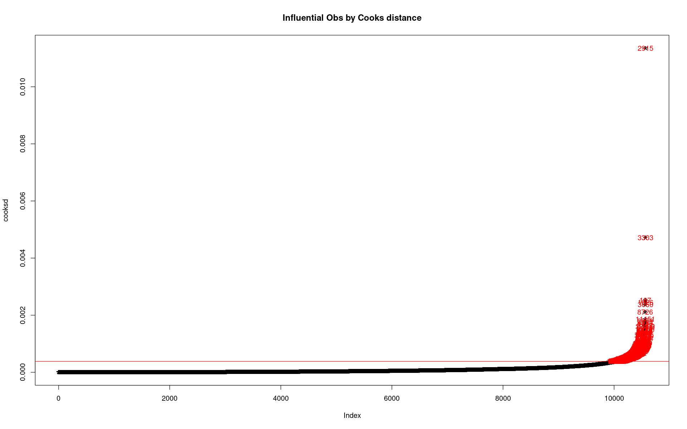
    


```R
# find the rows that are influential to observation
influential <- as.numeric(names(cooksd)[(cooksd > 4*mean(cooksd, na.rm=T))])  # influential row numbers
stem(influential)
```

    
      The decimal point is 3 digit(s) to the right of the |
    
       0 | 000011112222223344445555555666677777777788899999
       1 | 00000001111112223344444445555555666677777888999
       2 | 00000111111222223333334444555556666667777788888999999
       3 | 0000001111222223333334444444455555555556677777888899999
       4 | 000000001111111122222223333444445555556666666777788888999999999
       5 | 0000011233333445555566667777888889
       6 | 000111112222233334444445567777777899999
       7 | 00001112222233344455556778888999999
       8 | 01122223444555556777778899
       9 | 00001111222222344445555667777777888899
      10 | 1111222233334444555555566777788888999999
      11 | 000000112334445555666677788999
      12 | 000111111122333444
    


```R
# Bonferonni p-value for most extreme obs
car::outlierTest(baseline_model1)
```


           rstudent unadjusted p-value Bonferroni p
    3303   4.725867         2.3211e-06     0.024523
    11451 -4.588100         4.5248e-06     0.047805


```R
#Assess homocedasticity 
plot(baseline_model1,1)
plot(baseline_model1, 3)
```


    
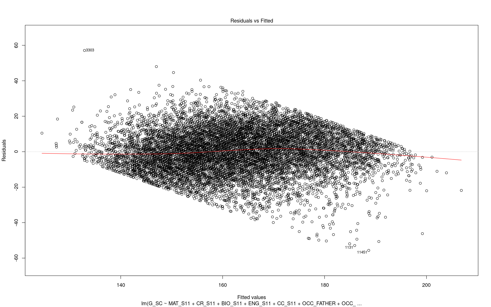
    


    
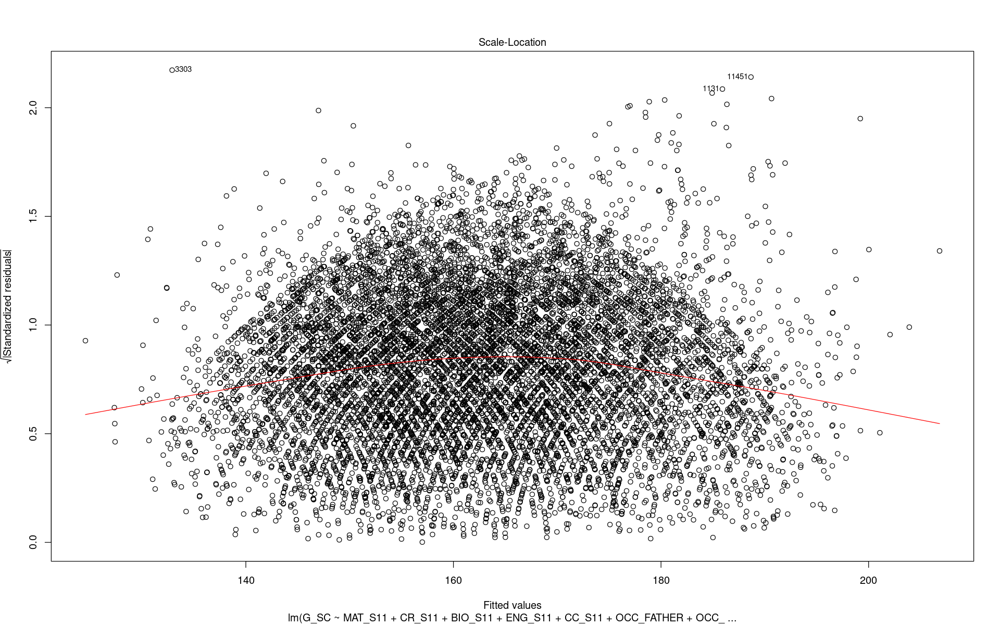
    


```R
#Create histogram and  density plot of the residuals
plot(density(resid(baseline_model1))) 
```


    
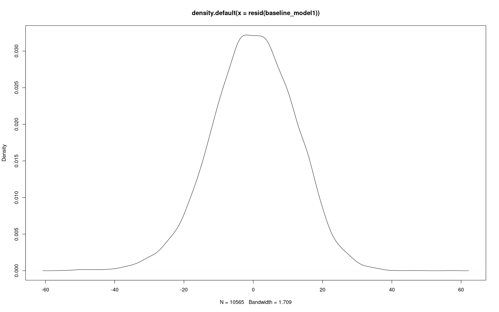
    


```R
#Create a QQ plotqqPlot(model, main="QQ Plot") #qq plot for studentized resid 
car::qqPlot(baseline_model1, main="QQ Plot") #qq plot for studentized resid
```


<style>
.dl-inline {width: auto; margin:0; padding: 0}
.dl-inline>dt, .dl-inline>dd {float: none; width: auto; display: inline-block}
.dl-inline>dt::after {content: ":\0020"; padding-right: .5ex}
.dl-inline>dt:not(:first-of-type) {padding-left: .5ex}
</style><dl class=dl-inline><dt>3303</dt><dd>2838</dd><dt>11451</dt><dd>9767</dd></dl>


    
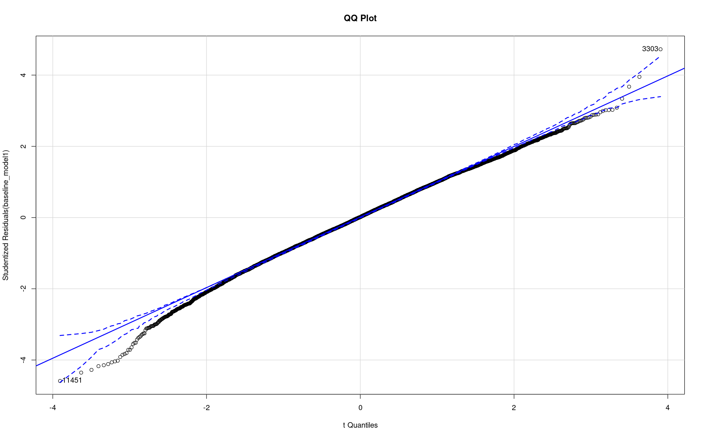
    


```R
alias(baseline_model1 )
```


    Model :
    G_SC ~ MAT_S11 + CR_S11 + BIO_S11 + ENG_S11 + SISBEN + PEOPLE_HOUSE + 
        JOB + SCHOOL_TYPE + dummyGender + dummyInternet + dummyTV + 
        dummyComputer + dummyWmachine + dummyMicOven + dummyCar + 
        dummyDvd + dummyPhone + dummyMobile + dummySchoolN
    
    Complete :
                    (Intercept) MAT_S11 CR_S11 BIO_S11 ENG_S11
    PEOPLE_HOUSETwo  0           0       0      0       0     
                    SISBENEsta clasificada en otro Level del SISBEN
    PEOPLE_HOUSETwo  1                                             
                    SISBENIt is not classified by the SISBEN SISBENLevel 1
    PEOPLE_HOUSETwo  1                                        1           
                    SISBENLevel 2 SISBENLevel 3 PEOPLE_HOUSEEight PEOPLE_HOUSEFive
    PEOPLE_HOUSETwo  1             1            -1                -1              
                    PEOPLE_HOUSEFour PEOPLE_HOUSENueve PEOPLE_HOUSEOnce
    PEOPLE_HOUSETwo -1               -1                -1              
                    PEOPLE_HOUSEOne PEOPLE_HOUSESeven PEOPLE_HOUSESix
    PEOPLE_HOUSETwo -1              -1                -1             
                    PEOPLE_HOUSETen PEOPLE_HOUSEThree PEOPLE_HOUSETwelve or more
    PEOPLE_HOUSETwo -1              -1                -1                        
                    JOBNo JOBYes, 20 hours or more per week
    PEOPLE_HOUSETwo  0     0                               
                    JOBYes, less than 20 hours per week SCHOOL_TYPENot apply
    PEOPLE_HOUSETwo  0                                   0                  
                    SCHOOL_TYPETECHNICAL SCHOOL_TYPETECHNICAL/ACADEMIC dummyGender
    PEOPLE_HOUSETwo  0                    0                             0         
                    dummyInternet dummyTV dummyComputer dummyWmachine dummyMicOven
    PEOPLE_HOUSETwo  0             0       0             0             0          
                    dummyCar dummyDvd dummyPhone dummyMobile dummySchoolN
    PEOPLE_HOUSETwo  0        0        0          0           0          


```R
# #Calculate Collinearity, will not run as you have na's in summary
vifmodel<-car::vif(baseline_model1)
vifmodel
#Calculate tolerance
1/vifmodel
```


<table>
<caption>A matrix: 24 × 3 of type dbl</caption>
<thead>
	<tr><th></th><th scope=col>GVIF</th><th scope=col>Df</th><th scope=col>GVIF^(1/(2*Df))</th></tr>
</thead>
<tbody>
	<tr><th scope=row>MAT_S11</th><td> 2.254001</td><td> 1</td><td>1.501333</td></tr>
	<tr><th scope=row>CR_S11</th><td> 2.254357</td><td> 1</td><td>1.501452</td></tr>
	<tr><th scope=row>BIO_S11</th><td> 2.516803</td><td> 1</td><td>1.586444</td></tr>
	<tr><th scope=row>ENG_S11</th><td> 1.906270</td><td> 1</td><td>1.380678</td></tr>
	<tr><th scope=row>CC_S11</th><td> 2.116643</td><td> 1</td><td>1.454869</td></tr>
	<tr><th scope=row>OCC_FATHER</th><td> 6.792342</td><td>11</td><td>1.090986</td></tr>
	<tr><th scope=row>OCC_MOTHER</th><td> 5.596277</td><td>11</td><td>1.081423</td></tr>
	<tr><th scope=row>EDU_FATHER</th><td>23.559445</td><td>11</td><td>1.154439</td></tr>
	<tr><th scope=row>EDU_MOTHER</th><td>22.365887</td><td>11</td><td>1.151714</td></tr>
	<tr><th scope=row>dummyJobNo</th><td> 4.445172</td><td> 1</td><td>2.108358</td></tr>
	<tr><th scope=row>dummyJobPT</th><td> 3.062072</td><td> 1</td><td>1.749878</td></tr>
	<tr><th scope=row>dummyJobFT</th><td> 2.182644</td><td> 1</td><td>1.477377</td></tr>
	<tr><th scope=row>SCHOOL_TYPE</th><td> 1.494291</td><td> 3</td><td>1.069233</td></tr>
	<tr><th scope=row>dummyGender</th><td> 1.074651</td><td> 1</td><td>1.036654</td></tr>
	<tr><th scope=row>dummyInternet</th><td> 1.951649</td><td> 1</td><td>1.397014</td></tr>
	<tr><th scope=row>dummyTV</th><td> 1.555057</td><td> 1</td><td>1.247019</td></tr>
	<tr><th scope=row>dummyComputer</th><td> 1.841054</td><td> 1</td><td>1.356854</td></tr>
	<tr><th scope=row>dummyWmachine</th><td> 1.325508</td><td> 1</td><td>1.151307</td></tr>
	<tr><th scope=row>dummyMicOven</th><td> 1.382723</td><td> 1</td><td>1.175892</td></tr>
	<tr><th scope=row>dummyCar</th><td> 1.462013</td><td> 1</td><td>1.209137</td></tr>
	<tr><th scope=row>dummyDvd</th><td> 1.280792</td><td> 1</td><td>1.131721</td></tr>
	<tr><th scope=row>dummyPhone</th><td> 1.050185</td><td> 1</td><td>1.024785</td></tr>
	<tr><th scope=row>dummyMobile</th><td> 1.463173</td><td> 1</td><td>1.209617</td></tr>
	<tr><th scope=row>dummySchoolN</th><td> 1.871326</td><td> 1</td><td>1.367964</td></tr>
</tbody>
</table>


<table>
<caption>A matrix: 24 × 3 of type dbl</caption>
<thead>
	<tr><th></th><th scope=col>GVIF</th><th scope=col>Df</th><th scope=col>GVIF^(1/(2*Df))</th></tr>
</thead>
<tbody>
	<tr><th scope=row>MAT_S11</th><td>0.44365551</td><td>1.00000000</td><td>0.6660747</td></tr>
	<tr><th scope=row>CR_S11</th><td>0.44358548</td><td>1.00000000</td><td>0.6660221</td></tr>
	<tr><th scope=row>BIO_S11</th><td>0.39732943</td><td>1.00000000</td><td>0.6303407</td></tr>
	<tr><th scope=row>ENG_S11</th><td>0.52458455</td><td>1.00000000</td><td>0.7242821</td></tr>
	<tr><th scope=row>CC_S11</th><td>0.47244628</td><td>1.00000000</td><td>0.6873473</td></tr>
	<tr><th scope=row>OCC_FATHER</th><td>0.14722462</td><td>0.09090909</td><td>0.9166023</td></tr>
	<tr><th scope=row>OCC_MOTHER</th><td>0.17869022</td><td>0.09090909</td><td>0.9247079</td></tr>
	<tr><th scope=row>EDU_FATHER</th><td>0.04244582</td><td>0.09090909</td><td>0.8662213</td></tr>
	<tr><th scope=row>EDU_MOTHER</th><td>0.04471095</td><td>0.09090909</td><td>0.8682708</td></tr>
	<tr><th scope=row>dummyJobNo</th><td>0.22496316</td><td>1.00000000</td><td>0.4743028</td></tr>
	<tr><th scope=row>dummyJobPT</th><td>0.32657627</td><td>1.00000000</td><td>0.5714685</td></tr>
	<tr><th scope=row>dummyJobFT</th><td>0.45815998</td><td>1.00000000</td><td>0.6768752</td></tr>
	<tr><th scope=row>SCHOOL_TYPE</th><td>0.66921356</td><td>0.33333333</td><td>0.9352494</td></tr>
	<tr><th scope=row>dummyGender</th><td>0.93053490</td><td>1.00000000</td><td>0.9646424</td></tr>
	<tr><th scope=row>dummyInternet</th><td>0.51238735</td><td>1.00000000</td><td>0.7158124</td></tr>
	<tr><th scope=row>dummyTV</th><td>0.64306316</td><td>1.00000000</td><td>0.8019122</td></tr>
	<tr><th scope=row>dummyComputer</th><td>0.54316716</td><td>1.00000000</td><td>0.7369988</td></tr>
	<tr><th scope=row>dummyWmachine</th><td>0.75442752</td><td>1.00000000</td><td>0.8685779</td></tr>
	<tr><th scope=row>dummyMicOven</th><td>0.72321080</td><td>1.00000000</td><td>0.8504180</td></tr>
	<tr><th scope=row>dummyCar</th><td>0.68398830</td><td>1.00000000</td><td>0.8270359</td></tr>
	<tr><th scope=row>dummyDvd</th><td>0.78076693</td><td>1.00000000</td><td>0.8836102</td></tr>
	<tr><th scope=row>dummyPhone</th><td>0.95221359</td><td>1.00000000</td><td>0.9758143</td></tr>
	<tr><th scope=row>dummyMobile</th><td>0.68344639</td><td>1.00000000</td><td>0.8267082</td></tr>
	<tr><th scope=row>dummySchoolN</th><td>0.53438029</td><td>1.00000000</td><td>0.7310132</td></tr>
</tbody>
</table>


```R
max(stdres(baseline_model1))
min(stdres(baseline_model1))
```


4.72107223099284


-4.58372471478061


# Model 2 keep


```R
baseline_model12<-lm(formula = G_SC ~ MAT_S11 + CR_S11+BIO_S11+ENG_S11+CC_S11
                    +dummyInternet+dummyWmachine+dummyMicOven+dummyCar+dummyMobile, data= clean_data_v2)
```


```R
print("Anova test")
anova(baseline_model2)
print("Summary of model")
summary(baseline_model2)
print("model Info comparison")
stargazer(baseline_model2, type="text") #Tidy output of all the required stats
print("Beta values of the model")
lm.beta(baseline_model2)
```

    [1] "Anova test"


<table>
<caption>A anova: 8 × 5</caption>
<thead>
	<tr><th></th><th scope=col>Df</th><th scope=col>Sum Sq</th><th scope=col>Mean Sq</th><th scope=col>F value</th><th scope=col>Pr(&gt;F)</th></tr>
	<tr><th></th><th scope=col>&lt;int&gt;</th><th scope=col>&lt;dbl&gt;</th><th scope=col>&lt;dbl&gt;</th><th scope=col>&lt;dbl&gt;</th><th scope=col>&lt;dbl&gt;</th></tr>
</thead>
<tbody>
	<tr><th scope=row>MAT_S11</th><td>    1</td><td>2748007.843</td><td>2748007.8425</td><td>13165.79733</td><td> 0.000000e+00</td></tr>
	<tr><th scope=row>CC_S11</th><td>    1</td><td> 651325.502</td><td> 651325.5016</td><td> 3120.52223</td><td> 0.000000e+00</td></tr>
	<tr><th scope=row>CR_S11</th><td>    1</td><td> 217970.576</td><td> 217970.5763</td><td> 1044.30431</td><td>4.834606e-220</td></tr>
	<tr><th scope=row>BIO_S11</th><td>    1</td><td> 105716.348</td><td> 105716.3482</td><td>  506.49055</td><td>5.764688e-110</td></tr>
	<tr><th scope=row>ENG_S11</th><td>    1</td><td> 311148.112</td><td> 311148.1125</td><td> 1490.72100</td><td>4.532170e-308</td></tr>
	<tr><th scope=row>dummyMobile</th><td>    1</td><td>   4010.579</td><td>   4010.5786</td><td>   19.21482</td><td> 1.177644e-05</td></tr>
	<tr><th scope=row>dummyMicOven</th><td>    1</td><td>   2283.547</td><td>   2283.5471</td><td>   10.94055</td><td> 9.434986e-04</td></tr>
	<tr><th scope=row>Residuals</th><td>12403</td><td>2588794.315</td><td>    208.7232</td><td>         NA</td><td>           NA</td></tr>
</tbody>
</table>


    [1] "Summary of model"


    
    Call:
    lm(formula = G_SC ~ MAT_S11 + CC_S11 + CR_S11 + BIO_S11 + ENG_S11 + 
        dummyMobile + dummyMicOven, data = clean_data)
    
    Residuals:
         Min       1Q   Median       3Q      Max 
    -146.210   -8.524    0.516    9.550   89.505 
    
    Coefficients:
                 Estimate Std. Error t value Pr(>|t|)    
    (Intercept)  49.35108    0.92758  53.204  < 2e-16 ***
    MAT_S11       0.28308    0.01781  15.895  < 2e-16 ***
    CC_S11        0.34664    0.02018  17.178  < 2e-16 ***
    CR_S11        0.39682    0.02084  19.044  < 2e-16 ***
    BIO_S11       0.35114    0.02018  17.400  < 2e-16 ***
    ENG_S11       0.45540    0.01260  36.133  < 2e-16 ***
    dummyMobile  -1.05969    0.30659  -3.456 0.000549 ***
    dummyMicOven -0.98461    0.29768  -3.308 0.000943 ***
    ---
    Signif. codes:  0 ‘***’ 0.001 ‘**’ 0.01 ‘*’ 0.05 ‘.’ 0.1 ‘ ’ 1
    
    Residual standard error: 14.45 on 12403 degrees of freedom
    Multiple R-squared:  0.6095,	Adjusted R-squared:  0.6093 
    F-statistic:  2765 on 7 and 12403 DF,  p-value: < 2.2e-16


    [1] "model Info comparison"
    
    ================================================
                            Dependent variable:     
                        ----------------------------
                                    G_SC            
    ------------------------------------------------
    MAT_S11                       0.283***          
                                  (0.018)           
                                                    
    CC_S11                        0.347***          
                                  (0.020)           
                                                    
    CR_S11                        0.397***          
                                  (0.021)           
                                                    
    BIO_S11                       0.351***          
                                  (0.020)           
                                                    
    ENG_S11                       0.455***          
                                  (0.013)           
                                                    
    dummyMobile                  -1.060***          
                                  (0.307)           
                                                    
    dummyMicOven                 -0.985***          
                                  (0.298)           
                                                    
    Constant                     49.351***          
                                  (0.928)           
                                                    
    ------------------------------------------------
    Observations                   12,411           
    R2                             0.609            
    Adjusted R2                    0.609            
    Residual Std. Error     14.447 (df = 12403)     
    F Statistic         2,765.427*** (df = 7; 12403)
    ================================================
    Note:                *p<0.1; **p<0.05; ***p<0.01
    [1] "Beta values of the model"


    
    Call:
    lm(formula = G_SC ~ MAT_S11 + CC_S11 + CR_S11 + BIO_S11 + ENG_S11 + 
        dummyMobile + dummyMicOven, data = clean_data)
    
    Standardized Coefficients::
     (Intercept)      MAT_S11       CC_S11       CR_S11      BIO_S11      ENG_S11 
      0.00000000   0.14542621   0.15178532   0.17213426   0.16950329   0.28172068 
     dummyMobile dummyMicOven 
     -0.02074484  -0.01969440 


```R
# Bonferonni p-value for most extreme obs
max(stdres(baseline_model2))
min(stdres(baseline_model2))
```


6.19893878703567


-10.1221105732264


```R
# check for influencial outliers
cooksd<-sort(cooks.distance(baseline_model2))
# plotting the cooks model
plot(cooksd, pch="*", cex=2, main="Influential Obs by Cooks distance")  
abline(h = 4*mean(cooksd, na.rm=T), col="red")  # add cutoff line
text(x=1:length(cooksd)+1, y=cooksd, labels=ifelse(cooksd>4*mean(cooksd, na.rm=T),names(cooksd),""), col="red")  # add labels
```


    
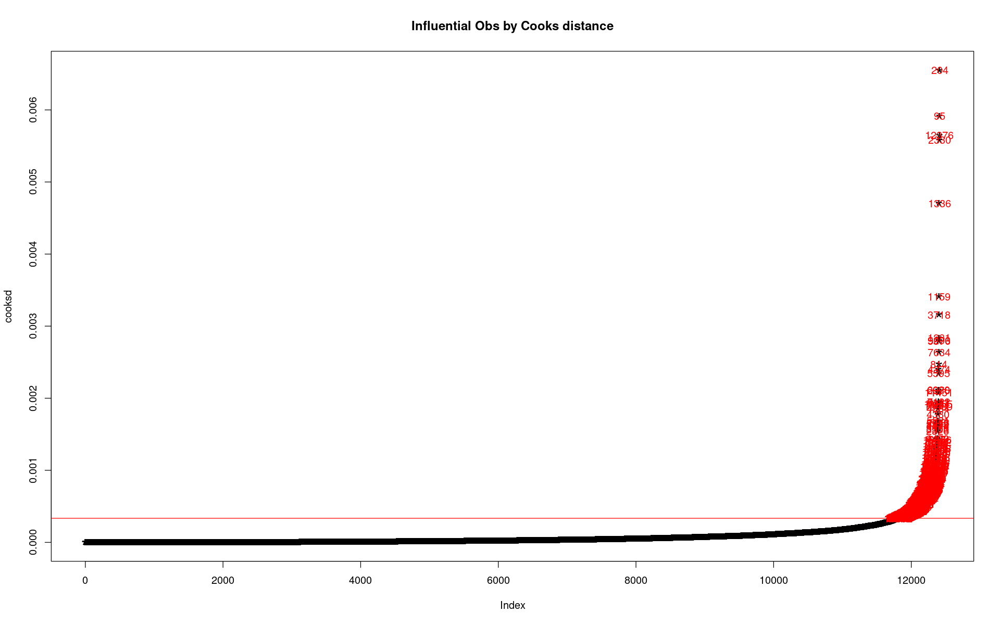
    


```R
#Create a QQ plotqqPlot(model, main="QQ Plot") #qq plot for studentized resid 
car::qqPlot(baseline_model2, main="QQ Plot") #qq plot for studentized resid
```


<style>
.list-inline {list-style: none; margin:0; padding: 0}
.list-inline>li {display: inline-block}
.list-inline>li:not(:last-child)::after {content: "\00b7"; padding: 0 .5ex}
</style>
<ol class=list-inline><li>1336</li><li>7721</li></ol>


    
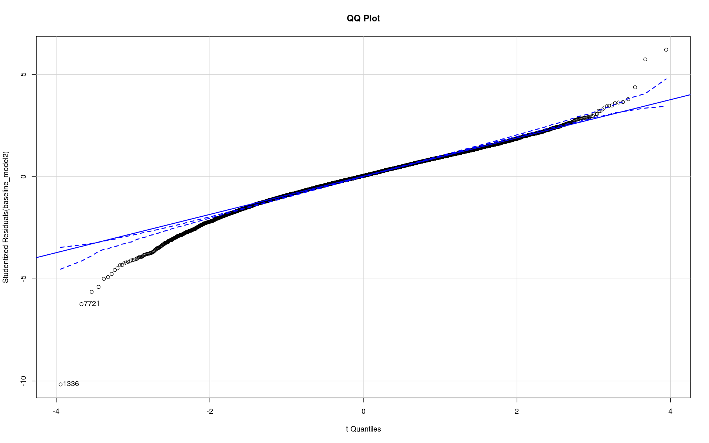
    


```R
#Assess homocedasticity 
plot(baseline_model2,1)
plot(baseline_model2, 3)
```


    
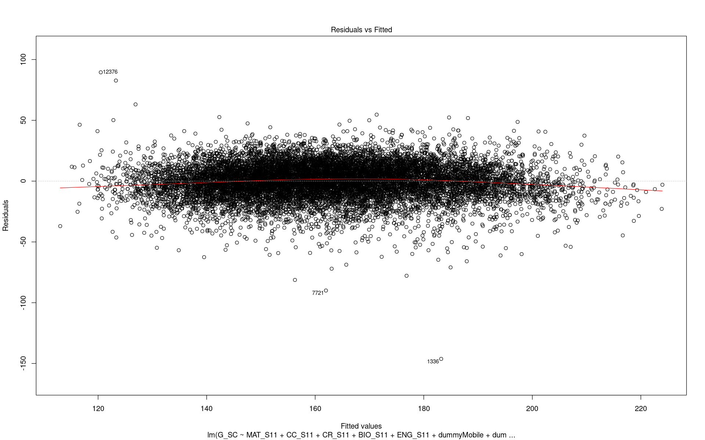
    


    
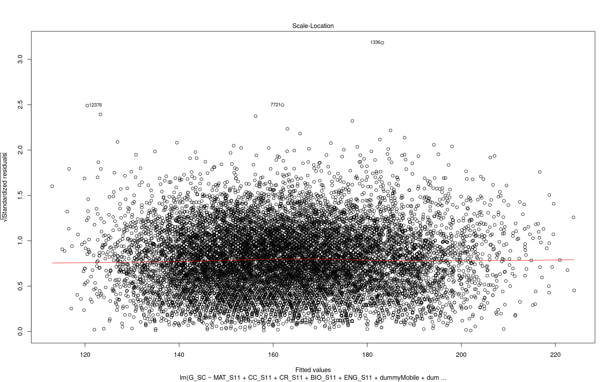
    


```R
#Create histogram and  density plot of the residuals
plot(density(resid(baseline_model2))) 
```


    

    


```R
# #Calculate Collinearity, will not run as you have na's in summary
vifmodel<-car::vif(baseline_model2)
vifmodel
#Calculate tolerance
1/vifmodel
```


<style>
.dl-inline {width: auto; margin:0; padding: 0}
.dl-inline>dt, .dl-inline>dd {float: none; width: auto; display: inline-block}
.dl-inline>dt::after {content: ":\0020"; padding-right: .5ex}
.dl-inline>dt:not(:first-of-type) {padding-left: .5ex}
</style><dl class=dl-inline><dt>MAT_S11</dt><dd>2.65871909360715</dd><dt>CC_S11</dt><dd>2.47974640393093</dd><dt>CR_S11</dt><dd>2.59481154280834</dd><dt>BIO_S11</dt><dd>3.01410436436377</dd><dt>ENG_S11</dt><dd>1.93075385913527</dd><dt>dummyMobile</dt><dd>1.1441562057376</dd><dt>dummyMicOven</dt><dd>1.12600498205671</dd></dl>


<style>
.dl-inline {width: auto; margin:0; padding: 0}
.dl-inline>dt, .dl-inline>dd {float: none; width: auto; display: inline-block}
.dl-inline>dt::after {content: ":\0020"; padding-right: .5ex}
.dl-inline>dt:not(:first-of-type) {padding-left: .5ex}
</style><dl class=dl-inline><dt>MAT_S11</dt><dd>0.376120968328127</dd><dt>CC_S11</dt><dd>0.403267043119726</dd><dt>CR_S11</dt><dd>0.385384442570233</dd><dt>BIO_S11</dt><dd>0.331773515152015</dd><dt>ENG_S11</dt><dd>0.517932410321776</dd><dt>dummyMobile</dt><dd>0.874006534234839</dd><dt>dummyMicOven</dt><dd>0.888095537706632</dd></dl>


# Removing outliers from the scores variables which we saw in boxplots, using 1.5 rule


```R
describe(cont_data)
```


<table>
<caption>A psych: 5 × 13</caption>
<thead>
	<tr><th></th><th scope=col>vars</th><th scope=col>n</th><th scope=col>mean</th><th scope=col>sd</th><th scope=col>median</th><th scope=col>trimmed</th><th scope=col>mad</th><th scope=col>min</th><th scope=col>max</th><th scope=col>range</th><th scope=col>skew</th><th scope=col>kurtosis</th><th scope=col>se</th></tr>
	<tr><th></th><th scope=col>&lt;int&gt;</th><th scope=col>&lt;dbl&gt;</th><th scope=col>&lt;dbl&gt;</th><th scope=col>&lt;dbl&gt;</th><th scope=col>&lt;dbl&gt;</th><th scope=col>&lt;dbl&gt;</th><th scope=col>&lt;dbl&gt;</th><th scope=col>&lt;dbl&gt;</th><th scope=col>&lt;dbl&gt;</th><th scope=col>&lt;dbl&gt;</th><th scope=col>&lt;dbl&gt;</th><th scope=col>&lt;dbl&gt;</th><th scope=col>&lt;dbl&gt;</th></tr>
</thead>
<tbody>
	<tr><th scope=row>MAT_S11</th><td>1</td><td>12411</td><td> 64.32076</td><td>11.87365</td><td> 64</td><td> 63.83624</td><td>11.8608</td><td>26</td><td>100</td><td> 74</td><td> 0.39946028</td><td> 0.12886390</td><td>0.10658126</td></tr>
	<tr><th scope=row>CR_S11</th><td>2</td><td>12411</td><td> 60.77842</td><td>10.02588</td><td> 61</td><td> 60.62846</td><td>10.3782</td><td>24</td><td>100</td><td> 76</td><td> 0.21419352</td><td> 0.47665834</td><td>0.08999511</td></tr>
	<tr><th scope=row>BIO_S11</th><td>3</td><td>12411</td><td> 63.95053</td><td>11.15687</td><td> 64</td><td> 63.64568</td><td>10.3782</td><td>11</td><td>100</td><td> 89</td><td> 0.30329883</td><td> 0.29791111</td><td>0.10014723</td></tr>
	<tr><th scope=row>ENG_S11</th><td>4</td><td>12411</td><td> 61.80106</td><td>14.29778</td><td> 59</td><td> 60.76866</td><td>14.8260</td><td>26</td><td>100</td><td> 74</td><td> 0.60676163</td><td>-0.37157362</td><td>0.12834091</td></tr>
	<tr><th scope=row>G_SC</th><td>5</td><td>12411</td><td>162.71050</td><td>23.11248</td><td>163</td><td>162.93947</td><td>23.7216</td><td>37</td><td>247</td><td>210</td><td>-0.09539073</td><td>-0.07629832</td><td>0.20746419</td></tr>
</tbody>
</table>


```R
summary(cont_data)
```


        MAT_S11           CR_S11          BIO_S11          ENG_S11     
     Min.   : 26.00   Min.   : 24.00   Min.   : 11.00   Min.   : 26.0  
     1st Qu.: 56.00   1st Qu.: 54.00   1st Qu.: 56.00   1st Qu.: 50.0  
     Median : 64.00   Median : 61.00   Median : 64.00   Median : 59.0  
     Mean   : 64.32   Mean   : 60.78   Mean   : 63.95   Mean   : 61.8  
     3rd Qu.: 72.00   3rd Qu.: 67.00   3rd Qu.: 71.00   3rd Qu.: 72.0  
     Max.   :100.00   Max.   :100.00   Max.   :100.00   Max.   :100.0  
         CC_S11            G_SC      
     Min.   :  0.00   Min.   : 37.0  
     1st Qu.: 54.00   1st Qu.:147.0  
     Median : 60.00   Median :163.0  
     Mean   : 60.71   Mean   :162.7  
     3rd Qu.: 67.00   3rd Qu.:179.0  
     Max.   :100.00   Max.   :247.0  


the maths behind this is if x < q1-1.5IQR or x > q3 + 1.5IQR


```R
IQR(cont_data$MAT_S11)
```


16


```R
# removing outliers from maths, first find ranges
lowerbound <- 56-1.5 * IQR(cont_data$MAT_S11)
upperbound = 72+1.5 * IQR(cont_data$MAT_S11)
```


```R
# found a total of 137 outliers, these need to be removed
fn$sqldf("select count(MAT_S11) from clean_data where MAT_S11 <$lowerbound or MAT_S11 > $upperbound")
clean_data_v2<-clean_data[!(clean_data$MAT_S11 > upperbound | clean_data$MAT_S11 < lowerbound),]
```


<table>
<caption>A data.frame: 1 × 1</caption>
<thead>
	<tr><th scope=col>count(MAT_S11)</th></tr>
	<tr><th scope=col>&lt;int&gt;</th></tr>
</thead>
<tbody>
	<tr><td>137</td></tr>
</tbody>
</table>


```R
# removing outliers from critical, first find ranges
lowerbound <- 54-1.5 * IQR(cont_data$CR_S11)
upperbound = 67+1.5 * IQR(cont_data$CR_S11)
fn$sqldf("select count(CR_S11) from clean_data_v2 where CR_S11 <$lowerbound or CR_S11 > $upperbound")
# found 146 in remaining set outliers
clean_data_v2<-clean_data_v2[!(clean_data_v2$CR_S11 > upperbound | clean_data_v2$CR_S11 < lowerbound),]
```


<table>
<caption>A data.frame: 1 × 1</caption>
<thead>
	<tr><th scope=col>count(CR_S11)</th></tr>
	<tr><th scope=col>&lt;int&gt;</th></tr>
</thead>
<tbody>
	<tr><td>179</td></tr>
</tbody>
</table>


```R
# removing outliers from biology, first find ranges
lowerbound <- 56-1.5 * IQR(cont_data$BIO_S11)
upperbound = 71+1.5 * IQR(cont_data$BIO_S11)
lowerbound
upperbound
fn$sqldf("select count(BIO_S11) from clean_data_v2 where BIO_S11 <$lowerbound or BIO_S11 > $upperbound")
# found 121 in remaining set outliers
clean_data_v2<-clean_data_v2[!(clean_data_v2$BIO_S11 > upperbound | clean_data_v2$BIO_S11 < lowerbound),]
```


33.5


93.5


<table>
<caption>A data.frame: 1 × 1</caption>
<thead>
	<tr><th scope=col>count(BIO_S11)</th></tr>
	<tr><th scope=col>&lt;int&gt;</th></tr>
</thead>
<tbody>
	<tr><td>121</td></tr>
</tbody>
</table>


```R
# removing outliers from english, first find ranges
lowerbound <- 50-1.5 * IQR(cont_data$ENG_S11)
upperbound = 72+1.5 * IQR(cont_data$ENG_S11)
lowerbound
upperbound
fn$sqldf("select count(ENG_S11) from t where ENG_S11 <$lowerbound or ENG_S11 > $upperbound")
# found 0 in remaining set outliers
clean_data_v2<-clean_data_v2[!(clean_data_v2$ENG_S11 > upperbound | clean_data_v2$ENG_S11 < lowerbound),]
```


17


105


<table>
<caption>A data.frame: 1 × 1</caption>
<thead>
	<tr><th scope=col>count(ENG_S11)</th></tr>
	<tr><th scope=col>&lt;int&gt;</th></tr>
</thead>
<tbody>
	<tr><td>0</td></tr>
</tbody>
</table>


```R
# removing outliers from CC, first find ranges
lowerbound <- 54-1.5 * IQR(cont_data$CC_S11)
upperbound = 67+1.5 * IQR(cont_data$CC_S11)
lowerbound
upperbound
fn$sqldf("select count(CC_S11) from t where CC_S11 <$lowerbound or CC_S11 > $upperbound")
# found 151 in remaining set outliers
clean_data_v2<-clean_data_v2[!(clean_data_v2$CC_S11 > upperbound | clean_data_v2$CC_S11 < lowerbound),]
```


34.5


86.5


<table>
<caption>A data.frame: 1 × 1</caption>
<thead>
	<tr><th scope=col>count(CC_S11)</th></tr>
	<tr><th scope=col>&lt;int&gt;</th></tr>
</thead>
<tbody>
	<tr><td>0</td></tr>
</tbody>
</table>


```R
# removing outliers from G_SC, first find ranges
lowerbound <- 147-1.5 * IQR(cont_data$CC_S11)
upperbound = 179+1.5 * IQR(cont_data$CC_S11)
lowerbound
upperbound
fn$sqldf("select count(G_SC) from t where G_SC <$lowerbound or G_SC > $upperbound")
# found 1258 in remaining set outliers
clean_data_v2<-clean_data_v2[!(clean_data_v2$G_SC > upperbound | clean_data_v2$G_SC < lowerbound),]
```


127.5


198.5


<table>
<caption>A data.frame: 1 × 1</caption>
<thead>
	<tr><th scope=col>count(G_SC)</th></tr>
	<tr><th scope=col>&lt;int&gt;</th></tr>
</thead>
<tbody>
	<tr><td>0</td></tr>
</tbody>
</table>


```R
clean_data_v2
```


<table>
<caption>A data.frame: 10565 × 53</caption>
<thead>
	<tr><th></th><th scope=col>GENDER</th><th scope=col>STRATUM</th><th scope=col>EDU_FATHER</th><th scope=col>EDU_MOTHER</th><th scope=col>OCC_FATHER</th><th scope=col>OCC_MOTHER</th><th scope=col>SISBEN</th><th scope=col>PEOPLE_HOUSE</th><th scope=col>INTERNET</th><th scope=col>TV</th><th scope=col>⋯</th><th scope=col>dummySis3</th><th scope=col>dummyJobNo</th><th scope=col>dummyJobPT</th><th scope=col>dummyJobFT</th><th scope=col>dummyRevenue1</th><th scope=col>dummyRevenue2</th><th scope=col>dummyRevenue3</th><th scope=col>dummyPhouseOne</th><th scope=col>dummyPhouse2t3</th><th scope=col>dummyPhouseAbove3</th></tr>
	<tr><th></th><th scope=col>&lt;fct&gt;</th><th scope=col>&lt;fct&gt;</th><th scope=col>&lt;fct&gt;</th><th scope=col>&lt;fct&gt;</th><th scope=col>&lt;fct&gt;</th><th scope=col>&lt;fct&gt;</th><th scope=col>&lt;fct&gt;</th><th scope=col>&lt;fct&gt;</th><th scope=col>&lt;fct&gt;</th><th scope=col>&lt;fct&gt;</th><th scope=col>⋯</th><th scope=col>&lt;dbl&gt;</th><th scope=col>&lt;dbl&gt;</th><th scope=col>&lt;dbl&gt;</th><th scope=col>&lt;dbl&gt;</th><th scope=col>&lt;dbl&gt;</th><th scope=col>&lt;dbl&gt;</th><th scope=col>&lt;dbl&gt;</th><th scope=col>&lt;dbl&gt;</th><th scope=col>&lt;dbl&gt;</th><th scope=col>&lt;dbl&gt;</th></tr>
</thead>
<tbody>
	<tr><th scope=row>1</th><td>F</td><td>Stratum 4</td><td>Incomplete Professional Education</td><td>Complete technique or technology     </td><td>Technical or professional level employee</td><td>Home                                    </td><td>It is not classified by the SISBEN       </td><td>Three         </td><td>Yes</td><td>Yes</td><td>⋯</td><td>0</td><td>1</td><td>0</td><td>0</td><td>1</td><td>0</td><td>0</td><td>0</td><td>1</td><td>0</td></tr>
	<tr><th scope=row>4</th><td>F</td><td>Stratum 2</td><td>Not sure                         </td><td>Not sure                             </td><td>Other occupation                        </td><td>Independent                             </td><td>It is not classified by the SISBEN       </td><td>Three         </td><td>Yes</td><td>Yes</td><td>⋯</td><td>0</td><td>1</td><td>0</td><td>0</td><td>0</td><td>1</td><td>0</td><td>0</td><td>1</td><td>0</td></tr>
	<tr><th scope=row>5</th><td>M</td><td>Stratum 4</td><td>Complete professional education  </td><td>Complete professional education      </td><td>Executive                               </td><td>Home                                    </td><td>It is not classified by the SISBEN       </td><td>One           </td><td>Yes</td><td>Yes</td><td>⋯</td><td>0</td><td>1</td><td>0</td><td>0</td><td>0</td><td>0</td><td>1</td><td>1</td><td>0</td><td>0</td></tr>
	<tr><th scope=row>6</th><td>F</td><td>Stratum 6</td><td>Complete professional education  </td><td>Complete professional education      </td><td>Independent                             </td><td>Executive                               </td><td>It is not classified by the SISBEN       </td><td>Three         </td><td>Yes</td><td>Yes</td><td>⋯</td><td>0</td><td>1</td><td>0</td><td>0</td><td>0</td><td>0</td><td>0</td><td>0</td><td>1</td><td>0</td></tr>
	<tr><th scope=row>7</th><td>M</td><td>Stratum 5</td><td>Complete professional education  </td><td>Complete professional education      </td><td>Small entrepreneur                      </td><td>Executive                               </td><td>It is not classified by the SISBEN       </td><td>Four          </td><td>Yes</td><td>Yes</td><td>⋯</td><td>0</td><td>1</td><td>0</td><td>0</td><td>0</td><td>0</td><td>0</td><td>0</td><td>0</td><td>1</td></tr>
	<tr><th scope=row>9</th><td>M</td><td>Stratum 2</td><td>Complete Secundary               </td><td>Complete professional education      </td><td>Independent                             </td><td>Operator                                </td><td>It is not classified by the SISBEN       </td><td>Three         </td><td>Yes</td><td>Yes</td><td>⋯</td><td>0</td><td>1</td><td>0</td><td>0</td><td>1</td><td>0</td><td>0</td><td>0</td><td>1</td><td>0</td></tr>
	<tr><th scope=row>12</th><td>M</td><td>Stratum 2</td><td>Complete technique or technology </td><td>Complete Secundary                   </td><td>Technical or professional level employee</td><td>Entrepreneur                            </td><td>It is not classified by the SISBEN       </td><td>Four          </td><td>Yes</td><td>Yes</td><td>⋯</td><td>0</td><td>0</td><td>0</td><td>1</td><td>0</td><td>1</td><td>0</td><td>0</td><td>0</td><td>1</td></tr>
	<tr><th scope=row>13</th><td>F</td><td>Stratum 3</td><td>Not sure                         </td><td>Incomplete technical or technological</td><td>Small entrepreneur                      </td><td>Home                                    </td><td>It is not classified by the SISBEN       </td><td>Five          </td><td>No </td><td>Yes</td><td>⋯</td><td>0</td><td>1</td><td>0</td><td>0</td><td>0</td><td>1</td><td>0</td><td>0</td><td>0</td><td>1</td></tr>
	<tr><th scope=row>14</th><td>M</td><td>Stratum 6</td><td>Complete professional education  </td><td>Complete professional education      </td><td>Entrepreneur                            </td><td>Small entrepreneur                      </td><td>It is not classified by the SISBEN       </td><td>Six           </td><td>Yes</td><td>Yes</td><td>⋯</td><td>0</td><td>1</td><td>0</td><td>0</td><td>0</td><td>0</td><td>0</td><td>0</td><td>0</td><td>1</td></tr>
	<tr><th scope=row>15</th><td>F</td><td>Stratum 1</td><td>Incomplete primary               </td><td>Incomplete primary                   </td><td>Small entrepreneur                      </td><td>Executive                               </td><td>Level 1                                  </td><td>Two           </td><td>No </td><td>No </td><td>⋯</td><td>0</td><td>0</td><td>0</td><td>1</td><td>1</td><td>0</td><td>0</td><td>0</td><td>1</td><td>0</td></tr>
	<tr><th scope=row>16</th><td>F</td><td>Stratum 3</td><td>Complete technique or technology </td><td>Not sure                             </td><td>Technical or professional level employee</td><td>Technical or professional level employee</td><td>It is not classified by the SISBEN       </td><td>Two           </td><td>Yes</td><td>Yes</td><td>⋯</td><td>0</td><td>1</td><td>0</td><td>0</td><td>0</td><td>1</td><td>0</td><td>0</td><td>1</td><td>0</td></tr>
	<tr><th scope=row>17</th><td>M</td><td>Stratum 3</td><td>Complete professional education  </td><td>Complete professional education      </td><td>Small entrepreneur                      </td><td>Executive                               </td><td>It is not classified by the SISBEN       </td><td>Four          </td><td>Yes</td><td>Yes</td><td>⋯</td><td>0</td><td>1</td><td>0</td><td>0</td><td>0</td><td>0</td><td>1</td><td>0</td><td>0</td><td>1</td></tr>
	<tr><th scope=row>18</th><td>M</td><td>Stratum 3</td><td>Complete professional education  </td><td>Complete professional education      </td><td>Independent professional                </td><td>Independent professional                </td><td>It is not classified by the SISBEN       </td><td>Four          </td><td>Yes</td><td>Yes</td><td>⋯</td><td>0</td><td>1</td><td>0</td><td>0</td><td>0</td><td>0</td><td>1</td><td>0</td><td>0</td><td>1</td></tr>
	<tr><th scope=row>19</th><td>M</td><td>Stratum 2</td><td>Complete technique or technology </td><td>Complete Secundary                   </td><td>Operator                                </td><td>Independent                             </td><td>Level 2                                  </td><td>Four          </td><td>Yes</td><td>Yes</td><td>⋯</td><td>0</td><td>0</td><td>1</td><td>0</td><td>1</td><td>0</td><td>0</td><td>0</td><td>0</td><td>1</td></tr>
	<tr><th scope=row>20</th><td>M</td><td>Stratum 3</td><td>Complete professional education  </td><td>Complete professional education      </td><td>Technical or professional level employee</td><td>Technical or professional level employee</td><td>Esta clasificada en otro Level del SISBEN</td><td>Three         </td><td>Yes</td><td>Yes</td><td>⋯</td><td>0</td><td>1</td><td>0</td><td>0</td><td>0</td><td>1</td><td>0</td><td>0</td><td>1</td><td>0</td></tr>
	<tr><th scope=row>21</th><td>M</td><td>Stratum 3</td><td>Complete professional education  </td><td>Complete professional education      </td><td>Independent professional                </td><td>Executive                               </td><td>It is not classified by the SISBEN       </td><td>Three         </td><td>Yes</td><td>Yes</td><td>⋯</td><td>0</td><td>1</td><td>0</td><td>0</td><td>1</td><td>0</td><td>0</td><td>0</td><td>1</td><td>0</td></tr>
	<tr><th scope=row>22</th><td>M</td><td>Stratum 2</td><td>Incomplete primary               </td><td>Incomplete Secundary                 </td><td>Independent                             </td><td>Home                                    </td><td>It is not classified by the SISBEN       </td><td>Four          </td><td>Yes</td><td>No </td><td>⋯</td><td>0</td><td>1</td><td>0</td><td>0</td><td>1</td><td>0</td><td>0</td><td>0</td><td>0</td><td>1</td></tr>
	<tr><th scope=row>23</th><td>M</td><td>Stratum 4</td><td>Complete primary                 </td><td>Incomplete primary                   </td><td>Independent                             </td><td>Home                                    </td><td>It is not classified by the SISBEN       </td><td>Four          </td><td>Yes</td><td>Yes</td><td>⋯</td><td>0</td><td>1</td><td>0</td><td>0</td><td>0</td><td>1</td><td>0</td><td>0</td><td>0</td><td>1</td></tr>
	<tr><th scope=row>24</th><td>M</td><td>Stratum 2</td><td>Incomplete primary               </td><td>Incomplete primary                   </td><td>0                                       </td><td>0                                       </td><td>It is not classified by the SISBEN       </td><td>Five          </td><td>Yes</td><td>Yes</td><td>⋯</td><td>0</td><td>1</td><td>0</td><td>0</td><td>0</td><td>1</td><td>0</td><td>0</td><td>0</td><td>1</td></tr>
	<tr><th scope=row>25</th><td>M</td><td>Stratum 3</td><td>Complete professional education  </td><td>Incomplete Professional Education    </td><td>Executive                               </td><td>Operator                                </td><td>It is not classified by the SISBEN       </td><td>Four          </td><td>Yes</td><td>Yes</td><td>⋯</td><td>0</td><td>1</td><td>0</td><td>0</td><td>0</td><td>1</td><td>0</td><td>0</td><td>0</td><td>1</td></tr>
	<tr><th scope=row>27</th><td>M</td><td>Stratum 3</td><td>Complete professional education  </td><td>Complete technique or technology     </td><td>Technical or professional level employee</td><td>Technical or professional level employee</td><td>It is not classified by the SISBEN       </td><td>Four          </td><td>Yes</td><td>Yes</td><td>⋯</td><td>0</td><td>1</td><td>0</td><td>0</td><td>0</td><td>1</td><td>0</td><td>0</td><td>0</td><td>1</td></tr>
	<tr><th scope=row>28</th><td>M</td><td>Stratum 6</td><td>Postgraduate education           </td><td>Complete professional education      </td><td>Executive                               </td><td>Auxiliary or Administrative             </td><td>It is not classified by the SISBEN       </td><td>Five          </td><td>Yes</td><td>Yes</td><td>⋯</td><td>0</td><td>1</td><td>0</td><td>0</td><td>0</td><td>0</td><td>0</td><td>0</td><td>0</td><td>1</td></tr>
	<tr><th scope=row>29</th><td>F</td><td>Stratum 4</td><td>Complete Secundary               </td><td>Complete technique or technology     </td><td>Technical or professional level employee</td><td>Home                                    </td><td>It is not classified by the SISBEN       </td><td>Four          </td><td>Yes</td><td>Yes</td><td>⋯</td><td>0</td><td>1</td><td>0</td><td>0</td><td>0</td><td>1</td><td>0</td><td>0</td><td>0</td><td>1</td></tr>
	<tr><th scope=row>30</th><td>F</td><td>Stratum 3</td><td>Complete technique or technology </td><td>Complete technique or technology     </td><td>Executive                               </td><td>Independent                             </td><td>It is not classified by the SISBEN       </td><td>Four          </td><td>Yes</td><td>Yes</td><td>⋯</td><td>0</td><td>1</td><td>0</td><td>0</td><td>0</td><td>1</td><td>0</td><td>0</td><td>0</td><td>1</td></tr>
	<tr><th scope=row>31</th><td>M</td><td>Stratum 4</td><td>Complete Secundary               </td><td>Incomplete Secundary                 </td><td>Other occupation                        </td><td>Other occupation                        </td><td>It is not classified by the SISBEN       </td><td>Twelve or more</td><td>Yes</td><td>Yes</td><td>⋯</td><td>0</td><td>1</td><td>0</td><td>0</td><td>0</td><td>0</td><td>1</td><td>0</td><td>0</td><td>1</td></tr>
	<tr><th scope=row>32</th><td>M</td><td>Stratum 3</td><td>Complete professional education  </td><td>Complete professional education      </td><td>Executive                               </td><td>Other occupation                        </td><td>It is not classified by the SISBEN       </td><td>Four          </td><td>Yes</td><td>Yes</td><td>⋯</td><td>0</td><td>1</td><td>0</td><td>0</td><td>0</td><td>0</td><td>1</td><td>0</td><td>0</td><td>1</td></tr>
	<tr><th scope=row>33</th><td>M</td><td>Stratum 4</td><td>Complete professional education  </td><td>Complete Secundary                   </td><td>Independent professional                </td><td>Independent professional                </td><td>It is not classified by the SISBEN       </td><td>Two           </td><td>Yes</td><td>Yes</td><td>⋯</td><td>0</td><td>1</td><td>0</td><td>0</td><td>0</td><td>1</td><td>0</td><td>0</td><td>1</td><td>0</td></tr>
	<tr><th scope=row>34</th><td>M</td><td>Stratum 4</td><td>Incomplete Professional Education</td><td>Incomplete Professional Education    </td><td>Independent                             </td><td>Technical or professional level employee</td><td>It is not classified by the SISBEN       </td><td>Four          </td><td>Yes</td><td>Yes</td><td>⋯</td><td>0</td><td>1</td><td>0</td><td>0</td><td>0</td><td>1</td><td>0</td><td>0</td><td>0</td><td>1</td></tr>
	<tr><th scope=row>35</th><td>M</td><td>Stratum 4</td><td>Complete professional education  </td><td>Complete professional education      </td><td>Small entrepreneur                      </td><td>Small entrepreneur                      </td><td>It is not classified by the SISBEN       </td><td>Four          </td><td>Yes</td><td>Yes</td><td>⋯</td><td>0</td><td>1</td><td>0</td><td>0</td><td>0</td><td>1</td><td>0</td><td>0</td><td>0</td><td>1</td></tr>
	<tr><th scope=row>36</th><td>M</td><td>Stratum 5</td><td>Complete professional education  </td><td>Incomplete Secundary                 </td><td>Technical or professional level employee</td><td>Home                                    </td><td>It is not classified by the SISBEN       </td><td>Five          </td><td>Yes</td><td>Yes</td><td>⋯</td><td>0</td><td>1</td><td>0</td><td>0</td><td>0</td><td>0</td><td>1</td><td>0</td><td>0</td><td>1</td></tr>
	<tr><th scope=row>⋮</th><td>⋮</td><td>⋮</td><td>⋮</td><td>⋮</td><td>⋮</td><td>⋮</td><td>⋮</td><td>⋮</td><td>⋮</td><td>⋮</td><td>⋱</td><td>⋮</td><td>⋮</td><td>⋮</td><td>⋮</td><td>⋮</td><td>⋮</td><td>⋮</td><td>⋮</td><td>⋮</td><td>⋮</td></tr>
	<tr><th scope=row>12377</th><td>M</td><td>Stratum 3</td><td>Complete professional education      </td><td>Complete professional education      </td><td>Executive                               </td><td>Independent                             </td><td>It is not classified by the SISBEN</td><td>Four </td><td>Yes</td><td>Yes</td><td>⋯</td><td>0</td><td>1</td><td>0</td><td>0</td><td>0</td><td>1</td><td>0</td><td>0</td><td>0</td><td>1</td></tr>
	<tr><th scope=row>12378</th><td>M</td><td>Stratum 2</td><td>Not sure                             </td><td>Not sure                             </td><td>Other occupation                        </td><td>Other occupation                        </td><td>Level 2                           </td><td>Four </td><td>Yes</td><td>Yes</td><td>⋯</td><td>0</td><td>1</td><td>0</td><td>0</td><td>0</td><td>1</td><td>0</td><td>0</td><td>0</td><td>1</td></tr>
	<tr><th scope=row>12379</th><td>F</td><td>Stratum 2</td><td>Postgraduate education               </td><td>Complete professional education      </td><td>Technical or professional level employee</td><td>Small entrepreneur                      </td><td>It is not classified by the SISBEN</td><td>Four </td><td>Yes</td><td>Yes</td><td>⋯</td><td>0</td><td>1</td><td>0</td><td>0</td><td>0</td><td>0</td><td>1</td><td>0</td><td>0</td><td>1</td></tr>
	<tr><th scope=row>12380</th><td>F</td><td>Stratum 4</td><td>Postgraduate education               </td><td>Postgraduate education               </td><td>Executive                               </td><td>Technical or professional level employee</td><td>It is not classified by the SISBEN</td><td>Three</td><td>Yes</td><td>Yes</td><td>⋯</td><td>0</td><td>1</td><td>0</td><td>0</td><td>0</td><td>0</td><td>1</td><td>0</td><td>1</td><td>0</td></tr>
	<tr><th scope=row>12381</th><td>F</td><td>Stratum 2</td><td>Postgraduate education               </td><td>Incomplete Professional Education    </td><td>Independent                             </td><td>Auxiliary or Administrative             </td><td>It is not classified by the SISBEN</td><td>Four </td><td>Yes</td><td>Yes</td><td>⋯</td><td>0</td><td>1</td><td>0</td><td>0</td><td>0</td><td>1</td><td>0</td><td>0</td><td>0</td><td>1</td></tr>
	<tr><th scope=row>12382</th><td>F</td><td>Stratum 3</td><td>Complete professional education      </td><td>Complete technique or technology     </td><td>Technical or professional level employee</td><td>Technical or professional level employee</td><td>It is not classified by the SISBEN</td><td>Four </td><td>Yes</td><td>Yes</td><td>⋯</td><td>0</td><td>1</td><td>0</td><td>0</td><td>0</td><td>1</td><td>0</td><td>0</td><td>0</td><td>1</td></tr>
	<tr><th scope=row>12384</th><td>M</td><td>Stratum 2</td><td>Complete Secundary                   </td><td>Complete technique or technology     </td><td>Other occupation                        </td><td>Other occupation                        </td><td>It is not classified by the SISBEN</td><td>Five </td><td>Yes</td><td>Yes</td><td>⋯</td><td>0</td><td>1</td><td>0</td><td>0</td><td>1</td><td>0</td><td>0</td><td>0</td><td>0</td><td>1</td></tr>
	<tr><th scope=row>12385</th><td>F</td><td>Stratum 3</td><td>Complete primary                     </td><td>Complete Secundary                   </td><td>Other occupation                        </td><td>Home                                    </td><td>It is not classified by the SISBEN</td><td>Five </td><td>Yes</td><td>Yes</td><td>⋯</td><td>0</td><td>1</td><td>0</td><td>0</td><td>1</td><td>0</td><td>0</td><td>0</td><td>0</td><td>1</td></tr>
	<tr><th scope=row>12386</th><td>M</td><td>Stratum 6</td><td>Postgraduate education               </td><td>Postgraduate education               </td><td>Executive                               </td><td>Executive                               </td><td>It is not classified by the SISBEN</td><td>Four </td><td>Yes</td><td>Yes</td><td>⋯</td><td>0</td><td>1</td><td>0</td><td>0</td><td>0</td><td>0</td><td>0</td><td>0</td><td>0</td><td>1</td></tr>
	<tr><th scope=row>12388</th><td>F</td><td>Stratum 2</td><td>Complete Secundary                   </td><td>Complete Secundary                   </td><td>Other occupation                        </td><td>Other occupation                        </td><td>Level 2                           </td><td>Three</td><td>No </td><td>Yes</td><td>⋯</td><td>0</td><td>1</td><td>0</td><td>0</td><td>1</td><td>0</td><td>0</td><td>0</td><td>1</td><td>0</td></tr>
	<tr><th scope=row>12389</th><td>F</td><td>Stratum 1</td><td>Incomplete primary                   </td><td>Complete primary                     </td><td>Independent                             </td><td>Home                                    </td><td>Level 1                           </td><td>Three</td><td>No </td><td>No </td><td>⋯</td><td>0</td><td>1</td><td>0</td><td>0</td><td>1</td><td>0</td><td>0</td><td>0</td><td>1</td><td>0</td></tr>
	<tr><th scope=row>12390</th><td>F</td><td>Stratum 1</td><td>Complete Secundary                   </td><td>Incomplete Secundary                 </td><td>Independent                             </td><td>Home                                    </td><td>Level 1                           </td><td>Six  </td><td>Yes</td><td>Yes</td><td>⋯</td><td>0</td><td>1</td><td>0</td><td>0</td><td>1</td><td>0</td><td>0</td><td>0</td><td>0</td><td>1</td></tr>
	<tr><th scope=row>12391</th><td>F</td><td>Stratum 3</td><td>Complete professional education      </td><td>Complete Secundary                   </td><td>Operator                                </td><td>Retired                                 </td><td>It is not classified by the SISBEN</td><td>Three</td><td>Yes</td><td>Yes</td><td>⋯</td><td>0</td><td>1</td><td>0</td><td>0</td><td>1</td><td>0</td><td>0</td><td>0</td><td>1</td><td>0</td></tr>
	<tr><th scope=row>12392</th><td>F</td><td>Stratum 3</td><td>Incomplete Professional Education    </td><td>Complete technique or technology     </td><td>Auxiliary or Administrative             </td><td>Other occupation                        </td><td>It is not classified by the SISBEN</td><td>Two  </td><td>Yes</td><td>Yes</td><td>⋯</td><td>0</td><td>1</td><td>0</td><td>0</td><td>1</td><td>0</td><td>0</td><td>0</td><td>1</td><td>0</td></tr>
	<tr><th scope=row>12393</th><td>M</td><td>Stratum 2</td><td>Complete primary                     </td><td>Complete Secundary                   </td><td>Operator                                </td><td>Home                                    </td><td>It is not classified by the SISBEN</td><td>Six  </td><td>Yes</td><td>Yes</td><td>⋯</td><td>0</td><td>1</td><td>0</td><td>0</td><td>1</td><td>0</td><td>0</td><td>0</td><td>0</td><td>1</td></tr>
	<tr><th scope=row>12394</th><td>M</td><td>Stratum 4</td><td>Complete professional education      </td><td>Complete professional education      </td><td>Executive                               </td><td>Other occupation                        </td><td>It is not classified by the SISBEN</td><td>Five </td><td>Yes</td><td>Yes</td><td>⋯</td><td>0</td><td>1</td><td>0</td><td>0</td><td>0</td><td>1</td><td>0</td><td>0</td><td>0</td><td>1</td></tr>
	<tr><th scope=row>12395</th><td>M</td><td>Stratum 3</td><td>Incomplete primary                   </td><td>Complete Secundary                   </td><td>Independent                             </td><td>Home                                    </td><td>It is not classified by the SISBEN</td><td>Four </td><td>Yes</td><td>Yes</td><td>⋯</td><td>0</td><td>1</td><td>0</td><td>0</td><td>0</td><td>1</td><td>0</td><td>0</td><td>0</td><td>1</td></tr>
	<tr><th scope=row>12397</th><td>M</td><td>Stratum 4</td><td>Incomplete Professional Education    </td><td>Complete professional education      </td><td>Independent                             </td><td>Other occupation                        </td><td>It is not classified by the SISBEN</td><td>Four </td><td>Yes</td><td>Yes</td><td>⋯</td><td>0</td><td>1</td><td>0</td><td>0</td><td>0</td><td>1</td><td>0</td><td>0</td><td>0</td><td>1</td></tr>
	<tr><th scope=row>12399</th><td>M</td><td>Stratum 1</td><td>Incomplete Secundary                 </td><td>Incomplete Secundary                 </td><td>Independent                             </td><td>Home                                    </td><td>Level 1                           </td><td>Six  </td><td>Yes</td><td>Yes</td><td>⋯</td><td>0</td><td>0</td><td>1</td><td>0</td><td>1</td><td>0</td><td>0</td><td>0</td><td>0</td><td>1</td></tr>
	<tr><th scope=row>12400</th><td>F</td><td>Stratum 2</td><td>Complete Secundary                   </td><td>Complete primary                     </td><td>Other occupation                        </td><td>Independent                             </td><td>Level 1                           </td><td>Five </td><td>Yes</td><td>Yes</td><td>⋯</td><td>0</td><td>1</td><td>0</td><td>0</td><td>0</td><td>1</td><td>0</td><td>0</td><td>0</td><td>1</td></tr>
	<tr><th scope=row>12401</th><td>F</td><td>Stratum 4</td><td>Complete professional education      </td><td>Complete professional education      </td><td>Technical or professional level employee</td><td>Technical or professional level employee</td><td>It is not classified by the SISBEN</td><td>Four </td><td>Yes</td><td>Yes</td><td>⋯</td><td>0</td><td>1</td><td>0</td><td>0</td><td>0</td><td>0</td><td>1</td><td>0</td><td>0</td><td>1</td></tr>
	<tr><th scope=row>12402</th><td>F</td><td>Stratum 3</td><td>Complete Secundary                   </td><td>Incomplete technical or technological</td><td>Independent                             </td><td>Auxiliary or Administrative             </td><td>It is not classified by the SISBEN</td><td>Four </td><td>Yes</td><td>Yes</td><td>⋯</td><td>0</td><td>1</td><td>0</td><td>0</td><td>0</td><td>1</td><td>0</td><td>0</td><td>0</td><td>1</td></tr>
	<tr><th scope=row>12403</th><td>F</td><td>Stratum 2</td><td>Incomplete technical or technological</td><td>Complete technique or technology     </td><td>Operator                                </td><td>Independent professional                </td><td>Level 1                           </td><td>Six  </td><td>Yes</td><td>Yes</td><td>⋯</td><td>0</td><td>1</td><td>0</td><td>0</td><td>1</td><td>0</td><td>0</td><td>0</td><td>0</td><td>1</td></tr>
	<tr><th scope=row>12404</th><td>F</td><td>Stratum 3</td><td>Not sure                             </td><td>Not sure                             </td><td>Technical or professional level employee</td><td>Home                                    </td><td>It is not classified by the SISBEN</td><td>Four </td><td>Yes</td><td>Yes</td><td>⋯</td><td>0</td><td>1</td><td>0</td><td>0</td><td>0</td><td>1</td><td>0</td><td>0</td><td>0</td><td>1</td></tr>
	<tr><th scope=row>12405</th><td>F</td><td>Stratum 3</td><td>Not sure                             </td><td>Not sure                             </td><td>Technical or professional level employee</td><td>Home                                    </td><td>It is not classified by the SISBEN</td><td>Four </td><td>Yes</td><td>Yes</td><td>⋯</td><td>0</td><td>1</td><td>0</td><td>0</td><td>0</td><td>0</td><td>1</td><td>0</td><td>0</td><td>1</td></tr>
	<tr><th scope=row>12406</th><td>M</td><td>Stratum 2</td><td>Incomplete technical or technological</td><td>Incomplete Secundary                 </td><td>Other occupation                        </td><td>Home                                    </td><td>It is not classified by the SISBEN</td><td>Two  </td><td>Yes</td><td>Yes</td><td>⋯</td><td>0</td><td>1</td><td>0</td><td>0</td><td>1</td><td>0</td><td>0</td><td>0</td><td>1</td><td>0</td></tr>
	<tr><th scope=row>12407</th><td>M</td><td>Stratum 2</td><td>Ninguno                              </td><td>Complete Secundary                   </td><td>Other occupation                        </td><td>Auxiliary or Administrative             </td><td>It is not classified by the SISBEN</td><td>Six  </td><td>Yes</td><td>Yes</td><td>⋯</td><td>0</td><td>1</td><td>0</td><td>0</td><td>1</td><td>0</td><td>0</td><td>0</td><td>0</td><td>1</td></tr>
	<tr><th scope=row>12409</th><td>M</td><td>Stratum 2</td><td>Complete technique or technology     </td><td>Complete technique or technology     </td><td>Retired                                 </td><td>Home                                    </td><td>Level 2                           </td><td>Five </td><td>Yes</td><td>Yes</td><td>⋯</td><td>0</td><td>1</td><td>0</td><td>0</td><td>0</td><td>1</td><td>0</td><td>0</td><td>0</td><td>1</td></tr>
	<tr><th scope=row>12410</th><td>F</td><td>Stratum 3</td><td>Complete professional education      </td><td>Complete professional education      </td><td>Independent professional                </td><td>Small entrepreneur                      </td><td>It is not classified by the SISBEN</td><td>Seven</td><td>Yes</td><td>Yes</td><td>⋯</td><td>0</td><td>1</td><td>0</td><td>0</td><td>0</td><td>0</td><td>1</td><td>0</td><td>0</td><td>1</td></tr>
	<tr><th scope=row>12411</th><td>M</td><td>Stratum 3</td><td>Complete Secundary                   </td><td>Complete primary                     </td><td>Independent                             </td><td>Home                                    </td><td>Level 1                           </td><td>Four </td><td>No </td><td>No </td><td>⋯</td><td>0</td><td>1</td><td>0</td><td>0</td><td>1</td><td>0</td><td>0</td><td>0</td><td>0</td><td>1</td></tr>
</tbody>
</table>


# model with small residuals, in line


```R
baseline_model7<-lm(formula = G_SC ~ dummyFatherOCSmallEnt+dummyFatherOCTechOrProf+dummyFatherOCOperator
                    +dummyFatherOCOther+dummyFatherOCIndi+dummyFatherOCENT+dummyEDUMotherIncProfEdu
                    +dummyEDUMotherPostGrad+dummyEDUMotherINCtech+dummyEDUMotherCompProfEdu
                    +dummySTtech+dummySTtechAca+dummyMicOven+dummyMobile+dummySchoolN
                    +dummyGender+dummyInternet, data= clean_data_v2)
```


```R
max(stdres(baseline_model7))
min(stdres(baseline_model7))
```


2.65807781764441


-2.68579029078517


```R
print("Anova test")
anova(baseline_model7)
print("Summary of model")
summary(baseline_model7)
print("model Info comparison")
stargazer(baseline_model7, type="text") #Tidy output of all the required stats
print("Beta values of the model")
lm.beta(baseline_model7)
```

    [1] "Anova test"


<table>
<caption>A anova: 18 × 5</caption>
<thead>
	<tr><th></th><th scope=col>Df</th><th scope=col>Sum Sq</th><th scope=col>Mean Sq</th><th scope=col>F value</th><th scope=col>Pr(&gt;F)</th></tr>
	<tr><th></th><th scope=col>&lt;int&gt;</th><th scope=col>&lt;dbl&gt;</th><th scope=col>&lt;dbl&gt;</th><th scope=col>&lt;dbl&gt;</th><th scope=col>&lt;dbl&gt;</th></tr>
</thead>
<tbody>
	<tr><th scope=row>dummyFatherOCSmallEnt</th><td>    1</td><td>   1509.6201</td><td> 1509.6201</td><td>  5.2152513</td><td>2.240940e-02</td></tr>
	<tr><th scope=row>dummyFatherOCTechOrProf</th><td>    1</td><td>   7235.0622</td><td> 7235.0622</td><td> 24.9948109</td><td>5.840910e-07</td></tr>
	<tr><th scope=row>dummyFatherOCOperator</th><td>    1</td><td>   8765.4279</td><td> 8765.4279</td><td> 30.2817316</td><td>3.823631e-08</td></tr>
	<tr><th scope=row>dummyFatherOCOther</th><td>    1</td><td>   6424.6707</td><td> 6424.6707</td><td> 22.1951692</td><td>2.494392e-06</td></tr>
	<tr><th scope=row>dummyFatherOCIndi</th><td>    1</td><td>  48167.5231</td><td>48167.5231</td><td>166.4032865</td><td>8.714607e-38</td></tr>
	<tr><th scope=row>dummyFatherOCENT</th><td>    1</td><td>    136.5440</td><td>  136.5440</td><td>  0.4717157</td><td>4.922140e-01</td></tr>
	<tr><th scope=row>dummyEDUMotherIncProfEdu</th><td>    1</td><td>   3563.2873</td><td> 3563.2873</td><td> 12.3100107</td><td>4.524128e-04</td></tr>
	<tr><th scope=row>dummyEDUMotherPostGrad</th><td>    1</td><td>  48851.7715</td><td>48851.7715</td><td>168.7671445</td><td>2.703905e-38</td></tr>
	<tr><th scope=row>dummyEDUMotherINCtech</th><td>    1</td><td>    467.0162</td><td>  467.0162</td><td>  1.6133908</td><td>2.040438e-01</td></tr>
	<tr><th scope=row>dummyEDUMotherCompProfEdu</th><td>    1</td><td>  55182.7771</td><td>55182.7771</td><td>190.6387308</td><td>5.450909e-43</td></tr>
	<tr><th scope=row>dummySTtech</th><td>    1</td><td>   4323.8660</td><td> 4323.8660</td><td> 14.9375652</td><td>1.117942e-04</td></tr>
	<tr><th scope=row>dummySTtechAca</th><td>    1</td><td>  29462.4487</td><td>29462.4487</td><td>101.7832759</td><td>7.943633e-24</td></tr>
	<tr><th scope=row>dummyMicOven</th><td>    1</td><td>  24627.0939</td><td>24627.0939</td><td> 85.0786817</td><td>3.414419e-20</td></tr>
	<tr><th scope=row>dummyMobile</th><td>    1</td><td>  18820.2817</td><td>18820.2817</td><td> 65.0180149</td><td>8.225551e-16</td></tr>
	<tr><th scope=row>dummySchoolN</th><td>    1</td><td>  21557.2856</td><td>21557.2856</td><td> 74.4734822</td><td>7.029538e-18</td></tr>
	<tr><th scope=row>dummyGender</th><td>    1</td><td>   2501.2225</td><td> 2501.2225</td><td>  8.6409184</td><td>3.294086e-03</td></tr>
	<tr><th scope=row>dummyInternet</th><td>    1</td><td>   2180.8309</td><td> 2180.8309</td><td>  7.5340688</td><td>6.064549e-03</td></tr>
	<tr><th scope=row>Residuals</th><td>10547</td><td>3052961.7347</td><td>  289.4626</td><td>         NA</td><td>          NA</td></tr>
</tbody>
</table>


    [1] "Summary of model"


    
    Call:
    lm(formula = G_SC ~ dummyFatherOCSmallEnt + dummyFatherOCTechOrProf + 
        dummyFatherOCOperator + dummyFatherOCOther + dummyFatherOCIndi + 
        dummyFatherOCENT + dummyEDUMotherIncProfEdu + dummyEDUMotherPostGrad + 
        dummyEDUMotherINCtech + dummyEDUMotherCompProfEdu + dummySTtech + 
        dummySTtechAca + dummyMicOven + dummyMobile + dummySchoolN + 
        dummyGender + dummyInternet, data = clean_data_v2)
    
    Residuals:
        Min      1Q  Median      3Q     Max 
    -45.659 -12.787   0.248  12.937  45.184 
    
    Coefficients:
                              Estimate Std. Error t value Pr(>|t|)    
    (Intercept)               166.5330     0.4213 395.255  < 2e-16 ***
    dummyFatherOCSmallEnt      -2.8333     0.7595  -3.731 0.000192 ***
    dummyFatherOCTechOrProf    -0.7808     0.5308  -1.471 0.141312    
    dummyFatherOCOperator      -1.6232     0.5698  -2.849 0.004395 ** 
    dummyFatherOCOther         -2.1409     0.6388  -3.352 0.000806 ***
    dummyFatherOCIndi          -2.2807     0.4703  -4.849 1.26e-06 ***
    dummyFatherOCENT           -1.4707     0.9298  -1.582 0.113757    
    dummyEDUMotherIncProfEdu    3.8178     0.8556   4.462 8.19e-06 ***
    dummyEDUMotherPostGrad      8.1257     0.6618  12.278  < 2e-16 ***
    dummyEDUMotherINCtech       1.9484     1.0062   1.936 0.052844 .  
    dummyEDUMotherCompProfEdu   3.5867     0.4278   8.384  < 2e-16 ***
    dummySTtech                -1.4116     0.6241  -2.262 0.023718 *  
    dummySTtechAca             -1.1841     0.4437  -2.669 0.007623 ** 
    dummyMicOven               -2.0320     0.3987  -5.096 3.53e-07 ***
    dummyMobile                -1.9945     0.4365  -4.570 4.94e-06 ***
    dummySchoolN               -3.6461     0.4362  -8.359  < 2e-16 ***
    dummyGender                -0.9994     0.3366  -2.969 0.002993 ** 
    dummyInternet              -1.3525     0.4927  -2.745 0.006065 ** 
    ---
    Signif. codes:  0 ‘***’ 0.001 ‘**’ 0.01 ‘*’ 0.05 ‘.’ 0.1 ‘ ’ 1
    
    Residual standard error: 17.01 on 10547 degrees of freedom
    Multiple R-squared:  0.08505,	Adjusted R-squared:  0.08357 
    F-statistic: 57.67 on 17 and 10547 DF,  p-value: < 2.2e-16


    [1] "model Info comparison"
    
    =====================================================
                                  Dependent variable:    
                              ---------------------------
                                         G_SC            
    -----------------------------------------------------
    dummyFatherOCSmallEnt              -2.833***         
                                        (0.760)          
                                                         
    dummyFatherOCTechOrProf             -0.781           
                                        (0.531)          
                                                         
    dummyFatherOCOperator              -1.623***         
                                        (0.570)          
                                                         
    dummyFatherOCOther                 -2.141***         
                                        (0.639)          
                                                         
    dummyFatherOCIndi                  -2.281***         
                                        (0.470)          
                                                         
    dummyFatherOCENT                    -1.471           
                                        (0.930)          
                                                         
    dummyEDUMotherIncProfEdu           3.818***          
                                        (0.856)          
                                                         
    dummyEDUMotherPostGrad             8.126***          
                                        (0.662)          
                                                         
    dummyEDUMotherINCtech               1.948*           
                                        (1.006)          
                                                         
    dummyEDUMotherCompProfEdu          3.587***          
                                        (0.428)          
                                                         
    dummySTtech                        -1.412**          
                                        (0.624)          
                                                         
    dummySTtechAca                     -1.184***         
                                        (0.444)          
                                                         
    dummyMicOven                       -2.032***         
                                        (0.399)          
                                                         
    dummyMobile                        -1.995***         
                                        (0.436)          
                                                         
    dummySchoolN                       -3.646***         
                                        (0.436)          
                                                         
    dummyGender                        -0.999***         
                                        (0.337)          
                                                         
    dummyInternet                      -1.352***         
                                        (0.493)          
                                                         
    Constant                          166.533***         
                                        (0.421)          
                                                         
    -----------------------------------------------------
    Observations                        10,565           
    R2                                   0.085           
    Adjusted R2                          0.084           
    Residual Std. Error           17.014 (df = 10547)    
    F Statistic               57.668*** (df = 17; 10547) 
    =====================================================
    Note:                     *p<0.1; **p<0.05; ***p<0.01
    [1] "Beta values of the model"


    
    Call:
    lm(formula = G_SC ~ dummyFatherOCSmallEnt + dummyFatherOCTechOrProf + 
        dummyFatherOCOperator + dummyFatherOCOther + dummyFatherOCIndi + 
        dummyFatherOCENT + dummyEDUMotherIncProfEdu + dummyEDUMotherPostGrad + 
        dummyEDUMotherINCtech + dummyEDUMotherCompProfEdu + dummySTtech + 
        dummySTtechAca + dummyMicOven + dummyMobile + dummySchoolN + 
        dummyGender + dummyInternet, data = clean_data_v2)
    
    Standardized Coefficients::
                  (Intercept)     dummyFatherOCSmallEnt   dummyFatherOCTechOrProf 
                   0.00000000               -0.03681232               -0.01535243 
        dummyFatherOCOperator        dummyFatherOCOther         dummyFatherOCIndi 
                  -0.03039590               -0.03433018               -0.05440841 
             dummyFatherOCENT  dummyEDUMotherIncProfEdu    dummyEDUMotherPostGrad 
                  -0.01533125                0.04249604                0.12082231 
        dummyEDUMotherINCtech dummyEDUMotherCompProfEdu               dummySTtech 
                   0.01823986                0.08635133               -0.02247241 
               dummySTtechAca              dummyMicOven               dummyMobile 
                  -0.03015472               -0.05286636               -0.05076337 
                 dummySchoolN               dummyGender             dummyInternet 
                  -0.10247546               -0.02770654               -0.03118699 


```R
# check for influencial outliers
cooksd<-sort(cooks.distance(baseline_model7))
# plotting the cooks model
plot(cooksd, pch="*", cex=2, main="Influential Obs by Cooks distance")  
abline(h = 4*mean(cooksd, na.rm=T), col="red")  # add cutoff line
text(x=1:length(cooksd)+1, y=cooksd, labels=ifelse(cooksd>4*mean(cooksd, na.rm=T),names(cooksd),""), col="red")  # add labels
```


    
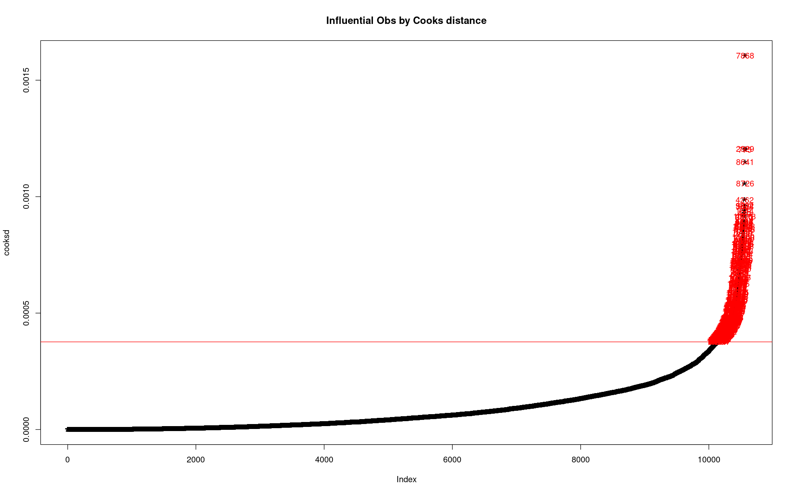
    


```R
plot(baseline_model7,1)
plot(baseline_model7, 3)
```


    
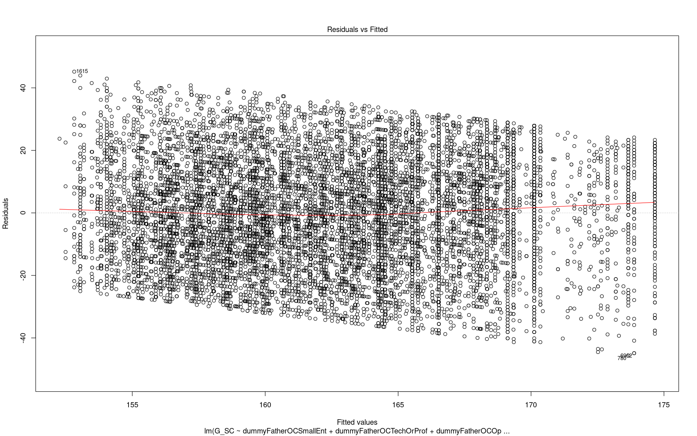
    


    
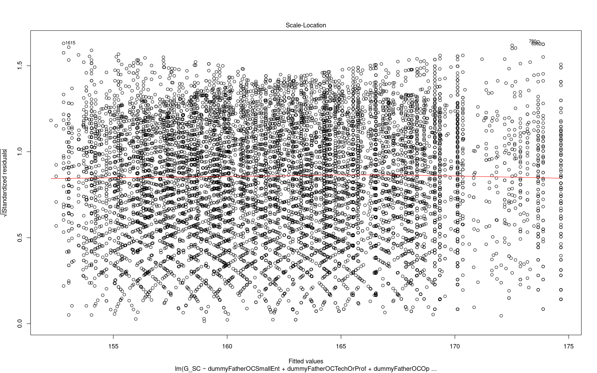
    


```R
car::qqPlot(baseline_model7, main="QQ Plot") 
```


<style>
.dl-inline {width: auto; margin:0; padding: 0}
.dl-inline>dt, .dl-inline>dd {float: none; width: auto; display: inline-block}
.dl-inline>dt::after {content: ":\0020"; padding-right: .5ex}
.dl-inline>dt:not(:first-of-type) {padding-left: .5ex}
</style><dl class=dl-inline><dt>3060</dt><dd>2621</dd><dt>10846</dt><dd>9283</dd></dl>


    
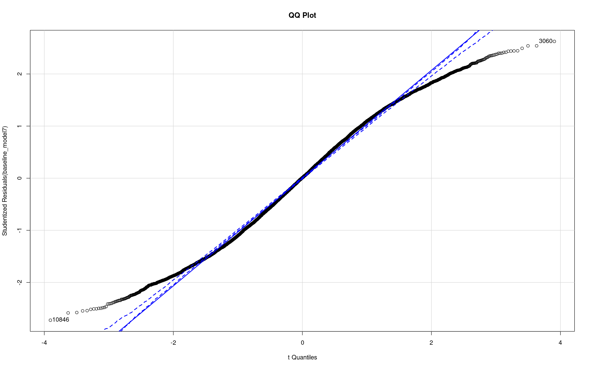
    


```R
plot(density(resid(baseline_model7))) 
```


    
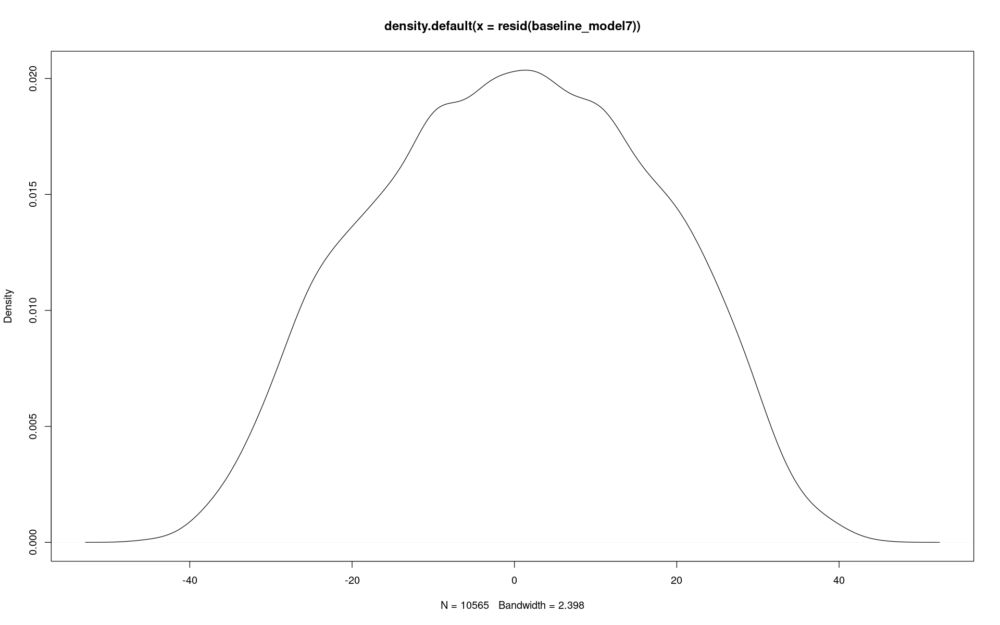
    


```R
# #Calculate Collinearity, will not run as you have na's in summary
vifmodel<-car::vif(baseline_model7)
vifmodel
#Calculate tolerance
1/vifmodel
```


<style>
.dl-inline {width: auto; margin:0; padding: 0}
.dl-inline>dt, .dl-inline>dd {float: none; width: auto; display: inline-block}
.dl-inline>dt::after {content: ":\0020"; padding-right: .5ex}
.dl-inline>dt:not(:first-of-type) {padding-left: .5ex}
</style><dl class=dl-inline><dt>dummyFatherOCSmallEnt</dt><dd>1.12247412463399</dd><dt>dummyFatherOCTechOrProf</dt><dd>1.25556243588667</dd><dt>dummyFatherOCOperator</dt><dd>1.31217743973462</dd><dt>dummyFatherOCOther</dt><dd>1.20945253241445</dd><dt>dummyFatherOCIndi</dt><dd>1.45107801180345</dd><dt>dummyFatherOCENT</dt><dd>1.08307491848482</dd><dt>dummyEDUMotherIncProfEdu</dt><dd>1.04543886455897</dd><dt>dummyEDUMotherPostGrad</dt><dd>1.11618713661921</dd><dt>dummyEDUMotherINCtech</dt><dd>1.02277213947967</dd><dt>dummyEDUMotherCompProfEdu</dt><dd>1.22288863894104</dd><dt>dummySTtech</dt><dd>1.1377467060993</dd><dt>dummySTtechAca</dt><dd>1.47161795768227</dd><dt>dummyMicOven</dt><dd>1.24053992218352</dd><dt>dummyMobile</dt><dd>1.42241202547492</dd><dt>dummySchoolN</dt><dd>1.732289588556</dd><dt>dummyGender</dt><dd>1.00376512929201</dd><dt>dummyInternet</dt><dd>1.48815113349289</dd></dl>


<style>
.dl-inline {width: auto; margin:0; padding: 0}
.dl-inline>dt, .dl-inline>dd {float: none; width: auto; display: inline-block}
.dl-inline>dt::after {content: ":\0020"; padding-right: .5ex}
.dl-inline>dt:not(:first-of-type) {padding-left: .5ex}
</style><dl class=dl-inline><dt>dummyFatherOCSmallEnt</dt><dd>0.890889133258257</dd><dt>dummyFatherOCTechOrProf</dt><dd>0.796455812485187</dd><dt>dummyFatherOCOperator</dt><dd>0.762092053801996</dd><dt>dummyFatherOCOther</dt><dd>0.826820377980179</dd><dt>dummyFatherOCIndi</dt><dd>0.689142824759066</dd><dt>dummyFatherOCENT</dt><dd>0.923297163412264</dd><dt>dummyEDUMotherIncProfEdu</dt><dd>0.956536086327594</dd><dt>dummyEDUMotherPostGrad</dt><dd>0.895907117357463</dd><dt>dummyEDUMotherINCtech</dt><dd>0.977734884828541</dd><dt>dummyEDUMotherCompProfEdu</dt><dd>0.817735947621487</dd><dt>dummySTtech</dt><dd>0.878930252787493</dd><dt>dummySTtechAca</dt><dd>0.679524189535547</dd><dt>dummyMicOven</dt><dd>0.806100619672008</dd><dt>dummyMobile</dt><dd>0.70303117668463</dd><dt>dummySchoolN</dt><dd>0.577270686498542</dd><dt>dummyGender</dt><dd>0.996248993731568</dd><dt>dummyInternet</dt><dd>0.671974759480825</dd></dl>


